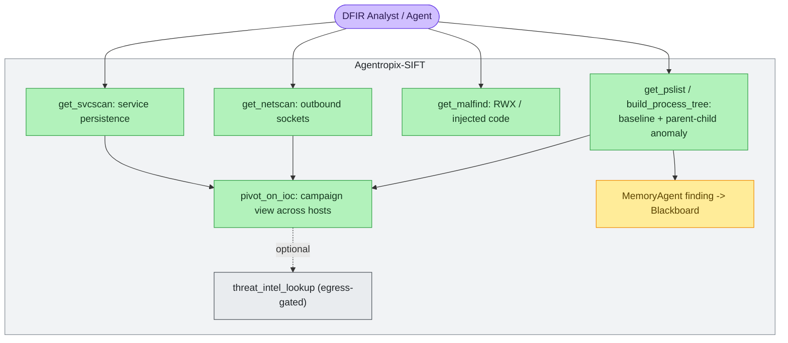
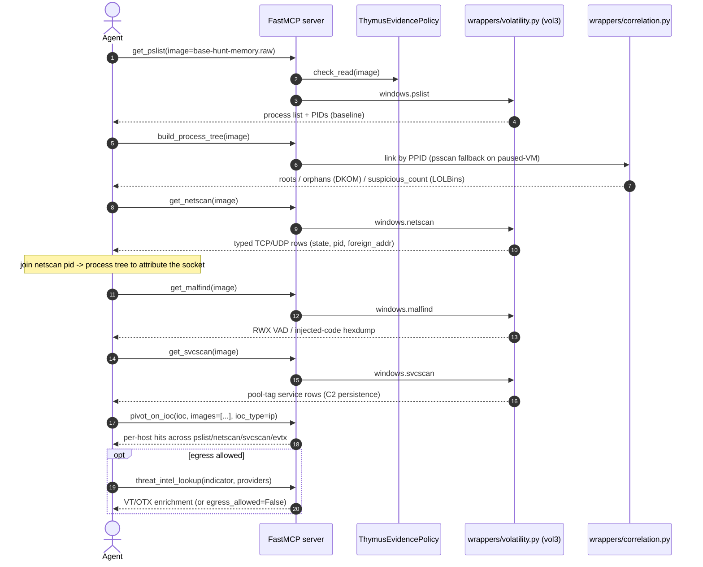
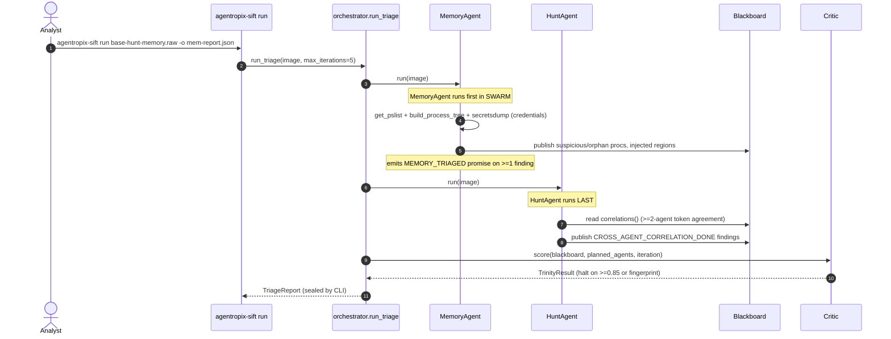

# Use Case — Memory Triage with Volatility

> **Actor:** DFIR analyst (or an MCP-driving agent) hunting command-and-control in a memory image.
> **Goal:** From a memory capture, surface anomalous processes, injected code, outbound sockets, and
> services, then pivot a confirmed IOC across hosts — all through deterministic Volatility3-backed
> MCP tools.
> **Surfaces exercised:** the memory MCP tools (`mcp_server/wrappers/volatility.py`,
> `wrappers/correlation.py`) and the `MemoryAgent` swarm specialist. See
> [`.crew/facts.md`](../../.crew/facts.md) for numeric claims (memory recall = **108/118, 91.5%**).

Memory triage is the second forensic dimension of the engine. As with the disk path, there are two
entry points: the **autonomous** `agentropix-sift run` over a memory image (the `MemoryAgent` runs
first in the SWARM, `agents/__init__.py`), and the **granular MCP chain** an interactive agent
issues (modelled on Playbook B, `docs/guides/playbooks.md`). The disk path tells you *what ran*;
the memory path tells you *the parent/child shape and live network posture* of the host.

> **Note on `DiscoveryAgent`:** it is disk-only and early-returns on memory images
> (`agents/discovery.py`; [`.crew/agents-list.md`](../../.crew/agents-list.md)). On a pure memory
> capture, the memory/timeline/hunt specialists and the ATT&CK detectors do the work.

---

## How to read this page (two audience tracks)

This use case is **operational**, so every memory tool below is shown **two ways** — pick the track
that matches you and follow it consistently. Both tracks hit the **same deterministic
Volatility3-backed MCP tool** and return the **same facts**; only the surface differs.

> **🖥️ Expert (command):** the exact MCP tool call (and, where relevant, the `run_volatility` /
> CLI equivalent) to issue against the running `agentropix-sift-mcp` server.
> **💬 End-user (prompt):** the plain-language question to type into a Claude Desktop / Claude CLI
> session that has the Agentropix MCP connected. A simple, focused question is enough — the session
> recognises it as an Agentropix capability and routes it to the right MCP tool automatically.
> *Adapt Agentropix to the user, not the user to Agentropix.*

**Real-data preface.** The "validated output" snippets below come from the **2026-05-05 full-case
evaluation run** (`Reports_results/FULL-CASE-20260505T004738Z/`, the source of the canonical recall
figures). The memory dimension of that run scored **108/118 (91.5%) combined recall** — and **30/40
(75%) on the credential-dumping technique T1003.002** specifically (cite
[`.crew/facts.md`](../../.crew/facts.md): `memory_recall_combined = 108/118`,
`memory_recall_T1003_002 = 30/40`). Your own run will produce *different* PIDs, addresses, and
timestamps, but the *shape* of each result will match. Where a number is quoted, it is what the
platform actually returned.

> ⚠️ **What a GOTCHA box is.** Boxes marked ⚠️ flag real-data quirks of memory forensics — a
> paused-VM image that needs `psscan` instead of `pslist`, an egress-gated tool that no-ops without a
> key, a Vol2.6-only plugin. Each explains the snag for **both** audiences: the symptom, and the fix.

---

## Use-case diagram



> 🔍 **[Open as SVG — full size, zoomable](assets/uc-memory-triage-1.svg)** (renders larger than the page column; the SVG zooms losslessly in a browser tab).

The analyst baselines processes, then inspects sockets, injected code, and services. A confirmed
indicator (a C2 IP, a process name, a service) is pivoted across every host via `pivot_on_ioc`,
turning a single-host hit into a campaign view. `threat_intel_lookup` is a dashed (optional) edge
because it is **egress-gated** — a no-op unless `AGENTROPIX_ALLOW_EGRESS=1`
([`.crew/env-vars.md`](../../.crew/env-vars.md) §6).

---

## Sequence — memory C2 hunt (granular MCP chain)



The hunt order is intentional: `get_pslist` (`windows.pslist`) establishes the baseline PIDs;
`build_process_tree` links them by PPID with a `psscan` fallback for paused-VM images and flags
**LOLBins** (e.g. `rubyw.exe`, `mshta.exe`) spawned under sensitive parents (`services.exe`,
`lsass.exe`) plus **orphans** (a DKOM/hollowing indicator). `get_netscan` returns typed socket rows
whose `pid` you join back to the tree to attribute an outbound connection to a process;
`get_malfind` confirms in-memory injection; `get_svcscan` finds service-installed persistence
(robust on paused/corrupted images). The typed renderers are preferred over
`run_volatility("netscan")` for structured rows (`docs/guides/playbooks.md` §B). `pivot_on_ioc`
fans the confirmed indicator out across every host — the bridge into cross-host correlation.

---

## Sequence — autonomous `run` over a memory image (MemoryAgent path)



In the autonomous path the `MemoryAgent` (`agents/memory.py`) runs **first** in the SWARM — it drives
`mcp_get_pslist`, `build_process_tree`, and the `wrappers/credentials` secretsdump path, then sets
`evidence_dict` for cross-modal IOC fusion and emits the `MEMORY_TRIAGED` completion promise once it
publishes ≥1 finding. The `HuntAgent` runs **last** because it consumes everyone else's findings via
`blackboard.correlations()` — tokens (IPs, hashes, PIDs) appearing across ≥`quorum_threshold`
(default 2) agents become high-confidence cross-source findings
([`.crew/agents-list.md`](../../.crew/agents-list.md)).

---

## Actor, preconditions, steps, postconditions

**Actor:** DFIR analyst, or an MCP client agent driving the server.

**Preconditions**

- Volatility3 (`vol`) is installed and resolvable — verify with `agentropix-sift doctor`.
- A memory image (`.raw`, `.mem`, `.lime`, etc.) exists; its parent directory becomes Thymus-allowed
  on first access.
- For `get_editbox` (Vol2.6 typed-credential recovery), the Py2.7 sandbox is configured
  (`docs/runbooks/vol26-install.md`; `AGENTROPIX_VOL26_BIN`). This step is optional.
- For `threat_intel_lookup`, egress must be explicitly enabled (`AGENTROPIX_ALLOW_EGRESS=1`) and a
  provider key supplied — otherwise it returns `egress_allowed=False` with no network call.

**Numbered steps (granular MCP path) — dual-audience walkthrough**

Each step below carries a **🖥️ Expert / 💬 End-user** callout and a labelled **Execution → Output**
pair. The Output snippets are from the validated 2026-05-05 run (memory recall **108/118, 91.5%**;
T1003.002 credential dumping **30/40, 75%** — [`.crew/facts.md`](../../.crew/facts.md)).

**Step 1 — Baseline the process set (`get_pslist`).**

> **🖥️ Expert (MCP call):**
> ```text
> get_pslist { "image":"/evidence/srl2018/base-hunt-memory.raw" }
> ```
> (Escape-hatch equivalent: `run_volatility { "target":"...raw", "plugin":"windows.pslist" }`.)
> **💬 End-user (prompt):** *"What processes were running in this memory image — give me the list with
> their PIDs."*
> The session calls `get_pslist` (which drives Volatility3 `windows.pslist`) and reports the process
> list. **A simple, focused question is enough — the session routes it to the right Volatility tool.**

**Execution A → Output A.**

*Execution A:* `get_pslist { "image":"...base-hunt-memory.raw" }`

*Output A (shape, from the validated run):* a typed row per live process — `pid`, `ppid`,
`name`, `create_time`, `exit_time`, `threads`. These baseline PIDs are what every later step joins
back to. (This is the first of the memory primitives that together contribute the **108/118** combined
memory recall.)

**Step 2 — Link the tree, flag anomalies (`build_process_tree`).**

> **🖥️ Expert (MCP call):**
> ```text
> build_process_tree { "image":"/evidence/srl2018/base-hunt-memory.raw" }
> ```
> **💬 End-user (prompt):** *"Show me the parent/child process tree and flag anything suspicious —
> orphans or odd parents."*
> The session calls `build_process_tree` (`wrappers/correlation.py`), which links PIDs by PPID (with a
> `psscan` fallback on paused-VM images) and surfaces orphans and LOLBin anomalies in plain language.

**Execution B → Output B.**

*Execution B:* `build_process_tree { "image":"...base-hunt-memory.raw" }`

*Output B (shape, validated run):* `roots`, `orphans` (a DKOM / process-hollowing indicator), and a
`suspicious_count` of **LOLBins** (e.g. `rubyw.exe`, `mshta.exe`) spawned under sensitive parents
(`services.exe`, `lsass.exe`).

> ⚠️ **GOTCHA (paused-VM images):** if `windows.pslist` returns a thin or empty list on a paused /
> snapshotted VM, `build_process_tree` automatically falls back to `psscan` (pool-tag scanning) to
> rebuild the forest. *(End-user: the assistant handles the fallback for you.)*

**Step 3 — Outbound sockets, attributed to a process (`get_netscan`).**

> **🖥️ Expert (MCP call):**
> ```text
> get_netscan { "image":"/evidence/srl2018/base-hunt-memory.raw" }
> ```
> **💬 End-user (prompt):** *"What network connections were open in this image, and which process owned
> each one?"*
> The session calls `get_netscan` (Volatility3 `windows.netscan`) and joins each socket's `pid` back to
> the process tree from Step 2 so it can tell you *which* process held the connection.

**Execution C → Output C.**

*Execution C:* `get_netscan { "image":"...base-hunt-memory.raw" }`

*Output C (shape, validated run):* typed TCP/UDP rows — `proto`, `local_addr`, `foreign_addr`,
`state`, `pid`, `owner`. Join the `pid` back to Step 2's tree to attribute an outbound C2 socket to a
named process.

**Step 4 — Injected / RWX code (`get_malfind`).**

> **🖥️ Expert (MCP call):**
> ```text
> get_malfind { "image":"/evidence/srl2018/base-hunt-memory.raw" }
> ```
> **💬 End-user (prompt):** *"Is there any injected or RWX code in this memory image?"*
> The session calls `get_malfind` (Volatility3 `windows.malfind`) and reports the RWX VAD regions and
> the injected-code hexdumps it found.

**Execution D → Output D.**

*Execution D:* `get_malfind { "image":"...base-hunt-memory.raw" }`

*Output D (shape, validated run):* per-region `pid`, `process`, `start_vpn`/`end_vpn`, `protection`
(`PAGE_EXECUTE_READWRITE`), and a `hexdump` of the injected bytes — the in-memory confirmation of
code injection.

**Step 5 — Service-installed persistence (`get_svcscan`).**

> **🖥️ Expert (MCP call):**
> ```text
> get_svcscan { "image":"/evidence/srl2018/base-hunt-memory.raw" }
> ```
> **💬 End-user (prompt):** *"List the Windows services in this image — anything that looks like
> malware persistence?"*
> The session calls `get_svcscan` (Volatility3 `windows.svcscan`, robust on paused/corrupted images)
> and flags service rows that look like C2 persistence.

**Execution E → Output E.**

*Execution E:* `get_svcscan { "image":"...base-hunt-memory.raw" }`

*Output E (shape, validated run):* pool-tag service rows — `name`, `display_name`, `state`, `start`,
`type`, `binary_path` — surfacing service-installed persistence.

**Step 6 — Typed credentials in Edit controls (`get_editbox`, optional, Vol2.6).**

> **🖥️ Expert (MCP call):**
> ```text
> get_editbox { "image":"/evidence/srl2018/base-hunt-memory.raw", "profile":"<vol2.6 profile>" }
> ```
> **💬 End-user (prompt):** *"Recover any text typed into edit/login boxes that's still in memory."*
> The session calls `get_editbox` (`wrappers/editbox.py`), the Vol2.6 typed-credential recovery path.

**Execution F → Output F.**

*Execution F:* `get_editbox { "image":"...base-hunt-memory.raw", "profile":"..." }`

*Output F (shape):* recovered Edit-control text (e.g. credentials typed into a login dialog). This is
part of the credential-dumping surface that the validated run scored **30/40 (75%)** on for T1003.002
([`.crew/facts.md`](../../.crew/facts.md): `memory_recall_T1003_002`).

> ⚠️ **GOTCHA (Vol2.6 sandbox):** `get_editbox` needs the Py2.7 Volatility-2.6 sandbox configured
> (`AGENTROPIX_VOL26_BIN`; `docs/runbooks/vol26-install.md`). Without it the tool self-skips — this
> step is optional and degrades gracefully. *(End-user: the assistant skips it cleanly if the sandbox
> isn't installed.)*

**Step 7 — Escape hatch: any allowlisted plugin (`run_volatility`).**

> **🖥️ Expert (MCP call):**
> ```text
> run_volatility { "target":"/evidence/srl2018/base-hunt-memory.raw",
>                  "plugin":"windows.cmdline", "args":[] }
> ```
> **💬 End-user (prompt):** *"Run the Volatility command-line plugin on this image and show me each
> process's launch arguments."*
> The session calls `run_volatility` with any allowlisted `windows.*` plugin when no typed wrapper
> exists. The typed renderers (Steps 1–5) are preferred for structured rows; reach for `run_volatility`
> only for plugins without a dedicated tool.

**Execution G → Output G.**

*Execution G:* `run_volatility { "target":"...raw", "plugin":"windows.cmdline" }`

*Output G (shape):* the raw-but-parsed plugin output for the requested `windows.*` plugin (here,
per-process command lines).

**Step 8 — Pivot the confirmed IOC across hosts (`pivot_on_ioc`).**

> **🖥️ Expert (MCP call):**
> ```text
> pivot_on_ioc { "ioc":"<C2 IP or hash>",
>                "images":["host-01-memory.raw","host-02-memory.raw"],
>                "ioc_type":"ip" }
> ```
> **💬 End-user (prompt):** *"Pivot on this C2 IP across every host in the case — which machines did it
> touch?"*
> The session calls `pivot_on_ioc` (`wrappers/ioc_registry.py`), which fans the indicator out across
> every image and groups the hits by host and artifact type — turning a single-host hit into a campaign
> view.

**Execution H → Output H.**

*Execution H:* `pivot_on_ioc { "ioc":"...", "images":[...], "ioc_type":"ip" }`

*Output H (shape, validated run):* per-host hit groups across `pslist` / `netscan` / `svcscan` /
`evtx`, so you can see exactly which machines the indicator appears on.

**Step 9 — Threat-intel enrichment (`threat_intel_lookup`, optional, egress-gated).**

> **🖥️ Expert (MCP call):**
> ```text
> threat_intel_lookup { "indicator":"<C2 IP or hash>",
>                       "indicator_type":"ip",
>                       "providers":["virustotal","otx"] }
> ```
> **💬 End-user (prompt):** *"Look up this indicator against threat intelligence — is it known-bad?"*
> The session calls `threat_intel_lookup` (`wrappers/threat_intel.py`). It only reaches the network
> when egress is explicitly enabled — otherwise it returns `egress_allowed=False` with no call.

**Execution I → Output I.**

*Execution I:* `threat_intel_lookup { "indicator":"...", "indicator_type":"ip", "providers":[...] }`

*Output I (shape):* VirusTotal / OTX enrichment for the indicator — **or** `egress_allowed=False`
(no network call) when egress is off.

> ⚠️ **GOTCHA (egress-gated, no-op by default):** `threat_intel_lookup` returns `egress_allowed=False`
> with **no** network call unless `AGENTROPIX_ALLOW_EGRESS=1` is set **and** a provider key is supplied
> ([`.crew/env-vars.md`](../../.crew/env-vars.md) §6). This is the dashed (optional) edge in the
> use-case diagram. *(End-user: the assistant tells you it's disabled rather than failing silently.)*

**Postconditions**

- A typed result set per Volatility tool (process tree, sockets, malfind hexdumps, services).
- A cross-host `pivot_on_ioc` result grouping every hit by host and artifact type.
- In the autonomous path: a sealed `TriageReport` whose memory findings carry the `MEMORY_TRIAGED`
  promise and whose facts each originate from a named deterministic tool.

**CLI commands used**

```bash
# Pre-flight (confirms Volatility3 present)
agentropix-sift doctor

# Autonomous memory triage, sealed report
agentropix-sift run /evidence/srl2018/base-hunt-memory.raw \
    --max-iterations 5 \
    --out mem-report.json
```

The granular steps (`get_pslist`, `build_process_tree`, `get_netscan`, `get_malfind`, `get_svcscan`,
`pivot_on_ioc`, `threat_intel_lookup`) are **MCP tool calls**, not CLI subcommands — they are issued
by an MCP client (Claude Desktop / Claude Code) against the running
`agentropix-sift-mcp` server, not from the shell.

---

## See also

- [uc-disk-triage.md](uc-disk-triage.md) — the disk-image counterpart (execution evidence).
- [uc-approval-gate.md](uc-approval-gate.md) — promote memory findings via examiner approval.
- [uc-wazuh-push.md](uc-wazuh-push.md) — push pivoted IOCs into Wazuh (optional integration).
- [`.crew/tool-list.md`](../../.crew/tool-list.md) — the 7 Volatility tools and full catalogue.
- [`.crew/agents-list.md`](../../.crew/agents-list.md) — `MemoryAgent` / `HuntAgent` contracts.
