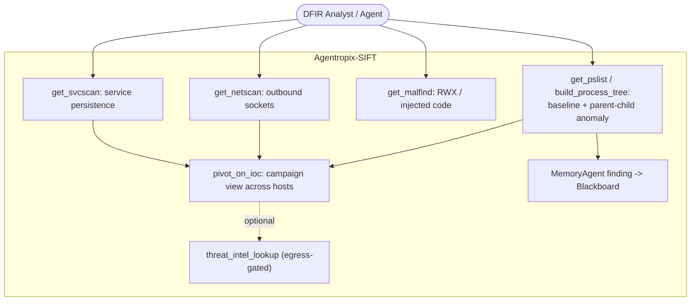
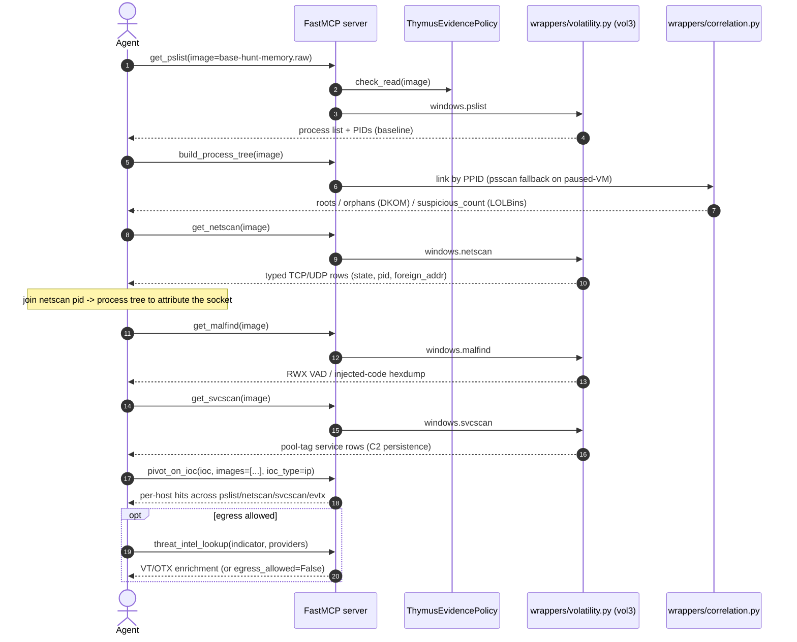
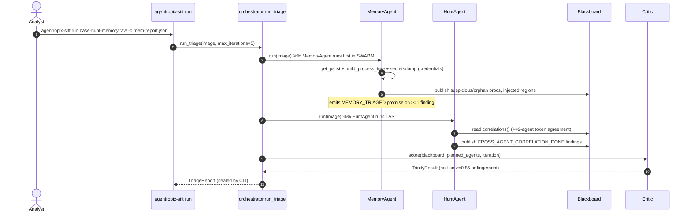

# Use Case — Memory Triage with Volatility

> **Actor:** DFIR analyst (or an MCP-driving agent) hunting command-and-control in a memory image.
> **Goal:** From a memory capture, surface anomalous processes, injected code, outbound sockets, and
> services, then pivot a confirmed IOC across hosts — all through deterministic Volatility3-backed
> MCP tools.
> **Surfaces exercised:** the memory MCP tools (`mcp_server/wrappers/volatility.py`,
> `wrappers/correlation.py`) and the `MemoryAgent` swarm specialist. See
> [`.crew/facts.md`](../../.crew/facts.md) for numeric claims (memory recall = **108/118, 91.5%**).

Memory triage is the second forensic dimension of the engine. As with the disk path, there are two
entry points: the **autonomous** `agentropix-sift run` over a memory image (the `MemoryAgent` runs
first in the SWARM, `agents/__init__.py`), and the **granular MCP chain** an interactive agent
issues (modelled on Playbook B, `docs/guides/playbooks.md`). The disk path tells you *what ran*;
the memory path tells you *the parent/child shape and live network posture* of the host.

> **Note on `DiscoveryAgent`:** it is disk-only and early-returns on memory images
> (`agents/discovery.py`; [`.crew/agents-list.md`](../../.crew/agents-list.md)). On a pure memory
> capture, the memory/timeline/hunt specialists and the ATT&CK detectors do the work.

---

## Use-case diagram



The analyst baselines processes, then inspects sockets, injected code, and services. A confirmed
indicator (a C2 IP, a process name, a service) is pivoted across every host via `pivot_on_ioc`,
turning a single-host hit into a campaign view. `threat_intel_lookup` is a dashed (optional) edge
because it is **egress-gated** — a no-op unless `AGENTROPIX_ALLOW_EGRESS=1`
([`.crew/env-vars.md`](../../.crew/env-vars.md) §6).

---

## Sequence — memory C2 hunt (granular MCP chain)



The hunt order is intentional: `get_pslist` (`windows.pslist`) establishes the baseline PIDs;
`build_process_tree` links them by PPID with a `psscan` fallback for paused-VM images and flags
**LOLBins** (e.g. `rubyw.exe`, `mshta.exe`) spawned under sensitive parents (`services.exe`,
`lsass.exe`) plus **orphans** (a DKOM/hollowing indicator). `get_netscan` returns typed socket rows
whose `pid` you join back to the tree to attribute an outbound connection to a process;
`get_malfind` confirms in-memory injection; `get_svcscan` finds service-installed persistence
(robust on paused/corrupted images). The typed renderers are preferred over
`run_volatility("netscan")` for structured rows (`docs/guides/playbooks.md` §B). `pivot_on_ioc`
fans the confirmed indicator out across every host — the bridge into cross-host correlation.

---

## Sequence — autonomous `run` over a memory image (MemoryAgent path)



In the autonomous path the `MemoryAgent` (`agents/memory.py`) runs **first** in the SWARM — it drives
`mcp_get_pslist`, `build_process_tree`, and the `wrappers/credentials` secretsdump path, then sets
`evidence_dict` for cross-modal IOC fusion and emits the `MEMORY_TRIAGED` completion promise once it
publishes ≥1 finding. The `HuntAgent` runs **last** because it consumes everyone else's findings via
`blackboard.correlations()` — tokens (IPs, hashes, PIDs) appearing across ≥`quorum_threshold`
(default 2) agents become high-confidence cross-source findings
([`.crew/agents-list.md`](../../.crew/agents-list.md)).

---

## Actor, preconditions, steps, postconditions

**Actor:** DFIR analyst, or an MCP client agent driving the server.

**Preconditions**

- Volatility3 (`vol`) is installed and resolvable — verify with `agentropix-sift doctor`.
- A memory image (`.raw`, `.mem`, `.lime`, etc.) exists; its parent directory becomes Thymus-allowed
  on first access.
- For `get_editbox` (Vol2.6 typed-credential recovery), the Py2.7 sandbox is configured
  (`docs/runbooks/vol26-install.md`; `AGENTROPIX_VOL26_BIN`). This step is optional.
- For `threat_intel_lookup`, egress must be explicitly enabled (`AGENTROPIX_ALLOW_EGRESS=1`) and a
  provider key supplied — otherwise it returns `egress_allowed=False` with no network call.

**Numbered steps (granular MCP path)**

1. `get_pslist(image)` → baseline process list + PIDs.
2. `build_process_tree(image)` → roots / orphans / LOLBin anomalies.
3. `get_netscan(image)` → typed sockets; join `pid` back to step 2.
4. `get_malfind(image)` → RWX/injected-code regions.
5. `get_svcscan(image)` → service-installed persistence.
6. *(optional)* `get_editbox(image, profile=...)` → typed credentials in Edit controls.
7. *(escape hatch)* `run_volatility(target, plugin, args)` → any allowlisted `windows.*` plugin.
8. `pivot_on_ioc(ioc, images=[...], ioc_type=...)` → campaign-wide hits.
9. *(optional, egress-gated)* `threat_intel_lookup(indicator, indicator_type, providers)`.

**Postconditions**

- A typed result set per Volatility tool (process tree, sockets, malfind hexdumps, services).
- A cross-host `pivot_on_ioc` result grouping every hit by host and artifact type.
- In the autonomous path: a sealed `TriageReport` whose memory findings carry the `MEMORY_TRIAGED`
  promise and whose facts each originate from a named deterministic tool.

**CLI commands used**

```bash
# Pre-flight (confirms Volatility3 present)
agentropix-sift doctor

# Autonomous memory triage, sealed report
agentropix-sift run /evidence/srl2018/base-hunt-memory.raw \
    --max-iterations 5 \
    --out mem-report.json
```

The granular steps (`get_pslist`, `build_process_tree`, `get_netscan`, `get_malfind`, `get_svcscan`,
`pivot_on_ioc`, `threat_intel_lookup`) are **MCP tool calls**, not CLI subcommands — they are issued
by an MCP client (Claude Desktop / Claude Code) against the running
`agentropix-sift-mcp` server, not from the shell.

---

## See also

- [uc-disk-triage.md](uc-disk-triage.md) — the disk-image counterpart (execution evidence).
- [uc-approval-gate.md](uc-approval-gate.md) — promote memory findings via examiner approval.
- [uc-wazuh-push.md](uc-wazuh-push.md) — push pivoted IOCs into Wazuh (optional integration).
- [`.crew/tool-list.md`](../../.crew/tool-list.md) — the 7 Volatility tools and full catalogue.
- [`.crew/agents-list.md`](../../.crew/agents-list.md) — `MemoryAgent` / `HuntAgent` contracts.
