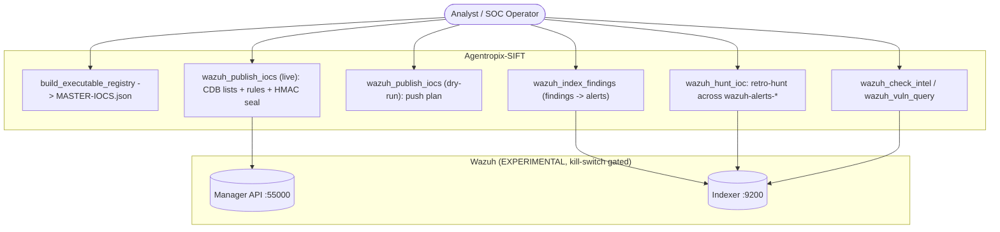
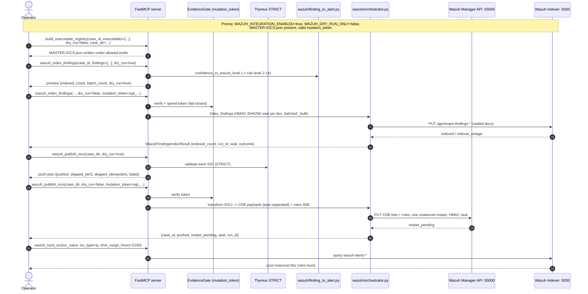

# Use Case — Push a Finding to Wazuh as an Alert (Experimental Integration)

> **Status: EXPERIMENTAL / OPT-IN.** The Wazuh integration is **disabled by default** and gated
> behind four kill switches — `WAZUH_INTEGRATION_ENABLED=false`, `WAZUH_PUSH_ENABLED=false`,
> `WAZUH_DRY_RUN_ONLY=true`, and `AGENTROPIX_INTEGRATION_NOT_PRODUCTION=false`
> ([`.crew/env-vars.md`](../../.crew/env-vars.md) §Wazuh-kill-switches). A live write needs **all**
> of these flipped *plus* a valid one-shot `mutation_token`. Treat the Wazuh family as an optional
> downstream surface, not a core triage step.
>
> **Actor:** DFIR analyst / SOC operator (or an MCP-driving agent) with Wazuh access.
> **Goal:** Promote a case's vetted findings/IOCs into the Wazuh Manager as indexed findings and CDB
> lists + rules, so the SOC retro-hunts and alerts on them going forward.
> **Surfaces exercised:** the 5 Wazuh MCP tools (`mcp_server/wrappers/wazuh_tools.py`,
> `wrappers/wazuh_intel.py`) over the `wazuh/` package (Manager API `:55000`, Indexer `:9200`).

The Wazuh push is the campaign's outward edge: after disk/memory triage produces findings and an
examiner approves them, their IOCs can be pushed into the SOC's detection plane. Every write is
**fail-closed** (a wrong/absent token or a kill switch left off returns a structured `error`, not a
silent pass), HMAC-sealed (ADR-016), and validated through Thymus STRICT
(`docs/guides/playbooks.md` §D; `docs/guides/end-to-end-scenario.md` §Phase 6).

---

## Use-case diagram



The operator first materialises `MASTER-IOCS.json` (`build_executable_registry`), previews the push
(`wazuh_publish_iocs` dry-run), then executes the live push (CDB lists + rules to the Manager API)
and indexes findings as alerts into the Indexer. `wazuh_hunt_ioc` retro-hunts the just-pushed IOC.
The dashed Wazuh subgraph is the experimental boundary — nothing reaches it unless the kill switches
are flipped.

---

## Sequence — finding/IOC → Wazuh alert



`wazuh_index_findings` maps each finding's confidence to a Wazuh rule level (2–14) via
`wazuh/finding_to_alert.py::confidence_to_wazuh_level`, HMAC-seals each doc, and writes batched
`_bulk` to `agentropix-findings-*`; a live write **requires** `dry_run=false` and a valid
`mutation_token`, and fails closed otherwise (`wazuh_tools.py`). `wazuh_publish_iocs` loads
`MASTER-IOCS.json`, classifies each IOC Tier-1/2/3, validates through **Thymus STRICT**, transforms
to pipe-separated CDB payloads, PUTs CDB lists + rules to the Manager API, triggers **one coalesced**
manager restart, stamps an HMAC-SHA256 seal (ADR-016), and appends to `wazuh-audit.jsonl`. The
publish step is **idempotent** (`skipped_idempotent`), so a retry after a partial failure is safe —
do not loop per-IOC; pass the whole `case_dir` once. An Indexer outage returns `outcome=indexer_outage`
with the full result shape, distinct from an `error` envelope.

---

## Actor, preconditions, steps, postconditions

**Actor:** DFIR analyst / SOC operator, or an MCP client agent with Wazuh access.

**Preconditions (all required for a live push — this is the experimental gate)**

- `WAZUH_INTEGRATION_ENABLED=true` (master enable; default `false`).
- `WAZUH_PUSH_ENABLED=true` and `WAZUH_DRY_RUN_ONLY=false` (default `false`/`true` respectively).
- `AGENTROPIX_INTEGRATION_NOT_PRODUCTION=true` — the W-188 operator affirmation that the target
  Wazuh is **not** production (default-deny; default `false`).
- A valid one-shot `mutation_token` (`egt_<ULID>` from `AGENTROPIX_MUTATION_TOKEN`).
- The case directory contains `MASTER-IOCS.json` (materialised by `build_executable_registry`).
- Manager/Indexer connectivity + credentials are configured (`WAZUH_MANAGER_URL`,
  `WAZUH_INDEXER_URL`, `AGENTROPIX_WAZUH_API_USER`, `AGENTROPIX_WAZUH_API_PASSWORD_FILE`,
  `WAZUH_INDEXER_USER`/`WAZUH_INDEXER_PASS`; see [`.crew/env-vars.md`](../../.crew/env-vars.md) §1).
- Findings to index should already be **APPROVED** — see [uc-approval-gate.md](uc-approval-gate.md).

If any kill switch is left off, the tool returns a structured `error` naming the env var to flip
(`wazuh_tools.py`) — it never throws or silently passes.

**Numbered steps**

1. `build_executable_registry(case_id, executables=[...], dry_run=false, case_dir=...)` → write
   `MASTER-IOCS.json` under the allowed prefix.
2. `wazuh_index_findings(case_id, findings=[...], dry_run=true)` → preview; then
   `wazuh_index_findings(..., dry_run=false, mutation_token=egt_...)` → index findings as sealed
   alerts.
3. `wazuh_publish_iocs(case_dir, dry_run=true)` → review the push plan (Tier-1/2/3 classification).
4. `wazuh_publish_iocs(case_dir, dry_run=false, mutation_token=egt_...)` → live push: CDB lists +
   rules + one coalesced manager restart + HMAC seal.
5. `wazuh_hunt_ioc(ioc_value, ioc_type="ip", time_range_hours=2160)` → retro-hunt the IOC across
   `wazuh-alerts-*` (default 90-day lookback) to confirm the push and surface prior exposure.
6. *(optional)* `wazuh_check_intel(...)` / `wazuh_vuln_query(...)` → test indicator membership / query
   CVE data.

**Postconditions**

- Findings are indexed into `agentropix-findings-*` as Wazuh alerts, each carrying a per-doc
  HMAC-SHA256 seal.
- IOCs are published as namespaced CDB lists + rules on the Manager (`WAZUH_LIST_NAMESPACE`, default
  `agentropix_`), with a single coalesced restart and an audit row in `wazuh-audit.jsonl`.
- A `run_id` + `seal` make the push auditable and tamper-evident; re-running is idempotent.
- The SOC now retro-hunts and alerts on the campaign's IOCs.

**CLI commands used**

```bash
# Mint the one-shot mutation token the live push requires
agentropix-sift evidence-gate mint   # -> egt_<ULID>; export as AGENTROPIX_MUTATION_TOKEN

# Flip the experimental kill switches for THIS session (never against production)
export WAZUH_INTEGRATION_ENABLED=true
export WAZUH_PUSH_ENABLED=true
export WAZUH_DRY_RUN_ONLY=false
export AGENTROPIX_INTEGRATION_NOT_PRODUCTION=true   # W-188 affirmation: NOT prod
```

`build_executable_registry`, `wazuh_index_findings`, `wazuh_publish_iocs`, `wazuh_hunt_ioc`,
`wazuh_check_intel`, and `wazuh_vuln_query` are **MCP tool calls** issued against the running server —
not CLI subcommands. The CLI/`export` commands above provision the token and flip the experimental
gate; the actual push is driven by the MCP client.

---

## See also

- [uc-approval-gate.md](uc-approval-gate.md) — APPROVE findings before indexing them as alerts.
- [uc-disk-triage.md](uc-disk-triage.md) / [uc-memory-triage.md](uc-memory-triage.md) — where the
  pushed IOCs originate.
- [`.crew/tool-list.md`](../../.crew/tool-list.md) — the 5 Wazuh tools (`wazuh_hunt_ioc` registered
  twice → 71 distinct tools total) and the `[MUT]` write markers.
- [`.crew/env-vars.md`](../../.crew/env-vars.md) — the full Wazuh kill-switch + connectivity matrix.
- [`.crew/module-map.md`](../../.crew/module-map.md) — the `wazuh/` package internals.
