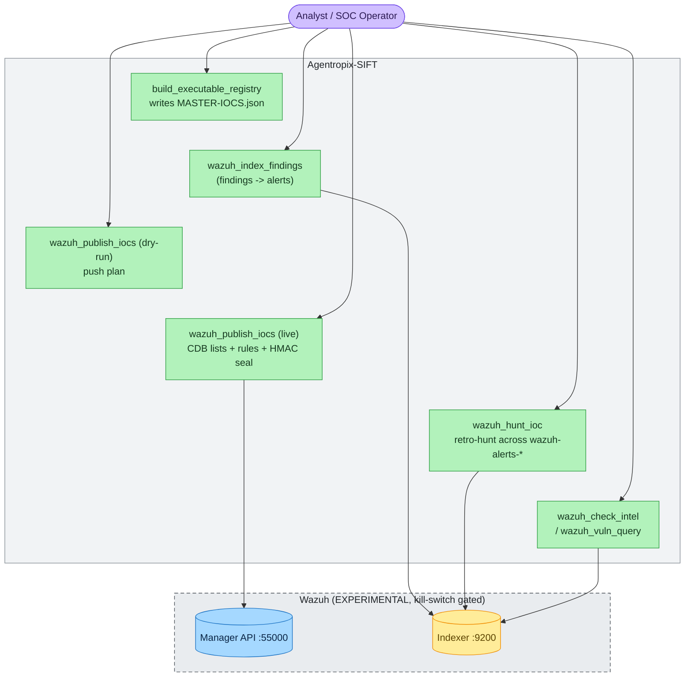
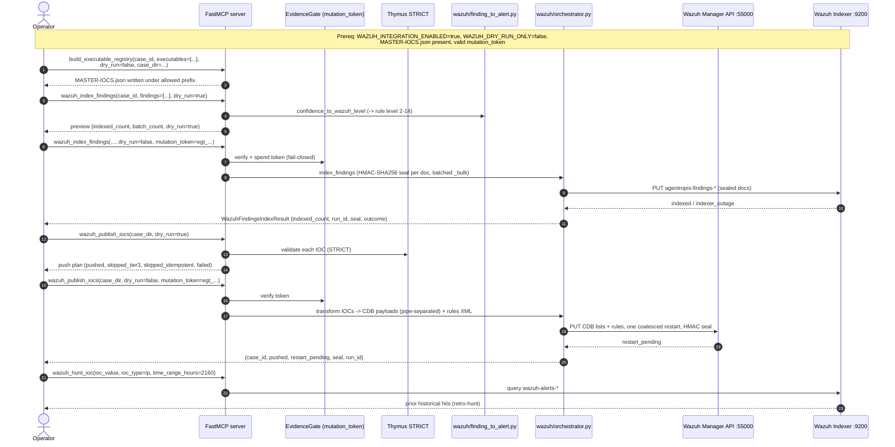

# Use Case — Push a Finding to Wazuh as an Alert (Experimental Integration)

> **Status: EXPERIMENTAL / OPT-IN.** The Wazuh integration is **disabled by default** and gated
> behind four kill switches — `WAZUH_INTEGRATION_ENABLED=false`, `WAZUH_PUSH_ENABLED=false`,
> `WAZUH_DRY_RUN_ONLY=true`, and `AGENTROPIX_INTEGRATION_NOT_PRODUCTION=false`
> ([`env-vars.md`](../07-sdlc-ops/env-vars.md) §Wazuh-kill-switches). A live write needs **all**
> of these flipped *plus* a valid one-shot `mutation_token`. Treat the Wazuh family as an optional
> downstream surface, not a core triage step.
>
> **Actor:** DFIR analyst / SOC operator (or an MCP-driving agent) with Wazuh access.
> **Goal:** Promote a case's vetted findings/IOCs into the Wazuh Manager as indexed findings and CDB
> lists + rules, so the SOC retro-hunts and alerts on them going forward.
> **Surfaces exercised:** the 5 Wazuh MCP tools (`mcp_server/wrappers/wazuh_tools.py`,
> `wrappers/wazuh_intel.py`) over the `wazuh/` package (Manager API `:55000`, Indexer `:9200`).

The Wazuh push is the campaign's outward edge: after disk/memory triage produces findings and an
examiner approves them, their IOCs can be pushed into the SOC's detection plane. Every write is
**fail-closed** (a wrong/absent token or a kill switch left off returns a structured `error`, not a
silent pass), HMAC-sealed (ADR-016), and validated through Thymus STRICT
(`docs/guides/playbooks.md` §D; `docs/guides/end-to-end-scenario.md` §Phase 6).

---

## Contents — what's in this page (and what to expect)

> Jump to any section below. Each row tells you what that part gives you, so you can go straight to your point.

| Section | What you'll get |
|---|---|
| [Use-case diagram](#use-case-diagram) | The actor → SIFT tools → Wazuh (kill-switch-gated) flow in one diagram, with the experimental boundary called out. |
| [Sequence — finding/IOC → Wazuh alert](#sequence--findingioc--wazuh-alert) | The step-by-step interaction trace from `build_executable_registry` through gate, Thymus, index, live push, and retro-hunt. |
| [Step-by-step — dual-audience (Expert command + End-user prompt)](#step-by-step--dual-audience-expert-command--end-user-prompt) | Every step shown twice (🖥️ MCP call + 💬 plain-language prompt) with shape-faithful sample outputs, the gate-provision box, and the usability matrix. |
| [Actor, preconditions, steps, postconditions](#actor-preconditions-steps-postconditions) | The full live-push contract: who runs it, the four kill switches + token prereqs, the numbered steps, and what the run leaves behind. |
| [See also](#see-also) | Cross-links to the Wazuh operator portal, the approval gate, IOC origins, and the tool/env/module references. |

---

## Use-case diagram



> 🔍 **[Open as SVG — full size, zoomable](assets/uc-wazuh-push-1.svg)** (renders larger than the page column; the SVG zooms losslessly in a browser tab).

The operator first materialises `MASTER-IOCS.json` (`build_executable_registry`), previews the push
(`wazuh_publish_iocs` dry-run), then executes the live push (CDB lists + rules to the Manager API)
and indexes findings as alerts into the Indexer. `wazuh_hunt_ioc` retro-hunts the just-pushed IOC.
The dashed Wazuh subgraph is the experimental boundary — nothing reaches it unless the kill switches
are flipped.

---

## Sequence — finding/IOC → Wazuh alert



> 🔍 **[Open as SVG — full size, zoomable](assets/uc-wazuh-push-2.svg)** (renders larger than the page column; the SVG zooms losslessly in a browser tab).

`wazuh_index_findings` maps each finding's confidence to a Wazuh rule level (2–14) via
`wazuh/finding_to_alert.py::confidence_to_wazuh_level`, HMAC-seals each doc, and writes batched
`_bulk` to `agentropix-findings-*`; a live write **requires** `dry_run=false` and a valid
`mutation_token`, and fails closed otherwise (`wazuh_tools.py`). `wazuh_publish_iocs` loads
`MASTER-IOCS.json`, classifies each IOC Tier-1/2/3, validates through **Thymus STRICT**, transforms
to pipe-separated CDB payloads, PUTs CDB lists + rules to the Manager API, triggers **one coalesced**
manager restart, stamps an HMAC-SHA256 seal (ADR-016), and appends to `wazuh-audit.jsonl`. The
publish step is **idempotent** (`skipped_idempotent`), so a retry after a partial failure is safe —
do not loop per-IOC; pass the whole `case_dir` once. An Indexer outage returns `outcome=indexer_outage`
with the full result shape, distinct from an `error` envelope.

---

## Step-by-step — dual-audience (Expert command + End-user prompt)

This page is **operational**, so every step below is shown **two ways at once** — the exact CLI/MCP
call an **expert** issues (`🖥️`), and the plain-language prompt a **non-technical end-user** types
into a Claude session that has the Agentropix MCP connected (`💬`). Both hit the **same deterministic
MCP tool** (verify each tool name against [`tool-list.md`](../04-mcp-tools/tool-list.md) §"Wazuh SIEM
integration (5)" and the EAR row `build_executable_registry`); only the surface differs.

> **🖥️ Expert track** — issue the `🖥️` MCP call, read the raw JSON (the *Output X* block).
> **💬 End-user track** — type the `💬` prompt; the session recognises it as an Agentropix capability,
> routes the **same** MCP tool, and explains the result in plain language. *A simple, focused question
> is enough — adapt Agentropix to the user, not the user to Agentropix.*

> **How to read the sample outputs.** The *Output X* blocks below are **shape-faithful**: their keys
> are the verified return keys of each tool (`wazuh_publish_iocs` → `case_id, pushed, skipped_tier3,
> skipped_idempotent, failed, restart_pending, dry_run, seal, run_id`; `wazuh_index_findings` →
> `indexed_count, indexed_failed_count, batch_count, index, dry_run, run_id, outcome`; `wazuh_hunt_ioc`
> → `ioc_digest, ioc_type, time_range_hours, indexer_reachable, total_hits, returned_hits, hits` —
> from each tool's docstring in `wrappers/wazuh_tools.py`). Values (counts, run IDs, the `hmac-sha256:…`
> seal digest) are illustrative; your run produces different numbers. Wazuh host/index are shown as
> `<WAZUH-MANAGER-URL>` / `<WAZUH-INDEXER-URL>` / `agentropix-findings-*` placeholders — never raw IPs.

> ⚠️ **GOTCHA — the gate must be flipped first.** Every `dry_run=false` call below returns a structured
> `error` envelope naming the env var to flip (e.g. `"Wazuh integration is disabled; set
> WAZUH_INTEGRATION_ENABLED=true"`) until **all four** kill switches are on AND a valid one-shot
> `mutation_token` is supplied. It never throws or silently writes. Run the
> [Provision the gate](#provision-the-gate-once-per-session-operator-local) box once per session before
> Step 2.

### Provision the gate (once per session, operator-local)

This is the only genuinely operator-local prerequisite — it mints the token and flips the experimental
kill switches for **this shell** (never against production). The end-user track has no equivalent: a
non-technical user cannot flip a server-side kill switch by prompting; an operator does this first.

> **🖥️ Expert (command):**
> ```bash
> agentropix-sift evidence-gate mint   # -> egt_<ULID>; export as AGENTROPIX_MUTATION_TOKEN
> export AGENTROPIX_MUTATION_TOKEN=egt_01J...        # the minted token
> export WAZUH_INTEGRATION_ENABLED=true              # master enable (default false)
> export WAZUH_PUSH_ENABLED=true                     # enable IOC push (default false)
> export WAZUH_DRY_RUN_ONLY=false                    # allow live writes (default true)
> export AGENTROPIX_INTEGRATION_NOT_PRODUCTION=true  # W-188: target is NOT prod (default false)
> ```
> **💬 End-user (prompt):** *"Is the Wazuh push gate ready in this session — are the kill switches on
> and do I have a live mutation token?"* The session reports the gate state back; if anything is off it
> tells you which switch your **operator** must flip. (Flipping it is an operator-local step.)

### Step 1 — Materialise `MASTER-IOCS.json` (`build_executable_registry`)

Build the executable registry the push consumes. `dry_run=false` writes `MASTER-IOCS.json` under the
case's allowed prefix; `dry_run=true` previews it.

> **🖥️ Expert (MCP call):**
> ```json
> build_executable_registry(
>   case_id="INC-2026-0605-WZ",
>   executables=[{"sha256": "<exe-sha256>", "path": "/Windows/Temp/x.exe"}],
>   dry_run=false,
>   case_dir="/cases/INC-2026-0605-WZ"
> )
> ```
> **💬 End-user (prompt):** *"Build the executable registry for this case and write MASTER-IOCS.json."*

**Execution A → Output A.**

*Execution A:* the MCP call above (or the `💬` prompt).

*Output A (shape-faithful):*
```json
{
  "case_id": "INC-2026-0605-WZ",
  "written": true,
  "path": "/cases/INC-2026-0605-WZ/MASTER-IOCS.json",
  "executable_count": 3,
  "dry_run": false
}
```

### Step 2 — Index findings as Wazuh alerts (`wazuh_index_findings` [MUT])

Preview first (`dry_run=true`), then index live (`dry_run=false` + `mutation_token`). Each finding's
confidence maps to a Wazuh rule level (2–14) via
`wazuh/finding_to_alert.py::confidence_to_wazuh_level`; each doc is HMAC-sealed and written batched
`_bulk` to `agentropix-findings-*`.

> **🖥️ Expert (MCP calls):**
> ```json
> wazuh_index_findings(case_id="INC-2026-0605-WZ", findings=[{"finding_id": "F-001", "severity": "high"}], dry_run=true)
> wazuh_index_findings(case_id="INC-2026-0605-WZ", findings=[{"finding_id": "F-001", "severity": "high"}], dry_run=false, mutation_token="egt_01J...")
> ```
> **💬 End-user (prompt):** *"Preview indexing my approved findings into Wazuh, then index them for
> real as sealed alerts."*

**Execution B → Output B (dry-run preview).**

*Execution B:* `wazuh_index_findings(..., dry_run=true)`.

*Output B:*
```json
{
  "indexed_count": 1,
  "indexed_failed_count": 0,
  "batch_count": 1,
  "index_template_installed_this_run": false,
  "index": "agentropix-findings-2026.06.05",
  "dry_run": true,
  "run_id": "wz-idx-01J9XR...",
  "outcome": "ok"
}
```

**Execution C → Output C (live index).**

*Execution C:* `wazuh_index_findings(..., dry_run=false, mutation_token="egt_01J...")`.

*Output C:*
```json
{
  "indexed_count": 1,
  "indexed_failed_count": 0,
  "batch_count": 1,
  "index_template_installed_this_run": true,
  "index": "agentropix-findings-2026.06.05",
  "dry_run": false,
  "run_id": "wz-idx-01J9XS...",
  "outcome": "ok"
}
```

> **`outcome=indexer_outage` is NOT an error.** If the Indexer (`<WAZUH-INDEXER-URL>`) is down, a live
> index returns the **full result shape** with `outcome="indexer_outage"` (and an `error` field
> describing it), distinct from the `{"error": …, "case_id": …, "dry_run": …}` envelope that means the
> call never reached the orchestrator (bad config / gate / token). Treat the two differently.

### Step 3 — Preview the IOC push plan (`wazuh_publish_iocs`, dry-run)

Load `MASTER-IOCS.json`, classify each IOC Tier-1/2/3, validate through **Thymus STRICT**, and return
the would-be-push plan **without writing**. This is where the **push denylist** shows up as
`skipped_tier3`.

> **🖥️ Expert (MCP call):**
> ```json
> wazuh_publish_iocs(case_dir="/cases/INC-2026-0605-WZ", dry_run=true)
> ```
> **💬 End-user (prompt):** *"Show me the Wazuh push plan for this case — which IOCs would publish and
> which get skipped?"*

**Execution D → Output D.**

*Execution D:* `wazuh_publish_iocs(case_dir="/cases/INC-2026-0605-WZ", dry_run=true)`.

*Output D:*
```json
{
  "case_id": "INC-2026-0605-WZ",
  "pushed": 4,
  "skipped_tier3": 2,
  "skipped_idempotent": 0,
  "failed": 0,
  "restart_pending": false,
  "dry_run": true,
  "seal": null,
  "run_id": "wz-push-01J9XT..."
}
```

> ⚠️ **GOTCHA — respect the push denylist (`skipped_tier3`).** The orchestrator **never** publishes
> Tier-3 hard exclusions, defined in `wazuh/denylists.py`: the `INFRA_IP_DENYLIST` (the lab DC, file
> server, and F-Response controller IPs), the `F_RESPONSE_BENIGN` process set (e.g. `subject_srv.exe`,
> matched case-insensitively after normalisation), and the Windows-installer-GUID hash set / installer
> path provenance. RFC1918 addresses are **not** hard-blocked here — they are gated separately via the
> `accept_internal_ips` flag / `WAZUH_OPERATOR_TRUSTED_CIDRS`. Anything denylisted lands in
> `skipped_tier3`, not `pushed` — do not try to force it through; that is a safety control, not a bug.

### Step 4 — Live push: CDB lists + rules + sealed restart (`wazuh_publish_iocs` [MUT])

Same call with `dry_run=false` + `mutation_token`: it transforms IOCs to pipe-separated CDB payloads,
PUTs CDB lists + rules to the Manager API (`<WAZUH-MANAGER-URL>` `:55000`), triggers **one coalesced**
manager restart, stamps an `hmac-sha256:…` seal (ADR-016), and appends to `wazuh-audit.jsonl`. The
push is **idempotent** — a retry after a partial failure is safe (re-runs land in `skipped_idempotent`);
pass the whole `case_dir` once, do **not** loop per-IOC.

> **🖥️ Expert (MCP call):**
> ```json
> wazuh_publish_iocs(case_dir="/cases/INC-2026-0605-WZ", dry_run=false, mutation_token="egt_01J...")
> ```
> **💬 End-user (prompt):** *"Publish the approved IOCs to Wazuh for real — push the CDB lists and
> rules and seal the run."*

**Execution E → Output E.**

*Execution E:* `wazuh_publish_iocs(case_dir="/cases/INC-2026-0605-WZ", dry_run=false, mutation_token="egt_01J...")`.

*Output E:*
```json
{
  "case_id": "INC-2026-0605-WZ",
  "pushed": 4,
  "skipped_tier3": 2,
  "skipped_idempotent": 0,
  "failed": 0,
  "restart_pending": true,
  "dry_run": false,
  "seal": "hmac-sha256:3f9c1a7e8b2d4c5f6a0e1d2c3b4a5968...",
  "run_id": "wz-push-01J9XU..."
}
```

`restart_pending: true` confirms the single coalesced manager restart was queued; the non-null `seal`
makes the push tamper-evident and auditable (cross-check `run_id` in `wazuh-audit.jsonl`).

### Step 5 — Retro-hunt the pushed IOC (`wazuh_hunt_ioc`)

Confirm the push landed and surface prior exposure by hunting the IOC across `wazuh-alerts-*`. The
default window is 90 days (`time_range_hours=2160`). Supported `ioc_type` values include `ip`,
`sha256`, `md5`, and `domain`.

> **🖥️ Expert (MCP call):**
> ```json
> wazuh_hunt_ioc(ioc_value="203.0.113.7", ioc_type="ip", time_range_hours=2160)
> ```
> **💬 End-user (prompt):** *"Has this IP shown up in Wazuh in the last 90 days? Retro-hunt it."*

**Execution F → Output F.**

*Execution F:* `wazuh_hunt_ioc(ioc_value="203.0.113.7", ioc_type="ip", time_range_hours=2160)`.

*Output F:*
```json
{
  "ioc_digest": "sha256:9a1b...",
  "ioc_type": "ip",
  "time_range_hours": 2160,
  "indexer_reachable": true,
  "total_hits": 3,
  "returned_hits": 3,
  "hits": [
    {"rule_id": 100200, "rule_level": 10, "rule_description": "agentropix IOC match", "srcip": "203.0.113.7"}
  ]
}
```

> The IOC value is hashed to `ioc_digest` in the response — the raw value is not echoed back. An Indexer
> outage returns the same shape with `indexer_reachable: false`, `total_hits: 0`, and a `warning`
> (retry with a narrower `time_range_hours`) — again, a degraded *result*, not an `error` envelope.

### Step 6 (optional) — Intel / vuln lookups (`wazuh_check_intel` · `wazuh_vuln_query`)

> **🖥️ Expert (MCP calls):**
> ```json
> wazuh_check_intel(ioc_value="evil.example.com", ioc_type="domain")
> wazuh_vuln_query(cve="CVE-2024-3094", time_range_hours=720)
> ```
> **💬 End-user (prompt):** *"Is this domain already on a Wazuh CDB list, and is CVE-2024-3094 reported
> anywhere in our Wazuh vuln data?"*

These two are **read-only** (no `mutation_token`, no kill switch) — `wazuh_check_intel` tests CDB-list
membership; `wazuh_vuln_query` queries CVE/vuln data. Both return the same degraded-vs-error
distinction as the hunt.

### Usability matrix — find your lane

| | **🖥️ Expert (types CLI/MCP calls)** | **💬 Non-expert (types a plain-language prompt)** |
|---|---|---|
| **Manual** (you drive each step, inspecting output before the next) | Issue each `🖥️` MCP call yourself; read the raw JSON inline. Best for the dry-run review and the approval gate. | Ask the assistant one focused question per step ("show me the push plan", "publish the IOCs for real"). It calls the same tool and explains the answer. |
| **Autonomous** (the agent runs the whole push sequence) | Drive the W-188 live runner (`AGENTROPIX_RUNNER_CASE_DIR`, `AGENTROPIX_RUNNER_HEADLESS_CONFIRM=YES`) after minting the token + flipping the switches; monitor `wazuh-audit.jsonl`. | Paste one prompt ("index my approved findings, preview the Wazuh push, then publish it") and let the assistant run Steps 2→4, narrating progress — the gate still fails closed if a switch is off. |

> Both tracks hit the **same deterministic MCP tools** and get the **same facts** — only the surface
> differs. The kill-switch gate and the Tier-3 denylist apply identically to every lane.

---

## Actor, preconditions, steps, postconditions

**Actor:** DFIR analyst / SOC operator, or an MCP client agent with Wazuh access.

**Preconditions (all required for a live push — this is the experimental gate)**

- `WAZUH_INTEGRATION_ENABLED=true` (master enable; default `false`).
- `WAZUH_PUSH_ENABLED=true` and `WAZUH_DRY_RUN_ONLY=false` (default `false`/`true` respectively).
- `AGENTROPIX_INTEGRATION_NOT_PRODUCTION=true` — the W-188 operator affirmation that the target
  Wazuh is **not** production (default-deny; default `false`).
- A valid one-shot `mutation_token` (`egt_<ULID>` from `AGENTROPIX_MUTATION_TOKEN`).
- The case directory contains `MASTER-IOCS.json` (materialised by `build_executable_registry`).
- Manager/Indexer connectivity + credentials are configured (`WAZUH_MANAGER_URL`,
  `WAZUH_INDEXER_URL`, `AGENTROPIX_WAZUH_API_USER`, `AGENTROPIX_WAZUH_API_PASSWORD_FILE`,
  `WAZUH_INDEXER_USER`/`WAZUH_INDEXER_PASS`; see [`env-vars.md`](../07-sdlc-ops/env-vars.md) §1).
- Findings to index should already be **APPROVED** — see [uc-approval-gate.md](uc-approval-gate.md).

If any kill switch is left off, the tool returns a structured `error` naming the env var to flip
(`wazuh_tools.py`) — it never throws or silently passes.

**Numbered steps**

1. `build_executable_registry(case_id, executables=[...], dry_run=false, case_dir=...)` → write
   `MASTER-IOCS.json` under the allowed prefix.
2. `wazuh_index_findings(case_id, findings=[...], dry_run=true)` → preview; then
   `wazuh_index_findings(..., dry_run=false, mutation_token=egt_...)` → index findings as sealed
   alerts.
3. `wazuh_publish_iocs(case_dir, dry_run=true)` → review the push plan (Tier-1/2/3 classification).
4. `wazuh_publish_iocs(case_dir, dry_run=false, mutation_token=egt_...)` → live push: CDB lists +
   rules + one coalesced manager restart + HMAC seal.
5. `wazuh_hunt_ioc(ioc_value, ioc_type="ip", time_range_hours=2160)` → retro-hunt the IOC across
   `wazuh-alerts-*` (default 90-day lookback) to confirm the push and surface prior exposure.
6. *(optional)* `wazuh_check_intel(...)` / `wazuh_vuln_query(...)` → test indicator membership / query
   CVE data.

**Postconditions**

- Findings are indexed into `agentropix-findings-*` as Wazuh alerts, each carrying a per-doc
  HMAC-SHA256 seal.
- IOCs are published as namespaced CDB lists + rules on the Manager (`WAZUH_LIST_NAMESPACE`, default
  `agentropix_`), with a single coalesced restart and an audit row in `wazuh-audit.jsonl`.
- A `run_id` + `seal` make the push auditable and tamper-evident; re-running is idempotent.
- The SOC now retro-hunts and alerts on the campaign's IOCs.

**CLI commands used**

```bash
# Mint the one-shot mutation token the live push requires
agentropix-sift evidence-gate mint   # -> egt_<ULID>; export as AGENTROPIX_MUTATION_TOKEN

# Flip the experimental kill switches for THIS session (never against production)
export WAZUH_INTEGRATION_ENABLED=true
export WAZUH_PUSH_ENABLED=true
export WAZUH_DRY_RUN_ONLY=false
export AGENTROPIX_INTEGRATION_NOT_PRODUCTION=true   # W-188 affirmation: NOT prod
```

`build_executable_registry`, `wazuh_index_findings`, `wazuh_publish_iocs`, `wazuh_hunt_ioc`,
`wazuh_check_intel`, and `wazuh_vuln_query` are **MCP tool calls** issued against the running server —
not CLI subcommands. The CLI/`export` commands above provision the token and flip the experimental
gate; the actual push is driven by the MCP client.

---

## See also

- [../09-integrations/wazuh-portal.md](../09-integrations/wazuh-portal.md) — the day-to-day operator's guide to the Wazuh integration (connect the SOC, preview a push, confirm alerts landed, read the dashboards); this page covers the push *mechanics*, that one covers *operating* it.
- [uc-approval-gate.md](uc-approval-gate.md) — APPROVE findings before indexing them as alerts.
- [uc-disk-triage.md](uc-disk-triage.md) / [uc-memory-triage.md](uc-memory-triage.md) — where the
  pushed IOCs originate.
- [`tool-list.md`](../04-mcp-tools/tool-list.md) — the 5 Wazuh tools (`wazuh_hunt_ioc` registered
  twice → 71 distinct tools total) and the `[MUT]` write markers.
- [`env-vars.md`](../07-sdlc-ops/env-vars.md) — the full Wazuh kill-switch + connectivity matrix.
- [`module-map.md`](../02-architecture/module-map.md) — the `wazuh/` package internals.

**Design rationale (ADRs).** Why the push is gated and sealed the way it is:

- [ADR-018 — Wazuh IOC Push Integration](../11-ADR/ADR-018-wazuh-ioc-push.md) — the genesis of this whole feature: per-PUT HMAC-SHA256 chain-of-custody seal behind a fail-closed evidence gate.
- [ADR-019 — Active Response Confirmation Gate](../11-ADR/ADR-019-ar-confirmation-gate.md) — why an explicit human/operator confirmation (the W-188 not-production affirmation + token) gates any destructive push (blast-radius + OWASP LLM07).
- [ADR-020 — Wazuh Credential Lifecycle](../11-ADR/ADR-020-credential-lifecycle.md) — the secrets discipline behind `AGENTROPIX_WAZUH_API_PASSWORD_FILE` and the connectivity credentials (flag → gitignore → 0600 → never echo).
- [ADR-016 — Courtroom Audit + Cryptographic Sealing](../11-ADR/ADR-016-courtroom-audit.md) — the seal applied to every push attempt (referenced inline as ADR-016).
- [ADR-021 — Two-Person Rule for Active Response](../11-ADR/ADR-021-two-person-rule-defer.md) — why a single operator confirmation suffices today (the deferred stricter control).

---

## Implementation proof (source)

> **For developers.** This section maps every use-case step to the **real code** that runs it, so you
> can read the call chain end-to-end. Paths are relative to `src/agentropix_sift/`. Symbols are cited
> `file::symbol`; snippets are trimmed to the load-bearing lines. The two MCP wrapper modules
> (`mcp_server/wrappers/wazuh_tools.py`, `mcp_server/wrappers/wazuh_intel.py`) are the protocol
> boundary; the `wazuh/` package is the engine. Both wrapper registrars are wired into the FastMCP app
> in `mcp_server/fastmcp_app.py` (`register_wazuh_tools(app)` ≈ line 2033, `register_wazuh_intel_tools(app)`
> ≈ line 2047), each guarded by its own feature flag.

### The five Wazuh tools + the EAR builder — where they live

| Use-case tool | Implementing symbol (handler) | Engine it calls |
|---|---|---|
| `build_executable_registry` | `mcp_server/wrappers/executable_registry.py::build_executable_registry` (MCP-exposed via `mcp_server/fastmcp_app.py::build_executable_registry` → `server.py::mcp_build_executable_registry`) | writes `<case_dir>/MASTER-IOCS.json` |
| `wazuh_index_findings` | `mcp_server/wrappers/wazuh_tools.py::register_wazuh_tools.wazuh_index_findings` | `wazuh/orchestrator.py::index_findings` |
| `wazuh_publish_iocs` | `mcp_server/wrappers/wazuh_tools.py::register_wazuh_tools.wazuh_publish_iocs` | `wazuh/orchestrator.py::push_iocs` |
| `wazuh_hunt_ioc` | `mcp_server/wrappers/wazuh_tools.py::register_wazuh_tools.wazuh_hunt_ioc` | `wazuh/indexer_client.py::IndexerClient` + `_hunt_ioc_dsl.build_hunt_query` |
| `wazuh_vuln_query` | `mcp_server/wrappers/wazuh_tools.py::register_wazuh_tools.wazuh_vuln_query` | `wazuh/indexer_client.py::IndexerClient` |
| `wazuh_check_intel` | `mcp_server/wrappers/wazuh_intel.py::register_wazuh_intel_tools.wazuh_check_intel` | `wazuh/client.py::WazuhClient` + `wazuh/tag_schema.py` |

### The kill-switch gate (precondition gate) — `wazuh/config.py` + `wazuh_tools.py`

The four kill switches are parsed in `wazuh/config.py::WazuhConfig.from_env` (defaults are fail-safe):

```python
# wazuh/config.py::WazuhConfig.from_env
integration_enabled = _bool_env("WAZUH_INTEGRATION_ENABLED", False, e)
push_enabled        = _bool_env("WAZUH_PUSH_ENABLED",        False, e)
dry_run_only        = _bool_env("WAZUH_DRY_RUN_ONLY",        True,  e)
list_namespace      = e.get("WAZUH_LIST_NAMESPACE", "agentropix_").strip()
```

Each mutating wrapper re-checks them and returns the **structured `error` envelope** described in the
GOTCHA box (never throws, never silently writes) — e.g. `wazuh_tools.py::wazuh_publish_iocs`:

```python
if not config.integration_enabled:
    return {"error": "Wazuh integration is disabled; set WAZUH_INTEGRATION_ENABLED=true",
            "case_dir": case_dir, "dry_run": dry_run}
if not dry_run and config.dry_run_only:
    return {"error": "WAZUH_DRY_RUN_ONLY=true prevents --confirm pushes; ...",
            "case_dir": case_dir, "dry_run": dry_run}
```

Note for the doc's W-188 affirmation (`AGENTROPIX_INTEGRATION_NOT_PRODUCTION`): it is **not** referenced
under `src/agentropix_sift/` — a repo-wide grep for `AGENTROPIX_INTEGRATION_NOT_PRODUCTION` /
`not_production` over `src/` returns nothing. It is an operator-/runner-level affirmation enforced
outside the `src` engine (the in-engine gate is the three `WazuhConfig` flags above plus the token).

### The mutation token (EvidenceGate) — `wazuh/evidence_gate.py`

Live writes are fail-closed on the one-shot token. `wazuh/evidence_gate.py::verify_evidence_token`
raises `EvidenceGateRequired` on a missing/malformed/unverifiable token (format `egt_<26-char ULID>`,
`_TOKEN_PATTERN = re.compile(r"^egt_[0-9A-Z]{26}$")`). `wazuh_index_findings` calls it directly before
the orchestrator:

```python
# wazuh_tools.py::wazuh_index_findings
if not dry_run:
    try:
        verify_evidence_token(mutation_token, op="index_findings")
    except EvidenceGateRequired as exc:
        return {"error": f"EvidenceGateRequired: {exc}", "case_id": case_id, "dry_run": dry_run}
```

`wazuh_publish_iocs` passes the token through to `push_iocs(..., evidence_token=mutation_token)`, which
verifies it before any network write (`orchestrator.py::push_iocs` order-of-operations step 2).

### Step 1 — `build_executable_registry` → `MASTER-IOCS.json`

`mcp_server/wrappers/executable_registry.py::build_executable_registry` (async) assembles the deduped
DRAFT registry and, when `dry_run=False` and `case_dir` is given, writes it to disk:

```python
# executable_registry.py::build_executable_registry
if not dry_run and case_dir is not None:
    dest = Path(case_dir) / "MASTER-IOCS.json"
    payload = registry.model_dump(by_alias=True, exclude={"artifact_path", "error"})
    dest.write_text(json.dumps(payload, indent=1, ensure_ascii=True), encoding="ascii")
    registry.artifact_path = str(dest)
```

This is the artifact `push_iocs` later loads via `wazuh/inventory.py::load_case_inventory`.

### Step 2 — `wazuh_index_findings` → confidence→level, HMAC seal, batched `_bulk`

The confidence→Wazuh-level mapping the page describes is literally
`wazuh/finding_to_alert.py::confidence_to_wazuh_level` (the 2–14 bands):

```python
# finding_to_alert.py::confidence_to_wazuh_level
if   confidence >= 0.95: return 14   # Critical
elif confidence >= 0.85: return 12   # High
elif confidence >= 0.70: return 9    # Medium
elif confidence >= 0.50: return 6    # Low
elif confidence >= 0.30: return 4    # Info
else:                    return 2    # Debug
```

Before the gate, the wrapper runs `wazuh_tools.py::_apply_draft_gate` (SIFT-W-286): it strips any
caller-supplied `approval.*`, forces `approval.status="DRAFT"` (the LLM cannot self-approve), and stamps
the server-side provenance tier (`_PROVENANCE_TIERS_RANKED = ("MCP","HOOK","SHELL","NONE")`, downgrade-only).
The orchestrator `wazuh/orchestrator.py::index_findings` then stamps each doc's `hmac_seal`
(`orchestrator.py::_stamp_finding_seal`-style binding via `wazuh/seal.py::CourtroomSeal.bind`), installs
the index template once (`wazuh/index_templates.py`), and writes batched `_bulk` (cap
`_BULK_CHUNK_SIZE`/500 per call) through `wazuh/indexer_client.py::IndexerClient.bulk_index`. An Indexer
outage returns the full result with `WazuhFindingsIndexResult.OUTCOME_INDEXER_OUTAGE = "indexer_outage"`
— the distinct-from-`error` shape the page calls out. Return keys come from
`orchestrator.py::WazuhFindingsIndexResult.to_dict` (`indexed_count`, `indexed_failed_count`,
`batch_count`, `index_template_installed_this_run`, `index`, `dry_run`, `run_id`, `outcome`).

### Steps 3–4 — `wazuh_publish_iocs` → classify, Thymus STRICT, CDB transform, coalesced restart, seal

`wazuh/orchestrator.py::push_iocs` is the single entry point for both dry-run (Step 3) and live (Step 4),
in this order:

1. **Load** `MASTER-IOCS.json` — `wazuh/inventory.py::load_case_inventory`.
2. **Thymus STRICT first** (before anything leaves the host) — `wazuh/thymus_bridge.py::ThymusBridge.validate_inventory`;
   a `ThymusReject` is HMAC-sealed and audited (`_seal_and_audit_attempt(..., event="thymus.reject")`) then re-raised.
3. **Classify each IOC** Tier-1/2/3 — `wazuh/prioritise.py::PriorityClassifier.classify`; only `tier1`/`tier2`
   land in `pushable`, everything else increments `excluded_count` → surfaced as `skipped_tier3`.
4. **Transform to CDB payloads** — `orchestrator.py::_make_cdb_body`: pipe-separated value
   `key:case_id|confidence|context`, ASCII-sorted for determinism, whitespace keys skipped (Wazuh error 1800).
5. **Idempotent skip** — when the freshly-built `body == existing_body`, the PUT is skipped and audited
   `result="skipped_idempotent"` (`orchestrator.py` ~line 1413), which is why re-running is safe.
6. **One coalesced restart** — fired only `if pushed > 0 and reconcile_error is None`, via
   `wazuh/client.py::WazuhClient.restart_manager` then `poll_restart`; `restart_pending=True` records the queued restart.
7. **HMAC-SHA256 seal + audit** — every attempt routes through `orchestrator.py::_seal_and_audit_attempt`,
   which uses `wazuh/seal.py::CourtroomSeal` (ADR-016, per-run `generate_session_key`) and appends to
   `wazuh-audit.jsonl` (`config.audit_log`).

The Tier-3 **push denylist** in the GOTCHA box is `wazuh/denylists.py`:
`INFRA_IP_DENYLIST` / `F_RESPONSE_BENIGN_DENYLIST` (`{"subject_srv.exe"}`, matched via
`F_RESPONSE_BENIGN_REGEX`/`is_f_response_benign` after `_normalise_process`) /
`WINDOWS_INSTALLER_GUID_DENYLIST` + `INSTALLER_GUID_PATH_REGEX`/`is_installer_guid_path`. RFC1918 is
**not** hard-blocked here — `denylists.py::is_rfc1918` + `load_operator_trusted_cidrs` /
`is_operator_trusted_ip` (`WAZUH_OPERATOR_TRUSTED_CIDRS`) gate it separately, exactly as the page states.
The classifier consumes `INFRA_IP_DENYLIST` directly (`prioritise.py` imports it; `if value in INFRA_IP_DENYLIST`).
Result keys come from `orchestrator.py::WazuhIOCPushResult.to_dict` (`case_id`, `pushed`, `skipped_tier3`,
`skipped_idempotent`, `failed`, `restart_pending`, `dry_run`, `seal`, `run_id`).

### Step 5 — `wazuh_hunt_ioc` → query `wazuh-alerts-*`, hash the IOC back

`wazuh_tools.py::wazuh_hunt_ioc` builds the query via
`mcp_server/wrappers/_hunt_ioc_dsl.py::build_hunt_query` (`term` on `<field>.keyword` for hashes/IPs to
dodge IPv4-`.`-tokenisation), runs it through `wazuh/indexer_client.py::IndexerClient` (bounded by
`INDEXER_TOOL_DEADLINE_SEC = 45.0`), and maps hits to
`mcp_server/wrappers/observations.py::ObservationAlert`. The raw IOC is **not** echoed — it is hashed to
`ioc_digest` (`hashlib.sha256(...)`), and an outage degrades to `indexer_reachable=False, hits=[]` with a
`warning` rather than an `error` envelope. The `_safe_tool`/`@safe_tool` decorator (WZ-021) converts any
escaped exception into `{"error": ...}`.

### Step 6 — read-only intel/vuln

`wazuh_intel.py::wazuh_check_intel` tests CDB-list membership via `wazuh/client.py::WazuhClient` +
`wazuh/tag_schema.py` (`AGENTROPIX_CDB_LISTS`, `list_for_value_kind`, `match`, `parse_cdb_body`) and
hashes the caller input to `value_digest`. `wazuh_tools.py::wazuh_vuln_query` queries CVE/vuln data
through the same `IndexerClient`. Neither takes a `mutation_token` or checks a kill switch — consistent
with the page's "read-only" claim.

**Source files cited:** `mcp_server/wrappers/wazuh_tools.py`, `mcp_server/wrappers/wazuh_intel.py`,
`mcp_server/wrappers/executable_registry.py`, `mcp_server/wrappers/_hunt_ioc_dsl.py`,
`mcp_server/wrappers/observations.py`, `mcp_server/fastmcp_app.py`, `mcp_server/server.py`,
`wazuh/orchestrator.py`, `wazuh/config.py`, `wazuh/evidence_gate.py`, `wazuh/finding_to_alert.py`,
`wazuh/prioritise.py`, `wazuh/denylists.py`, `wazuh/seal.py`, `wazuh/inventory.py`,
`wazuh/thymus_bridge.py`, `wazuh/client.py`, `wazuh/indexer_client.py`, `wazuh/index_templates.py`,
`wazuh/tag_schema.py` (all under `/home/admin2/agentropix-sift/src/agentropix_sift/`).
