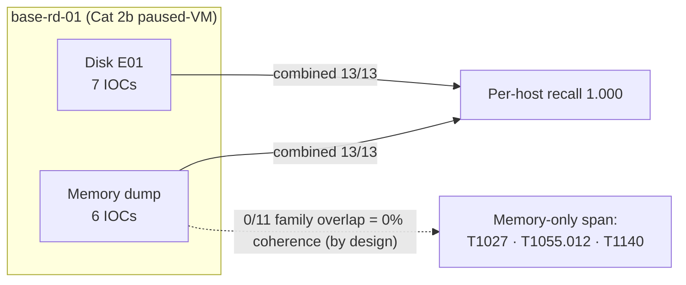

# Evaluation Corpus & Recall Methodology

> **Section 07 · SDLC & Ops** — the evidence the recall numbers are measured against.
> Related: [Testing](testing.md) ·
> [Implementation](implementation.md) ·
> [Security Model](security-model.md)

[Testing](testing.md) describes the ground-truth end-to-end recall *gate*; this page
documents the **corpus** that gate runs against — what evidence images exist, where they
came from, which ones have authored ground-truth, and the honest gaps. It is the
evaluator/judge-facing companion to the in-repo evaluator pack
(`docs/07-evaluator/evidence-dataset.md`), the authority for every number below.

All counts are anchored to source files (an `ls` of the actual `samples/` directory or a
dated recall snapshot), never to memory. Numbers that appear elsewhere in this portal track
[CANONICAL_FACTS](../08-reference/canonical-facts.md).

---

## Contents — what's in this page (and what to expect)

> Jump to any section below. Each row tells you what that part gives you, so you can go straight to your point.

| Section | What you'll get |
|---|---|
| [1. The two recall framings (read this first)](#1-the-two-recall-framings-read-this-first) | Why the headline reports recall two ways — *tactic-hit* (72/72 + 108/118 canonical) vs stricter *per-IOC* (156/156) — and why you must not add or reconcile them. |
| [2. Evidence corpus inventory](#2-evidence-corpus-inventory) | The full processed corpus (11 disk E01s + 25 memory dumps) vs the scored SRL-2018 subset, with per-modality counts and ground-truth status. |
| [3. The SRL-2018 disk corpus (the headline)](#3-the-srl-2018-disk-corpus-the-headline) | The 7 headline disks host-by-host (all 7/7 = 1.000) and the 27-technique MITRE ATT&CK span across the corpus. |
| [4. Cross-modal coherence (6 hosts)](#4-cross-modal-coherence-6-hosts) | How disk and memory artifacts corroborate per host, and why `base-rd-01`'s 0% coherence is by-design complementarity, not a defect. |
| [5. The honest gap — SRL-2015 memory pool](#5-the-honest-gap--srl-2015-memory-pool) | The largest coverage hole: 25 unground-truthed SRL-2015 dumps (~1,069 inferred IOCs) and the named action item to close it. |
| [6. Ground-truth YAML schema](#6-ground-truth-yaml-schema) | The real `expected_tactics` + `expected_findings` file format, the deterministic-keyword rule, and the ≥0.7 confirmed-vs-inference confidence convention. |
| [7. Provenance & license](#7-provenance--license) | Where every corpus came from (SANS / CyberDefenders public training material) and the license/curation status of each piece. |
| [8. What is NOT in the dataset](#8-what-is-not-in-the-dataset) | The explicit exclusions — no proprietary case data, no extra PII, no evidence-byte egress, no unvetted third-party corpora. |
| [See also](#see-also) | Cross-links to Testing, Implementation, Security Model, CANONICAL_FACTS, and the in-repo oracle artifacts. |

---

## 1. The two recall framings (read this first)

This project reports recall two ways, and the two headlines use **different
denominators**. Both are true; they count different things. Keep them distinct.

Two terms recur below and mean different units of measurement:

- **Tactic-hit recall** — counts whether each *expected MITRE technique* surfaced **at least
  once** anywhere in the run. The unit is the technique ID; one confirmed finding satisfies
  the whole technique. This is the looser, coverage-style count.
- **Per-IOC recall** — counts whether each *individual expected indicator of compromise*
  (one row of a ground-truth file's `expected_findings` list) surfaced. The unit is the
  single artifact expectation; multiple IOCs can map to the same technique. This is the
  stricter count.

| Framing | Headline | What it counts | Source |
|---|---|---|---|
| **Canonical (facts.md)** | **72/72 disk** (100%) · **108/118 memory** (91.5%) combined | Whole-corpus *tactic-hit* recall on the sealed `FULL-CASE-20260505T004738Z` run; memory is the combined 118-IOC pool incl. the harder `T1003.002` band (30/40) | [CANONICAL_FACTS](../08-reference/canonical-facts.md) |
| **Per-IOC (evidence-dataset.md)** | **156/156 distinct measurements = 1.000** | The sum of three *per-IOC* surfaces, operator-attested as of the 2026-05-06→07 snapshots: **49/49 disk + 107/107 memory + 83/83 cross-modal** | `docs/07-evaluator/evidence-dataset.md` (oracle) |

The 72/72 figure is a **tactic-hit** count (did each expected MITRE tactic surface at least
once?). The 49/49 figure is a stricter **per-IOC** count over the same 7 disks (did each
individual expected IOC surface?). They are *not* the same measurement on the same scale —
do not add them, and do not "reconcile" one into the other. The canonical pair
(72/72 + 108/118) is the headline this portal forward-drift-gates; the 156/156 per-IOC
total is the evaluator-pack framing and is **operator-attested**, point-in-time as of the
dated cross-modal snapshots.

> **Source note.** The 156/156 breakdown (49/49 + 107/107 + 83/83) is taken verbatim from
> the oracle's `docs/07-evaluator/evidence-dataset.md` headline table, which in turn
> consolidates the dated `CROSS-MODAL-RECALL-SUMMARY-2026-05-06.md` snapshot. The combined
> memory denominator differs because evidence-dataset.md scores **107/107 on 21 of 22 hosts
> at per-IOC granularity**, while canonical-facts.md reports the **108/118** combined pool (which
> includes the partially-recovered `T1003.002` SAM-dumping band at 30/40).

---

## 2. Evidence corpus inventory

The in-repo evaluator pack (`docs/07-evaluator/evidence-dataset.md`) states the corpus as
**11 disk E01s + 25 memory dumps · 3,710 findings · across SRL-2015 + SRL-2018**. The
recall *headline* is measured on the SRL-2018 subset (7 disks have authored ground-truth);
the wider 11-E01 / 25-dump figure is the full processed corpus including SRL-2015 evidence
that the system *runs against* but does not yet *score*.

| Corpus | Type | Count | Ground-truth | Scoring status |
|---|---|---|---|---|
| **SRL-2018 disk** | E01 disk images | 7 disks (subset of the 11 processed) | 7× `ground_truth_*-cdrive.yaml` | **49/49 IOCs = 1.000** (per-IOC) |
| **SRL-2018 memory** | Memory dumps | 22 hosts | 20 distinct `ground_truth_*-memory.yaml` (some hosts carry `-mem`/`-memory` aliases) | **107/107 = 1.000** on 21 of 22 hosts |
| **SRL-2018 cross-modal** | Disk + memory, same host | 6 paired hosts | Per-host coherence reports | **83/83 = 1.000** |
| **SRL-2015 memory pool** | Memory dumps | 25 dumps | **NONE** — open gap (§5) | **Not scored**; ~1,069 IOCs inferred, unmeasured |

A live `ls /home/admin2/agentropix-sift/samples/ground_truth_*.yaml` returns **29 files**,
matching the disk + memory ground-truth tally above. The evaluator pack reproduces recall
via the `real_corpus` pytest marker (requires `/cases/SRL-2015` or `/cases/SRL-2018`
mounted) — see [Testing §markers](testing.md).

---

## 3. The SRL-2018 disk corpus (the headline)

Seven disks from the SANS-published **SRL-2018 "Compromised Enterprise Network"** case —
a Cobalt Strike APT campaign with beacon persistence, lateral movement, credential
dumping, and process injection (per the header comment in `samples/ground_truth_dc.yaml`).

| Host | Image | Role | Per-IOC recall |
|---|---|---|---|
| Domain controller | `base-dc-cdrive.E01` | DC / infrastructure pivot | **7/7 = 1.000** |
| File server | `base-file-cdrive.E01` | SMB lateral-move destination | **7/7 = 1.000** |
| Remote desktop 01 | `base-rd-01-cdrive.E01` | RDS host, admin pivot | **7/7 = 1.000** |
| Remote desktop 02 | `base-rd-02-cdrive.E01` | RDS lateral hop | **7/7 = 1.000** |
| Workstation 01 | `base-wkstn-01-c-drive.E01` | Initial-foothold workstation, Outlook user | **7/7 = 1.000** |
| Workstation 05 | `base-wkstn-05-cdrive.E01` | User workstation, lateral target | **7/7 = 1.000** |
| DMZ FTP | `base-dmz-ftp-cdrive.E01` | DMZ-exposed FTP server, exfil staging | **7/7 = 1.000** |
| **Whole corpus** | 7 disks | (multi-host case) | **49/49 = 1.000** |

### MITRE ATT&CK span

The cross-modal snapshot (`CROSS-MODAL-RECALL-SUMMARY-2026-05-06.md`, closing technique
roll-up) reports **27 distinct MITRE techniques** across the corpus — the disk-evidence
core plus memory-only additions from paused-VM and specialty hosts:

```
T1003.002 · T1021.001 · T1021.002 · T1027 · T1053.005 · T1055 · T1055.012 ·
T1057 · T1059 · T1059.001 · T1059.003 · T1070.006 · T1071 · T1071.001 ·
T1078 · T1083 · T1105 · T1112 · T1114 · T1140 · T1218.011 · T1505.001 ·
T1505.003 · T1518.001 · T1543.003 · T1547.001 · T1560.001
```

> **Note.** The evaluator pack's one-line corpus row cites "8 MITRE techniques (per
> `project_apt_scenarios_analysis`)" — that is the count for a *single APT-scenario
> analysis artifact*, not the corpus span. The corpus-wide span is the **27 distinct
> techniques** rolled up in the cross-modal summary. Both are oracle figures at different
> scopes; this page uses 27 for the corpus and flags the 8 to avoid the apparent conflict.

---

## 4. Cross-modal coherence (6 hosts)

Six SRL-2018 hosts carry **both** disk and memory ground-truth, enabling a measurement no
prior project reported: **cross-modal coherence** — how often the same MITRE *family* is
corroborated across both the disk and memory artifacts of one host.

| Host | Combined recall | Coherence | Distinctive memory-only signal |
|---|---|---|---|
| base-wkstn-01 | 14/14 | 30.0% (3/10) | T1114 email collection + T1518.001 software discovery |
| base-dc | 14/14 | 27.3% (3/11) | T1057 + T1083 reconnaissance |
| base-rd-02 | 14/14 | 18.2% (2/11) | T1543.003 service control |
| base-wkstn-05 | 14/14 | 16.7% (2/12) | T1021.001 RDP listener + T1218.011 rundll32 orphan |
| base-file | 14/14 | 16.7% (2/12) | T1560.001 archive (Rar.exe) + T1112 registry mod |
| base-rd-01 | 13/13 | **0.0%** (0/11) | T1027 + T1055.012 + T1140 (memory-only structural anomalies) |
| **6-host sum** | — | mean 18.0% | **83/83 = 1.000** |

**0% coherence on `base-rd-01` is by design, not a defect.** It is a *Cat 2b paused-VM*
snapshot — in the cross-modal summary's capture-mode taxonomy, **Cat 2b** denotes a host
captured from a *paused (suspended) virtual machine* rather than a live, running system. A
paused capture exposes a fundamentally different surface than a live disk, so it
*adds* 3 net-new MITRE techniques (T1027, T1055.012, T1140) that disk evidence cannot
surface, even though it corroborates **zero** disk families. The framework reports 0% to
show it handles every snapshot mode honestly, rather than hiding the complementarity.
(Source: `CROSS-MODAL-RECALL-SUMMARY-2026-05-06.md`, "0.0% coherence is not a defect".)



---

## 5. The honest gap — SRL-2015 memory pool

The **25 SRL-2015 memory dumps** are the largest single coverage hole in the dataset. They
are *processed* by the system (used for mail-domain regression and phishing-chain
validation) but have **no authored `ground_truth_*.yaml` files**, so their recall is
**inferred, not measured** — an estimated ~1,069 IOCs that the system surfaces but no
scoring harness grades.

| Modality | Status | Count | Recall |
|---|---|---|---|
| SRL-2018 disk | Complete | 7/7 disks GT | **49/49 = 1.000** |
| SRL-2018 memory | Complete | 22 hosts (20 distinct YAMLs) | **107/107 = 1.000** on 21/22 |
| SRL-2018 cross-modal | Sampled | 6 of 7 host-pairs | **83/83 = 1.000** |
| **SRL-2015 memory** | **ABSENT** | 0/25 dumps GT | **Not measured** (~1,069 inferred) |
| **Total distinct measurements at 1.000** | | | **156/156** |

The gap exists because ground-truth authoring was prioritized for SRL-2018 (the headline
case for the SANS rubric); closing it — authoring per-dump YAMLs for the 25 SRL-2015 dumps,
re-running, and computing aggregate recall — is a named post-submission action item.

---

## 6. Ground-truth YAML schema

A ground-truth file enumerates the IOCs expected for one evidence image. The recall gate
loads these and subtracts confirmed technique IDs to populate the Critic's `gaps` channel
(see [Testing](testing.md)). The actual schema in `samples/ground_truth_*.yaml` is a
**two-part** structure: an `expected_tactics` list (the MITRE technique IDs that must be
covered) plus an `expected_findings` list (per-artifact expectations with deterministic
match keywords):

```yaml
case_id: "SANS-APT-DC-2018"
image: "base-dc-cdrive.E01"
filesystem: "ntfs"

# MITRE technique IDs the Trinity Loop must cover; any ID not confirmed by the
# swarm's findings lands in Critic.gaps.
expected_tactics:
  - "T1105"       # Ingress Tool Transfer (CS beacon delivery)
  - "T1547.001"   # Registry Run Keys
  - "T1053.005"   # Scheduled Task
  - "T1003.002"   # OS Credential Dumping: SAM
  # ...

# One entry per expected artifact the swarm should surface.
expected_findings:
  - artifact_path: "Windows/System32/config/SOFTWARE"
    description: "Cobalt Strike beacon registry persistence under HKLM run key"
    mitre_technique_id: "T1547.001"
    expected_agent: "ArtifactAgent"
    difficulty: "trivial"          # trivial | correlation | yara_hit
    evidence_keywords:             # deterministic substrings, NOT vendor labels
      - "Registry"
      - "CurrentVersion\\Run"
      - "beacon"
```

A key methodological detail visible in the file comments (W-052): match keywords are the
*deterministic substrings a forensic tool actually emits* (e.g. a plaso winreg key path),
**never** a vendor label like `CobaltStrike` that no tool produces. Per-disk recall =
matched `expected_findings` / total; whole-corpus recall sums across disks.

> **Conflict resolved (oracle wins).** The companion `compare/docs/ACCURACY-REPORT.md`
> describes the schema as `expected_tactic_hits` entries with `tactic` / `expected_count` /
> `evidence_token` keys. The **actual** repo YAMLs use `expected_tactics` +
> `expected_findings` with `mitre_technique_id` / `evidence_keywords` / `difficulty`. This
> page documents the real schema and notes the discrepancy.

### Confidence convention

Each finding carries a `confidence` float in `0.0..1.0`. The project convention — **≥ 0.7
is *confirmed*, < 0.7 is *inference*** — is corroborated in code by the
finding-to-severity band in `src/agentropix_sift/wazuh/finding_to_alert.py`, where the
`>= 0.70` threshold is the boundary at which a finding escalates to a high-severity Wazuh
level (9). Below that floor, a finding is a single-source observation requiring
corroboration; at or above it, the finding is treated as cross-validated.

---

## 7. Provenance & license

| Corpus | Provenance | License | Public source | Operator curation |
|---|---|---|---|---|
| SRL-2018 disks (7×) | SANS-published CTF / training material | Public training case | SANS training portal, CTF archives, SIFT-OVA | None (canonical SANS evidence) |
| SRL-2018 memory (22×) | Same case as disks | Public training case | SANS training portal | None (canonical) |
| SRL-2015 memory (25×) | SANS prior-year training case | Public training case | SANS archives | None (canonical) |
| Ground-truth YAMLs (29×) | Operator-authored IOC expectations | Test artifact (N/A) | No — local-only in the sift repo | Authored 2026-05-06 onward |
| TeamSpy T1566 fixture | CyberDefenders public BlueTeam challenge | Free with registration | Yes — CyberDefenders | Operator-authored IOC expectations |

**Summary.** Every evidence *byte* is publicly available SANS / CyberDefenders training
material — not real intrusions from production networks. Every ground-truth IOC file is an
operator-authored validation artifact, currently private/local in the source-of-truth repo
(the in-repo evaluator pack itself is marked **LOCAL-ONLY — DO NOT PUSH**). Whether the
YAMLs ship alongside a public submission is a separate operator decision; the underlying
SANS case data is openly distributed.

---

## 8. What is NOT in the dataset

1. **No proprietary case data.** All disk and memory images are public SANS / CyberDefenders
   training material — no real intrusions from production networks.
2. **No PII beyond what SANS publishes.** Ground-truth YAMLs reference usernames, domain
   names, and IPs from the public case documentation. No personal email addresses, real
   employee names, or extracted credential values are redistributed.
3. **No evidence-byte egress off the SIFT host.** Analysis stays within the read-only
   `/cases/` · `/mnt/` mount points; the sealed `report.json` contains only IOC metadata
   (paths, PIDs, hashes, MITRE tags), not raw bytes. See
   [Security Model](security-model.md) and [Provenance & Grounding](../05-safety-forensics/provenance-grounding.md).
4. **No unvetted third-party corpora.** External corpora surveyed for future acquisition
   are listed as *targets*, not current dataset members.

---

## See also

- [Testing](testing.md) — the ground-truth recall *gate* that runs against this corpus, plus the `real_corpus` pytest marker.
- [Implementation](implementation.md) — the swarm agents and scoring code the ground-truth files exercise.
- [Security Model](security-model.md) — the Thymus read-only boundary and seal invariants that keep evidence bytes on-host.
- [CANONICAL_FACTS](../08-reference/canonical-facts.md) — the canonical 72/72 + 108/118 recall pair and 4464-test count.
- In-repo oracle: `docs/07-evaluator/evidence-dataset.md` (evaluator pack) · `CROSS-MODAL-RECALL-SUMMARY-2026-05-06.md` (cross-modal snapshot) · `samples/ground_truth_*.yaml` (the 29 ground-truth files).
