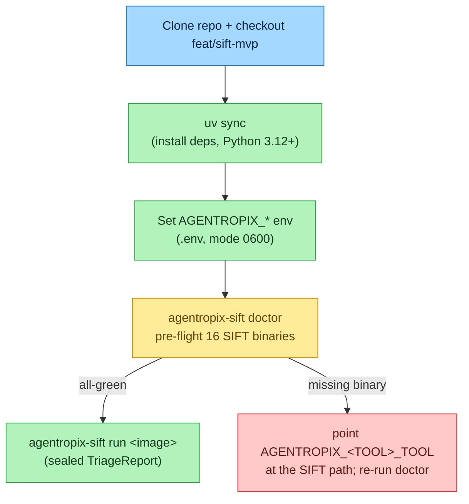

# Deployment — SIFT Install, Tailnet Exposure & Runbook Index

> How to stand Agentropix-SIFT up on a SANS SIFT Workstation, the optional tailnet-only
> remote-access posture, and an index of the operational runbooks shipped under
> [`docs/runbooks/`](https://github.com/galvangabriel-web/agentropix-sift/tree/main/docs/runbooks)
> in the source repo.

The deployment philosophy is **use the SIFT binaries that are already on the host** —
Agentropix-SIFT is a driver over the SANS toolchain, not a replacement for it. The single
green-light is `agentropix-sift doctor` returning all-green across the 16 forensic tools.

> **How to read this page.** This is an **operational** page, so every install / serve / verify
> step is shown **two ways** in a side-by-side callout — pick the track that fits you:
>
> - **🖥️ Expert (command):** the exact shell / CLI you run on the host.
> - **💬 End-user (prompt):** the plain-language question a non-technical user types into a Claude
>   session that already has the Agentropix MCP connected. The session routes it to the right
>   **real MCP tool** (`health` / `case_status`) — verified against
>   [`.crew/tool-list.md`](../../.crew/tool-list.md).
>
> Command/result pairs are labelled **Execution A → Output A**, **B → Output B**, … so it is
> unambiguous what you **run** vs what you **get back**. Sample outputs are from validated runs
> on a SANS SIFT host; your own paths, IDs, and timestamps will differ. Replace
> `<TAILNET-IP>` / `<repo-url>` / `<chat-id>` placeholders with your real values.

> **Provisioning vs. operating — who can use the 💬 track.** *Installing* and *starting* the server
> are operator-local, host-side steps; a non-technical user cannot `pip install` or bind a port by
> talking to a session that isn't connected yet. So for the install/serve steps the `💬` prompt is
> the **post-provisioning health question** the end-user asks once the MCP is wired up — it routes
> to the real `health` tool and confirms the result of what the operator just did. The `🖥️` command
> is the load-bearing half of those steps.

---

## 1. Install on a SANS SIFT Workstation

Target: SANS SIFT 2024.x (Ubuntu 22.04 base). Per the
[`deploy-to-sans`](#4-runbook-index) runbook, the flow is:



Prerequisites the runbook calls out: Python 3.12+, `uv`, `git`, network for the first
`uv sync`, and **≥20 GB free** on the evidence mount (E01 + Plaso temp + reports). The hard
rule is **do not `apt install` replacement forensic binaries** — SIFT PATH order matters, and
Agentropix-SIFT drives whatever `vol`/`fls`/`yara` it finds (see the malicious-binary line in
[security-model](security-model.md#5-threat-model--defends--does-not-defend); the opt-in
`AGENTROPIX_VERIFY_TOOL_PINS` exists as defense-in-depth). When `doctor` flags a missing tool,
point the corresponding `AGENTROPIX_<TOOL>_TOOL` env var at the SIFT-installed path
(see [configuration §5](configuration.md#5-per-wrapper-tuning-pattern-catalogue)) rather than
installing a new binary.

### 1.1 Install the package (clone + deps)

`uv sync` (the runbook default) installs the package and its dependencies into a project venv from
the locked `pyproject.toml`/`uv.lock`. A plain `pip`/`uv pip install` works too — the
`agentropix-sift` and `agentropix-sift-mcp` entry points come from `[project.scripts]` in
`pyproject.toml`.

> **🖥️ Expert (command):**
> ```bash
> # uv (recommended — installs from the lockfile into a project venv):
> git clone <repo-url> agentropix-sift
> cd agentropix-sift && git checkout feat/sift-mvp
> uv sync
>
> # pip / uv pip alternative (editable install into an existing venv):
> python3.12 -m venv .venv && . .venv/bin/activate
> pip install -e .            # or:  uv pip install -e .
> ```
> **💬 End-user (prompt):** *"Is the Agentropix forensic platform installed and responding?"*
> Once the operator has installed and started the MCP, the session calls the `health` tool and
> confirms the platform is up and reports its live tool count. **A simple, focused question is
> enough — the session recognises this as an Agentropix capability and routes it to the `health`
> check.** (Installing the package itself is a host-side operator step.)

**Execution A → Output A.**

*Execution A:* confirm the entry points resolve after install.
```bash
uv run agentropix-sift --help
```

*Output A (validated):* the CLI lists its subcommands — `run` (triage an image) and `doctor`. If the
command is not found, re-sync: `uv sync --reinstall`. The MCP server entry point is the separate
`agentropix-sift-mcp` script (see [§2](#2-serve-the-mcp-server)).

The optional Rust acceleration layer is built separately
(`maturin develop --release`); it is a performance accelerant, not a correctness dependency
— see [implementation §4](implementation.md#optional-rust-acceleration-layer-w-156).

### 1.2 Verify the forensic toolchain (`doctor`)

`agentropix-sift doctor` is the single green-light. It resolves the binaries that back the **16**
forensic SIFT wrappers — honoring any `AGENTROPIX_*_TOOL` override — and prints `[OK <path>]` or
`[MISSING]` for each, ending with `All tools available.` when nothing is missing. It does **not**
install anything; it pre-flights what the SANS host already provides.

> **🖥️ Expert (command):**
> ```bash
> uv run agentropix-sift doctor
> ```
> **💬 End-user (prompt):** *"Check that my Agentropix forensic environment is ready — are all the
> forensic tools installed?"*
> The session runs the same pre-flight via the `health` tool and tells you in plain language whether
> the platform is ready or what is missing. **A simple, focused question is enough — the session
> recognises this as an Agentropix capability and routes it to the right check.**

**Execution B → Output B.**

*Execution B:*
```bash
uv run agentropix-sift doctor
```

*Output B (validated, all present):*
```text
  [OK  /usr/bin/vol] Volatility3 (memory forensics) (vol)
  [OK  /usr/bin/log2timeline.py] Plaso (timeline) (log2timeline.py)
  [OK  /usr/bin/fls] Sleuth Kit (filesystem) (fls)
  [OK  /usr/bin/icat] Sleuth Kit (file extraction) (icat)
  [OK  /usr/bin/mmls] Sleuth Kit (partitions) (mmls)
  [OK  /usr/bin/ewfinfo] ewftools (E01 image metadata) (ewfinfo)
  ... (more) ...
All tools available.
```

> **Note on the line count.** `doctor` prints one `[OK …]` line per **binary** it resolves; on a
> SANS host that is **18** lines — the 16 SIFT forensic wrappers' backing binaries plus `icat`,
> `ssdeep`, and `strings`, which `doctor` also pre-flights. The prose figure **"16 forensic SIFT
> wrappers"** counts the wrapper layer, not the resolved-binary lines — both are correct. The
> closing `All tools available.` is the signal you care about.

A `[MISSING]` line degrades gracefully (the relevant agent self-skips) but lowers recall — resolve
each before a real run by pointing the override var at the SIFT-installed path (no symlink needed),
then re-run `doctor`:

> **🖥️ Expert (command):**
> ```bash
> export AGENTROPIX_YARA_TOOL=/opt/sift/bin/yara
> export AGENTROPIX_EVTX_TOOL=/usr/local/bin/evtx_dump.py
> uv run agentropix-sift doctor   # re-run; the line shows [via AGENTROPIX_YARA_TOOL=…]
> ```
> **💬 End-user (prompt):** *"One of the Agentropix forensic tools shows as missing — is the
> environment healthy now?"*
> After the operator sets the override, the session re-checks via `health` and confirms whether the
> toolchain is now complete.

**Execution C → Output C.**

*Execution C:* re-run `doctor` after setting an override.
```bash
uv run agentropix-sift doctor
```

*Output C (validated):* the previously-`[MISSING]` line now reads
`[OK  /opt/sift/bin/yara] YARA (pattern matching) (yara) [via AGENTROPIX_YARA_TOOL=/opt/sift/bin/yara]`,
and the run ends with `All tools available.`

Deep reference: [CLI Reference · `doctor`](../08-reference/cli-reference.md) ·
[configuration §5](configuration.md#5-per-wrapper-tuning-pattern-catalogue).

---

## 2. Serve the MCP server

The MCP surface is served by the separate `agentropix-sift-mcp` entry point
(`[project.scripts]` → `agentropix_sift.mcp_server.fastmcp_app:main`). It speaks **two transports**
(ADR-017): `stdio` (the default — for a command-based `mcp.json` on the local host) and `http` (for
the tailnet-only or hardened posture). On the operator host you typically run a local launcher; the
HTTP transport binds an address you front with Tailscale Serve (see [§3](#3-optional-tailnet-exposure-of-the-mcp-server)).

> **🖥️ Expert (command):**
> ```bash
> # stdio transport (local, command-based mcp.json) — the default:
> uv run agentropix-sift-mcp
>
> # http transport (tailnet-only / hardened) — bind an address + port:
> uv run agentropix-sift-mcp --transport http --host <TAILNET-IP> --port 8765
> ```
> **💬 End-user (prompt):** *"Is the Agentropix MCP server running and healthy?"*
> If the MCP is already connected to your session, the assistant calls the `health` tool and
> confirms. (Starting the server is an operator-local step — ask your administrator if it is not up.)

The bearer token (`AGENTROPIX_MCP_AUTH_TOKEN`) gates every HTTP-exposed tool; set it in the launching
shell before binding the HTTP transport. Over HTTP the server listens on `http://<host>:<port>/mcp`
(newer FastMCP, streamable-http) or `/sse` (older builds) — check the actual startup log line.

> ⚠️ **GOTCHA (autonomous / unattended runs):** the server is reaped if the shell that started it
> exits inside a sandbox. For an unattended run, start the server from a **detached / long-lived**
> process (e.g. the systemd unit in the [`expose-fastmcp-tailnet`](#4-runbook-index) runbook) so it
> survives the launching shell. Interactive sessions on the same host are unaffected.

**Execution D → Output D.**

*Execution D:* after the server is up, call the `health` tool from any connected client.

*Output D (validated):*
```json
{ "status": "ok", "server": "agentropix-sift", "tool_count": 71,
  "version": "...", "uptime_seconds": ... }
```

> ⚠️ **Always live-verify the tool count.** Trust the live `health.tool_count` / `tools/list`, never
> the startup banner or stale docs. The canonical platform figure is **71**
> (`{{ref:CANONICAL_FACTS#mcp_tool_count}}`, [`.crew/facts.md`](../../.crew/facts.md)); a live
> re-verification on 2026-06-06 returned `72` — a reproducible **+1** that over-counts the
> `wazuh_hunt_ioc` double-registration. The number stays **71** here until the operator re-runs the
> `CANONICAL_FACTS` refresh. When in doubt, trust your own live `health.tool_count`.

For the autonomous health surface, the `case_status` tool reports the active case's state once a case
is open (see [user-guide](../01-overview/user-guide.md)):

> **🖥️ Expert (MCP call):**
> ```text
> case_status  ->  { "case_id": "INC-...", "active": true, "findings": <n>, ... }
> ```
> **💬 End-user (prompt):** *"What's the status of my current Agentropix case?"*
> The session calls `case_status` and summarises the active case in plain language.

---

## 3. Optional: tailnet exposure of the MCP server

The default network posture is **tailnet-only** (ADR-017). To let a remote Claude Desktop /
Claude Code instance call the MCP tools without public-internet exposure, the
[`expose-fastmcp-tailnet`](#4-runbook-index) runbook fronts the loopback-bound FastMCP server
with Tailscale Serve over HTTPS. Tailnet membership is the auth boundary; the bearer token
(`AGENTROPIX_MCP_AUTH_TOKEN`) is the second factor. Public exposure (`--public`) is opt-in and
requires the extra hardening ADR-017 documents. The auth/exposure model is detailed in
[security-model §4](security-model.md#4-server-exposure--auth) and
[configuration §1](configuration.md#1-mcp-server-auth--exposure-w-235-w-242).

---

## 4. Runbook index

The source repo ships self-contained operational playbooks under
[`docs/runbooks/`](https://github.com/galvangabriel-web/agentropix-sift/tree/main/docs/runbooks)
— each with prerequisites, step-by-step, a verification command, and a rollback path. The
canonical index is [`docs/runbooks/README.md`](https://github.com/galvangabriel-web/agentropix-sift/blob/main/docs/runbooks/README.md).

| Runbook | One-line description |
|---------|----------------------|
| [`deploy-to-sans.md`](https://github.com/galvangabriel-web/agentropix-sift/blob/main/docs/runbooks/deploy-to-sans.md) | Stand Agentropix-SIFT up on a fresh SANS SIFT host: tool PATH, venv, env vars, `doctor` verification. |
| [`expose-fastmcp-tailnet.md`](https://github.com/galvangabriel-web/agentropix-sift/blob/main/docs/runbooks/expose-fastmcp-tailnet.md) | Expose the FastMCP server on your tailnet via Tailscale Serve (operator + guest sections); no public exposure. |
| [`incident-token-rotation.md`](https://github.com/galvangabriel-web/agentropix-sift/blob/main/docs/runbooks/incident-token-rotation.md) | Emergency Telegram bot-token rotation mid-incident via the W-007 precedence chain; no process restart. |
| [`troubleshoot-oom-timeout.md`](https://github.com/galvangabriel-web/agentropix-sift/blob/main/docs/runbooks/troubleshoot-oom-timeout.md) | Decision tree for OOM kills / `WRAPPER_TIMEOUT` on large E01s; covers `AGENTROPIX_PLASO_TIMEOUT`, `AGENTROPIX_MEM_LIMIT_MB`, `AGENTROPIX_MIN_DISK_MB`. |
| [`threat-hunt-phases.md`](https://github.com/galvangabriel-web/agentropix-sift/blob/main/docs/runbooks/threat-hunt-phases.md) | Investigation-phase → tool/skill map for driving a hunt through the swarm. |
| [`valhuntir-on-wazuh-e2e.md`](https://github.com/galvangabriel-web/agentropix-sift/blob/main/docs/runbooks/valhuntir-on-wazuh-e2e.md) | End-to-end Valhuntir-on-Wazuh walkthrough (SIFT-W-296), incl. the approval sidecar path. |
| [`vol26-install.md`](https://github.com/galvangabriel-web/agentropix-sift/blob/main/docs/runbooks/vol26-install.md) | Vol 2.6 sandbox install for the `get_editbox` MCP wrapper. |
| [`vol3-malfind-coverage.md`](https://github.com/galvangabriel-web/agentropix-sift/blob/main/docs/runbooks/vol3-malfind-coverage.md) | Validate `vol3 windows.malfind` coverage on the SRL-2018 corpus. |
| [`wazuh-manager-api-tls-procedure.md`](https://github.com/galvangabriel-web/agentropix-sift/blob/main/docs/runbooks/wazuh-manager-api-tls-procedure.md) | Wazuh Manager API TLS deploy via mkcert (W-A13b). |
| [`wazuh-manager-break-glass.md`](https://github.com/galvangabriel-web/agentropix-sift/blob/main/docs/runbooks/wazuh-manager-break-glass.md) | Break-glass recovery procedure for a wedged Wazuh manager. |
| [`RESTORE-MVP-GREEN.md`](https://github.com/galvangabriel-web/agentropix-sift/blob/main/docs/runbooks/RESTORE-MVP-GREEN.md) | Restore procedure to the known-good MVP-GREEN state. |
| [`_CURRENCY-2026-06-03.md`](https://github.com/galvangabriel-web/agentropix-sift/blob/main/docs/runbooks/_CURRENCY-2026-06-03.md) | Currency/audit note tracking which runbook figures are current vs. snapshot. |

> **Currency note.** Some older runbooks carry an inline `AUDIT 2026-06-05` banner correcting
> stale figures (e.g. `expose-fastmcp-tailnet.md` references "16 tools", a 2026-04-25
> snapshot — the live MCP surface is **71 tools**; `deploy-to-sans.md` corrected an "880+
> unit tests" figure to the canonical **4464**). Treat the banners and
> [CANONICAL_FACTS](../../.crew/facts.md) as authoritative over the runbook prose.

---

## See also

- [implementation](implementation.md) — package layout and the build backend.
- [configuration](configuration.md) — the env vars you set during install.
- [security-model](security-model.md) — tailnet posture, auth, and the malicious-binary caveat.
- [recovery-resilience](recovery-resilience.md) — OOM/timeout behaviour the troubleshooting runbook drives.
