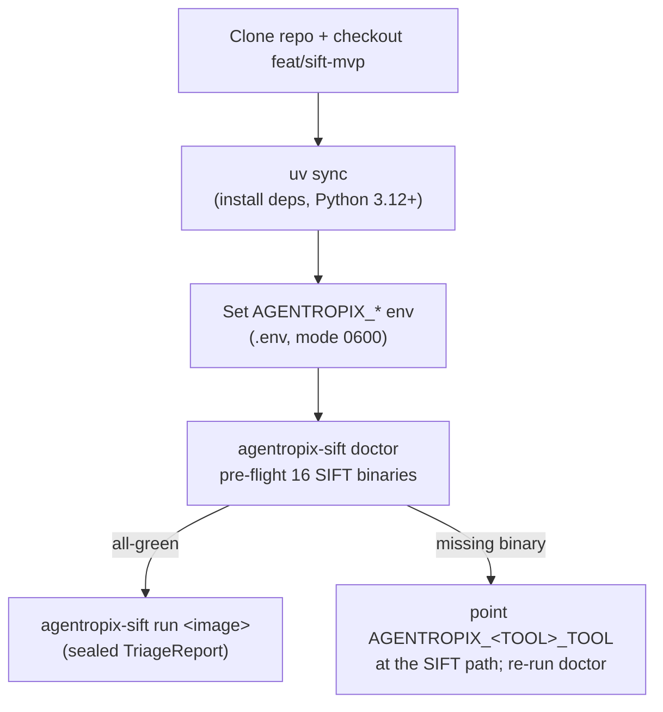

# Deployment — SIFT Install, Tailnet Exposure & Runbook Index

> How to stand Agentropix-SIFT up on a SANS SIFT Workstation, the optional tailnet-only
> remote-access posture, and an index of the operational runbooks shipped under
> [`docs/runbooks/`](https://github.com/galvangabriel-web/agentropix-sift/tree/main/docs/runbooks)
> in the source repo.

The deployment philosophy is **use the SIFT binaries that are already on the host** —
Agentropix-SIFT is a driver over the SANS toolchain, not a replacement for it. The single
green-light is `agentropix-sift doctor` returning all-green across the 16 forensic tools.

---

## 1. Install on a SANS SIFT Workstation

Target: SANS SIFT 2024.x (Ubuntu 22.04 base). Per the
[`deploy-to-sans`](#runbook-index) runbook, the flow is:

Prerequisites the runbook calls out: Python 3.12+, `uv`, `git`, network for the first
`uv sync`, and **≥20 GB free** on the evidence mount (E01 + Plaso temp + reports). The hard
rule is **do not `apt install` replacement forensic binaries** — SIFT PATH order matters, and
Agentropix-SIFT drives whatever `vol`/`fls`/`yara` it finds (see the malicious-binary line in
[security-model](security-model.md#5-threat-model--defends--does-not-defend); the opt-in
`AGENTROPIX_VERIFY_TOOL_PINS` exists as defense-in-depth). When `doctor` flags a missing tool,
point the corresponding `AGENTROPIX_<TOOL>_TOOL` env var at the SIFT-installed path
(see [configuration §5](configuration.md#5-per-wrapper-tuning-pattern-catalogue)) rather than
installing a new binary.

The optional Rust acceleration layer is built separately
(`maturin develop --release`); it is a performance accelerant, not a correctness dependency
— see [implementation §4](implementation.md#optional-rust-acceleration-layer-w-156).

---

## 2. Optional: tailnet exposure of the MCP server

The default network posture is **tailnet-only** (ADR-017). To let a remote Claude Desktop /
Claude Code instance call the MCP tools without public-internet exposure, the
[`expose-fastmcp-tailnet`](#runbook-index) runbook fronts the loopback-bound FastMCP server
with Tailscale Serve over HTTPS. Tailnet membership is the auth boundary; the bearer token
(`AGENTROPIX_MCP_AUTH_TOKEN`) is the second factor. Public exposure (`--public`) is opt-in and
requires the extra hardening ADR-017 documents. The auth/exposure model is detailed in
[security-model §4](security-model.md#4-server-exposure--auth) and
[configuration §1](configuration.md#1-mcp-server-auth--exposure-w-235-w-242).

---

## 3. Runbook index

The source repo ships self-contained operational playbooks under
[`docs/runbooks/`](https://github.com/galvangabriel-web/agentropix-sift/tree/main/docs/runbooks)
— each with prerequisites, step-by-step, a verification command, and a rollback path. The
canonical index is [`docs/runbooks/README.md`](https://github.com/galvangabriel-web/agentropix-sift/blob/main/docs/runbooks/README.md).

| Runbook | One-line description |
|---------|----------------------|
| [`deploy-to-sans.md`](https://github.com/galvangabriel-web/agentropix-sift/blob/main/docs/runbooks/deploy-to-sans.md) | Stand Agentropix-SIFT up on a fresh SANS SIFT host: tool PATH, venv, env vars, `doctor` verification. |
| [`expose-fastmcp-tailnet.md`](https://github.com/galvangabriel-web/agentropix-sift/blob/main/docs/runbooks/expose-fastmcp-tailnet.md) | Expose the FastMCP server on your tailnet via Tailscale Serve (operator + guest sections); no public exposure. |
| [`incident-token-rotation.md`](https://github.com/galvangabriel-web/agentropix-sift/blob/main/docs/runbooks/incident-token-rotation.md) | Emergency Telegram bot-token rotation mid-incident via the W-007 precedence chain; no process restart. |
| [`troubleshoot-oom-timeout.md`](https://github.com/galvangabriel-web/agentropix-sift/blob/main/docs/runbooks/troubleshoot-oom-timeout.md) | Decision tree for OOM kills / `WRAPPER_TIMEOUT` on large E01s; covers `AGENTROPIX_PLASO_TIMEOUT`, `AGENTROPIX_MEM_LIMIT_MB`, `AGENTROPIX_MIN_DISK_MB`. |
| [`threat-hunt-phases.md`](https://github.com/galvangabriel-web/agentropix-sift/blob/main/docs/runbooks/threat-hunt-phases.md) | Investigation-phase → tool/skill map for driving a hunt through the swarm. |
| [`valhuntir-on-wazuh-e2e.md`](https://github.com/galvangabriel-web/agentropix-sift/blob/main/docs/runbooks/valhuntir-on-wazuh-e2e.md) | End-to-end Valhuntir-on-Wazuh walkthrough (SIFT-W-296), incl. the approval sidecar path. |
| [`vol26-install.md`](https://github.com/galvangabriel-web/agentropix-sift/blob/main/docs/runbooks/vol26-install.md) | Vol 2.6 sandbox install for the `get_editbox` MCP wrapper. |
| [`vol3-malfind-coverage.md`](https://github.com/galvangabriel-web/agentropix-sift/blob/main/docs/runbooks/vol3-malfind-coverage.md) | Validate `vol3 windows.malfind` coverage on the SRL-2018 corpus. |
| [`wazuh-manager-api-tls-procedure.md`](https://github.com/galvangabriel-web/agentropix-sift/blob/main/docs/runbooks/wazuh-manager-api-tls-procedure.md) | Wazuh Manager API TLS deploy via mkcert (W-A13b). |
| [`wazuh-manager-break-glass.md`](https://github.com/galvangabriel-web/agentropix-sift/blob/main/docs/runbooks/wazuh-manager-break-glass.md) | Break-glass recovery procedure for a wedged Wazuh manager. |
| [`RESTORE-MVP-GREEN.md`](https://github.com/galvangabriel-web/agentropix-sift/blob/main/docs/runbooks/RESTORE-MVP-GREEN.md) | Restore procedure to the known-good MVP-GREEN state. |
| [`_CURRENCY-2026-06-03.md`](https://github.com/galvangabriel-web/agentropix-sift/blob/main/docs/runbooks/_CURRENCY-2026-06-03.md) | Currency/audit note tracking which runbook figures are current vs. snapshot. |

> **Currency note.** Some older runbooks carry an inline `AUDIT 2026-06-05` banner correcting
> stale figures (e.g. `expose-fastmcp-tailnet.md` references "16 tools", a 2026-04-25
> snapshot — the live MCP surface is **71 tools**; `deploy-to-sans.md` corrected an "880+
> unit tests" figure to the canonical **4464**). Treat the banners and
> [CANONICAL_FACTS](../../.crew/facts.md) as authoritative over the runbook prose.

---

## See also

- [implementation](implementation.md) — package layout and the build backend.
- [configuration](configuration.md) — the env vars you set during install.
- [security-model](security-model.md) — tailnet posture, auth, and the malicious-binary caveat.
- [recovery-resilience](recovery-resilience.md) — OOM/timeout behaviour the troubleshooting runbook drives.
