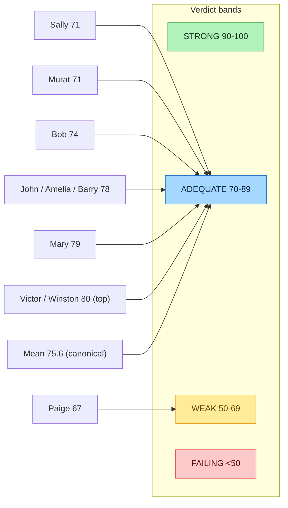

# Evaluation Scorecard — BMAD Persona Verdict & Rubric Self-Grade

> **Section 07 · SDLC & Ops** — the independent multi-persona evaluation and the
> Devpost rubric self-assessment, two evidence-of-quality signals a judge can audit.
> Related: [Testing](testing.md) (the recall gate behind the D2 score) ·
> [Security Model](security-model.md) (the D3 verifiability spine) ·
> [Audit & Courtroom Seal](../05-safety-forensics/audit-courtroom.md) ·
> [Canonical Facts](../../.crew/facts.md) (the source of every number on this page)

Agentropix-SIFT was put through **two deliberately independent quality assessments** before
submission: a **10-persona BMAD cross-discipline evaluation** (the engineering verdict) and a
**voluntary re-grade against the actual Devpost rubric** (the submission self-grade). Neither
is a marketing artifact — both ship with named gaps, confidence weights, and reproducible
math. This page records the canonical scores; **every number here cites
[CANONICAL_FACTS](../../.crew/facts.md)** and must never contradict it.

| Assessment | Canonical score | Source |
|---|---|---|
| BMAD 10-persona synthesis | **75.6 / 100** (mean) · **80 / 100** top (Winston + Victor) | `bmad_synthesis_score` — [CANONICAL_FACTS](../../.crew/facts.md) |
| Devpost rubric self-grade | **83.83 / 100** | `rubric_score_self` — [CANONICAL_FACTS](../../.crew/facts.md) |

> **Number discipline (conflict resolved).** An earlier presentation draft quoted a
> *confidence-weighted* total of 77.95/100 for the BMAD synthesis. The canonical figure is the
> **unweighted mean of 75.6/100** as registered in `CANONICAL_FACTS.md` under
> `bmad_synthesis_score`. The 77.95 figure is the weighted variant from the synthesis
> worksheet and is **not** canonicalized; this page uses 75.6 (mean) / 80 (top) and cites the
> fact file. See [Conflicts](#conflicts-resolved) below.

---

## 1. What BMAD is and why it is independent

BMAD (Build / Measure / Analyze / Decide) is the sprint methodology behind the evaluation: a
crew of **10 personas** each scored the project *in isolation*, across five dimensions, from a
distinct professional lens — analyst, PM, business strategist, architect, UX, dev, solo-dev,
test architect, tech-writer, and scrum master. No persona saw another's score before
submitting, so agreement between personas is a real cross-discipline signal rather than an
echo. The per-persona outputs were then folded into one weighted synthesis.

The independence is the point: a single self-assessment is easy to game; **ten isolated
discipline-specific verdicts that all land in the same band** is hard to game. The full
methodology, persona outputs, and synthesis math live operator-side in the
`2026-05-23-bmad-eval-sweep` worksheet (cited by `CANONICAL_FACTS.md` for
`bmad_synthesis_score`); they are not shipped in the public repo per the project's
Docs Local-Only Policy.

---

## 2. The five dimensions (D1–D5)

Each persona scored five dimensions, each out of 20, for a 100-point total. The dimensions map
directly onto what a DFIR judge cares about:

| Dim | Name | What it measures | Primary voice (confidence) |
|---|---|---|---|
| **D1** | Architecture & Extensibility | Is the layering real? Is the MCP boundary an enforced seam? | Winston (architect) — HIGH, 18/20 |
| **D2** | Agentic Autonomy & Execution | Is the planner/reviewer loop a deterministic loop or a slide? | Amelia (dev) HIGH 18/20 + Barry (solo-dev) HIGH 17/20 |
| **D3** | Verifiability, Safety & Governance | Is there a verifier, is it tested, is the seal bound to evidence? | Murat (test architect) — HIGH, 16/20 |
| **D4** | Transformative Workflow Capabilities | Do the workflows produce measurable, real recall outputs? | Murat (test architect) — HIGH, 14/20 |
| **D5** | Strategic Impact & Usability | Is the judge-facing narrative as strong as the engineering? | Mary + John + Victor + Bob — HIGH composite |

The system's own read of its profile: **engineering is ahead of narrative.** D1–D3 cluster
high; D5 (strategic packaging) is the weakest dimension and the named load-bearing gap — see
[§5](#5-honest-gaps-named-with-owners--effort).

---

## 3. The verdict matrix (10 personas)

Each cell is that persona's score for the dimension; the **Total** column is the 100-point
sum. Verdict bands: **STRONG 90–100 · ADEQUATE 70–89 · WEAK 50–69 · FAILING <50.**

| # | Persona (lens) | Total | D1 | D2 | D3 | D4 | D5 | Verdict |
|---|---|---|---|---|---|---|---|---|
| 1 | Mary (analyst) | 79 | 16 | 14 | 17 | 17 | 15 | ADEQUATE |
| 2 | John (PM) | 78 | 17 | 15 | 16 | 17 | 13 | ADEQUATE |
| 3 | Victor (business strategist) | **80** | 17 | 15 | 18 | 16 | 14 | ADEQUATE |
| 4 | Winston (architect) | **80** | 18 | 15 | 17 | 16 | 14 | ADEQUATE |
| 5 | Sally (UX) | 71 | 14 | 14 | 16 | 13 | 14 | ADEQUATE |
| 6 | Amelia (dev) | 78 | 15 | 18 | 15 | 16 | 14 | ADEQUATE |
| 7 | Barry (solo-dev) | 78 | 16 | 17 | 15 | 16 | 14 | ADEQUATE |
| 8 | Murat (test architect) | 71 | 13 | 14 | 16 | 14 | 14 | ADEQUATE |
| 9 | Paige (tech-writer) | 67 | 14 | 13 | 14 | 13 | 13 | **WEAK** |
| 10 | Bob (scrum master) | 74 | 14 | 14 | 15 | 15 | 16 | ADEQUATE |

**Range 67–80. 9 ADEQUATE · 1 WEAK · 0 STRONG · 0 FAILING.** The unanimous synthesis read:
*the system passes today and is one editorial sprint away from STRONG.* The single WEAK rating
(Paige) is from a tech-writer lens that treats stale governance artifacts as more disqualifying
than any other discipline does. Two personas tied for the top at **80/100** —
**Victor** (high on D3 verifiability, 18) and **Winston** (high on D1 architecture, 18 HIGH) —
which is the canonical top figure registered as `bmad_synthesis_score`.

---

## 4. Confidence weighting and the top-5 strengths

Personas tagged each dimension score with a **confidence level**, and the synthesis weighted
agreement by it: **HIGH = 1.0 · MED = 0.5 · LOW = 0.1.** A strength flagged by many personas at
HIGH confidence carries far more weight than one asserted once at LOW. The same weighting
produced the mean-vs-top spread: the **canonical mean is 75.6/100** and the **canonical top is
80/100** (Winston + Victor) per [CANONICAL_FACTS](../../.crew/facts.md).

Top-5 cross-discipline strengths (flagged by ≥2 personas, confidence-weighted):

| # | Strength | Flagged by | Weighted |
|---|---|---|---|
| 1 | **Real-data evidence** in the FULL-CASE report (per-IOC recall, per-host SUMMARY) | 9 of 10 | 4.3 |
| 2 | **Voluntary rubric re-grade discipline** (self-corrected an over-claimed internal grade down to the honest Devpost grade) | 4 of 10 | 4.0 |
| 3 | **HMAC-SHA-256 report seal + evidence SHA-256 anchor + audit-log cross-bind** (courtroom-grade chain of custody) | 8 of 10 | 3.7 |
| 4 | **Planner/reviewer loop with completion-promise tokens** (Architect → Swarm → Critic, deterministic fingerprint halt, stable-agent drop) | 8 of 10 | 3.4 |
| 5 | **MCP boundary as a single auditable seam** (typed wrappers driving Plaso / Vol3 / TSK / RegRipper / YARA / EZ-Tools) | 8 of 10 | 3.3 |

The strengths line up with the architecture the rest of the portal documents: the
[security model](security-model.md) (structural read-only + seal), the
[recall gate](testing.md#4-the-ground-truth-e2e-recall-gate) (real-data evidence), and the
[courtroom seal](../05-safety-forensics/audit-courtroom.md) (chain of custody).

---

## 5. Honest gaps (named with owners + effort)

BMAD identified five cross-discipline weaknesses that ≥2 personas agreed on. The project ships
them with owners and effort estimates rather than hide them — this is the calibration claim
behind the ADEQUATE band: **the team named these before judges had to find them.** Effort
sizes: **S = <1 day · M = 1–3 days.**

| # | Gap | Flagged by | Effort | Status |
|---|---|---|---|---|
| 1 | **Demo video not yet recorded** — narration script + shot list + production checklist shipped; recording is operator action. | 5 personas | M | OPEN (operator) |
| 2 | **No quantified manual-baseline triage time** — "accelerated triage" is asserted, not yet measured against a manual baseline on the same image. | 5 personas | M | OPEN |
| 3 | **First-5-minutes start path** — the `start-mcp.sh` follow-up cluster has open gaps that a fresh clone may hit. | 5 personas | S | OPEN |
| 4 | **Oracle independence** — 6 of 7 per-host ground-truth YAMLs were authored *post-hoc* from the run's own output, so the disk recall is partially curve-fit; a blinded held-out GT is the named fix. | 4 personas | M | OPEN |
| 5 | **Internal-dialect pollution** — operator codenames untranslated for fresh reviewers. | 3 personas | M | PARTIALLY CLOSED |

Gap 4 is the same methodology caveat that the [testing page](testing.md#canonical-recall-numbers)
records against the canonical disk-recall figure (**72/72**, post-hoc GT; blinded variant
pending Theme 4). Closing gaps 1, 2, and 4 is editorial + one timing experiment — *not new
engineering* — and the synthesis read is that doing so lifts the score toward STRONG.

---

## 6. The Devpost rubric self-grade — 83.83/100

Separately from the BMAD verdict, the team self-graded against the **actual Devpost 6-criterion
rubric**. The discipline here is the headline: an earlier internal grade scored the project
against the *wrong* internal rubric and over-claimed; the team **voluntarily re-graded** against
the real Devpost rubric and landed at the honest **83.83/100** (`rubric_score_self`,
[CANONICAL_FACTS](../../.crew/facts.md)). The project does not over-claim its own score — that
self-correction is itself the #2 weighted strength in [§4](#4-confidence-weighting-and-the-top-5-strengths).

The six Devpost criteria the self-grade covers map onto features documented elsewhere in this
portal:

| Devpost criterion | Where the evidence lives |
|---|---|
| Autonomous Execution Quality | the deterministic planner/reviewer loop — see [Implementation](implementation.md) |
| IR Accuracy | the ground-truth recall gate — see [Testing](testing.md#4-the-ground-truth-e2e-recall-gate) |
| Breadth and Depth | the corpora and MITRE coverage — see [Data section](../03-data/) |
| Constraint Implementation | the architectural safety boundaries — see [Security Model](security-model.md) |
| Audit Trail Quality | the `@traced` ledger + HMAC seal — see [Audit & Courtroom Seal](../05-safety-forensics/audit-courtroom.md) |
| Usability and Documentation | this portal + the submission doc suite |

---

## 7. The canonical project shape (for context)

The evaluation scored the system as it actually ships. The load-bearing structural numbers —
which override any older figures a stale presentation might carry — are, per
[CANONICAL_FACTS](../../.crew/facts.md):

| Fact | Canonical value |
|---|---|
| MCP tool surface | **71** distinct tool functions |
| Swarm specialists | **7** core DFIR specialists (+ 6 ATT&CK detector agents; 13 `SWARM` classes) |
| Test suite | **4464** collected tests |
| Disk recall (regression) | **72/72 (100%)** |
| Memory recall (combined) | **108/118 (91.5%)** |
| Python | **3.12+** |

> **Do not quote the stale presentation figures.** An older draft cited "46 tools",
> "11-agent swarm", and "2,807 tests". The canonical, oracle-verified values are
> **71 tools**, **7 core specialists + 6 detectors**, and **4464 tests** — always cite the
> fact file.

---

## Conflicts resolved

- **BMAD synthesis total — 77.95 vs 75.6.** The source presentation used the
  *confidence-weighted* total **77.95/100**. The oracle's `CANONICAL_FACTS.md` registers
  `bmad_synthesis_score` as the **unweighted mean of 75.6/100** (top 80/100). The fact file
  wins; this page uses **75.6 (mean) / 80 (top)** and cites it. The 77.95 weighted variant is
  noted but not canonicalized.
- **Tool / agent / test counts.** The source presentation carried legacy figures
  (46 tools, 11-agent swarm, 2,807 tests). Replaced with the canonical
  **71 tools / 7 core specialists + 6 detectors / 4464 tests** per
  [CANONICAL_FACTS](../../.crew/facts.md).

---

## See also

- [Testing](testing.md) — the recall gate and coverage gates the D2/D3 scores rest on.
- [Security Model](security-model.md) — the structural read-only and seal controls (D3).
- [Audit & Courtroom Seal](../05-safety-forensics/audit-courtroom.md) — chain-of-custody, the #3 strength.
- [Canonical Facts](../../.crew/facts.md) — the single source of truth for every number here.
