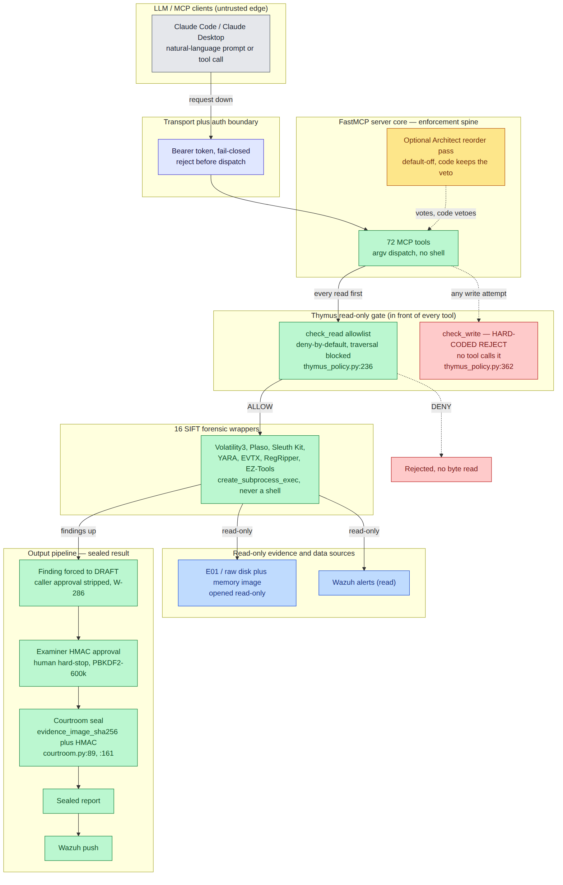
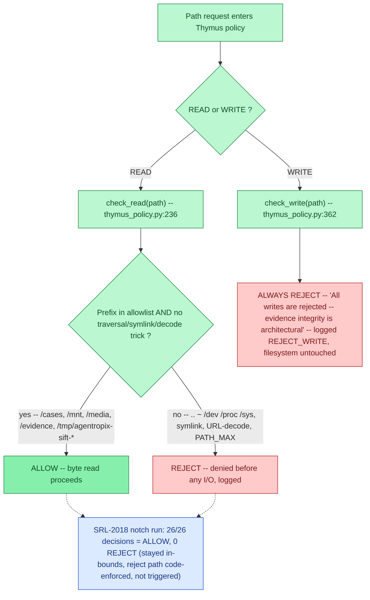
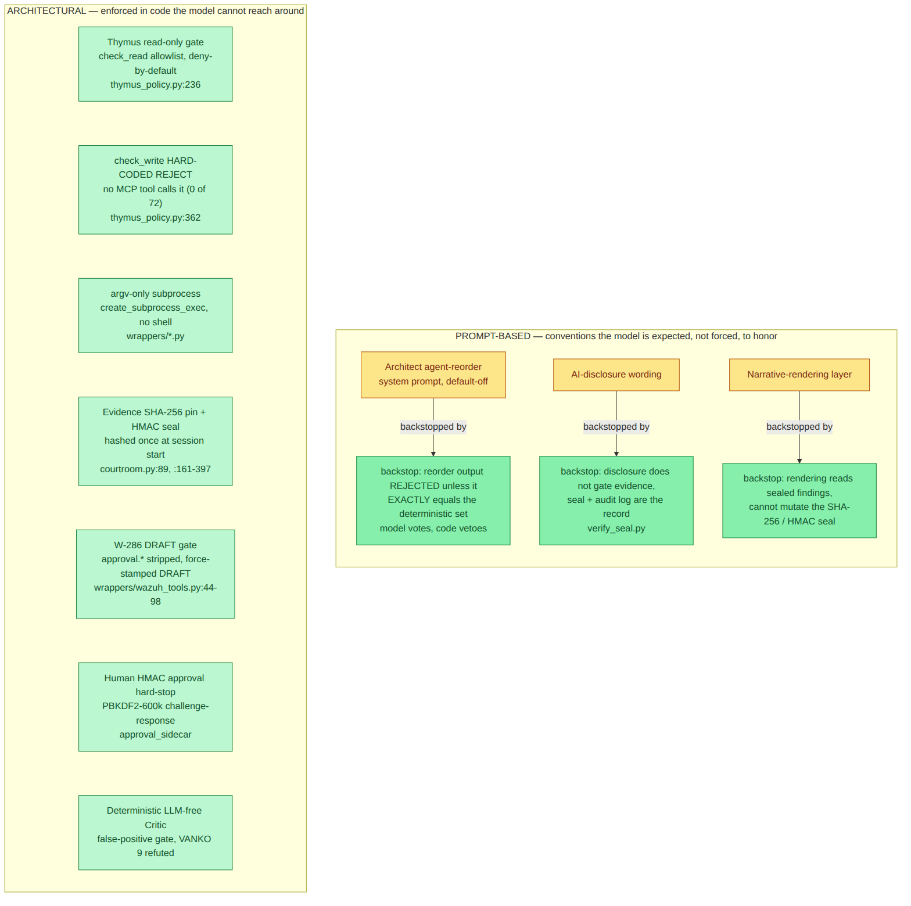
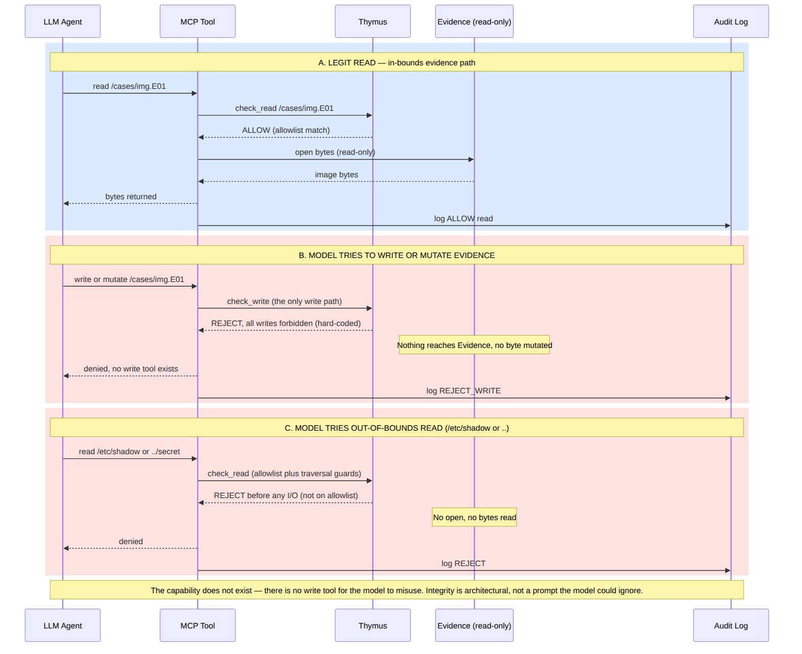
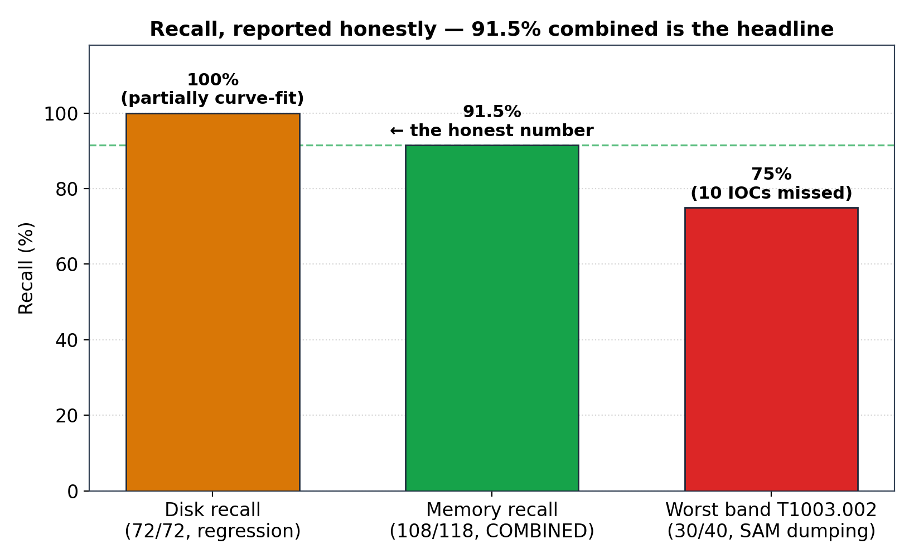
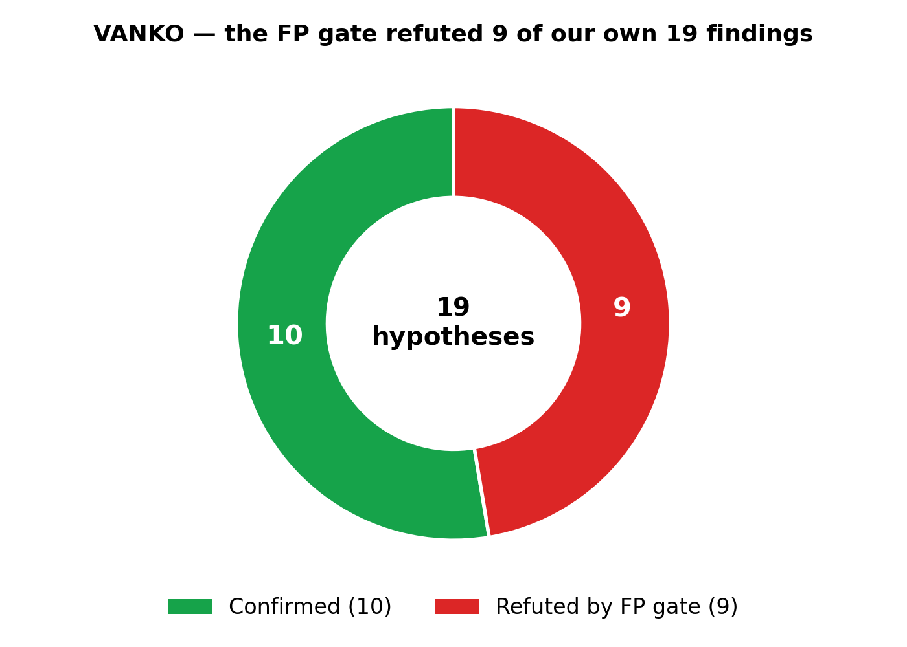
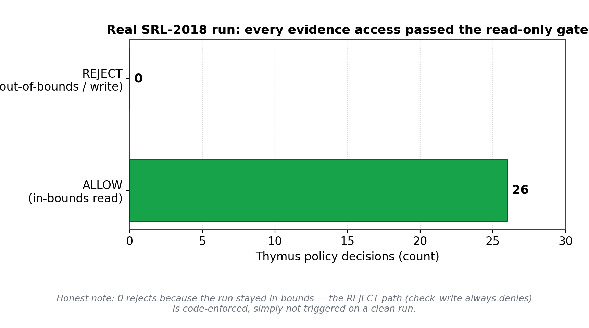
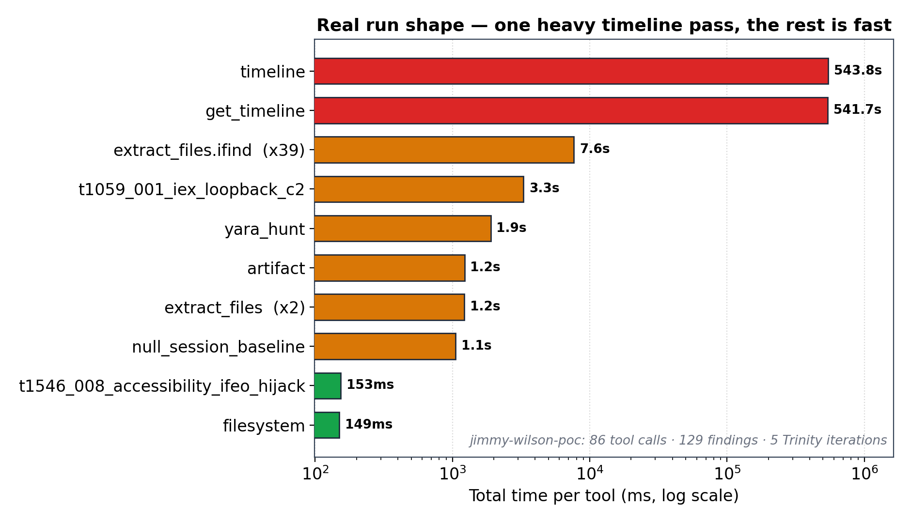

# Evidence Integrity, Visualized — Architectural, Not Prompt-Based

A graphical companion to [`ACCURACY-REPORT.md`](ACCURACY-REPORT.md) §6. This page proves, with
architecture diagrams **and** real-data charts, that evidence integrity in Agentropix-SIFT is
**architectural** — enforced in code the model cannot reach around — and shows exactly what happens
if the model "ignores" the restriction. Audience: judges and auditors.

## How to read this page

Every figure on this page is grounded in two things, and nothing else:

1. **Real code** — each control is cited to its source file and line (e.g. `thymus_policy.py:236`).
   The diagrams are not aspirational; they trace the actual enforcement path through the codebase.
2. **Real prior runs** — the charts are computed from the 2026 **SRL-2018** (APT IP-theft) and
   **VANKO** (insider IP-theft) cases and their executed MCP transcripts. Expect real artifacts,
   real IDs, and **honest negatives** — including the controls that were never *triggered* on a clean
   run and the recall band that underperforms. We disclose those rather than hide them.

**Color language** (consistent across every diagram):

| Color | Meaning |
|---|---|
| 🟩 **Green** | Architectural / **code-enforced** — the model cannot bypass it |
| 🟨 **Amber** | **Prompt-based** convention — the model is *expected*, not *forced*, to honor it (each is backstopped by green) |
| 🟦 **Blue** | **Read-only** evidence and data sources (opened read-only) |
| ⬜ **Grey** | The **untrusted LLM edge** (Claude client) |
| 🟥 **Red** | **REJECT / deny** path — denied before any byte of I/O |

The thesis the visuals carry: **the load-bearing controls are all green.** Nothing amber is
load-bearing, because every amber convention is backstopped by a green, code-enforced check.

---

## Layered architecture — how the components interconnect

**Caption.** Master layering of Agentropix-SIFT, top to bottom: an untrusted Claude client (grey)
passes through a fail-closed Bearer boundary into the FastMCP enforcement spine of 72 tools, where the
Thymus read-only gate fronts every tool — `check_read` is a deny-by-default allowlist
(`thymus_policy.py:236`) and `check_write` is a hard-coded REJECT that no tool calls
(`thymus_policy.py:362`). Allowed reads reach the 16 forensic wrappers (argv subprocess, never a shell)
that open E01/raw disk and memory images and Wazuh strictly read-only (blue), then flow up the output
pipeline where findings are forced to DRAFT (W-286), gated by a human HMAC examiner approval, and sealed
with `evidence_image_sha256` plus HMAC (`courtroom.py:89`, `:161`) before report and Wazuh push. The
single in-runtime LLM touchpoint — the optional, default-off Architect reorder (amber) — only gets a
vote; the code keeps the veto.

This is the interconnection map for everything below. Trace the request *down* the stack and the result
*up*: the LLM never touches evidence directly. Every read is intercepted by Thymus `check_read`
(`thymus_policy.py:236`) before a byte is opened, and the only write path, `check_write`
(`thymus_policy.py:362`), is hard-coded to reject — so the wrappers can only ever open evidence
**read-only**. The wrappers themselves spawn each forensic binary via `asyncio.create_subprocess_exec`
(an argv list, never a shell — there is no `create_subprocess_shell` anywhere in the tree), so there is
no shell-injection surface for the model to reach. The result is sealed: the evidence image is SHA-256
hashed once at session start (`courtroom.py:89`) and that hash, with the report and audit log, is
HMAC-SHA256 sealed and cross-bound (`courtroom.py:161`–`397`). The integrity guarantee is a property of
the architecture, not of a prompt the model is asked to obey.

---

## Thymus access control — how it allows or denies

**Caption.** Thymus decision flow: a path request branches on READ vs WRITE. READ routes through
`check_read()` (`thymus_policy.py:236`), a deny-by-default allowlist (`/cases`, `/mnt`, `/media`,
`/evidence`, `/tmp/agentropix-sift-*`) that rejects traversal, symlink, URL-decode and PATH_MAX tricks
before any byte is read; WRITE routes through `check_write()` (`thymus_policy.py:362`), which is
hard-coded to ALWAYS REJECT ("All writes are rejected — evidence integrity is architectural") and logs
`REJECT_WRITE` with the filesystem untouched. The annotation records the real SRL-2018 "notch" run
(26/26 ALLOW, 0 REJECT) — honest framing: the run stayed in-bounds so the code-enforced reject path was
simply not triggered.

Thymus is the gate in front of **every** tool. On the READ branch, the allowlist is *deny-by-default*:
a path is rejected unless its prefix is explicitly permitted, and the check runs **before any I/O** — it
rejects `..` traversal, `~` expansion, `/dev`/`/proc`/`/sys`, symlinks, URL-decode tricks and PATH_MAX
games up front (`thymus_policy.py:236`). On the WRITE branch there is no policy to evaluate at all:
`check_write` (`thymus_policy.py:362`) is hard-coded to reject, with the docstring stating it plainly —
*"All writes are rejected — evidence integrity is architectural … No MCP tool should call it; it exists
for defense-in-depth and audit completeness."* None of the 72 tools call it. The blue annotation keeps
us honest: on the real SRL-2018 *notch* access audit, all **26 of 26** decisions were ALLOW and **0**
were REJECT — not because the deny path is weak, but because the run stayed in-bounds, so the
code-enforced reject path was never triggered.

---

## Architectural vs prompt-based guardrails — the load-bearing controls are all code-enforced

**Caption.** The seven load-bearing evidence-integrity controls are all architectural (green): the
Thymus deny-by-default read gate (`thymus_policy.py:236`), the hard-coded write reject that no MCP tool
calls (`thymus_policy.py:362`), argv-only subprocess spawning (`wrappers/*.py`), the once-per-session
SHA-256 evidence pin plus HMAC seal (`courtroom.py:89`, `:161`–`397`), the W-286 DRAFT gate that strips
caller-supplied approval fields (`wrappers/wazuh_tools.py:44`–`98`), the PBKDF2-600k human HMAC approval
hard-stop (`approval_sidecar`), and the deterministic LLM-free false-positive Critic. The three
prompt-based conventions (amber) — the default-off Architect reorder, AI-disclosure wording, and the
narrative-rendering layer — each carry a green code-side backstop, the clearest being the reorder pass
whose output is rejected unless it exactly equals the deterministic agent set.

This is the core thesis of the page. The seven green controls are the ones that actually protect
evidence integrity, and each is enforced in code the model cannot route around — most starkly the
hard-coded write reject (`thymus_policy.py:362`) and the W-286 DRAFT gate (`wrappers/wazuh_tools.py:44`–`98`),
which strips any caller-supplied `approval.*` field and force-stamps every finding **DRAFT**, so the LLM
cannot self-approve; promotion to APPROVED requires a human PBKDF2-600k HMAC challenge-response in the
`approval_sidecar`. The three amber conventions are *not* load-bearing: the optional Architect reorder
gets a vote but the code rejects its output unless it **exactly equals** the deterministic agent set —
the model votes, the code keeps the veto. AI-disclosure wording does not gate evidence (the seal and
audit log are the record, re-verifiable offline via `verify_seal.py`), and the narrative-rendering layer
reads sealed findings but cannot mutate the SHA-256/HMAC seal. **Nothing amber is load-bearing, because
every amber item is backstopped by green.**

---

## What happens if the model "ignores" the restriction

**Caption.** Three scenarios show that the model cannot mutate or escape evidence regardless of intent.
(A) An in-bounds read of `/cases/img.E01` passes Thymus `check_read` (allowlist match,
`thymus_policy.py:236`) and returns bytes, logged ALLOW. (B) Any write attempt hits the only write
path, `check_write`, which is hard-coded to reject all writes (`thymus_policy.py:362` — "All writes are
rejected — evidence integrity is architectural"), so nothing reaches Evidence; logged `REJECT_WRITE`.
(C) An out-of-bounds read (`/etc/shadow` or `..`) is denied by `check_read`'s deny-by-default allowlist
and traversal guards before any I/O, logged REJECT — the capability to misuse simply does not exist in
the 72-tool surface.

The honest answer to "what if the model ignores the restriction?" is that there is no restriction for
it to ignore — there is no write capability to misuse. A prompt-based guardrail can be argued around; an
absent capability cannot. The model can *request* a write or an out-of-bounds read, and the request is
logged, but the bytes never move: scenario B is stopped at the only write path (`thymus_policy.py:362`)
and scenario C is stopped before any `open()` by the allowlist and traversal guards
(`thymus_policy.py:236`). Whatever the model's intent, the architecture — not its compliance — is what
holds.

---

## Real-world: how it actually performed

The diagrams describe the design; these four charts are computed from real prior runs. We lead with the
**honest** numbers and disclose the caveats.

### Recall — the honest number is 91.5%

**Caption.** Memory recall is **108/118 (91.5%)** — that is the headline number. The disk
**72/72 (100%)** result is shown with its caveat: it is **partially curve-fit** (6 of 7 ground-truth
YAMLs were authored from earlier wrapper output), so it is not led with. The worst band is disclosed in
the open: **T1003.002 (SAM credential dumping) = 30/40 (75%)**, accounting for 10 of the 118 memory IOCs
missed. We publish the underperforming band rather than average it away.

### VANKO — refuting our own findings is the feature

**Caption.** On the VANKO insider-IP-theft case, of **19 hypotheses** the deterministic false-positive
Critic **confirmed 10 and refuted 9**. Those 9 refutations are kept on record as honest negatives —
the system refuting nearly half of its own candidate findings is exactly the behavior an auditor wants:
the LLM-free Critic is a code-side gate, not a narrative the model can talk past.

### Thymus access ledger — 26 ALLOW, 0 REJECT (and why)

**Caption.** The real SRL-2018 "notch" access audit recorded **26/26 ALLOW, 0 REJECT**. The honest
framing matters: this is **not** evidence that nothing is ever rejected. The run stayed in-bounds, so
the reject path was simply not exercised. The reject path is **code-enforced** — `check_write` always
rejects (`thymus_policy.py:362`) and `check_read` denies anything off the allowlist
(`thymus_policy.py:236`) — it was just not *triggered* on this clean, in-bounds run. We do not invent
rejections to make the chart look protective.

### Real-run performance — one heavy pass, everything else is fast

**Caption.** The real SRL-2018 "jimmy-wilson-poc" engine run: **86 tool calls, 129 findings, 5 Trinity
iterations**. The chart is **total time per tool** (log scale) — the **timeline build dominates at ~544 s**
(one heavy Plaso pass) while **every other tool family totals only seconds** (and most individual calls
are milliseconds — e.g. the 39 `extract_files.ifind` carves sum to ~7.6 s). Most of the wall-clock is
that single timeline pass; the rest of the run is fast, and enforcement (Thymus on every read, the seal
at the end) is not the bottleneck.

---

## Where to verify

Every visual claim maps to a code anchor or a real-run source you can check independently.

| Visual claim | Verify at |
|---|---|
| Deny-by-default read allowlist; traversal/symlink/URL-decode/PATH_MAX blocked before I/O | `thymus_policy.py:236` (`check_read`) |
| `check_write` is a hard-coded REJECT; no MCP tool (0 of 72) calls it | `thymus_policy.py:362` (`check_write`) |
| Forensic binaries spawned argv-only, never a shell (no `create_subprocess_shell`) | `wrappers/*.py` (`asyncio.create_subprocess_exec`) |
| Evidence SHA-256 pinned once at session start, embedded in the sealed report | `courtroom.py:89` (`evidence_image_sha256`); `orchestrator.py:292`→`:311` |
| Report + audit log HMAC-SHA256 sealed and cross-bound; offline re-verify | `courtroom.py:161`–`397`; `audit/verify_seal.py` |
| W-286 DRAFT gate — `approval.*` stripped, finding force-stamped DRAFT | `wrappers/wazuh_tools.py:44`–`98`; `approval_sidecar/__init__.py` |
| Human HMAC approval hard-stop (PBKDF2-600k) — LLM cannot self-approve | `approval_sidecar/__init__.py` |
| Optional Architect reorder rejected unless it exactly equals the deterministic agent set | in-runtime Architect reorder pass (default-off; code keeps the veto) |
| Memory recall 108/118 (91.5%); disk 72/72 (100%, curve-fit caveat); T1003.002 30/40 (75%) | [`ACCURACY-REPORT.md`](ACCURACY-REPORT.md) §6; [`../08-reference/canonical-facts.md`](../08-reference/canonical-facts.md) |
| VANKO 19 hypotheses → 10 confirmed / 9 refuted (FP gate) | VANKO `confirmed-findings.json` / `FINDINGS.jsonl`; [`../12-CASES-REPORTS`](../12-CASES-REPORTS) |
| SRL-2018 notch access audit: 26/26 ALLOW, 0 REJECT (in-bounds, reject path not triggered) | SRL-2018 "notch" run transcript (`case-activation/runs/`) |
| jimmy-wilson-poc: 86 tool calls, 129 findings, 5 iterations; timeline ~544 s, rest sub-3.3 s | SRL-2018 "jimmy-wilson-poc" run transcript (`case-activation/runs/`) |
