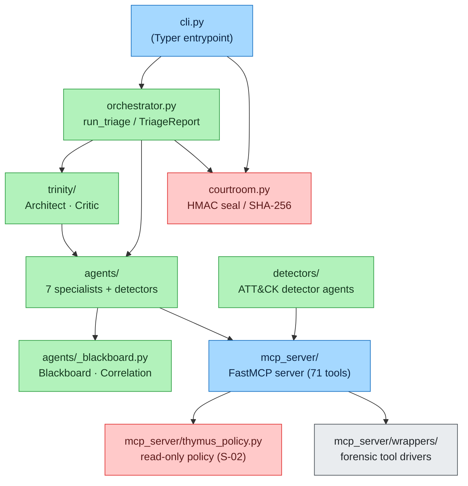

# Implementation — Code Organization & Build

> How the Agentropix-SIFT codebase is laid out, how the packages depend on one another,
> and how to build the project (including the optional Rust acceleration layer).

This chapter is the map you read before touching code. It narrates the module tree under
`src/agentropix_sift/`, names the load-bearing files per package, and documents the build
backend. It is the **build-and-module** companion to
[component-architecture](../02-architecture/component-architecture.md): that page draws the
runtime layer map and determinism boundaries; this one tells you which file each box lives
in and how to compile the package. For the per-agent breakdown see
[agents-list](../10-agents/agents-list.md); for the data contract see
[the data section](../03-data/); for safety internals see [security-model](security-model.md).

---

## Contents — what's in this page (and what to expect)

> Jump to any section below. Each row tells you what that part gives you, so you can go straight to your point.

| Section | What you'll get |
|---|---|
| [1. Package layout at a glance](#1-package-layout-at-a-glance) | The `src/` layout, the two console scripts, and a dependency diagram showing how the CLI → orchestrator → swarm → MCP boundary fits together. |
| [2. Top-level modules](#2-top-level-modules) | The single-file modules at the package root (`cli.py`, `orchestrator.py`, `courtroom.py`, `secrets.py`) with their purpose and key symbols. |
| [3. Packages](#3-packages) | A walkthrough of every sub-package — the DFIR swarm, Trinity loop, MCP server, wrappers, evidence gate, provenance, security, and the rest — and the load-bearing file in each. |
| [4. Build & tooling](#4-build--tooling) | How to build the wheel (hatchling), the lint/type config (ruff + basedpyright), and how to compile the optional Rust acceleration layer. |
| [See also](#see-also) | Cross-links to component-architecture, testing, configuration, and deployment. |

---

## 1. Package layout at a glance

Agentropix-SIFT is a single Python package (`agentropix_sift`) shipped under a **`src/`
layout** — that is, the importable code lives one directory down in
`src/agentropix_sift/` rather than at the repo root, so tests always run against the
*installed* package and never accidentally import loose files from the working tree. It
targets **Python 3.12+** (`requires-python = ">=3.12"`, `pyproject.toml:6`) and exposes two
**console scripts** (the `agentropix-sift…` commands that `pip install` puts on your `PATH`,
defined under `[project.scripts]`, `pyproject.toml:60-62`):

| Console script | Entry point | Role |
|----------------|-------------|------|
| `agentropix-sift` | `agentropix_sift.cli:main` | Typer CLI — `run` an image, `doctor` the SIFT binaries |
| `agentropix-sift-mcp` | `agentropix_sift.mcp_server.fastmcp_app:main` | FastMCP server hosting the 71 MCP tools |



The dependency arrows run **downhill**: the CLI drives the orchestrator, the orchestrator
runs the Trinity Loop over the swarm, every agent reaches the forensic tools only through
the `mcp_server/` boundary, and that boundary is gated by the Thymus read-only policy. The
`courtroom.py` crypto layer is invoked at the edges (CLI seals the report on write,
orchestrator stamps the evidence hash). No agent imports a wrapper directly — the MCP
boundary is the only path to a subprocess, which is what makes the Thymus policy and the
trace capture total rather than advisory.

---

## 2. Top-level modules

Single-file modules at the package root (`src/agentropix_sift/`):

| Module | Purpose | Key symbols |
|--------|---------|-------------|
| `cli.py` | Typer CLI: `run` (triage an image), `doctor` (pre-flight the 16 SIFT binaries). Seals the report on write. | `main()`, `doctor()`, `_DOCTOR_ENV_OVERRIDES` |
| `orchestrator.py` | Drives the `SWARM` over one image under the Trinity Loop; rolls findings + trace into a schema-compliant `TriageReport`. | `TriageReport` (`orchestrator.py:33`), `run_triage()` |
| `courtroom.py` | Chain-of-custody crypto (ADR-016/022): `evidence_image_sha256`, HMAC-SHA256 seal/verify, 0600 session-key write, audit-log sealing. | `evidence_image_sha256`, `seal_report`, `verify_seal`, `write_sealed_report`, `seal_audit_log` |
| `secrets.py` | Secret/token resolution (file-pointer form preferred over inline) and a logging-safe redactor. | `load_telegram_token`, `install_secret_filter`, `SecretFilter` |

---

## 3. Packages

### `agents/` — the DFIR swarm

Specialist `SwarmAgent` subclasses publishing `Finding`s to a shared `Blackboard`. The
ordered `SWARM` tuple is defined in `agents/__init__.py` and HuntAgent runs last because it
consumes every other agent's findings. The seven first-class specialists are
`memory.py`, `timeline.py`, `filesystem.py`, `artifact.py`, `discovery.py`, `mail.py`,
`hunt.py`; the base contract (`Finding`, the `SwarmAgent` ABC, the per-agent finding cap)
lives in `agents/_base.py`, and the asyncio finding registry + correlation logic in
`agents/_blackboard.py`. Shared helper logic (`_enrichment.py`, `_evidence.py`,
`_suspicious.py`, `_discovery_detectors.py`, `_mail_*`, `_hive_presets.py`, `_archive.py`)
sits alongside. See [agents-list](../10-agents/agents-list.md) for the full per-agent table,
[agentic-architecture](../10-agents/agentic-architecture.md) for how these specialists
coordinate, and [delegation-model](../10-agents/delegation-model.md) for the orchestration
contract.

### `trinity/` — Architect → Swarm → Critic

`architect.py` holds the deterministic planner (`Architect`) that returns the canonical
`SWARM`, optionally pruning agents the Critic marked stable while preserving run order.
`critic.py` holds the `Critic` and the `TrinityResult` `NamedTuple`: a deterministic scorer
(`score = max finding confidence + 0.25·#correlations`, capped at 1.0) that halts on a
fixed-point convergence fingerprint or a score threshold — **never** an LLM self-rating
(`trinity/critic.py`).

### `mcp_server/` — the single FastMCP server (71 tools)

| Key file | Purpose |
|----------|---------|
| `fastmcp_app.py` | Registration site for the in-module tools (+5 wazuh wrappers); `main()` server entry |
| `server.py` | Tool dispatch helpers (`mcp_get_pslist`, `mcp_fls`, …), `ToolError`, `configure_policy` |
| `thymus_policy.py` | **Thymus read-only evidence policy** — the path allowlist + symlink/traversal screen + audit ring enforced at the tool boundary so no tool can write to or escape the evidence tree. (S-02 is its safety-requirement ID; the rationale lives in [security-model](security-model.md).) |
| `config.py` | `load_config()` / `get_config()` merge |
| `_env.py` | `AGENTROPIX_*` env-var readers with floor/ceiling clamping (`get_int`, `get_float`, …) |
| `_trace.py` | Per-tool-call trace capture (`trace_scope`, raw-output snapshots) |
| `_tool_pins.py`, `_versions.py` | Tool-pin verification; `REQUIRED_TOOLS` version checks |
| `audit_analyzer.py`, `_startup_banner.py`, `_status.py` | Audit analysis, boot banner, status taxonomy |
| `wrappers/` | Forensic wrapper modules (see below) |

The **71** distinct tool functions are reached as 74 `@app.tool()` decorator occurrences
(67 in `fastmcp_app.py` + 5 wazuh wrappers, with `wazuh_hunt_ioc` registered in two modules);
see [CANONICAL_FACTS](../08-reference/canonical-facts.md).

### `mcp_server/wrappers/` — forensic tool drivers

Thin protocol-drivers around the 16 SIFT binaries plus EZ-Tools and correlation/mail
helpers. Each wrapper ships the same cross-cutting machinery: subprocess timeout, memory
ceiling, retry, stderr capture, and tracing. Shared internals live in `_safe_tool.py` (the
flat-error-envelope decorator), `_subprocess.py` (memory-monitored execution), `_status.py`,
`_versions.py`, and the DSL helpers (`_hunt_ioc_dsl.py`, `_vuln_query_dsl.py`). The
SIFT-16 core drivers are `volatility.py`, `plaso.py`, `tsk.py`, `extract.py`, `ewf.py`,
`evtx.py`, `yara.py`, `bulk_extractor.py`, `regripper.py`, `prefetch.py`, `amcache.py`,
`shimcache.py`, `exiftool.py`, `foremost.py`, `hashdeep.py`, `strings.py`. See the
[module map](../02-architecture/module-map.md) for the EZ-Tools, imaging, mail, and case/IOC
groups, and [ez-tools-integration](../02-architecture/ez-tools-integration.md) for how the
Eric Zimmerman parsers are wrapped and surfaced as MCP tools.

### `evidence_gate/` — mutation-token regime

`registry.py` defines `TokenRow` (a frozen dataclass) and `TokenRegistry`, a SQLite-backed
mint/spend/revoke store with one-shot, TTL-bounded tokens (`AGENTROPIX_EVIDENCE_GATE_DB`).
`cli.py` exposes the `agentropix-sift evidence-gate` token operations; `errors.py` holds the
gate error types.

### `provenance/` — chain validation

`validate.py` (`ValidateReport`, `validate_dir()`) re-verifies a sealed provenance chain
row-by-row (`_verify_one_row`, `_row_canonical_sans_seal`) and exposes a CLI `main()`.

### `security/` — redaction

`redact.py` performs HMAC-keyed deterministic scalar redaction of findings
(`redact_finding`, `RedactionError`); the key comes from `AGENTROPIX_REDACTOR_HMAC_KEY`.

### `approval_sidecar/` — HMAC human-in-the-loop service

A Starlette HMAC approval service (`app.py`, `__main__.py` entrypoint) with PBKDF2 auth
(`auth.py`), nonce TTL (`nonce.py`), an append-only hash chain (`hash_chain.py`), an
OpenSearch writer (`writer.py`), request/response models (`models.py`), and browser form
assets (`static/`). Optional and off the critical path.

### Remaining packages

`audit/` (standalone seal verifier `verify_seal.py`), `memory/` (the opt-in Hippocampus
recall bridge `hippocampus_bridge.py`), `wazuh/` (SIEM integration — IOC models, manager +
indexer clients, push orchestration, active-response guard), `detectors/` (the deterministic
ATT&CK detector agents and vendored `yara_rules/`), `imaging/` (`ewf_lifecycle.py` E01 mount
lifecycle), `reports/` (tiered report rendering + Mermaid emission), `schema/` (typed result
models + JSON Schemas), `chromosomes/` (agent presets), and `benchmarks/` (scaffolding).
Full detail is in the [module map](../02-architecture/module-map.md).

---

## 4. Build & tooling

### Python build backend

The wheel is built with **hatchling** (`pyproject.toml:85-87`), packaging only
`src/agentropix_sift` (`pyproject.toml:102-103`). Runtime dependencies are pinned in
`[project.dependencies]` — notably `fastmcp>=3.2.4`, `volatility3>=2.27.0`, `pydantic>=2`,
`typer>=0.12`, `tenacity>=8.2`, `yara-python`, `libpff-python` (PST/OST), `extract-msg`
(Outlook `.msg`), and `defusedxml>=0.7` (XXE/billion-laughs protection when parsing
operator-influenced XML). Optional extras: `dev` (pytest, ruff, basedpyright, pytest-cov),
`reports` (jinja2/markdown/weasyprint).

Lint and type config: **ruff** targeting `py312`, line length 120, lint selectors
`E,F,W,I,UP,B,SIM` (`pyproject.toml:64-69`); **basedpyright** in `strict` type-checking mode
(`pyproject.toml:81-83`).

### Optional Rust acceleration layer (W-156)

`crates/agentropix_sift_rust/` is a PyO3 extension (`Cargo.toml`) for high-volume forensic
correlation (timeline merge, sweep scan), using Rayon for data-parallel slices and Chrono
for timestamp parsing. It is **disabled at the `pyproject` layer** (the `rust-accel`
optional-dependency group is commented out, `pyproject.toml:45-58`): per W-163, the crate
ships only a `Cargo.toml` with no Python packaging metadata, so `uv` cannot resolve it from
a registry or path-spec. Until the crate gains a maturin `pyproject.toml`, build it against
the active venv with:

```bash
cd crates/agentropix_sift_rust && maturin develop --release
```

The Python code path runs unchanged without the extension; the Rust layer is a pure
performance accelerant, not a correctness dependency.

---

## See also

- [component-architecture](../02-architecture/component-architecture.md) — the runtime layer
  map and determinism boundaries these modules implement.
- [testing](testing.md) — the test topology and recall gate that guard this codebase.
- [configuration](configuration.md) — the `AGENTROPIX_*` env-var surface.
- [deployment](deployment.md) — standing the package up on a SIFT host.
