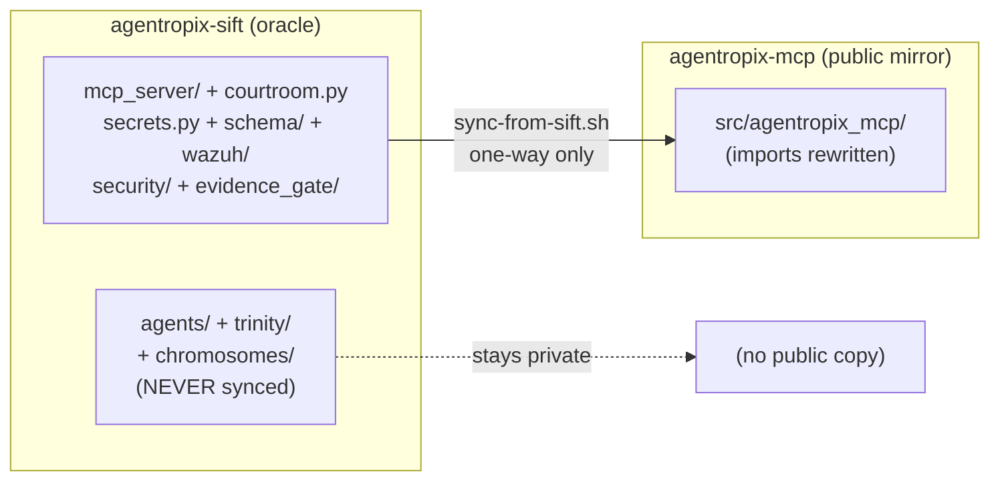

# Maintenance — The Dual-Repo Sync (`sift` → `mcp`)

> **Section 07 · SDLC & Ops.** Why two repositories and two package names exist, and
> how the one-way `agentropix-sift` → `agentropix-mcp` sync keeps the public MCP mirror
> faithful to its private source-of-truth. This is the maintainer/operator meta-doc that
> reconciles the `agentropix_sift` (oracle package) vs `agentropix_mcp` (public mirror)
> naming you see referenced throughout the docs.

The canonical package is **`agentropix_sift`** — the private source-of-truth that this entire
portal documents (see [CANONICAL_FACTS](../../.crew/facts.md)). The public
**`agentropix_mcp`** repo is a sanitized, MCP-server-only *mirror* of it, produced by a
deterministic one-way sync. No fact in this portal is sourced from the public mirror; the
mirror exists only to give the SANS Find Evil! 2026 submission an open-source face.

> Source of truth for this page: the live sync script at
> [`scripts/sync-from-sift.sh`](https://github.com/galvangabriel-web/agentropix-mcp/blob/main/scripts/sync-from-sift.sh)
> in the public repo (verified against `/home/admin2/agentropix_mcp/scripts/sync-from-sift.sh`),
> plus `CARRY-MANIFEST.md` in the same repo.

---

## 1. Two repos, two package names — the reconciliation

| Repo | Package | Visibility | Role |
|---|---|---|---|
| `agentropix-sift` | `agentropix_sift` | **PRIVATE** (`galvangabriel-web/agentropix-sift`) | **Source-of-truth / oracle.** Contains the MCP server PLUS the proprietary agent layers that consume it — the plan/review loop (`trinity/`), the genetic-search detector layer (`chromosomes/`), the `agents/` swarm, and the per-modality detector library. All MCP code is developed and tested here first. This is the package every doc in this portal cites. |
| `agentropix-mcp` | `agentropix_mcp` | **PUBLIC** (`galvangabriel-web/agentropix-mcp`) | **Sanitized mirror.** The MCP server + supporting modules only — no agent layers. The open-source public face for the SANS Find Evil! 2026 submission. |

The sync is strictly **one-way: `sift` → `mcp`**. Never push from `mcp` back to `sift`. The
public repo holds a strict subset; a reverse-sync would erase the private `trinity/`,
`chromosomes/`, and `agents/` layers.

> **So why does the same code appear under two import roots?** Because the public mirror
> rewrites every `agentropix_sift.*` import to `agentropix_mcp.*` during the sync (step 2
> below). The two package names are the *same code* seen through the public/private lens —
> not two independent codebases. When this portal says `agentropix_sift`, that is the
> authoritative name; `agentropix_mcp` is what the public copy of that exact module is
> renamed to.



---

## 2. When does a `sift` change reach the public mirror?

| Change in `sift` | Impact on `mcp` |
|---|---|
| New MCP wrapper added (`mcp_server/wrappers/*.py`) | Sync brings it over automatically |
| Existing wrapper fixed | Sync overwrites the public copy |
| Supporting module modified (`courtroom.py`, `secrets.py`, `schema/`, `wazuh/`, `security/`, `evidence_gate/`) | Sync overwrites |
| A wrapper newly imports from a NEW `agentropix_sift.<foo>` not in the `KEEP_LIST`/sed rules | **Drift gate REFUSES** — sync exits 1; operator must decide (see §5) |
| Agent-layer changes — `agents/`, `trinity/`, `chromosomes/` | **No impact** (stays private) |
| Test files matching the MCP surface | Brought over; agent-only tests stay private |

The sync only ever writes under `src/agentropix_mcp/`. Everything else in the public repo is
operator-owned and untouched (see §6).

---

## 3. The sync pipeline — what `sync-from-sift.sh` does, in order

The script is **idempotent**, **read-only on the `sift` side**, and **never auto-commits**.
It runs the following numbered steps (source:
[`scripts/sync-from-sift.sh`](https://github.com/galvangabriel-web/agentropix-mcp/blob/main/scripts/sync-from-sift.sh)):

| # | Step | What it does |
|---|------|--------------|
| 1 | **Copy** | Copies every module in the in-script `KEEP_LIST` from `sift` into a `mktemp -d` staging tree (`__pycache__` dropped; public-only overlays like `__init__.py` preserved). |
| 2 | **sed-rewrite imports** | Rewrites `agentropix_sift.* → agentropix_mcp.*` across every staged `*.py` (e.g. `agentropix_sift.mcp_server.wrappers → agentropix_mcp.wrappers`, `agentropix_sift.schema → agentropix_mcp.schema`). |
| 3 | **Drift check (zero-drift gate)** | Greps the staging tree for any remaining `agentropix_sift` reference. **Zero is required**; one or more leftover refs → prints offending lines and exits **1**. |
| 4 | **Diff** | Computes the diff against the current public `src/agentropix_mcp/`. Under `--dry-run` it prints the diff summary and stops here (exit 0, nothing written). |
| 5 | **Apply** | `rsync -a --delete` from staging into `src/agentropix_mcp/` (the `--delete` makes the mirror an exact reflection of the carried set). |
| 6 | **gitleaks** | Runs `gitleaks detect` against the repo with `.gitleaks.toml`. A leak → exit **2** before any commit is possible. |
| 7 | **pytest baseline** | Best-effort run of `tests/unit/test_fastmcp_app.py` via the borrowed `sift` venv. A failure → exit **3** (a regression the sync introduced). |
| 8 | **Stage (not commit)** | Prints `git diff --stat` for operator review and the exact `git add`/`git commit` commands. **Never auto-commits or auto-pushes.** |

> **Step-count note (conflict resolved against the oracle).** `compare/docs/MAINTENANCE.md`
> describes this as an "8-step pipeline" by counting *diff* and *apply* as one step and
> *stage* as the 8th. The live script numbers steps **1–7** in its banners (it folds the
> `--dry-run` early-exit into the diff/apply step). The behaviour above is the same either
> way; the table follows the script's logical phases. Trust the script, not the count.

### Exit codes

| Code | Meaning |
|---|---|
| `0` | Synced cleanly — ready for operator review + commit |
| `1` | Unresolved `agentropix_sift` cross-references after sed (manual intervention — see §5) |
| `2` | gitleaks found a secret (must fix before push) |
| `3` | pytest baseline failed (regression introduced by sync) |
| `4` | Invalid `sift` path (or unknown argument) |
| `5` | Not run from the `agentropix-mcp` repo root |

---

## 4. How to run a sync

```bash
# 1. Pull the latest sift main (the oracle)
git -C /home/admin2/agentropix-sift pull

# 2. Preview without writing
cd /home/admin2/agentropix_mcp
bash scripts/sync-from-sift.sh --dry-run

# 3. Apply
bash scripts/sync-from-sift.sh
#    (override the source with:  --sift /alt/path/to/sift)

# 4. Review the staged diff the script printed, then commit
git add src/agentropix_mcp/
git commit -m "sync: re-sync from agentropix-sift @ <short sha>"

# 5. Push to the public remote
git push origin main
```

---

## 5. When the drift gate fails (exit 1)

A non-zero leftover count means `sift` introduced a new cross-cutting dependency the mirror
doesn't yet carry. The script lists the offending `agentropix_sift.<something>` lines. Two
resolutions:

### Option A — bring the new module over (most common)

1. Locate it: `ls /home/admin2/agentropix-sift/src/agentropix_sift/<something>/`
2. Add a `KEEP_LIST` row in `scripts/sync-from-sift.sh` (two-column `SRC  DST`):
   ```bash
   "<something>/    <something>/"
   ```
3. Add a matching sed-rewrite rule in step 2's block:
   ```
   -e 's|agentropix_sift\.<something>|agentropix_mcp.<something>|g'
   ```
4. Append a row to `CARRY-MANIFEST.md` documenting the new carve (the decision log).
5. Re-run the sync.

### Option B — refactor `sift` to remove the dep

- Preferable long-term when the new dependency does not belong in the public surface.
- Open a PR in `sift` to inline or remove the cross-cutting import.
- Re-run the sync after that PR merges.

The gate's whole purpose is to **force an explicit operator decision** on every new
public-incompatible dependency rather than silently shipping (or silently dropping) it.

---

## 6. Files the sync NEVER touches

The sync writes only `src/agentropix_mcp/`. These public-repo files are operator-owned and
preserved across every sync (all confirmed present in `/home/admin2/agentropix_mcp/`):

| File | Why it is mcp-only |
|---|---|
| `LICENSE` | Apache 2.0, mcp-specific copyright (auto-detected in GitHub's "About" sidebar) |
| `NOTICE` | Attribution notice for the public distribution |
| `README.md` | Public-MCP framing, not `sift`'s project doc |
| `CARRY-MANIFEST.md` | Decision log of what is carried / excluded / pending |
| `pyproject.toml` | Audited mcp-only deps — distinct from `sift`'s (`name = "agentropix-mcp"`) |
| `docs/MAINTENANCE.md` | The public maintainer doc this page documents |
| `.github/REPO-METADATA.md` | Public-repo metadata |
| `scripts/sync-from-sift.sh` | The sync script itself |

---

## 7. The six failsafes

The sync is deliberately conservative — six independent safeguards keep it from corrupting
either repo or leaking anything:

1. **Read-only on the `sift` side.** The script never writes to `sift`; it only copies out of it.
2. **Never auto-commits.** Step 8 stages a diff and prints the commit command; the operator always reviews before `git commit`.
3. **Never auto-pushes.** `git push` is always a manual operator action.
4. **gitleaks every run** (step 6) — a secret blocks the sync with exit 2 before any commit.
5. **Zero-drift gate** (step 3) — refuses to leave any unresolved `agentropix_sift` cross-reference, forcing the explicit §5 decision.
6. **Ctrl-C recoverable.** The script can be aborted at any step; a partial apply is undone with `git checkout -- src/agentropix_mcp/` (the staging tree lives in a `mktemp -d` cleaned up on exit).

---

## See also

- [implementation](implementation.md) — the package layout the mirror reflects.
- [security-model](security-model.md) — the Thymus/redaction controls carried into the public surface.
- [testing](testing.md) — the regression suite the sync's pytest gate samples.
- [CANONICAL_FACTS](../../.crew/facts.md) — why `agentropix_sift` is the canonical package name.
