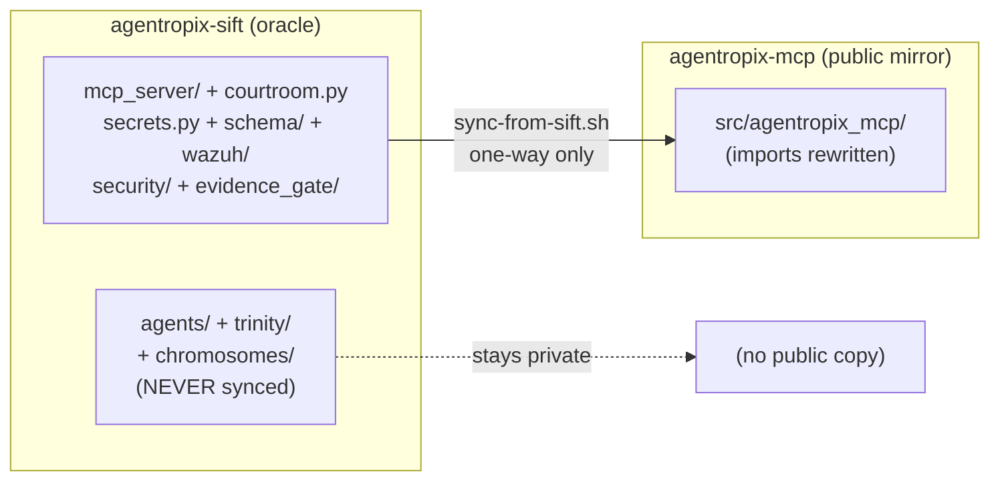

# Maintenance — The Dual-Repo Sync (`sift` → `mcp`)

> **Section 07 · SDLC & Ops.** Why two repositories and two package names exist, and
> how the one-way `agentropix-sift` → `agentropix-mcp` sync keeps the public MCP mirror
> faithful to its private source-of-truth. This is the maintainer/operator meta-doc that
> reconciles the `agentropix_sift` (oracle package) vs `agentropix_mcp` (public mirror)
> naming you see referenced throughout the docs.

The canonical package is **`agentropix_sift`** — the private source-of-truth that this entire
portal documents (see [CANONICAL_FACTS](../08-reference/canonical-facts.md)). The public
**`agentropix_mcp`** repo is a sanitized, MCP-server-only *mirror* of it, produced by a
deterministic one-way sync. No fact in this portal is sourced from the public mirror; the
mirror exists only to give the SANS Find Evil! 2026 submission an open-source face.

> Source of truth for this page: the live sync script at
> [`scripts/sync-from-sift.sh`](https://github.com/galvangabriel-web/agentropix-mcp/blob/main/scripts/sync-from-sift.sh)
> in the public repo (verified against `/home/admin2/agentropix_mcp/scripts/sync-from-sift.sh`,
> re-read 2026-06-06), plus `CARRY-MANIFEST.md` in the same repo.

> **Audience note (read first).** This is a **maintainer/operator** page, not an end-user
> capability. Running the sync is a shell action on a private workstation — it has **no
> plain-language prompt equivalent**, exactly like the one-time MCP-wiring step in the
> [User Guide](../01-overview/user-guide.md) (an end-user can't drive a private build pipeline by
> talking to a session). The **one** place a `💬` end-user prompt legitimately applies is
> *verifying* the mirror **after** a sync — confirming the public server still answers and reports
> its tool count. That maps to the real **`health`** MCP tool
> ([`tool-list.md`](../04-mcp-tools/tool-list.md)). Where a step genuinely has no prompt form, the
> callout says so rather than inventing one. Repo paths below use placeholders
> (`<SIFT-REPO>` = the private oracle clone, `<MCP-REPO>` = the public mirror clone); on this
> workstation they resolve to `/home/admin2/agentropix-sift` and `/home/admin2/agentropix_mcp`.

---

## Contents — what's in this page (and what to expect)

> Jump to any section below. Each row tells you what that part gives you, so you can go straight to your point.

| Section | What you'll get |
|---|---|
| [1. Two repos, two package names — the reconciliation](#1-two-repos-two-package-names--the-reconciliation) | Why `agentropix_sift` (private oracle) and `agentropix_mcp` (public mirror) coexist, and why the sync is strictly one-way. |
| [2. When does a `sift` change reach the public mirror?](#2-when-does-a-sift-change-reach-the-public-mirror) | Which kinds of `sift` changes get carried, overwritten, blocked, or stay private. |
| [3. The sync pipeline — what `sync-from-sift.sh` does, in order](#3-the-sync-pipeline--what-sync-from-siftsh-does-in-order) | The numbered copy→rewrite→drift→diff→apply→gitleaks→pytest→stage steps, plus exit codes. |
| [4. How to run a sync](#4-how-to-run-a-sync) | The five operator steps (pull → dry-run → apply → review/commit → push) with Execution→Output pairs and the post-sync health check. |
| [5. When the drift gate fails (exit 1)](#5-when-the-drift-gate-fails-exit-1) | What a leftover `agentropix_sift` reference means and the two ways to resolve it (carry the module or refactor). |
| [6. Files the sync NEVER touches](#6-files-the-sync-never-touches) | The operator-owned public-repo files preserved across every sync, and why each is mcp-only. |
| [7. The six failsafes](#7-the-six-failsafes) | The independent safeguards (read-only, no auto-commit/push, gitleaks, drift gate, Ctrl-C recovery) that keep the sync safe. |
| [See also](#see-also) | Related pages: implementation, security model, testing, and the canonical facts. |

---

## 1. Two repos, two package names — the reconciliation

| Repo | Package | Visibility | Role |
|---|---|---|---|
| `agentropix-sift` | `agentropix_sift` | **PRIVATE** (`galvangabriel-web/agentropix-sift`) | **Source-of-truth / oracle.** Contains the MCP server PLUS the proprietary agent layers that consume it — the plan/review loop (`trinity/`), the genetic-search detector layer (`chromosomes/`), the `agents/` swarm, and the per-modality detector library. All MCP code is developed and tested here first. This is the package every doc in this portal cites. |
| `agentropix-mcp` | `agentropix_mcp` | **PUBLIC** (`galvangabriel-web/agentropix-mcp`) | **Sanitized mirror.** The MCP server + supporting modules only — no agent layers. The open-source public face for the SANS Find Evil! 2026 submission. |

The sync is strictly **one-way: `sift` → `mcp`**. Never push from `mcp` back to `sift`. The
public repo holds a strict subset; a reverse-sync would erase the private `trinity/`,
`chromosomes/`, and `agents/` layers.

> **So why does the same code appear under two import roots?** Because the public mirror
> rewrites every `agentropix_sift.*` import to `agentropix_mcp.*` during the sync (step 2
> below). The two package names are the *same code* seen through the public/private lens —
> not two independent codebases. When this portal says `agentropix_sift`, that is the
> authoritative name; `agentropix_mcp` is what the public copy of that exact module is
> renamed to.



---

## 2. When does a `sift` change reach the public mirror?

| Change in `sift` | Impact on `mcp` |
|---|---|
| New MCP wrapper added (`mcp_server/wrappers/*.py`) | Sync brings it over automatically |
| Existing wrapper fixed | Sync overwrites the public copy |
| Supporting module modified (`courtroom.py`, `secrets.py`, `schema/`, `wazuh/`, `security/`, `evidence_gate/`) | Sync overwrites |
| A wrapper newly imports from a NEW `agentropix_sift.<foo>` not in the `KEEP_LIST`/sed rules | **Drift gate REFUSES** — sync exits 1; operator must decide (see §5) |
| Agent-layer changes — `agents/`, `trinity/`, `chromosomes/` | **No impact** (stays private) |
| Test files matching the MCP surface | Brought over; agent-only tests stay private |

The sync only ever writes under `src/agentropix_mcp/`. Everything else in the public repo is
operator-owned and untouched (see §6).

---

## 3. The sync pipeline — what `sync-from-sift.sh` does, in order

The script is **idempotent**, **read-only on the `sift` side**, and **never auto-commits**.
It runs the following numbered steps (source:
[`scripts/sync-from-sift.sh`](https://github.com/galvangabriel-web/agentropix-mcp/blob/main/scripts/sync-from-sift.sh)):

| # | Step | What it does |
|---|------|--------------|
| 1 | **Copy** | Copies every module in the in-script `KEEP_LIST` from `sift` into a `mktemp -d` staging tree (`__pycache__` dropped; public-only overlays like `__init__.py` preserved). |
| 2 | **sed-rewrite imports** | Rewrites `agentropix_sift.* → agentropix_mcp.*` across every staged `*.py` (e.g. `agentropix_sift.mcp_server.wrappers → agentropix_mcp.wrappers`, `agentropix_sift.schema → agentropix_mcp.schema`). |
| 3 | **Drift check (zero-drift gate)** | Greps the staging tree for any remaining `agentropix_sift` reference. **Zero is required**; one or more leftover refs → prints offending lines and exits **1**. |
| 4 | **Diff** | Computes the diff against the current public `src/agentropix_mcp/`. Under `--dry-run` it prints the diff summary and stops here (exit 0, nothing written). |
| 5 | **Apply** | `rsync -a --delete` from staging into `src/agentropix_mcp/` (the `--delete` makes the mirror an exact reflection of the carried set). |
| 6 | **gitleaks** | Runs `gitleaks detect` against the repo with `.gitleaks.toml`. A leak → exit **2** before any commit is possible. |
| 7 | **pytest baseline** | Best-effort run of `tests/unit/test_fastmcp_app.py` via the borrowed `sift` venv. A failure → exit **3** (a regression the sync introduced). |
| 8 | **Stage (not commit)** | Prints `git diff --stat` for operator review and the exact `git add`/`git commit` commands. **Never auto-commits or auto-pushes.** |

> **Step-count note (conflict resolved against the oracle).** `compare/docs/MAINTENANCE.md`
> describes this as an "8-step pipeline" by counting *diff* and *apply* as one step and
> *stage* as the 8th. The live script numbers steps **1–7** in its banners (it folds the
> `--dry-run` early-exit into the diff/apply step). The behaviour above is the same either
> way; the table follows the script's logical phases. Trust the script, not the count.

### Exit codes

| Code | Meaning |
|---|---|
| `0` | Synced cleanly — ready for operator review + commit |
| `1` | Unresolved `agentropix_sift` cross-references after sed (manual intervention — see §5) |
| `2` | gitleaks found a secret (must fix before push) |
| `3` | pytest baseline failed (regression introduced by sync) |
| `4` | Invalid `sift` path (or unknown argument) |
| `5` | Not run from the `agentropix-mcp` repo root |

---

## 4. How to run a sync

The whole procedure is **five operator steps**: pull the oracle, dry-run, apply, review-and-commit,
push. Each is shown below as an **🖥️ Expert (command)** action with its **Execution → Output** pair,
plus a **💬 End-user (prompt)** lane where one genuinely applies. The script flags used here come
straight from `sync-from-sift.sh` (`--dry-run`, `--sift <path>`, `-h`/`--help`).

> **🖥️ Expert (command) — the full run, end to end:**
> ```bash
> # 1. Pull the latest sift main (the oracle)
> git -C <SIFT-REPO> pull            # e.g. /home/admin2/agentropix-sift
>
> # 2. Preview without writing (idempotent, never touches sift)
> cd <MCP-REPO>                      # e.g. /home/admin2/agentropix_mcp
> bash scripts/sync-from-sift.sh --dry-run
>
> # 3. Apply
> bash scripts/sync-from-sift.sh
> #    (override the source with:  --sift /alt/path/to/sift)
> #    (usage/help, no side effects:  bash scripts/sync-from-sift.sh --help)
>
> # 4. Review the staged diff the script printed, then commit
> git add src/agentropix_mcp/
> git commit -m "sync: re-sync from agentropix-sift @ <short sha>"
>
> # 5. Push to the public remote
> git push origin main
> ```
> **💬 End-user (prompt):** *not applicable for steps 1–5* — the sync is a private-workstation shell
> pipeline with no MCP surface, so there is no plain-language equivalent (see the Audience note at the
> top). The only end-user-shaped action is the **post-sync health check** in
> [§4.1](#41-verify-the-mirror-after-a-sync) below, which maps to the real `health` tool.

The numbered steps, one Execution → Output pair each:

**Execution A → Output A — pull the oracle.**

*Execution A:* `git -C <SIFT-REPO> pull`

*Output A:* the private oracle clone fast-forwards to the latest `main` (or `Already up to date.`).
The sync reads from this tree read-only; nothing is written back to it.

**Execution B → Output B — dry-run preview (writes nothing).**

*Execution B:* `cd <MCP-REPO> && bash scripts/sync-from-sift.sh --dry-run`

*Output B (shape):* the script banners Steps 1–4, then prints a diff summary and a
`files differing: <N>` line, ending with `Dry-run complete. Re-run without --dry-run to apply.` and
**exit 0** — staging happens in a `mktemp -d` tree, so the public `src/agentropix_mcp/` is untouched:
> ```text
> ==> Sync source: <SIFT-REPO>
> ==> Sync target: <MCP-REPO>
> ==> Dry-run:     1
> ==> Step 1: copying tracked modules
>   copied: mcp_server/ -> .
>   ... (more) ...
> ==> Step 2: sed-rewrite imports (agentropix_sift.* -> agentropix_mcp.*)
> ==> Step 3: drift check (zero agentropix_sift refs expected)
>   OK — 0 unresolved references
> ==> Step 4: computing diff against current public tree
>   (dry-run: showing diff summary only, NOT writing changes)
>   files differing: <N>
> Dry-run complete. Re-run without --dry-run to apply.
> ```
> If the dry-run instead exits **1**, the drift gate tripped — go to [§5](#5-when-the-drift-gate-fails-exit-1).

**Execution C → Output C — apply.**

*Execution C:* `bash scripts/sync-from-sift.sh`

*Output C (shape, clean run):* Steps 1–3 as above, then **Step 4** `applying changes to
<MCP-REPO>/src/agentropix_mcp/` (an `rsync -a --delete` from staging), **Step 5** `gitleaks scan` →
`OK — no leaks`, **Step 6** `pytest baseline` → `OK — Gap-5 regression suite green`, **Step 7** prints
`git diff --stat` plus the exact `git add` / `git commit` commands, and ends `Done.` at **exit 0**. It
**never auto-commits**. (Banner step numbers 4–7 here vs the §3 logical-phase table is reconciled in
the [step-count note](#3-the-sync-pipeline--what-sync-from-siftsh-does-in-order) — trust the script.)

**Execution D → Output D — review and commit.**

*Execution D:* eyeball the `git diff --stat` the script printed, then
`git add src/agentropix_mcp/ && git commit -m "sync: re-sync from agentropix-sift @ <short sha>"`

*Output D:* a single mirror commit touching **only** `src/agentropix_mcp/`. If the diff includes
anything outside that path, stop — the sync should never write elsewhere (see [§6](#6-files-the-sync-never-touches)).

**Execution E → Output E — push.**

*Execution E:* `git push origin main`

*Output E:* the public mirror on GitHub now reflects the carried subset. Push is always a manual
operator action — the script never pushes (failsafe 3, [§7](#7-the-six-failsafes)).

### 4.1 Verify the mirror after a sync

This is the **one** step with a genuine end-user prompt: after a sync + redeploy, confirm the public
MCP server still answers and reports its tool count. That is exactly what the `health` tool does.

> **🖥️ Expert (command/MCP call):**
> ```text
> health  ->  { "status": "ok", "server": "agentropix-...", "tool_count": <N>, "version": "...",
>               "uptime_seconds": ... }
> ```
> **💬 End-user (prompt):** *"Is the Agentropix MCP server healthy, and how many forensic tools does it
> report right now?"*
> The session calls the real `health` tool ([`tool-list.md`](../04-mcp-tools/tool-list.md)) and reports
> the live status and `tool_count`. **A simple, focused question is enough — the session recognises it as
> an Agentropix capability and routes it to `health`.** Trust this live count, not the startup banner.

**Execution F → Output F.**

*Execution F:* call the `health` tool against the redeployed mirror.

*Output F:* `{ "status": "ok", "server": "agentropix-...", "tool_count": <N>, "version": "...",
"uptime_seconds": ... }`. The canonical platform figure is **73** tools
(`{{ref:CANONICAL_FACTS#mcp_tool_count}}`); a live server may report 72 (the `wazuh_hunt_ioc`
double-registration — see the live-drift note in the [User Guide §1.2](../01-overview/user-guide.md#12-sanity-check--call-health)).
The sync carries the *same* tool surface to the mirror, so the public server reports the same count as
the private oracle once both run the carried code.

---

## 5. When the drift gate fails (exit 1)

A non-zero leftover count means `sift` introduced a new cross-cutting dependency the mirror
doesn't yet carry. The script lists the offending `agentropix_sift.<something>` lines. Two
resolutions:

> **🖥️ Expert (command) — see exactly what the gate caught:** the script already prints up to 20
> offending lines and the two-option remedy. To re-inspect the staging tree the gate scanned, re-run the
> dry-run — `bash scripts/sync-from-sift.sh --dry-run` — and read the **Step 3** block (`FAIL: <N>
> unresolved agentropix_sift references after sed`).
> **💬 End-user (prompt):** *not applicable* — resolving a drift-gate failure is a maintainer code-edit
> decision (editing `KEEP_LIST`/sed rules or refactoring `sift`), not an MCP capability, so there is no
> plain-language prompt for it.

**Execution → Output (drift-gate trip).**

*Execution:* `bash scripts/sync-from-sift.sh` (or `--dry-run`) when `sift` added a new dep.

*Output (exit 1):*
> ```text
> ==> Step 3: drift check (zero agentropix_sift refs expected)
> FAIL: <N> unresolved agentropix_sift references after sed:
>   <file>:<line>:  from agentropix_sift.<something> import ...
>   ... (up to 20 lines) ...
> Either (a) add the missing source module to KEEP_LIST in this script,
> or (b) refactor sift to remove the cross-cutting dependency.
> ```
> Pick Option A or B below; nothing was written (the gate runs before the apply).

### Option A — bring the new module over (most common)

1. Locate it: `ls /home/admin2/agentropix-sift/src/agentropix_sift/<something>/`
2. Add a `KEEP_LIST` row in `scripts/sync-from-sift.sh` (two-column `SRC  DST`):
   ```bash
   "<something>/    <something>/"
   ```
3. Add a matching sed-rewrite rule in step 2's block:
   ```
   -e 's|agentropix_sift\.<something>|agentropix_mcp.<something>|g'
   ```
4. Append a row to `CARRY-MANIFEST.md` documenting the new carve (the decision log).
5. Re-run the sync.

### Option B — refactor `sift` to remove the dep

- Preferable long-term when the new dependency does not belong in the public surface.
- Open a PR in `sift` to inline or remove the cross-cutting import.
- Re-run the sync after that PR merges.

The gate's whole purpose is to **force an explicit operator decision** on every new
public-incompatible dependency rather than silently shipping (or silently dropping) it.

---

## 6. Files the sync NEVER touches

The sync writes only `src/agentropix_mcp/`. These public-repo files are operator-owned and
preserved across every sync (all confirmed present in `/home/admin2/agentropix_mcp/`):

| File | Why it is mcp-only |
|---|---|
| `LICENSE` | Apache 2.0, mcp-specific copyright (auto-detected in GitHub's "About" sidebar) |
| `NOTICE` | Attribution notice for the public distribution |
| `README.md` | Public-MCP framing, not `sift`'s project doc |
| `CARRY-MANIFEST.md` | Decision log of what is carried / excluded / pending |
| `pyproject.toml` | Audited mcp-only deps — distinct from `sift`'s (`name = "agentropix-mcp"`) |
| `docs/MAINTENANCE.md` | The public maintainer doc this page documents |
| `.github/REPO-METADATA.md` | Public-repo metadata |
| `scripts/sync-from-sift.sh` | The sync script itself |

---

## 7. The six failsafes

The sync is deliberately conservative — six independent safeguards keep it from corrupting
either repo or leaking anything:

1. **Read-only on the `sift` side.** The script never writes to `sift`; it only copies out of it.
2. **Never auto-commits.** Step 8 stages a diff and prints the commit command; the operator always reviews before `git commit`.
3. **Never auto-pushes.** `git push` is always a manual operator action.
4. **gitleaks every run** (step 6) — a secret blocks the sync with exit 2 before any commit.
5. **Zero-drift gate** (step 3) — refuses to leave any unresolved `agentropix_sift` cross-reference, forcing the explicit §5 decision.
6. **Ctrl-C recoverable.** The script can be aborted at any step; a partial apply is undone with `git checkout -- src/agentropix_mcp/` (the staging tree lives in a `mktemp -d` cleaned up on exit).

---

## See also

- [implementation](implementation.md) — the package layout the mirror reflects.
- [security-model](security-model.md) — the Thymus/redaction controls carried into the public surface.
- [testing](testing.md) — the regression suite the sync's pytest gate samples.
- [CANONICAL_FACTS](../08-reference/canonical-facts.md) — why `agentropix_sift` is the canonical package name.
