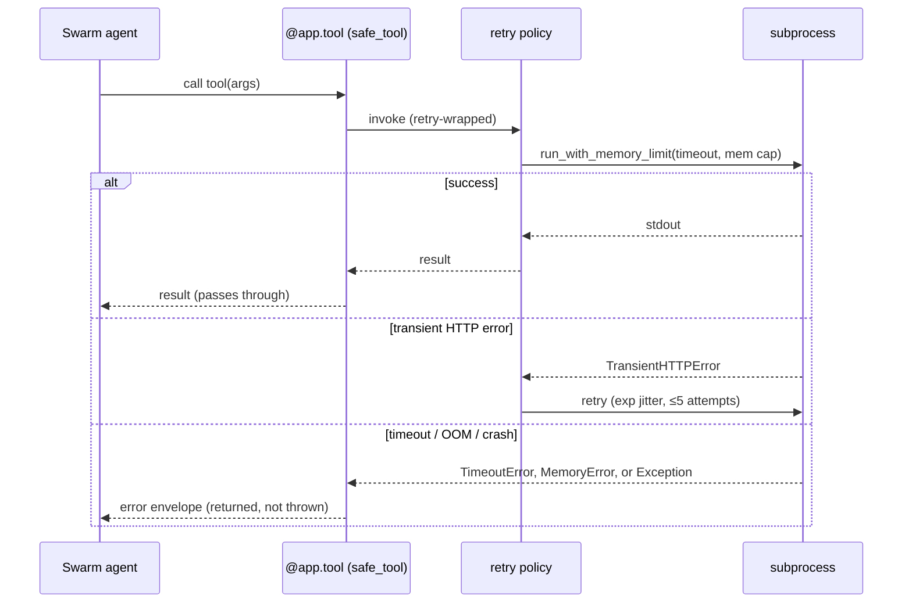

# Recovery & Resilience — Failure-Mode Catalogue

> Every way a triage run can fail under load — missing tools, timeouts, OOM, stale mounts,
> transient SIEM errors — and the mitigation the runtime applies. The R1–R5 chaos classes
> are the resilience contract; each has a regression test in `tests/chaos/`.

**How to read this page.** This is a *design contract*, not a how-to runbook — it documents
what the runtime guarantees when things go wrong, not commands you type. (For the operator
decision tree on OOM / timeout incidents, see the
[`troubleshoot-oom-timeout`](deployment.md#4-runbook-index) runbook instead.) A few terms recur:

- **Triage run** — one autonomous investigation: the Trinity loop spawns the Swarm of DFIR
  agents, each of which drives forensic tools over the evidence image.
- **Tool** — a `@app.tool()` callable exposed over the MCP (Model Context Protocol) boundary.
  Most wrap a SIFT forensic binary (e.g. Volatility, YARA, Plaso) in a subprocess.
- **Error envelope** — the flat `{error, details}` dict a tool returns *instead of throwing*,
  so one tool's failure can't crash the whole run (defined in §1).
- **R-class** — a numbered chaos-resilience contract (R1–R5), each pinned by a regression
  test in `tests/chaos/` (catalogued in §4).

Agentropix-SIFT is designed to **degrade gracefully**: a single tool failure must not crash
the agent loop. Two architectural choices make this possible — the flat error envelope at
the MCP boundary (§1), and memory-monitored subprocess execution (§3) that kills runaway tools
rather than letting them OOM (exhaust RAM on) the host.

---

## 1. The error envelope — failures never escape the boundary

Every `@app.tool()` callable is wrapped by the `safe_tool` decorator
(`mcp_server/wrappers/_safe_tool.py`). On any caught exception it **returns** a flat
`{"error": str, "details": dict}` dict — where `error` is a short error category and `details`
carries the offending tool name plus context — instead of letting the exception **propagate**
up and abort the run. That distinction is the whole point: a Pydantic `ValidationError` (bad
arguments) or an httpx 5xx (the SIEM returned a server error) in one tool call surfaces as a
returned value, so the agent's iteration stays alive. The decorator deliberately does **not**
swallow `KeyboardInterrupt`, `SystemExit`, or `asyncio.CancelledError` — those three propagate
untouched so real shutdown and cooperative cancellation still work. Retry (§2) is composed
*inside* the envelope: the runtime retries first, and only envelopes the **final** outcome if
all attempts fail.

*Reading the diagram:* a tool call enters the `safe_tool` boundary, which invokes the
retry-wrapped policy, which in turn runs the forensic binary under the memory-and-timeout
guard (§3). The happy path passes the result straight through. A transient HTTP error is
retried with exponential backoff. A timeout, an out-of-memory kill, or any other crash is
caught and returned as the flat error envelope.

The agent treats an error envelope as "this dimension produced nothing" and continues; the
Critic (the Trinity loop's convergence gate) refuses to halt while any *planned* agent
produced zero findings, so a degraded tool surfaces as a deliberate non-halt rather than a
false convergence (the loop wrongly concluding it is done).

---

## 2. Retry & backoff

Network-touching tools (the ones that call the Wazuh SIEM over HTTP) share one
[tenacity](https://tenacity.readthedocs.io/) retry policy, `_wazuh_retry_policy()`
(`wazuh/indexer_client.py`), so the backoff shape is identical everywhere:

| Parameter | Value | Meaning |
|-----------|-------|---------|
| Wait | `wait_exponential_jitter(initial=1.0, max=30.0)` | Back off 1 s, then doubling with random jitter, capped at 30 s between attempts |
| Max attempts | `stop_after_attempt(5)` | Try at most 5 times total before giving up |
| Retry classifier | `TransientHTTPError` only (5xx / connect timeouts) | The single exception type considered worth retrying |
| `reraise` | `True` | After the last failed attempt, re-raise the real exception (which §1 then envelopes) rather than tenacity's `RetryError` |

Crucially the classifier retries **only** transient HTTP errors — auth failures, 4xx
(client/request errors), and Pydantic `ValidationError`s propagate immediately rather than
being retried into a wall, since retrying them would never succeed. A deliberately slow query
(`timeout_sec` exceeded) is also *not* retried, because re-running it just re-incurs the same
timeout — and, on the write path, would risk a retry-induced duplicate write. Subprocess-level
retries (a separate, coarser layer for the forensic-binary wrappers) are bounded by
`AGENTROPIX_MAX_RETRIES` (default `2`).

---

## 3. Memory ceilings & timeouts

Forensic subprocesses run under `run_with_memory_limit(...)`
(`mcp_server/wrappers/_subprocess.py`) — one guard that bounds both wall-clock time and RAM:

- **Timeout** — `asyncio.wait_for(proc.communicate(), timeout=...)` raises `TimeoutError`
  when a tool runs longer than its budget; the process tree (the subprocess and any children
  it forked) is then killed so nothing is left running.
- **Memory monitor** — a background asyncio task samples the process tree's **RSS** (Resident
  Set Size — the physical RAM the process and its children actually occupy, read via the
  `psutil` library) against the configured limit. On a breach it calls
  `os.killpg(pgid, SIGKILL)` — sending the un-catchable `SIGKILL` to the entire **process
  group** (`pgid`), so the whole worker tree dies at once — and the call surfaces as a
  `MemoryError`. When `psutil` is not installed, monitoring is disabled with a warning rather
  than failing the call (the timeout guard still applies).
- **Limit resolution** — `AGENTROPIX_MEM_LIMIT_MB` wins if set (any value, including `0` to
  disable the guard entirely); otherwise the cap auto-scales to the evidence size
  (`max(default, image_GB · 730 MB)`, the W-162 change) so large E01 images get proportionally
  more headroom, with a static floor of `4096` MB for small images.

Per-wrapper timeout/cap knobs (`AGENTROPIX_<TOOL>_TIMEOUT`, `AGENTROPIX_<TOOL>_MAX_*`) tune
individual tools — see [configuration](configuration.md). The OOM/timeout decision tree for
large E01 images is the subject of the
[`troubleshoot-oom-timeout`](deployment.md#4-runbook-index) runbook.

---

## 4. The R1–R5 chaos resilience classes

A **chaos test** deliberately injects a fault — a tool that exits but leaves no output, a
process that is already dead when we try to kill it, an unmount that fails — and asserts the
runtime cleans up correctly anyway. `tests/chaos/test_fault_paths.py` collects the specific
failure modes that *historically leaked resources* (orphaned mounts, zombie subprocesses,
abandoned tmpdirs) and pins the cleanup contract. Each **R-class** (R1–R5) is one such
regression, named so the contract can be cited directly; each row maps to a named test class
in that file:

| Class | Injected fault | Required behaviour | Pinned by |
|-------|----------------|--------------------|-----------|
| **R1** | `ewfmount` exits 0 but the `ewf1` node never appears | Raise `RuntimeError` *and* remove the mount tmpdir (no leaked mount or tmpdir) | `TestEwfMountMissingEwf1` |
| **R2** | `os.killpg` raises `ProcessLookupError` (the process was already dead) | Swallow the lookup error; `TimeoutError` still propagates cleanly (no crash) | `TestPlasoKillpgFailure` |
| **R3** | `fusermount` exits non-zero (stale mount already gone) | tmpdir is still removed; a non-zero unmount must not block cleanup | `TestFusermountNonZeroCleanup` |
| **R4** | `TimeoutError` fires during a memory-monitored run | The asyncio memory-monitor task is cancelled (no orphaned monitor task) | `TestMemoryMonitorCancelledOnTimeout` |
| **R5a / R5b** | A subprocess exceeds its timeout (Volatility / YARA) | `proc.kill()` fires on the runaway subprocess — no zombie tool | `TestVolatilityTimeoutKill` / `TestYaraTimeoutKill` |

Two earlier regressions in the same file guard the surrounding surface:
`TestPlasoCleanupOnTimeout` (W-022:
`shutil.rmtree(ignore_errors=True)` in `finally` cleans the Plaso tmpdir on both the timeout
and the happy path) and `TestExtractFilesTraversalRejected` (traversal / NUL-byte in-container
paths land in `rejected[]` before any subprocess is invoked).

---

## 5. Failure → mitigation summary

One row per failure mode, the runtime's response, and the source file that implements it
(R-class references point back to the §4 contracts):

| Failure mode | Mitigation | Source |
|--------------|------------|--------|
| Missing SIFT binary | `doctor` pre-flights the 16 binaries; wrapper raises a typed error with a remediation hint; agent continues on the envelope | `cli.py` (`doctor`), `_safe_tool.py` |
| Tool raises mid-iteration | Flat error envelope; agent loop survives; that dimension yields no findings | `_safe_tool.py` |
| Transient SIEM 5xx / connect timeout | Exponential-jitter retry, ≤5 attempts, transient-only classifier | `wazuh/indexer_client.py` |
| Auth / 4xx / validation error | **Not** retried — propagates immediately (fail fast) | `wazuh/indexer_client.py` |
| Subprocess runs too long | `asyncio.wait_for` timeout → kill process tree (R5; monitor task cancelled, R4) | `_subprocess.py` |
| Subprocess exceeds RAM | `psutil` RSS monitor → `killpg(SIGKILL)` whole tree → `MemoryError` | `_subprocess.py` |
| `psutil` unavailable | Memory monitoring disabled with a warning, call still runs | `_subprocess.py` |
| Stale/failed EWF mount | tmpdir removed regardless of `ewfmount`/`fusermount` exit code (R1, R3) | `tests/chaos/test_fault_paths.py` |
| `killpg` on a dead PID | `ProcessLookupError` swallowed; timeout still raises (R2) | `tests/chaos/test_fault_paths.py` |
| Plaso timeout | tmpdir cleaned in `finally`; recall gate flags `PLASO_TIMEOUT` (W-128) | `plaso.py`, `tests/integration/test_e2e_dc_recall.py` |
| Evidence image unhashable | `evidence_image_sha256 = null`; operator may supply `AGENTROPIX_EVIDENCE_SHA256` | `courtroom.py` |
| Audit ring overflow | Bounded ring (default 1000, `AGENTROPIX_THYMUS_AUDIT_LOG_RING_SIZE`); on-disk JSONL is the durable source of truth | `thymus_policy.py` |
| Oversize scalar in redaction | Becomes `[REDACTED-OVERSIZE-<tag>]` — graceful, not fatal; depth-limit guards recursion | `security/redact.py` |

---

## See also

- [testing](testing.md) — where the R1–R5 classes and the recall gate live.
- [security-model](security-model.md) — the Thymus policy and fail-closed redaction.
- [configuration](configuration.md) — the timeout / memory / retry env knobs.
- [deployment](deployment.md#4-runbook-index) — the OOM/timeout troubleshooting runbook.
