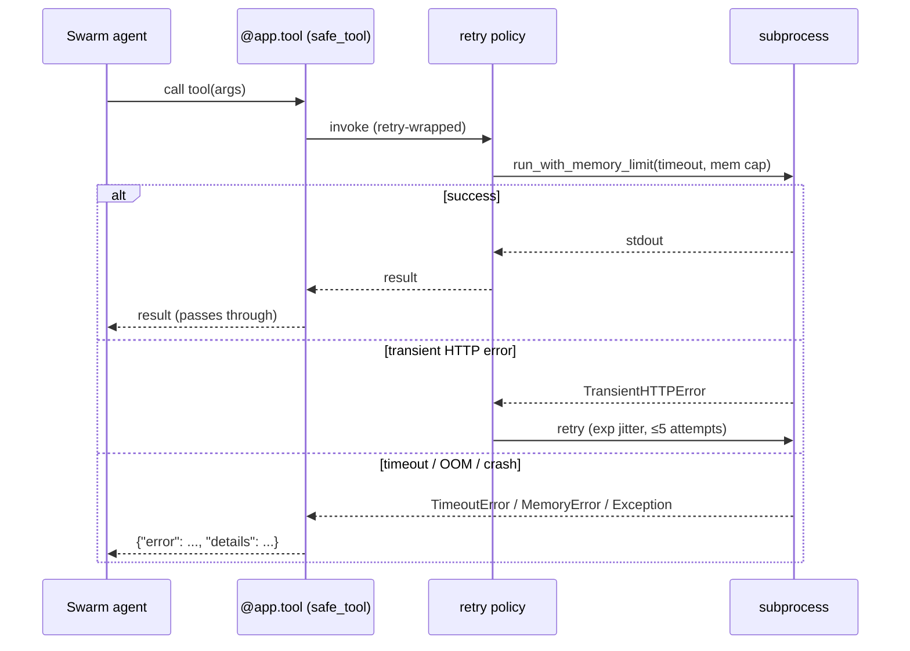

# Recovery & Resilience — Failure-Mode Catalogue

> Every way a triage run can fail under load — missing tools, timeouts, OOM, stale mounts,
> transient SIEM errors — and the mitigation the runtime applies. The R1–R5 chaos classes
> are the resilience contract; each has a regression test in `tests/chaos/`.

Agentropix-SIFT is designed to **degrade gracefully**: a single tool failure must not crash
the agent loop. Two architectural choices make this possible — the flat-error-envelope at
the MCP boundary, and memory-monitored subprocess execution that kills runaway tools rather
than letting them OOM the host.

---

## 1. The error envelope — failures never escape the boundary

Every `@app.tool()` callable is wrapped by `safe_tool` (`mcp_server/wrappers/_safe_tool.py`).
On any caught exception it returns a flat `{"error": str, "details": dict}` envelope instead
of propagating, which keeps the agent's iteration alive: a `ValidationError` or an httpx 5xx
in one tool call no longer crashes the run. The decorator deliberately does **not** swallow
`KeyboardInterrupt`, `SystemExit`, or `asyncio.CancelledError` — those propagate untouched so
real shutdown and cancellation still work. Retry is composed *inside* the envelope (retry
first, then envelope the final outcome).

The agent treats an error envelope as "this dimension produced nothing" and continues; the
Critic refuses to halt while any *planned* agent produced zero findings, so a degraded tool
surfaces as a non-halt rather than a false convergence.

---

## 2. Retry & backoff

Network-touching tools share one tenacity policy, `_wazuh_retry_policy()`
(`wazuh/indexer_client.py`), so backoff shape is consistent everywhere:

| Parameter | Value |
|-----------|-------|
| Wait | `wait_exponential_jitter(initial=1.0, max=30.0)` |
| Max attempts | `stop_after_attempt(5)` |
| Retry classifier | `TransientHTTPError` only (5xx / connect timeouts) |
| `reraise` | `True` (final failure re-raised, then enveloped) |

Crucially the classifier retries **only** transient HTTP errors — auth failures, 4xx, and
Pydantic `ValidationError`s propagate immediately rather than being retried into a wall. A
deliberately slow query (`timeout_sec` exceeded) is also *not* retried, because re-running it
just re-incurs the same timeout (and, on the write path, would risk a retry-induced
duplicate). Subprocess-level retries are bounded by `AGENTROPIX_MAX_RETRIES` (default `2`).

---

## 3. Memory ceilings & timeouts

Forensic subprocesses run under `run_with_memory_limit(...)` (`mcp_server/wrappers/_subprocess.py`):

- **Timeout** — `asyncio.wait_for(proc.communicate(), timeout=...)` raises `TimeoutError`
  when a tool runs long; the process tree is then killed.
- **Memory monitor** — an asyncio task samples the process tree's RSS (via `psutil`,
  including children) against the limit and `os.killpg(pgid, SIGKILL)`s the whole worker
  tree on breach, raising `MemoryError`. When `psutil` is unavailable, monitoring is disabled
  with a warning rather than failing the call.
- **Limit resolution** — `AGENTROPIX_MEM_LIMIT_MB` wins if set (any value, including `0` to
  disable the guard); otherwise the cap scales to evidence size
  (`max(default, image_GB · 730 MB)`, W-162) with a static floor of `4096` MB.

Per-wrapper timeout/cap knobs (`AGENTROPIX_<TOOL>_TIMEOUT`, `AGENTROPIX_<TOOL>_MAX_*`) tune
individual tools — see [configuration](configuration.md). The OOM/timeout decision tree for
large E01 images is the subject of the
[`troubleshoot-oom-timeout`](deployment.md#runbook-index) runbook.

---

## 4. The R1–R5 chaos resilience classes

`tests/chaos/test_fault_paths.py` injects the specific failure modes that historically leaked
resources, and pins the cleanup contract. Each R-class is a regression against a real bug:

| Class | Injected fault | Required behaviour |
|-------|----------------|--------------------|
| **R1** | `ewfmount` exits 0 but the `ewf1` node never appears | Raise `RuntimeError` *and* remove the mount tmpdir (no leaked mount/tmpdir) |
| **R2** | `os.killpg` raises `ProcessLookupError` (process already dead) | Swallow the lookup error; `TimeoutError` still propagates cleanly (no crash) |
| **R3** | `fusermount` exits non-zero (stale mount already gone) | tmpdir is still removed; non-zero unmount must not block cleanup |
| **R4** | `TimeoutError` fires during a memory-monitored run | The asyncio memory-monitor task is cancelled (no orphaned monitor) |
| **R5a / R5b** | A subprocess exceeds its timeout (Volatility / YARA) | `proc.kill()` fires on the runaway subprocess — no zombie tool |

Two earlier regressions guard the same surface: `TestPlasoCleanupOnTimeout` (W-022:
`shutil.rmtree(ignore_errors=True)` in `finally` cleans the Plaso tmpdir on both the timeout
and the happy path) and `TestExtractFilesTraversalRejected` (traversal / NUL-byte in-container
paths land in `rejected[]` before any subprocess is invoked).

---

## 5. Failure → mitigation summary

| Failure mode | Mitigation | Source |
|--------------|------------|--------|
| Missing SIFT binary | `doctor` pre-flights the 16 binaries; wrapper raises a typed error with a remediation hint; agent continues on the envelope | `cli.py` (`doctor`), `_safe_tool.py` |
| Tool raises mid-iteration | Flat error envelope; agent loop survives; that dimension yields no findings | `_safe_tool.py` |
| Transient SIEM 5xx / connect timeout | Exponential-jitter retry, ≤5 attempts, transient-only classifier | `wazuh/indexer_client.py` |
| Auth / 4xx / validation error | **Not** retried — propagates immediately (fail fast) | `wazuh/indexer_client.py` |
| Subprocess runs too long | `asyncio.wait_for` timeout → kill process tree (R5) | `_subprocess.py` |
| Subprocess exceeds RAM | `psutil` RSS monitor → `killpg(SIGKILL)` whole tree → `MemoryError` (R4) | `_subprocess.py` |
| `psutil` unavailable | Memory monitoring disabled with a warning, call still runs | `_subprocess.py` |
| Stale/failed EWF mount | tmpdir removed regardless of `ewfmount`/`fusermount` exit code (R1, R3) | `tests/chaos/test_fault_paths.py` |
| `killpg` on a dead PID | `ProcessLookupError` swallowed; timeout still raises (R2) | `tests/chaos/test_fault_paths.py` |
| Plaso timeout | tmpdir cleaned in `finally`; recall gate flags `PLASO_TIMEOUT` (W-128) | `plaso.py`, `tests/integration/test_e2e_dc_recall.py` |
| Evidence image unhashable | `evidence_image_sha256 = null`; operator may supply `AGENTROPIX_EVIDENCE_SHA256` | `courtroom.py` |
| Audit ring overflow | Bounded ring (default 1000, `AGENTROPIX_THYMUS_AUDIT_LOG_RING_SIZE`); on-disk JSONL is the durable source of truth | `thymus_policy.py` |
| Oversize scalar in redaction | Becomes `[REDACTED-OVERSIZE-<tag>]` — graceful, not fatal; depth-limit guards recursion | `security/redact.py` |

---

## See also

- [testing](testing.md) — where the R1–R5 classes and the recall gate live.
- [security-model](security-model.md) — the Thymus policy and fail-closed redaction.
- [configuration](configuration.md) — the timeout / memory / retry env knobs.
- [deployment](deployment.md#runbook-index) — the OOM/timeout troubleshooting runbook.
