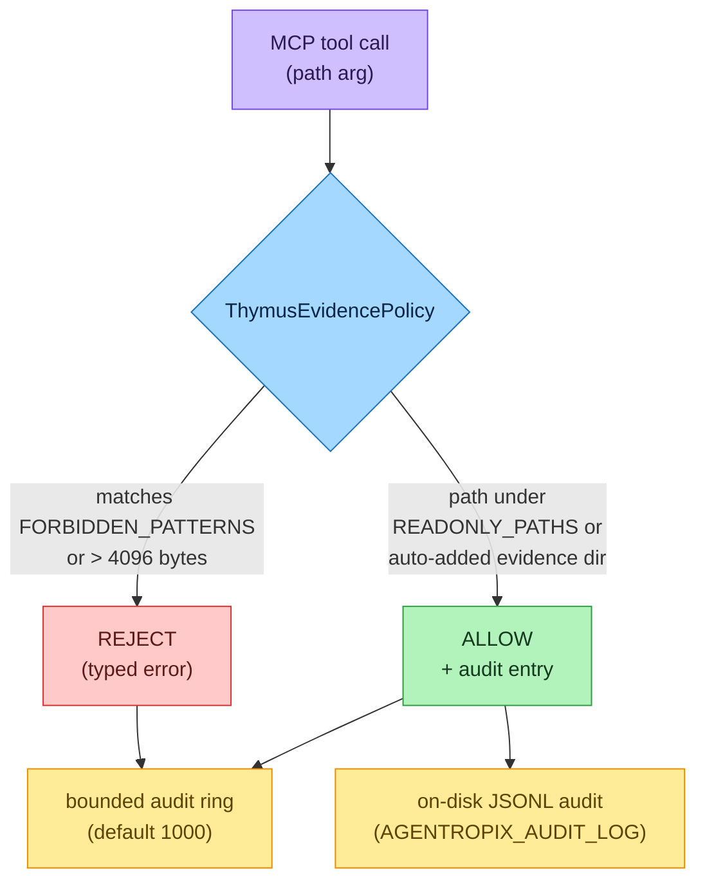
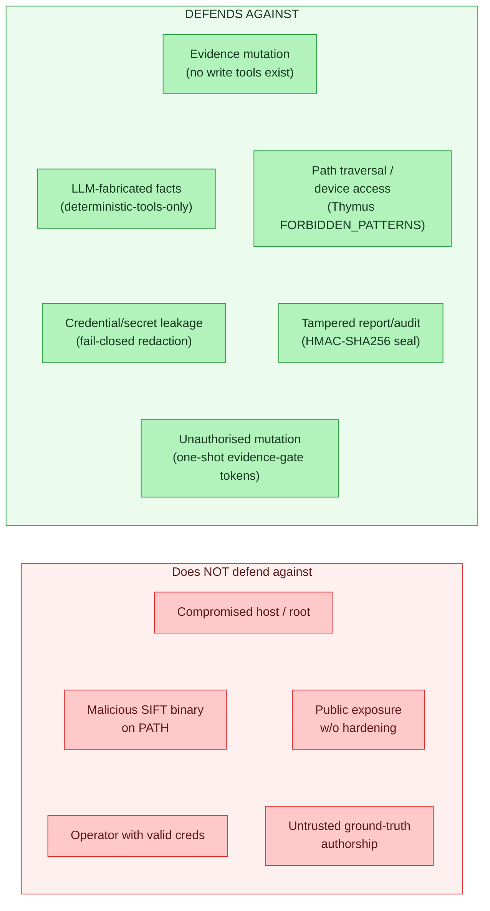

# Security Model — Thymus, Denylists, Redaction & Threat Model

> The safety spine of Agentropix-SIFT: the Thymus read-only evidence policy, the path and
> Wazuh-push denylists, deterministic secret/finding redaction, and an honest threat model
> of what the system does — and does not — defend against.

The guiding principle is **architectural, not advisory**: the agent cannot write to evidence
because no MCP tool exposes a write operation. Every other control (Thymus, the SHA-256
evidence invariant, the HMAC courtroom seal) is defense-in-depth layered on top of that
structural impossibility. For the crypto seal mechanics see
[audit & courtroom](../05-safety-forensics/audit-courtroom.md) and
[provenance & grounding](../05-safety-forensics/provenance-grounding.md); for the
evidence-gate mutation tokens see
[implementation](implementation.md#evidence_gate--mutation-token-regime).

> **Terms used on this page.** *Thymus* is the read-only path policy (named for the immune
> organ that licenses what the body may touch). An *MCP tool* is one of the 71 deterministic
> functions the agent calls; the agent never runs raw shell. A *wrapper* is the Python module
> that drives an underlying SIFT forensic binary behind an MCP tool. A *denylist* is an
> explicit set of inputs that are refused. *Redaction* replaces a secret with a stable
> placeholder. The *courtroom seal* is an HMAC-SHA256 signature binding a report to its
> evidence. This page is the **rationale and threat model** — the step-by-step how-to for
> tuning these controls lives in [configuration](configuration.md) and
> [approval-portal](../05-safety-forensics/approval-portal.md).

---

## Contents — what's in this page (and what to expect)

> Jump to any section below. Each row tells you what that part gives you, so you can go straight to your point.

| Section | What you'll get |
|---|---|
| [1. Thymus — read-only evidence policy (S-02)](#1-thymus--read-only-evidence-policy-s-02) | How `thymus_policy.py` confines every MCP path to read-only zones — allowed prefixes, forbidden patterns, the 4096-byte path cap, and the dual ring + JSONL audit trail. |
| [2. Denylists](#2-denylists) | Where path denial lives (Thymus `FORBIDDEN_PATTERNS`) and the Wazuh IOC-push denylists that stop benign/infrastructure indicators reaching the SIEM. |
| [3. Secret & finding redaction](#3-secret--finding-redaction) | The two separately-keyed redaction layers — log-secret stripping and the fail-closed, DoS-hardened HMAC finding redactor — plus file-pointer secret sourcing. |
| [4. Server exposure & auth](#4-server-exposure--auth) | Bearer-token auth, the three-condition dev-mode gate, the tailnet-only default posture, and the PBKDF2-backed approval sidecar. |
| [5. Threat model — defends / does NOT defend](#5-threat-model--defends--does-not-defend) | An honest two-column boundary: what the architecture stops (mutation, traversal, tamper, fabrication, leakage) and what it explicitly does not (root host, trojaned binary, malicious operator, public exposure, untrusted ground truth). |
| [See also](#see-also) | Cross-links to recovery-resilience, configuration, the safety & forensics section, and deployment. |

---

## 1. Thymus — read-only evidence policy (S-02)

`mcp_server/thymus_policy.py` validates that every file path an MCP tool touches lies within
a permitted read-only zone, before the wrapper executes. It is the architectural evidence
integrity layer.

**Allowed zones** (`READONLY_PATHS`): `/cases/`, `/mnt/`, `/media/`, `/evidence/`,
`/tmp/agentropix-sift-`, and the SIFT YARA rule dirs `/usr/share/yara/rules/` +
`/usr/share/yara-rules/` (added by default so `scan_yara` works without an env override —
SIFT-W-080). Operators extend the set via `AGENTROPIX_THYMUS_ALLOWED_PREFIXES`. When
auto-detection is on, the parent directory of an image file is added on first access (capped
at `AGENTROPIX_MAX_AUTO_PREFIXES`, default 50, to prevent prefix explosion).

**Forbidden patterns** (`FORBIDDEN_PATTERNS`): `..` (traversal), `~` (home expansion),
`/dev/`, `/proc/`, `/sys/`. Paths over `_PATH_MAX_BYTES` (4096) are rejected with a typed
REJECT rather than letting the OS raise `ENAMETOOLONG` inside a wrapper (SIFT-W-109).

**Audit trail** — every ALLOW/REJECT decision is recorded twice, by design. The in-memory copy
is a *bounded ring* (a fixed-size circular buffer that overwrites its oldest entries; default
1000, `AGENTROPIX_THYMUS_AUDIT_LOG_RING_SIZE`, floor 100 / ceiling 100000) that backs the
`audit_log` inspection helper for live introspection. The **on-disk JSONL** (one JSON object
per line, written to `AGENTROPIX_AUDIT_LOG` / `AGENTROPIX_AUDIT_LOG_DIR`) is the durable
chain-of-custody source of truth — the ring is for inspection, the JSONL is for the record.

---

## 2. Denylists

Path-level denial is handled by Thymus's `FORBIDDEN_PATTERNS` above (there is no general
shell-command interpreter to deny — wrappers invoke fixed argv subprocesses, never
`shell=True`, and traversal/NUL-byte in-container paths are rejected pre-subprocess; see the
R-class tests in [recovery-resilience](recovery-resilience.md)).

The **Wazuh IOC-push** path carries its own denylists (`wazuh/denylists.py`) to stop benign
or infrastructure indicators from being pushed to the SIEM: a case-insensitive benign-process
regex (`F_RESPONSE_BENIGN_REGEX`) applied after path/whitespace/NUL/trailing-dot
normalisation, a Windows-Installer GUID-path provenance predicate (`is_installer_guid_path`),
and RFC-1918 handling gated by `accept_internal_ips` + `WAZUH_OPERATOR_TRUSTED_CIDRS`. The
active-response guard additionally protects CIDRs that automated response must **never** block
(`AGENTROPIX_AR_PROTECTED_CIDRS`, defaulting to RFC-1918 + loopback/ULA/link-local).

---

## 3. Secret & finding redaction

Two independent, separately-keyed redaction layers:

| Layer | Module | Key | Behaviour |
|-------|--------|-----|-----------|
| Secret-in-logs | `secrets.py` | n/a (pattern strip) | `install_secret_filter` strips resolved tokens from every log record before handlers see them; tokens are never emitted to stdout or the audit log |
| Finding redaction | `security/redact.py` | `AGENTROPIX_REDACTOR_HMAC_KEY` (≥32 bytes) | Replaces credential-pattern scalars with `[REDACTED-<tag>]`, where `<tag>` = first 16 hex of `HMAC-SHA256(key, value)` |

The HMAC redactor is **fail-closed**: any uncaught exception is wrapped in `RedactionError`
so the aggregator aborts rather than emitting unredacted output. It is also DoS-hardened —
`MAX_DEPTH = 32` (recursion/cycle guard), `MAX_VALUE_BYTES = 1 MB` per scalar (oversize →
`[REDACTED-OVERSIZE-<tag>]`, graceful), and `MAX_REGEX_INPUT_BYTES = 64 KiB` (ReDoS guard
when the timeout-capable `regex` package is unavailable). The 16-hex tag is a deliberate fix
from a round-4 review: a full SHA-256 of a low-entropy value (a short password, a username) can be brute-forced back
to its input by an attacker who hashes guesses until one matches, so no `raw_sha256` field is
ever emitted — only the truncated, key-salted 16-hex tag. The redactor key is deliberately
**separate** from the MASTER-IOCS signer key (`AGENTROPIX_MASTER_IOCS_HMAC_KEY`, which signs
the promoted-indicator manifest): compromising one key never weakens the other.

Secret *sourcing* prefers the file-pointer form over inline values (e.g.
`AGENTROPIX_TELEGRAM_TOKEN_FILE` > `AGENTROPIX_TELEGRAM_TOKEN` > legacy
`AGENTROPIX_TELEGRAM_BOT_TOKEN`), so operators can rotate via Docker secrets / systemd
`LoadCredential` / `op read` without a code change (`secrets.py`).

---

## 4. Server exposure & auth

HTTP-exposed tools require a bearer token (`AGENTROPIX_MCP_AUTH_TOKEN`, minted with
`secrets.token_urlsafe(32)`). Dev-mode is not a single switch: `AGENTROPIX_MCP_DEV_MODE=1`
is insufficient alone — it also requires `AGENTROPIX_BUILD_PROFILE=dev` **and** a loopback
bind (`AGENTROPIX_HTTP_HOST=127.0.0.1`), at which point the server boots with a random
per-start ephemeral token (audit-logged). The default network posture is **tailnet-only**
(ADR-017); see [deployment](deployment.md). The optional approval sidecar binds `127.0.0.1`
by default and uses PBKDF2 (`600000` iterations) over per-examiner salts.

---

## 5. Threat model — defends / does NOT defend

An honest security model states its boundaries as plainly as its protections. The two columns
below are independent lists — the connectors between boxes are layout only (they carry no flow
or ordering); read each box on its own. The green column is what the architecture stops; the
red column is what it does **not**, and why no control on this page should be read as covering
those cases.

**What the system defends against.** Evidence integrity (writes are structurally impossible;
pre/post SHA-256 invariant binds the report to the evidence bytes; Thymus blocks traversal and
device-file reads). Report/audit integrity (HMAC-SHA256 courtroom seal, verifiable offline via
`audit/verify_seal.py` and `provenance/validate.py`). Fact provenance (every finding originates
from a named deterministic MCP tool captured in `trace.tool_calls`; `inference_constraint=high`
means the LLM orchestrates but never authors facts and never self-rates — the Critic score is
deterministic). Secret hygiene (log filtering + fail-closed HMAC redaction). Mutation control
(one-shot, TTL-bounded evidence-gate tokens, sourced from env, never a CLI flag).

**What it explicitly does NOT defend against.** A compromised host or root-level adversary
(the seal proves tamper *after the fact*, it does not prevent a root actor from forging a new
key + reseal; the `.session-key` is mode 0600 but root reads everything). A malicious or
trojaned forensic binary on `PATH` — Agentropix-SIFT drives whatever `vol`/`fls`/`yara` it
finds (which is why the deploy runbook says *do not* `apt install` replacement binaries, and
`AGENTROPIX_VERIFY_TOOL_PINS` exists as opt-in defense-in-depth). An authenticated operator
acting maliciously (the approval sidecar gives non-repudiation, not prevention). Public
internet exposure without the extra hardening ADR-017 requires (`--public` is opt-in). And it
does not validate that the **ground-truth** used by the recall gate is itself trustworthy —
recall is a quality signal, not a security boundary.

---

## See also

- [recovery-resilience](recovery-resilience.md) — fail-closed behaviour under fault injection.
- [configuration](configuration.md) — the security-relevant `AGENTROPIX_*` knobs.
- [the safety & forensics section](../05-safety-forensics/) — seal/provenance mechanics in depth.
- [deployment](deployment.md) — tailnet exposure posture and token rotation.

### Decision records behind these controls (ADRs)

Each control on this page traces to an [Architecture Decision Record](../11-ADR/) that captures
why it was implemented (or, for the deferred items, why it was deliberately not):

- **Fail-safe, defense-in-depth posture (the whole §5 stance)** —
  [ADR-008](../11-ADR/ADR-008-safety-architecture.md) (bio-agentic safety model that defaults to
  stopping rather than continuing).
- **HMAC courtroom seal (§3, §5)** — [ADR-016](../11-ADR/ADR-016-courtroom-audit.md); the
  cross-bound audit-log seal — [ADR-022](../11-ADR/ADR-022-audit-log-seal.md).
- **Server exposure / tailnet-only default (§4)** —
  [ADR-017](../11-ADR/ADR-017-tailnet-mcp-exposure.md) (already cited inline).
- **Wazuh IOC-push denylists + per-PUT HMAC chain of custody (§2)** —
  [ADR-018](../11-ADR/ADR-018-wazuh-ioc-push.md).
- **Active-response confirmation gate + protected CIDRs (§2)** —
  [ADR-019](../11-ADR/ADR-019-ar-confirmation-gate.md); the two-person rule was deliberately
  **deferred** in [ADR-021](../11-ADR/ADR-021-two-person-rule-defer.md) (the single-confirmation
  gate suffices while no AR is invoked).
- **Secret sourcing / file-pointer credential discipline (§3)** —
  [ADR-020](../11-ADR/ADR-020-credential-lifecycle.md) (Wazuh credential lifecycle).
