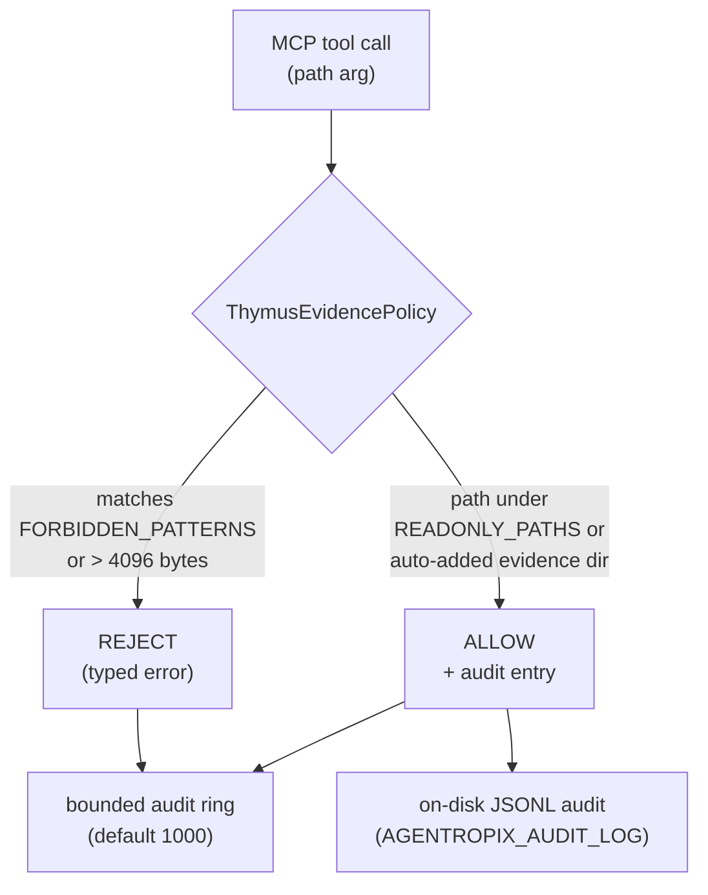
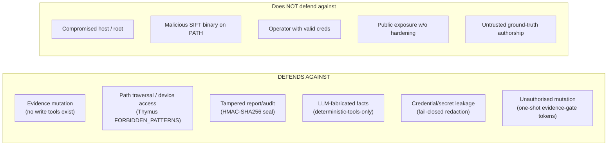

# Security Model — Thymus, Denylists, Redaction & Threat Model

> The safety spine of Agentropix-SIFT: the Thymus read-only evidence policy, the path and
> Wazuh-push denylists, deterministic secret/finding redaction, and an honest threat model
> of what the system does — and does not — defend against.

The guiding principle is **architectural, not advisory**: the agent cannot write to evidence
because no MCP tool exposes a write operation. Every other control (Thymus, the SHA-256
evidence invariant, the HMAC courtroom seal) is defense-in-depth layered on top of that
structural impossibility. For the crypto seal mechanics see the
[safety & forensics section](../05-safety-forensics/); for the evidence-gate mutation tokens
see [implementation](implementation.md#evidence_gate--mutation-token-regime).

---

## 1. Thymus — read-only evidence policy (S-02)

`mcp_server/thymus_policy.py` validates that every file path an MCP tool touches lies within
a permitted read-only zone, before the wrapper executes. It is the architectural evidence
integrity layer.

**Allowed zones** (`READONLY_PATHS`): `/cases/`, `/mnt/`, `/media/`, `/evidence/`,
`/tmp/agentropix-sift-`, and the SIFT YARA rule dirs `/usr/share/yara/rules/` +
`/usr/share/yara-rules/` (added by default so `scan_yara` works without an env override —
SIFT-W-080). Operators extend the set via `AGENTROPIX_THYMUS_ALLOWED_PREFIXES`. When
auto-detection is on, the parent directory of an image file is added on first access (capped
at `AGENTROPIX_MAX_AUTO_PREFIXES`, default 50, to prevent prefix explosion).

**Forbidden patterns** (`FORBIDDEN_PATTERNS`): `..` (traversal), `~` (home expansion),
`/dev/`, `/proc/`, `/sys/`. Paths over `_PATH_MAX_BYTES` (4096) are rejected with a typed
REJECT rather than letting the OS raise `ENAMETOOLONG` inside a wrapper (SIFT-W-109).

**Audit trail** — every ALLOW/REJECT is recorded. The in-memory copy is a *bounded ring*
(default 1000, `AGENTROPIX_THYMUS_AUDIT_LOG_RING_SIZE`, floor 100 / ceiling 100000) serving
the `audit_log` inspection helper; the **on-disk JSONL** (`AGENTROPIX_AUDIT_LOG` /
`AGENTROPIX_AUDIT_LOG_DIR`) is the chain-of-custody source of truth.

---

## 2. Denylists

Path-level denial is handled by Thymus's `FORBIDDEN_PATTERNS` above (there is no general
shell-command interpreter to deny — wrappers invoke fixed argv subprocesses, never
`shell=True`, and traversal/NUL-byte in-container paths are rejected pre-subprocess; see the
R-class tests in [recovery-resilience](recovery-resilience.md)).

The **Wazuh IOC-push** path carries its own denylists (`wazuh/denylists.py`) to stop benign
or infrastructure indicators from being pushed to the SIEM: a case-insensitive benign-process
regex (`F_RESPONSE_BENIGN_REGEX`) applied after path/whitespace/NUL/trailing-dot
normalisation, a Windows-Installer GUID-path provenance predicate (`is_installer_guid_path`),
and RFC-1918 handling gated by `accept_internal_ips` + `WAZUH_OPERATOR_TRUSTED_CIDRS`. The
active-response guard additionally protects CIDRs that automated response must **never** block
(`AGENTROPIX_AR_PROTECTED_CIDRS`, defaulting to RFC-1918 + loopback/ULA/link-local).

---

## 3. Secret & finding redaction

Two independent, separately-keyed redaction layers:

| Layer | Module | Key | Behaviour |
|-------|--------|-----|-----------|
| Secret-in-logs | `secrets.py` | n/a (pattern strip) | `install_secret_filter` strips resolved tokens from every log record before handlers see them; tokens are never emitted to stdout or the audit log |
| Finding redaction | `security/redact.py` | `AGENTROPIX_REDACTOR_HMAC_KEY` (≥32 bytes) | Replaces credential-pattern scalars with `[REDACTED-<tag>]`, where `<tag>` = first 16 hex of `HMAC-SHA256(key, value)` |

The HMAC redactor is **fail-closed**: any uncaught exception is wrapped in `RedactionError`
so the aggregator aborts rather than emitting unredacted output. It is also DoS-hardened —
`MAX_DEPTH = 32` (recursion/cycle guard), `MAX_VALUE_BYTES = 1 MB` per scalar (oversize →
`[REDACTED-OVERSIZE-<tag>]`, graceful), and `MAX_REGEX_INPUT_BYTES = 64 KiB` (ReDoS guard
when the timeout-capable `regex` package is unavailable). The 16-hex tag is a deliberate fix
from a round-4 review: a full SHA-256 of a low-entropy value is preimage-recoverable, so no
`raw_sha256` field is ever emitted. The redactor key is **separate** from the MASTER-IOCS
signer key (`AGENTROPIX_MASTER_IOCS_HMAC_KEY`).

Secret *sourcing* prefers the file-pointer form over inline values (e.g.
`AGENTROPIX_TELEGRAM_TOKEN_FILE` > `AGENTROPIX_TELEGRAM_TOKEN` > legacy
`AGENTROPIX_TELEGRAM_BOT_TOKEN`), so operators can rotate via Docker secrets / systemd
`LoadCredential` / `op read` without a code change (`secrets.py`).

---

## 4. Server exposure & auth

HTTP-exposed tools require a bearer token (`AGENTROPIX_MCP_AUTH_TOKEN`, minted with
`secrets.token_urlsafe(32)`). Dev-mode is not a single switch: `AGENTROPIX_MCP_DEV_MODE=1`
is insufficient alone — it also requires `AGENTROPIX_BUILD_PROFILE=dev` **and** a loopback
bind (`AGENTROPIX_HTTP_HOST=127.0.0.1`), at which point the server boots with a random
per-start ephemeral token (audit-logged). The default network posture is **tailnet-only**
(ADR-017); see [deployment](deployment.md). The optional approval sidecar binds `127.0.0.1`
by default and uses PBKDF2 (`600000` iterations) over per-examiner salts.

---

## 5. Threat model — defends / does NOT defend

**What the system defends against.** Evidence integrity (writes are structurally impossible;
pre/post SHA-256 invariant binds the report to the evidence bytes; Thymus blocks traversal and
device-file reads). Report/audit integrity (HMAC-SHA256 courtroom seal, verifiable offline via
`audit/verify_seal.py` and `provenance/validate.py`). Fact provenance (every finding originates
from a named deterministic MCP tool captured in `trace.tool_calls`; `inference_constraint=high`
means the LLM orchestrates but never authors facts and never self-rates — the Critic score is
deterministic). Secret hygiene (log filtering + fail-closed HMAC redaction). Mutation control
(one-shot, TTL-bounded evidence-gate tokens, sourced from env, never a CLI flag).

**What it explicitly does NOT defend against.** A compromised host or root-level adversary
(the seal proves tamper *after the fact*, it does not prevent a root actor from forging a new
key + reseal; the `.session-key` is mode 0600 but root reads everything). A malicious or
trojaned forensic binary on `PATH` — Agentropix-SIFT drives whatever `vol`/`fls`/`yara` it
finds (which is why the deploy runbook says *do not* `apt install` replacement binaries, and
`AGENTROPIX_VERIFY_TOOL_PINS` exists as opt-in defense-in-depth). An authenticated operator
acting maliciously (the approval sidecar gives non-repudiation, not prevention). Public
internet exposure without the extra hardening ADR-017 requires (`--public` is opt-in). And it
does not validate that the **ground-truth** used by the recall gate is itself trustworthy —
recall is a quality signal, not a security boundary.

---

## See also

- [recovery-resilience](recovery-resilience.md) — fail-closed behaviour under fault injection.
- [configuration](configuration.md) — the security-relevant `AGENTROPIX_*` knobs.
- [the safety & forensics section](../05-safety-forensics/) — seal/provenance mechanics in depth.
- [deployment](deployment.md) — tailnet exposure posture and token rotation.
