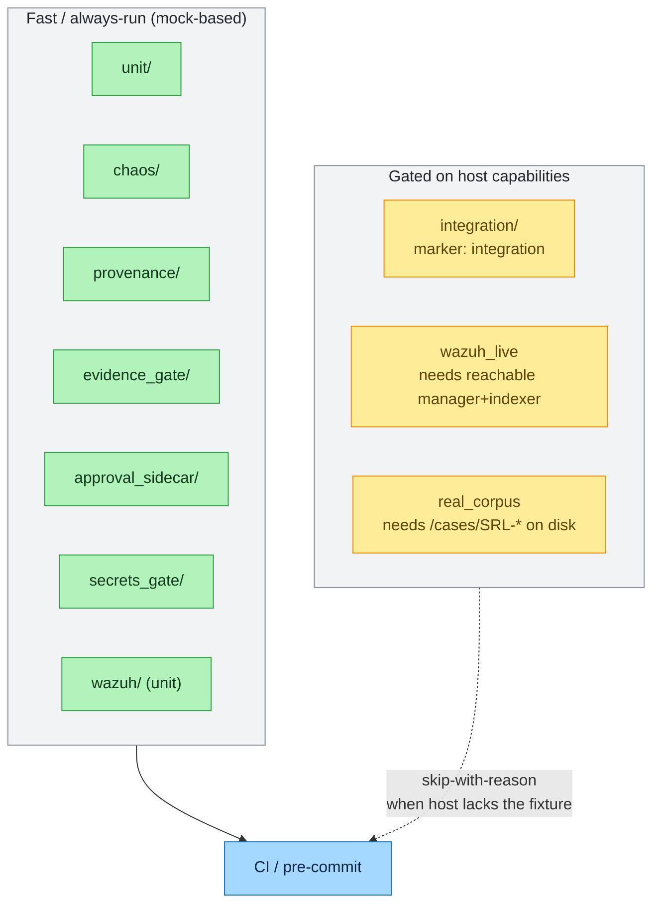

# Testing — Topology, Gates & Ground-Truth Recall

> How Agentropix-SIFT is tested: the suite layout under `tests/`, the pytest markers, the
> coverage gate, and the ground-truth end-to-end recall gate that distinguishes a real
> forensic regression from an infrastructure failure.

The suite holds **4464** collected tests (`pytest --collect-only -q`; see
[CANONICAL_FACTS](../../.crew/facts.md)). The number is **forward-drift-gated** — a CI check
that fails the build if a doc quotes a test count without citing the canonical fact file, or
quotes a known-outdated value. Concretely: doc lines that quote the count must cite this fact
file, and the following **stale literals are actively rejected** by the upstream drift check
(each is a prior, now-superseded count): `1270`, `1129`, `1084`, `1073` (early drafts) and
`3881`, `3899` (intermediate corrections). The current canonical value is **4464**; never
quote any of the rejected literals as if current.

---

## 1. Test topology

Tests live under `tests/`, partitioned by the layer they exercise. Each suite below is a real
directory in the oracle repo (`/home/admin2/agentropix-sift/tests/`); the **Path** column is
the exact on-disk location.

| Suite | Path | What it covers |
|-------|------|----------------|
| Unit | `tests/unit/` | The largest suite — agent logic, wrappers, schema, scoring, env clamping. Mock-based, fast. |
| Integration | `tests/integration/` | Real-subprocess tests requiring SIFT binaries on PATH (and, for some, a staged E01 image). |
| Chaos | `tests/chaos/` | Fault-injection / resilience-path tests (R1–R5 classes — see [recovery-resilience](recovery-resilience.md)). |
| Provenance | `tests/provenance/` | Sealed provenance-chain validation (per-row HMAC re-verification). |
| Evidence gate | `tests/evidence_gate/` | Mutation-token mint/spend/revoke, one-shot + TTL semantics. |
| Approval sidecar | `tests/approval_sidecar/` | HMAC challenge/submit, nonce TTL, PBKDF2 auth, append-only hash chain. |
| Audit | `tests/audit/` | Standalone report + audit-log seal verification. |
| Wazuh | `tests/wazuh/` | SIEM integration — IOC models, denylists, push orchestration, active-response guard. |
| Secrets gate | `tests/secrets_gate/` | Secret resolution precedence and logging-safe redaction. |



Two tiers, distinguished by what the host must provide:

- **Fast / always-run** — mock-based suites with no external prerequisites (`unit/`, `chaos/`,
  `provenance/`, `evidence_gate/`, `approval_sidecar/`, `secrets_gate/`, `wazuh/unit`). These run
  everywhere, including CI and the pre-commit hook.
- **Gated on host capabilities** — suites that need a real fixture: SIFT binaries on PATH (and
  sometimes a staged [E01](../08-reference/glossary.md) disk image) for `integration/`, a reachable
  Wazuh deployment for `wazuh_live`, or a real case corpus on disk for `real_corpus`.

The gated suites **skip with a self-describing reason** (naming every searched path) when the host
lacks the fixture, so a missing E01 or an unreachable Wazuh never turns into a false failure — a
skip is reported as a skip, not silently passed and not failed.

---

## 2. Pytest markers

A **pytest marker** is a label attached to a test (`@pytest.mark.<name>`) that lets a run select
or deselect a group of tests — e.g. `pytest -m integration` runs only integration tests, and
`pytest -m "not integration"` skips them. The markers below are declared in `pyproject.toml:74-79`
and are what selects the host-dependent (gated) tiers from §1:

| Marker | Meaning |
|--------|---------|
| `chaos` | Fault-injection / resilience-path tests (mock-based, fast). |
| `integration` | Real-subprocess tests requiring SIFT tools on PATH. |
| `wazuh_live` | Requires a reachable Wazuh manager + indexer (gated on `WAZUH_INTEGRATION_ENABLED`). |
| `real_corpus` | Requires `/cases/SRL-2015` or `/cases/SRL-2018` on disk (orthogonal to `integration`). |

`asyncio_mode = "auto"` (`pyproject.toml:72`) means async test functions are collected
without per-test `@pytest.mark.asyncio` decoration — fitting because every agent is an async
coroutine over the MCP boundary.

---

## 3. Coverage gate

The `dev` dependency group pins `pytest-cov>=7.1.0` (`pyproject.toml:99`), and the type gate
is **basedpyright in `strict` mode** (`pyproject.toml:81-83`) — strict typing is itself a
correctness gate, not just a lint. Lint is **ruff** with the `E,F,W,I,UP,B,SIM` selectors
(`pyproject.toml:68-69`). See [setup-pre-commit] guidance in
[deployment](deployment.md) for wiring these into a commit-time hook.

---

## 4. The ground-truth E2E recall gate

The deepest correctness signal is the **Trinity Loop recall gate**. *Recall* here is the
standard information-retrieval measure — of the findings a known-answer key says *should* be
discovered, what fraction did the system actually surface (`hits / total`). The gate runs the
full `run_triage()` pipeline against a real SANS E01 image and scores its findings against a
hand-authored **ground-truth file** (the known-answer key: the list of findings a correct run
must produce, plus the pass threshold).

### How it scores

`tests/integration/test_e2e_dc_recall.py` runs `run_triage(e01_image, max_iterations=5)`,
then scores the report's findings against the `expected_findings` and `scoring` blocks of
`samples/ground_truth_dc.yaml` (the ground-truth file lives at the repo root under `samples/`).
The ground-truth YAML is the **single evaluator** — there is no second scoring implementation
that could drift, so the YAML is the only place the pass criteria are defined. Per-finding fingerprints are
`SHA-256[:16]` of `(source, description, evidence)`, used **only** for recall scoring (this
is deliberately *not* the Critic's dedup key, which is an unhashed 4-tuple `frozenset`
element in `critic.py`). Recall is `hits / total`, compared against
`scoring.recall_threshold`.

### Canonical recall numbers

From the last full evaluation run (2026-05-05), per [CANONICAL_FACTS](../../.crew/facts.md):

| Metric | Value |
|--------|-------|
| Disk recall (regression) | **72/72 (100%)** |
| Memory recall (combined) | **108/118 (91.5%)** |

The disk-recall figure carries a methodology caveat (post-hoc ground truth: 6 of 7
`ground_truth_*.yaml` authored from run output); the blinded variant is pending Theme 4
execution. Never quote a recall number that contradicts the fact file.

### The PLASO_TIMEOUT discriminator (W-128)

Recall numerics alone are not a clean pass. The gate carries a discriminator
(`_gate_failure_message`, `test_e2e_dc_recall.py`) that fails the run when the timeline
wrapper's `wrapper_error` contains `"timed out"` — **independently of recall**. This exists
because of a real silent-failure mode: run `28T190548Z` scored 4/7 = 0.571, numerically
clearing the 0.57 floor, yet Plaso had timed out and produced zero events, so the passing
recall was drawn entirely from non-timeline agents. The discriminator catches that case:

```python
if timed_out:
    return True, f"PLASO_TIMEOUT: {base} timeline wrapper_error={we!r}"
if recall < threshold:
    return True, base
return False, ""
```

A `PLASO_TIMEOUT` failure is never overridden by a numerically passing recall — the
timeline subsystem either produced events or the run failed. Synthetic dict-payload tests
(`TestRecallGateTimeoutDiscriminator`) pin this contract on hosts without the SANS image
staged, so the regression fails fast even where the live E01 cannot run.

---

## See also

- [recovery-resilience](recovery-resilience.md) — the R1–R5 chaos classes in detail.
- [implementation](implementation.md) — the code the tests exercise.
- [security-model](security-model.md) — the Thymus / seal invariants the audit suite checks.

[setup-pre-commit]: deployment.md
