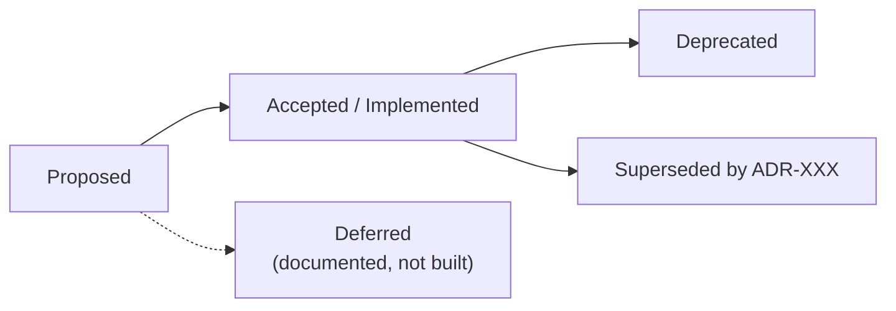

# ADR Index

A routed index of every Architecture Decision Record under
[`docs/adr/`](../../../agentropix-sift/docs/adr/). An ADR captures one architectural
decision with its context and consequences; ADRs are immutable once accepted —
a changed decision is superseded by a new ADR
([`docs/adr/README.md`](../../../agentropix-sift/docs/adr/README.md)).

> **Status discipline.** The Status column below is taken from the live status
> audit ([`docs/adr/_STATUS-AUDIT.md`](../../../agentropix-sift/docs/adr/_STATUS-AUDIT.md),
> dated 2026-06-03), **not** from the older `README.md` index (which is frozen at
> ADR-008, weakness W-247). Two ADRs are **Proposed** (not shipped) and one is
> **Deferred**; do not depict those as implemented.

## Status lifecycle

ADRs move `Proposed → Accepted` once the decision is technically reviewed, has a
clear implementation path, has no blocking concerns, and related docs are
updated. The eight strategic ADRs (001–008) are marked **Implemented** in the
live audit; the implementation-level ADRs (010+) are **Accepted** unless flagged
otherwise below.

## Numbered ADRs

| ADR | Title | Status (live) | One-line summary |
|-----|-------|---------------|------------------|
| [ADR-001](../../../agentropix-sift/docs/adr/ADR-001-sdk-selection.md) | SDK Selection (Chimera Stack) | Implemented | Picks the agent SDK / "Chimera Stack" — the agentic chromosome the platform is built on. |
| [ADR-002](../../../agentropix-sift/docs/adr/ADR-002-execution-engine.md) | Execution Engine (Ralph Orchestrator) | Implemented | Extracts the Ralph execution-engine component as the core loop's runner. |
| [ADR-003](../../../agentropix-sift/docs/adr/ADR-003-state-persistence.md) | State Persistence (Git checkpointing) | Implemented | Git-based state checkpointing (LineageManager) for run/replay state. |
| [ADR-004](../../../agentropix-sift/docs/adr/ADR-004-identity-system.md) | Identity System (MHC Tokens / SPIFFE-SPIRE) | Implemented | Agent identity via MHC-token credentials for self/non-self trust. |
| [ADR-005](../../../agentropix-sift/docs/adr/ADR-005-message-bus.md) | Message Bus (Cytokine Network) | Implemented | Inter-agent message bus modeled as a cytokine signaling network. |
| [ADR-006](../../../agentropix-sift/docs/adr/ADR-006-memory-system.md) | Memory System (Epigenetic Memory) | Implemented | Cross-run epigenetic memory layer for the swarm. |
| [ADR-007](../../../agentropix-sift/docs/adr/ADR-007-deployment-model.md) | Deployment Model (StemCell Niche) | Implemented | Deployment / hosting model framed as a StemCell niche. |
| [ADR-008](../../../agentropix-sift/docs/adr/ADR-008-safety-architecture.md) | Safety Architecture (Bio-Agentic / "The Oncologist") | Implemented | The Thymus-policy safety spine: read-only evidence, deterministic-tools-only findings, the SHA-256 invariant. |
| [ADR-009](../../../agentropix-sift/docs/adr/ADR-009-task-router.md) | Intelligent Task Router | ⚠️ **Proposed (NOT shipped)** | Adds sequential-with-context-passing routing for multi-step tasks the parallel-first Trinity Loop fails on. **Not implemented.** |
| [ADR-010](../../../agentropix-sift/docs/adr/ADR-010-genesis-module.md) | Genesis Module Architecture | Accepted (2026-01-18) | Consolidates scattered bio-agentic algorithms (fitness landscapes, evolutionary rescue, stochastic simulation) into one Genesis module. |
| [ADR-011](../../../agentropix-sift/docs/adr/ADR-011-evidence-gates.md) | Evidence-Type Gate Consolidation | Accepted | Consolidates the per-agent evidence-type gates (disk vs memory) across the DFIR swarm. |
| [ADR-012](../../../agentropix-sift/docs/adr/ADR-012-extract-files.md) | `mcp_extract_files` — registry/artifact extraction from raw E01 | Accepted | Defines `extract_files` to pull registry/artifacts straight from a raw `.E01` after M3 wrapper expansion. |
| [ADR-013](../../../agentropix-sift/docs/adr/ADR-013-evtx-wrapper.md) | `mcp_get_evtx` — Windows Event Log (.evtx) wrapper | Accepted | Wraps `.evtx` parsing as a first-class detection-signal MCP tool. |
| [ADR-014](../../../agentropix-sift/docs/adr/ADR-014-W072-impacket-secretsdump.md) | Credential-dump triage via `impacket-secretsdump.py` (W-072) | Accepted (path forward; BMAD Phase 6) | Adds credential-dump triage where vol3 2.27.0 cannot, via impacket-secretsdump. |
| [ADR-015](../../../agentropix-sift/docs/adr/ADR-015-context-engineering.md) | Context Engineering — Progressive Disclosure | Accepted | Combats context rot by progressively disclosing wrapper/runbook/persona context instead of front-loading it. |
| [ADR-016](../../../agentropix-sift/docs/adr/ADR-016-courtroom-audit.md) | Courtroom Audit — High Inference Constraint + Cryptographic Sealing | Accepted | The "Courtroom" guarantee: LLM only orchestrates while deterministic tools generate facts, sealed under HMAC-SHA256. |
| [ADR-017](../../../agentropix-sift/docs/adr/ADR-017-tailnet-mcp-exposure.md) | Tailnet-only HTTP MCP exposure | Accepted | Exposes the FastMCP server over HTTP restricted to the tailnet only. |
| [ADR-018](../../../agentropix-sift/docs/adr/ADR-018-wazuh-ioc-push.md) | Wazuh IOC Push Integration | Accepted | Pushes investigation-discovered IOCs into Wazuh. |
| [ADR-019](../../../agentropix-sift/docs/adr/ADR-019-ar-confirmation-gate.md) | Active Response Confirmation Gate | Accepted | A confirmation gate before any Wazuh Active Response fires. |
| [ADR-020](../../../agentropix-sift/docs/adr/ADR-020-credential-lifecycle.md) | Wazuh Credential Lifecycle | Accepted (review F-5) | Lifecycle management for the Wazuh integration credentials. |
| [ADR-021](../../../agentropix-sift/docs/adr/ADR-021-two-person-rule-defer.md) | Two-Person Rule for Active Response | ⚠️ **Deferred** | Two-operator confirmation for Active Response — documented, **not implemented** (defers ADR-019's out-of-scope item). |
| [ADR-022](../../../agentropix-sift/docs/adr/ADR-022-audit-log-seal.md) | Audit-Log Seal — Independent HMAC Envelope | Accepted | Independently HMAC-seals the Thymus access trail and cross-binds it into the report (extends ADR-016). |
| [ADR-023](../../../agentropix-sift/docs/adr/ADR-023-pilot-feedback-pipeline.md) | Pilot-Feedback Pipeline | Accepted | Resurrects the Sprint-18 pilot-feedback workflow by promoting the script and un-ignoring the survey directory. |
| [ADR-024](../../../agentropix-sift/docs/adr/ADR-024-multi-tier-report-engine.md) | Multi-Tier Report Generation Engine | ⚠️ **Proposed (NOT shipped)** | Adds human-facing rendered (HTML/PDF) output on top of the existing JSON `mcp_report_generate()` pipeline. **Not implemented.** |

## Non-numbered ADRs

These cover milestone-specific and recall-contribution **defer** decisions. They
live in the same directory and are part of the audit trail.

| ADR | Title | Kind | One-line summary |
|-----|-------|------|------------------|
| [ADR-M6.3-event-window](../../../agentropix-sift/docs/adr/ADR-M6.3-event-window.md) | Per-parser sampling + priority filter in the Plaso wrapper | Milestone | Adds per-parser sampling and a priority filter to bound Plaso event volume. |
| [ADR-M6.3-residual-gap](../../../agentropix-sift/docs/adr/ADR-M6.3-residual-gap.md) | Wrapper succeeds · detector emits zero findings on live DC | Milestone | Documents the residual gap where the wrapper runs but the detector yields zero findings on the live DC image. |
| [ADR-W051-defer](../../../agentropix-sift/docs/adr/ADR-W051-defer.md) | DEFER live recall contribution of the EventID 4624 detector | Defer | The 4624 (T1078) logon detector is wired and unit-tested but its live recall contribution is deferred. |
| [ADR-W052-T2-defer](../../../agentropix-sift/docs/adr/ADR-W052-T2-defer.md) | DEFER Truth #2 (RUNDLL32 stager) | Defer | Defers the Cobalt-Strike RUNDLL32 Prefetch-stager ground-truth (T2). |
| [ADR-W052-T6-defer](../../../agentropix-sift/docs/adr/ADR-W052-T6-defer.md) | DEFER Truth #6 (beacon AppData injection) | Defer | Defers the CS beacon AppData-drop-before-injection ground-truth (T6). |
| [ADR-W054-defer](../../../agentropix-sift/docs/adr/ADR-W054-defer.md) | DEFER live recall contribution of the MFT timestomp detector | Defer | The `$MFT` timestomp detector (T1070.006) is wired and unit-tested but its live recall contribution is deferred. |

## Templates and stale index

| File | Role |
|------|------|
| [ADR-TEMPLATE.md](../../../agentropix-sift/docs/adr/ADR-TEMPLATE.md) | The standard ADR format (Michael Nygard / MADR style). |
| [README.md](../../../agentropix-sift/docs/adr/README.md) | The original ADR index — **frozen at ADR-008** (weakness W-247); use this page for the full, current routing. |
| [_STATUS-AUDIT.md](../../../agentropix-sift/docs/adr/_STATUS-AUDIT.md) | The live status grep (2026-06-03) this page's Status column is sourced from. |

---

## Related references

- [CLI reference](cli-reference.md) — `run` cites ADR-016 / ADR-022 for sealing.
- [Glossary](glossary.md) — the bio-agentic terms many ADRs map to.
- [Agents list](../../.crew/agents-list.md) — the Trinity Loop ADR-016 protects.
