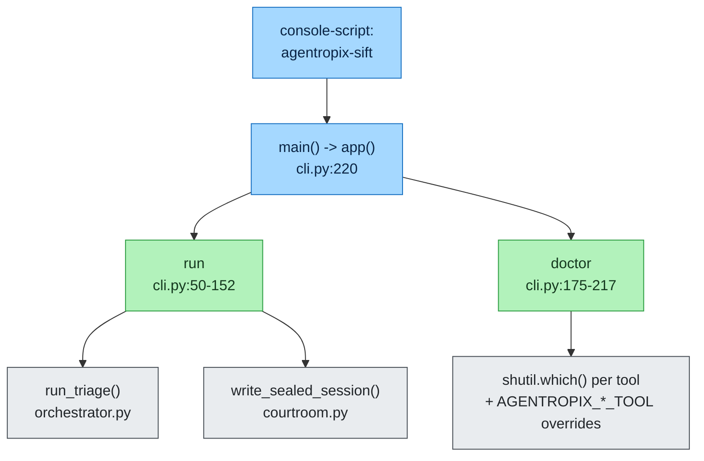
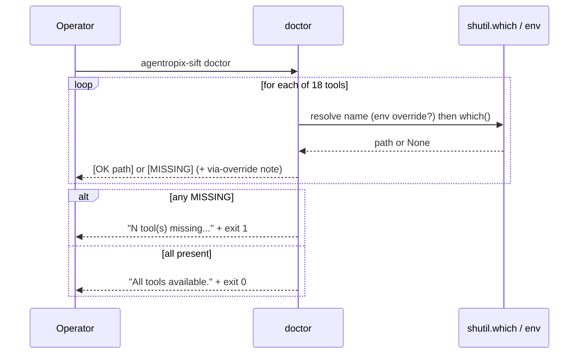

# CLI Reference

The `agentropix-sift` command-line interface is a thin [Typer](https://typer.tiangolo.com/)
application defined entirely in `src/agentropix_sift/cli.py`.
It is the operator-facing entry point to the bio-agentic DFIR triage engine: it
runs the Trinity Loop over an evidence image and verifies that the underlying
SIFT forensic tools are installed.

> **Scope note.** The CLI exposes exactly **two** commands — `run` and `doctor`.
> There is *no* `mcp server` subcommand inside this Typer app: the FastMCP server
> is launched separately (see [The MCP server entry point](#the-mcp-server-entry-point)
> below). Do not invent flags; this reference is derived line-by-line from
> `cli.py`.

> **How to read this page (two audiences).** This is an **operational** page, so every
> command below carries a side-by-side callout:
> - **🖥️ Expert (command):** the exact shell command — copy it, run it, read the raw
>   output in the `Output X` block.
> - **💬 End-user (prompt):** the plain-language question you type into a Claude session
>   that has the Agentropix MCP connected. The session recognises it as an Agentropix
>   capability and **routes it to the real MCP tool named in the callout** — you never
>   type the tool name yourself. *(Each `💬` prompt is mapped to a real tool from
>   [`tool-list.md`](../04-mcp-tools/tool-list.md).)*
>
> Command/result pairs are labelled **Execution X → Output X** so it is unambiguous what
> you **run** versus what you **get back**. Sample outputs are illustrative of a real
> run; the exact paths, counts, and hashes vary per evidence image (paths shown as
> placeholders like `/cases/SRL-2018/…`).

## Contents — what's in this page (and what to expect)

This page documents the two `agentropix-sift` CLI commands line-by-line from `cli.py`. Jump to any section:

| Section | What you'll get |
|---------|-----------------|
| [Invocation and global help](#invocation-and-global-help) | The console entry point, a call-flow diagram, and how to read `--help` for both commands (plus the connected-session `health` equivalent). |
| [`agentropix-sift run`](#agentropix-sift-run) | The primary triage command: synopsis, all arguments/options, preflight guards, the Stop-hook sentinel, sealed output artifacts, console summary, and worked Execution→Output examples. |
| [`agentropix-sift doctor`](#agentropix-sift-doctor) | The readiness check: the 18 backing binaries it probes, `AGENTROPIX_*_TOOL` overrides, exit codes, and Execution→Output examples for present/override/missing cases. |
| [The MCP server entry point](#the-mcp-server-entry-point) | Why the 71-tool FastMCP server is launched out-of-band (not a subcommand) and where to find its tool surface and request flow. |
| [Related references](#related-references) | Cross-links to the glossary, ADR index, agents list, and environment-variable reference. |

---

## Invocation and global help



The Typer app is constructed at `cli.py:44` with `name="agentropix-sift"` and the
help string *"Bio-agentic DFIR triage on SANS SIFT Workstation."* The `main()`
shim at `cli.py:220` simply calls `app()` and is the registered console
entry point. Invoke either command with `--help` to see Typer's auto-generated
usage:

> **🖥️ Expert (command):**
> ```bash
> agentropix-sift --help
> agentropix-sift run --help
> agentropix-sift doctor --help
> ```
> **💬 End-user (prompt):** *"What can the Agentropix forensic engine do, and is it ready
> to run?"*
> The session answers in plain language and, to confirm the engine is live, routes the
> question to the **`health`** MCP tool (server name + tool count + version) — the
> connected-session equivalent of probing the CLI. *(Mapped tool: `health`.)*

**Execution Z → Output Z.**

*Execution Z:*
```bash
agentropix-sift --help
```

*Output Z (Typer auto-generated usage; abridged):*
```text
 Usage: agentropix-sift [OPTIONS] COMMAND [ARGS]...

 Bio-agentic DFIR triage on SANS SIFT Workstation.

╭─ Commands ───────────────────────────────────────────────╮
│ run      Run autonomous DFIR triage on an evidence image. │
│ doctor   Check that required SIFT tools are available.    │
╰──────────────────────────────────────────────────────────╯
```
Exit code: `0` (help is always a clean exit).

---

## `agentropix-sift run`

Run autonomous DFIR triage on an evidence image. This is the primary command: it
drives the full **Trinity Loop** (Architect proposes the swarm → the 7-agent
Swarm plus the ATT&CK detectors run deterministic forensic tools → the Critic
scores findings and halts on a deterministic convergence fingerprint). See
[the agents reference](../10-agents/agents-list.md) for the loop's roles, and
[ADR-016](adr-index.md#adr-016) for the inference-constraint / sealing model.

### Synopsis

```console
agentropix-sift run IMAGE [--max-iterations N] [--out PATH] [--verbose]
```

> **🖥️ Expert (command):**
> ```bash
> agentropix-sift run /cases/SRL-2018/base-dc-cdrive.E01 -n 3 -o dc-triage.json -v
> ```
> **💬 End-user (prompt):** *"Investigate this disk image end to end — run the full triage,
> stage every finding as DRAFT, and give me the sealed report. Don't approve anything."*
> The session drives the same autonomous **Trinity Loop** over the 71 MCP tools and, when
> it finishes, hands back the sealed document by routing to the **`report_generate`** tool
> (and `case_status` for progress). A simple, focused request is enough — the session
> recognises this as the Agentropix triage capability and orchestrates the swarm for you.
> *(Mapped tools: `report_generate`, `case_status`; the loop itself consumes the full
> 71-tool surface — see [tool list](../04-mcp-tools/tool-list.md).)*
>
> *Why no single "run" MCP tool?* The CLI `run` command is an orchestrator, not a tool —
> it launches the swarm that *calls* the MCP tools. The end-user equivalent is the
> autonomous prompt above; the concrete result tool the session returns is
> `report_generate`.

### Arguments and options

Derived from `cli.py:51-56`.

| Name | Form | Type | Default | Description |
|------|------|------|---------|-------------|
| `IMAGE` | positional (required) | `Path` | — | Path to the disk/memory image file (e.g. an `.E01`). Validated to exist before the run; see [Preflight checks](#preflight-checks). |
| `--max-iterations` | `--max-iterations`, `-n` | `int` | `5` | Maximum Trinity Loop iterations (story **S-07**). Upper bound on Architect → Swarm → Critic re-plan cycles. |
| `--out` | `--out`, `-o` | `Path` | `report.json` | Output report path. The sealed report, audit log, and session key are derived from this stem (see [Output artifacts](#output-artifacts)). |
| `--verbose` | `--verbose`, `-v` | `bool` flag | `False` | Emit detailed output: enables `logging.basicConfig(level=INFO)` and prints the loaded config keys (`cli.py:76-77,87-88`). |

### Preflight checks

`run` performs two guards before any forensic tool opens a file descriptor:

1. **Image existence** (`cli.py:58-60`). If `IMAGE` does not exist, the command
   prints `Error: image not found: <path>` to stderr and exits with code `1`.
2. **Dangling-symlink rejection** (`cli.py:62-74`, weakness **W-164**). When the
   repo-only helper `scripts/preflight_evidence_symlink.py` is importable
   (loaded dynamically via `_load_preflight_validator()`, `cli.py:19-41`), the
   evidence fixture is validated. A *broken* evidence symlink would otherwise let
   the timeline pass while every per-finding tool gets Thymus-rejected, silently
   collapsing recall. On failure Typer raises a `BadParameter` carrying a repair
   hint, for example:

   ```
   <error>. Repair hint: ln -sfn /cases/SRL-2018/base-dc-cdrive.E01 <image>
   ```

   If the helper cannot be located (it ships outside the wheel, in `scripts/`),
   the preflight is skipped gracefully rather than blocking the run.

### Stop-hook sentinel

Before the triage starts, `run` writes a sentinel describing the active triage to
`$CLAUDE_PROJECT_DIR/.claude/active-triage.json` (falling back to the current
working directory), recording the image path, the required completion promises,
and the start time (`cli.py:92-114`, weakness **W-081** / milestone **M8.3**).
The five required promises are:

| Promise token |
|---------------|
| `TIMELINE_GENERATED` |
| `MEMORY_TRIAGED` |
| `ARTIFACTS_PARSED` |
| `FILESYSTEM_WALKED` |
| `CROSS_AGENT_CORRELATION_DONE` |

The sentinel lets a Claude-Code Stop hook detect an in-flight triage and block a
premature session exit. It is **always** removed afterward — on clean finish and
on exception (`cli.py:118-124`) — so an error-recovery session is never blocked.

### Output artifacts

After `run_triage()` returns, the report is sealed via
`write_sealed_session()` from `courtroom.py`
(`cli.py:126-142`; **M8.2a**, [ADR-016](adr-index.md#adr-016) + [ADR-022](adr-index.md#adr-022) —
read the full decisions in [Section 11: ADR-016](../11-ADR/ADR-016-courtroom-audit.md),
[ADR-022](../11-ADR/ADR-022-audit-log-seal.md)).
This generates a single 32-byte per-run session key, optionally drains the
Thymus on-disk audit log (when `AGENTROPIX_AUDIT_LOG` is set), seals that log,
cross-binds the audit seal into the report, and finally seals the report under
`report_seal`. Three files land on disk, derived from the `--out` stem:

| Artifact | Path (relative to `--out` stem) | Notes |
|----------|----------------------------------|-------|
| Sealed report | `<out>` (e.g. `report.json`) | HMAC-SHA256-sealed final document. |
| Sealed audit log | `<stem>.audit-log.json` | The drained Thymus access trail, independently sealed. |
| Session key | `<stem>` session-key file | Written **mode 0600** (per-run key). |

### Console output

On completion `run` prints a summary (`cli.py:144-152`):

```
Findings: <count>
Tool calls: <count>
Status: <status>
Report written to <path>
Audit log (sealed) at <path> (<n> entries)
Session key (mode 0600) at <path>
Evidence SHA-256: <sha>          # only if report.evidence_image_sha256 is set
Inference constraint: high (LLM is orchestrator; facts from MCP tools)
```

The fixed `Inference constraint: high` line is the operator-visible assertion
that the LLM only *orchestrates* while deterministic MCP tools generate the
facts — the core [ADR-016](adr-index.md#adr-016) "Courtroom" guarantee.

### Examples (Execution → Output)

Each example is a command/result pair. Paths are placeholders — substitute your own
evidence image and output stem.

**Execution A → Output A** (minimal run over a SANS SRL-2018 disk image).

*Execution A:*
```bash
agentropix-sift run /cases/SRL-2018/base-dc-cdrive.E01
```

*Output A (illustrative; counts/hashes vary per image):*
```text
Agentropix-SIFT triage: /cases/SRL-2018/base-dc-cdrive.E01
  max-iterations: 5
  output: report.json

Findings: 7
Tool calls: 41
Status: converged
Report written to report.json
Audit log (sealed) at report.audit-log.json (0 entries)
Session key (mode 0600) at report.session-key
Inference constraint: high (LLM is orchestrator; facts from MCP tools)
```
Exit code: `0` on a completed run. (The `Evidence SHA-256:` line appears only when
`report.evidence_image_sha256` is set; the `Audit log … (0 entries)` count is non-zero
only when `AGENTROPIX_AUDIT_LOG` points at a populated trail — see Execution C.)

**Execution B → Output B** (cap the loop at 3 iterations, named report, config + INFO logs).

*Execution B:*
```bash
agentropix-sift run /cases/SRL-2018/base-dc-cdrive.E01 -n 3 -o dc-triage.json -v
```

*Output B (the `-v` flag adds the echoed `max-iterations`/`output`/`config keys` preamble
and turns on INFO logging from the orchestrator and swarm; the closing summary block is as
in Output A but with `Report written to dc-triage.json`).* Exit code: `0`.

**Execution C → Output C** (seal the Thymus audit trail alongside the report).

*Execution C:*
```bash
AGENTROPIX_AUDIT_LOG=/tmp/agentropix-audit.jsonl \
  agentropix-sift run /cases/SRL-2018/base-dc-cdrive.E01 -o dc-triage.json
```

*Output C:* identical summary to Output A, except the audit line now reports the drained,
independently sealed Thymus access trail — e.g. `Audit log (sealed) at dc-triage.audit-log.json (128 entries)`.
Exit code: `0`.

> ⚠️ **GOTCHA (preflight exits).** If `IMAGE` does not exist the command prints
> `Error: image not found: <path>` to **stderr** and exits `1` *before* any tool runs. A
> dangling evidence symlink is rejected by Typer with a `BadParameter` carrying a
> `Repair hint: ln -sfn …` line (also a non-zero exit) — see [Preflight checks](#preflight-checks).
> Neither failure writes a report or a session key.

---

## `agentropix-sift doctor`

Check that the required SIFT forensic tools are available on `PATH` (or via their
`AGENTROPIX_*_TOOL` env-var override). Run this first on any new SIFT
Workstation before attempting `run`. Defined at `cli.py:175-217`.

### Synopsis

```console
agentropix-sift doctor
```

`doctor` takes no arguments and no options.

> **🖥️ Expert (command):**
> ```bash
> agentropix-sift doctor
> ```
> **💬 End-user (prompt):** *"Check that my Agentropix forensic environment is ready — are
> all the forensic tools installed?"*
> The session runs the same readiness check and reports in plain language whether everything
> is present or what is missing. In a connected session this is surfaced via the
> **`health`** MCP tool (it returns the live tool count and server status — the connected
> equivalent of the binary pre-flight). *(Mapped tool: `health`.)*

### What it checks

`doctor` iterates a fixed dictionary of **18** binaries that back the project's
**16** forensic SIFT wrappers (`cli.py:178-197`). For each, it resolves the name —
honouring the `AGENTROPIX_*_TOOL` override map at `cli.py:160-172` — then calls
`shutil.which()` and prints one line per binary in the exact form
`  [OK  <path>] <description> (<cmd>)` or `  [MISSING] <description> (<cmd>)`
(`cli.py:204-208`). When a binary was resolved through an env-var override, the line
gains a `[via <ENV_VAR>=<resolved>]` suffix.

| Binary (`doctor` key) | Description | Env-var override (`_DOCTOR_ENV_OVERRIDES`) |
|-----------------------|-------------|--------------------------------------------|
| `vol` | Volatility3 (memory forensics) | — |
| `log2timeline.py` | Plaso (timeline) | — |
| `fls` | Sleuth Kit (filesystem) | — |
| `icat` | Sleuth Kit (file extraction) | `AGENTROPIX_ICAT_TOOL` |
| `mmls` | Sleuth Kit (partitions) | — |
| `ewfinfo` | ewftools (E01 image metadata) | — |
| `evtx_dump.py` | python-evtx (Windows Event Log parser) | `AGENTROPIX_EVTX_TOOL` |
| `yara` | YARA (pattern matching) | `AGENTROPIX_YARA_TOOL` |
| `bulk_extractor` | bulk_extractor | `AGENTROPIX_BE_TOOL` |
| `rip.pl` | RegRipper (registry hives) | — |
| `pf` | Prefetch parser (execution evidence) | `AGENTROPIX_PREFETCH_TOOL` |
| `amcache_parser` | Amcache.hve parser (execution evidence) | `AGENTROPIX_AMCACHE_TOOL` |
| `shimcache_parser` | Shimcache parser (AppCompatCache) | `AGENTROPIX_SHIMCACHE_TOOL` |
| `ssdeep` | ssdeep (fuzzy hashing) | — |
| `exiftool` | ExifTool (metadata) | `AGENTROPIX_EXIFTOOL_TOOL` |
| `foremost` | Foremost (carving) | `AGENTROPIX_FOREMOST_TOOL` |
| `hashdeep` | hashdeep (hashing) | `AGENTROPIX_HASHDEEP_TOOL` |
| `strings` | GNU strings (printable-sequence extraction) | `AGENTROPIX_STRINGS_TOOL` |

The override map lets an operator point `doctor` (and the wrapper) at a
SIFT-installed alternative *without* creating `/usr/local/bin` symlinks. Each
override is kept in sync with the corresponding wrapper's `_resolve_tool()` by a
drift-guard test (`cli.py:155-159`). When a binary is resolved via an override,
the line is annotated `[via <ENV_VAR>=<resolved>]` (`cli.py:207`).

### Exit codes and output



> 🔍 **[Open as SVG — full size, zoomable](assets/cli-reference-2.svg)** (renders larger than the page column; the SVG zooms losslessly in a browser tab).

If one or more tools are missing, `doctor` prints a remediation line —
*"`<n>` tool(s) missing. Install, or set the corresponding `AGENTROPIX_*_TOOL`
env var to a working binary."* — and exits `1` (`cli.py:210-215`). If everything
resolves, it prints `All tools available.` and exits `0` (`cli.py:216-217`).

### Examples (Execution → Output)

**Execution D → Output D** (verify the workstation before a run).

*Execution D:*
```bash
agentropix-sift doctor
```

*Output D (all present; one `[OK …]` line per binary, abridged):*
```text
  [OK  /usr/bin/vol] Volatility3 (memory forensics) (vol)
  [OK  /usr/bin/log2timeline.py] Plaso (timeline) (log2timeline.py)
  [OK  /usr/bin/fls] Sleuth Kit (filesystem) (fls)
  [OK  /usr/bin/mmls] Sleuth Kit (partitions) (mmls)
  [OK  /usr/bin/ewfinfo] ewftools (E01 image metadata) (ewfinfo)
  ... (13 more lines) ...

All tools available.
```
Exit code: `0` when every binary resolves.

> **Note on the line count.** `doctor` prints one line per **binary** (18 lines on a stock
> SIFT box — the 16 forensic wrappers' backing binaries plus `icat` and `strings`, which
> `doctor` also pre-flights). The prose figure **"16 forensic SIFT wrappers"** counts the
> wrapper layer, not the resolved-binary lines; both are correct. The signal you act on is
> the closing `All tools available.` (exit `0`) versus the `<n> tool(s) missing.` line
> (exit `1`).

**Execution E → Output E** (point `doctor` at a non-default YARA build, then re-check).

*Execution E:*
```bash
AGENTROPIX_YARA_TOOL=/opt/yara/4.5/bin/yara agentropix-sift doctor
```

*Output E (the YARA line is now annotated with the resolved override; other lines as in
Output D):*
```text
  [OK  /opt/yara/4.5/bin/yara] YARA (pattern matching) (yara) [via AGENTROPIX_YARA_TOOL=/opt/yara/4.5/bin/yara]
```
Exit code: `0` (assuming the override path resolves and all other binaries are present).

**Execution F → Output F** (a missing binary — the failure path).

*Execution F:* run `doctor` on a host where (for example) `bulk_extractor` is not installed.

*Output F:*
```text
  [MISSING] bulk_extractor (bulk_extractor)
  ... (other lines) ...

1 tool(s) missing. Install, or set the corresponding AGENTROPIX_*_TOOL env var to a working binary.
```
Exit code: `1` whenever one or more binaries are missing (`cli.py:210-215`). A `MISSING`
tool degrades gracefully at run time (the relevant agent self-skips) but lowers recall —
resolve it, or set the binary's `AGENTROPIX_*_TOOL` override, before a real run.

---

## The MCP server entry point

The 71-tool FastMCP server is **not** a subcommand of this Typer app. It is a
single FastMCP application (`mcp_server/fastmcp_app.py`) launched out-of-band —
in the verified host configuration via the repo's `scripts/start-mcp.sh`
launcher (referenced throughout the weakness ledger; e.g.
`scripts/start-mcp.sh background`). Tailnet-only HTTP exposure of that server is
the subject of [ADR-017](adr-index.md#adr-017)
([full decision in Section 11](../11-ADR/ADR-017-tailnet-mcp-exposure.md)). For the full tool surface see the
[tool list reference](../04-mcp-tools/tool-list.md); for request flow see
`docs/MCP-REQUEST-FLOW.md` upstream.

> The MCP tool count is **71** distinct tool functions (cite
> [`canonical-facts.md`](canonical-facts.md) / `CANONICAL_FACTS.md`). The `run` command
> consumes those tools indirectly through the swarm agents; it does not register
> or list them itself.

---

## Related references

- [Glossary](glossary.md) — personas, weakness-ledger IDs, story IDs, key terms.
- [ADR Index](adr-index.md) — the architectural decisions cited above.
- [Section 11 — ADRs (in-portal copies)](../11-ADR/README.md) — full text of the ADRs cited above: [ADR-016](../11-ADR/ADR-016-courtroom-audit.md) / [ADR-022](../11-ADR/ADR-022-audit-log-seal.md) (sealing) and [ADR-017](../11-ADR/ADR-017-tailnet-mcp-exposure.md) (tailnet MCP exposure).
- [Agents list](../10-agents/agents-list.md) — Trinity roles and the swarm agents the `run` loop drives.
- [Environment variables](../07-sdlc-ops/env-vars.md) — full `AGENTROPIX_*` namespace, including the `*_TOOL` overrides and `AGENTROPIX_AUDIT_LOG`.
- [Canonical facts](canonical-facts.md) — the numeric source of truth for the 71-tool surface and test counts cited above.
