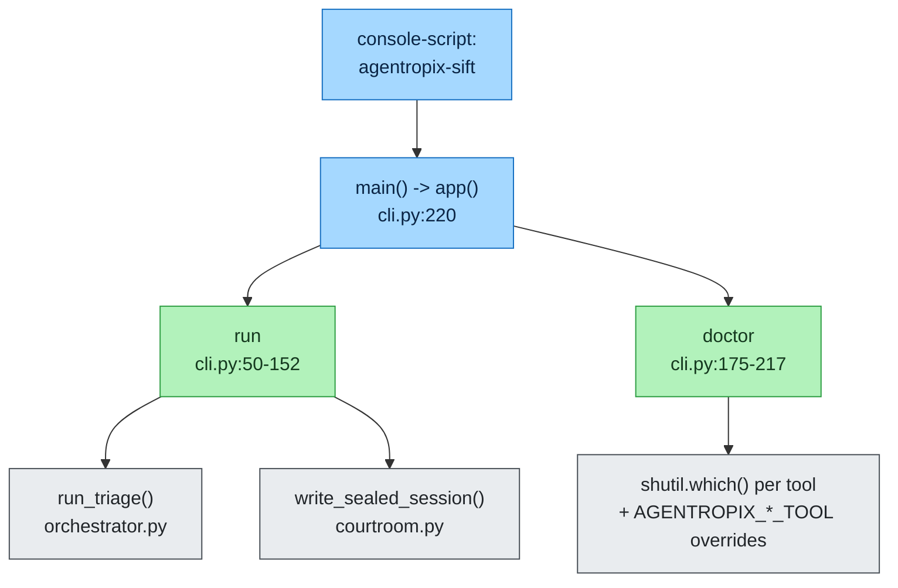
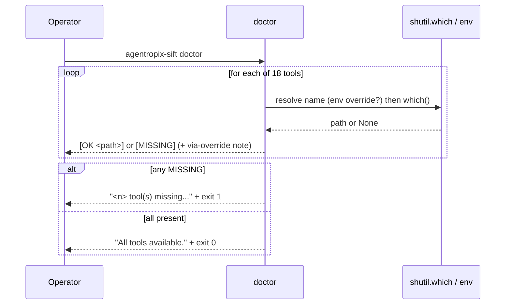

# CLI Reference

The `agentropix-sift` command-line interface is a thin [Typer](https://typer.tiangolo.com/)
application defined entirely in [`src/agentropix_sift/cli.py`](../../../agentropix-sift/src/agentropix_sift/cli.py).
It is the operator-facing entry point to the bio-agentic DFIR triage engine: it
runs the Trinity Loop over an evidence image and verifies that the underlying
SIFT forensic tools are installed.

> **Scope note.** The CLI exposes exactly **two** commands — `run` and `doctor`.
> There is *no* `mcp server` subcommand inside this Typer app: the FastMCP server
> is launched separately (see [The MCP server entry point](#the-mcp-server-entry-point)
> below). Do not invent flags; this reference is derived line-by-line from
> `cli.py`.

## Invocation and global help



The Typer app is constructed at `cli.py:44` with `name="agentropix-sift"` and the
help string *"Bio-agentic DFIR triage on SANS SIFT Workstation."* The `main()`
shim at `cli.py:220` simply calls `app()` and is the registered console
entry point. Invoke either command with `--help` to see Typer's auto-generated
usage:

```console
$ agentropix-sift --help
$ agentropix-sift run --help
$ agentropix-sift doctor --help
```

---

## `agentropix-sift run`

Run autonomous DFIR triage on an evidence image. This is the primary command: it
drives the full **Trinity Loop** (Architect proposes the swarm → the 7-agent
Swarm plus the ATT&CK detectors run deterministic forensic tools → the Critic
scores findings and halts on a deterministic convergence fingerprint). See
[the agents reference](../../.crew/agents-list.md) for the loop's roles, and
[ADR-016](adr-index.md#adr-016) for the inference-constraint / sealing model.

### Synopsis

```console
agentropix-sift run IMAGE [--max-iterations N] [--out PATH] [--verbose]
```

### Arguments and options

Derived from `cli.py:51-56`.

| Name | Form | Type | Default | Description |
|------|------|------|---------|-------------|
| `IMAGE` | positional (required) | `Path` | — | Path to the disk/memory image file (e.g. an `.E01`). Validated to exist before the run; see [Preflight checks](#preflight-checks). |
| `--max-iterations` | `--max-iterations`, `-n` | `int` | `5` | Maximum Trinity Loop iterations (story **S-07**). Upper bound on Architect → Swarm → Critic re-plan cycles. |
| `--out` | `--out`, `-o` | `Path` | `report.json` | Output report path. The sealed report, audit log, and session key are derived from this stem (see [Output artifacts](#output-artifacts)). |
| `--verbose` | `--verbose`, `-v` | `bool` flag | `False` | Emit detailed output: enables `logging.basicConfig(level=INFO)` and prints the loaded config keys (`cli.py:76-77,87-88`). |

### Preflight checks

`run` performs two guards before any forensic tool opens a file descriptor:

1. **Image existence** (`cli.py:58-60`). If `IMAGE` does not exist, the command
   prints `Error: image not found: <path>` to stderr and exits with code `1`.
2. **Dangling-symlink rejection** (`cli.py:62-74`, weakness **W-164**). When the
   repo-only helper `scripts/preflight_evidence_symlink.py` is importable
   (loaded dynamically via `_load_preflight_validator()`, `cli.py:19-41`), the
   evidence fixture is validated. A *broken* evidence symlink would otherwise let
   the timeline pass while every per-finding tool gets Thymus-rejected, silently
   collapsing recall. On failure Typer raises a `BadParameter` carrying a repair
   hint, for example:

   ```
   <error>. Repair hint: ln -sfn /cases/SRL-2018/base-dc-cdrive.E01 <image>
   ```

   If the helper cannot be located (it ships outside the wheel, in `scripts/`),
   the preflight is skipped gracefully rather than blocking the run.

### Stop-hook sentinel

Before the triage starts, `run` writes a sentinel describing the active triage to
`$CLAUDE_PROJECT_DIR/.claude/active-triage.json` (falling back to the current
working directory), recording the image path, the required completion promises,
and the start time (`cli.py:92-114`, weakness **W-081** / milestone **M8.3**).
The five required promises are:

| Promise token |
|---------------|
| `TIMELINE_GENERATED` |
| `MEMORY_TRIAGED` |
| `ARTIFACTS_PARSED` |
| `FILESYSTEM_WALKED` |
| `CROSS_AGENT_CORRELATION_DONE` |

The sentinel lets a Claude-Code Stop hook detect an in-flight triage and block a
premature session exit. It is **always** removed afterward — on clean finish and
on exception (`cli.py:118-124`) — so an error-recovery session is never blocked.

### Output artifacts

After `run_triage()` returns, the report is sealed via
`write_sealed_session()` from [`courtroom.py`](../../../agentropix-sift/src/agentropix_sift/courtroom.py)
(`cli.py:126-142`; **M8.2a**, [ADR-016](adr-index.md#adr-016) + [ADR-022](adr-index.md#adr-022)).
This generates a single 32-byte per-run session key, optionally drains the
Thymus on-disk audit log (when `AGENTROPIX_AUDIT_LOG` is set), seals that log,
cross-binds the audit seal into the report, and finally seals the report under
`report_seal`. Three files land on disk, derived from the `--out` stem:

| Artifact | Path (relative to `--out` stem) | Notes |
|----------|----------------------------------|-------|
| Sealed report | `<out>` (e.g. `report.json`) | HMAC-SHA256-sealed final document. |
| Sealed audit log | `<stem>.audit-log.json` | The drained Thymus access trail, independently sealed. |
| Session key | `<stem>` session-key file | Written **mode 0600** (per-run key). |

### Console output

On completion `run` prints a summary (`cli.py:144-152`):

```
Findings: <count>
Tool calls: <count>
Status: <status>
Report written to <path>
Audit log (sealed) at <path> (<n> entries)
Session key (mode 0600) at <path>
Evidence SHA-256: <sha>          # only if report.evidence_image_sha256 is set
Inference constraint: high (LLM is orchestrator; facts from MCP tools)
```

The fixed `Inference constraint: high` line is the operator-visible assertion
that the LLM only *orchestrates* while deterministic MCP tools generate the
facts — the core [ADR-016](adr-index.md#adr-016) "Courtroom" guarantee.

### Examples

```console
# Minimal run over a SANS SRL-2018 disk image
agentropix-sift run /cases/SRL-2018/base-dc-cdrive.E01

# Cap the loop at 3 iterations, write to a named report, show config + INFO logs
agentropix-sift run /cases/SRL-2018/base-dc-cdrive.E01 -n 3 -o dc-triage.json -v

# Seal the Thymus audit trail alongside the report
AGENTROPIX_AUDIT_LOG=/tmp/agentropix-audit.jsonl \
  agentropix-sift run /cases/SRL-2018/base-dc-cdrive.E01 -o dc-triage.json
```

---

## `agentropix-sift doctor`

Check that the required SIFT forensic tools are available on `PATH` (or via their
`AGENTROPIX_*_TOOL` env-var override). Run this first on any new SIFT
Workstation before attempting `run`. Defined at `cli.py:175-217`.

### Synopsis

```console
agentropix-sift doctor
```

`doctor` takes no arguments and no options.

### What it checks

`doctor` iterates a fixed dictionary of **18** binaries that back the project's
**16** forensic SIFT wrappers (`cli.py:178-197`). For each, it resolves the name —
honouring the `AGENTROPIX_*_TOOL` override map at `cli.py:160-172` — then calls
`shutil.which()` and prints `OK <path>` or `MISSING`.

| Binary (`doctor` key) | Description | Env-var override (`_DOCTOR_ENV_OVERRIDES`) |
|-----------------------|-------------|--------------------------------------------|
| `vol` | Volatility3 (memory forensics) | — |
| `log2timeline.py` | Plaso (timeline) | — |
| `fls` | Sleuth Kit (filesystem) | — |
| `icat` | Sleuth Kit (file extraction) | `AGENTROPIX_ICAT_TOOL` |
| `mmls` | Sleuth Kit (partitions) | — |
| `ewfinfo` | ewftools (E01 image metadata) | — |
| `evtx_dump.py` | python-evtx (Windows Event Log parser) | `AGENTROPIX_EVTX_TOOL` |
| `yara` | YARA (pattern matching) | `AGENTROPIX_YARA_TOOL` |
| `bulk_extractor` | bulk_extractor | `AGENTROPIX_BE_TOOL` |
| `rip.pl` | RegRipper (registry hives) | — |
| `pf` | Prefetch parser (execution evidence) | `AGENTROPIX_PREFETCH_TOOL` |
| `amcache_parser` | Amcache.hve parser (execution evidence) | `AGENTROPIX_AMCACHE_TOOL` |
| `shimcache_parser` | Shimcache parser (AppCompatCache) | `AGENTROPIX_SHIMCACHE_TOOL` |
| `ssdeep` | ssdeep (fuzzy hashing) | — |
| `exiftool` | ExifTool (metadata) | `AGENTROPIX_EXIFTOOL_TOOL` |
| `foremost` | Foremost (carving) | `AGENTROPIX_FOREMOST_TOOL` |
| `hashdeep` | hashdeep (hashing) | `AGENTROPIX_HASHDEEP_TOOL` |
| `strings` | GNU strings (printable-sequence extraction) | `AGENTROPIX_STRINGS_TOOL` |

The override map lets an operator point `doctor` (and the wrapper) at a
SIFT-installed alternative *without* creating `/usr/local/bin` symlinks. Each
override is kept in sync with the corresponding wrapper's `_resolve_tool()` by a
drift-guard test (`cli.py:155-159`). When a binary is resolved via an override,
the line is annotated `[via <ENV_VAR>=<resolved>]` (`cli.py:207`).

### Exit codes and output



If one or more tools are missing, `doctor` prints a remediation line —
*"`<n>` tool(s) missing. Install, or set the corresponding `AGENTROPIX_*_TOOL`
env var to a working binary."* — and exits `1` (`cli.py:210-215`). If everything
resolves, it prints `All tools available.` and exits `0` (`cli.py:216-217`).

### Examples

```console
# Verify the workstation before a run
agentropix-sift doctor

# Point doctor at a non-default YARA build, then re-check
AGENTROPIX_YARA_TOOL=/opt/yara/4.5/bin/yara agentropix-sift doctor
```

---

## The MCP server entry point

The 71-tool FastMCP server is **not** a subcommand of this Typer app. It is a
single FastMCP application (`mcp_server/fastmcp_app.py`) launched out-of-band —
in the verified host configuration via the repo's `scripts/start-mcp.sh`
launcher (referenced throughout the weakness ledger; e.g.
`scripts/start-mcp.sh background`). Tailnet-only HTTP exposure of that server is
the subject of [ADR-017](adr-index.md#adr-017). For the full tool surface see the
[tool list reference](../../.crew/tool-list.md); for request flow see
`docs/MCP-REQUEST-FLOW.md` upstream.

> The MCP tool count is **71** distinct tool functions (cite
> [`.crew/facts.md`](../../.crew/facts.md) / `CANONICAL_FACTS.md`). The `run` command
> consumes those tools indirectly through the swarm agents; it does not register
> or list them itself.

---

## Related references

- [Glossary](glossary.md) — personas, weakness-ledger IDs, story IDs, key terms.
- [ADR Index](adr-index.md) — the architectural decisions cited above.
- [Agents list](../../.crew/agents-list.md) — Trinity roles and the swarm agents the `run` loop drives.
- [Environment variables](../../.crew/env-vars.md) — full `AGENTROPIX_*` namespace, including the `*_TOOL` overrides and `AGENTROPIX_AUDIT_LOG`.
