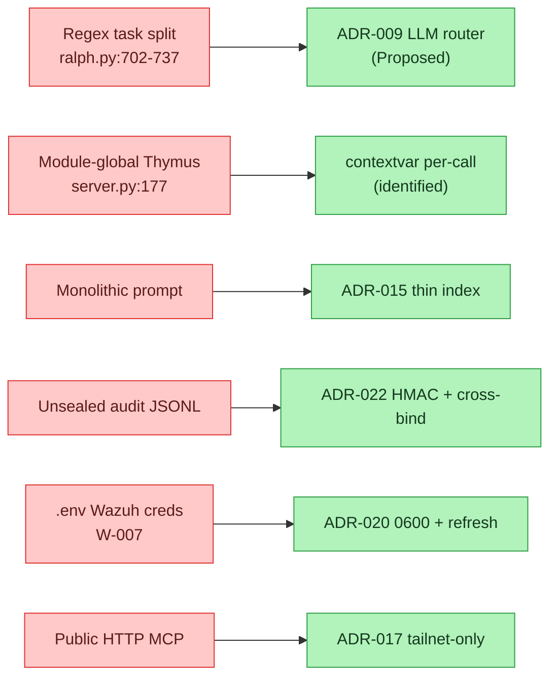
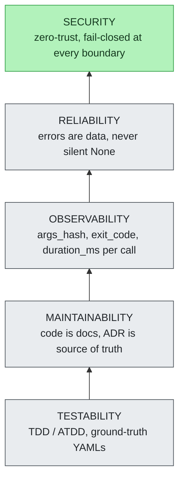

# Design Decisions — Rationale & History

> **Section 08 · Reference** — the design-history layer behind the ADRs.
> Related: [ADR Index](adr-index.md) · [Section 11 — ADRs (full text)](../11-ADR/README.md) · [Glossary](glossary.md) · [CLI Reference](cli-reference.md) · [Anti-Hallucination](../05-safety-forensics/anti-hallucination.md) · [Human-in-the-Loop](../05-safety-forensics/human-in-the-loop.md)

> **Reading the ADRs in full.** Every ADR cited below links to the oracle
> (`../../../agentropix-sift/docs/adr/`) — the source of truth. The same decisions
> are also mirrored inside this portal under [Section 11 — ADRs](../11-ADR/README.md),
> where you can read the complete *genesis / why-implemented / why-denied* record
> (e.g. [ADR-016](../11-ADR/ADR-016-courtroom-audit.md),
> [ADR-022](../11-ADR/ADR-022-audit-log-seal.md),
> [ADR-014](../11-ADR/ADR-014-W072-impacket-secretsdump.md)) without leaving the docs.

An **Architecture Decision Record (ADR)** captures one architectural decision
with its context, the options weighed, and the consequences accepted; once
accepted an ADR is immutable, and a changed decision is *superseded* by a new ADR
rather than edited. The [ADR Index](adr-index.md) **routes** every ADR under
[`docs/adr/`](../../../agentropix-sift/docs/adr/) — title, live status, one-line
summary. This page is the complementary **rationale layer**: the recurring design
principles the ADRs share, the hard trade-offs where a real cost was accepted on
purpose, the approaches that were tried and discarded (with file-and-line
post-mortems), and the quality bar the codebase enforces. For the ADR-001..024
table itself, use the index — this page does **not** duplicate it, and every
status verdict here is kept in lock-step with the index's live status audit.

> **How to read this page.** Sections 1–3 are the *why* behind the ADRs
> (principles, trade-offs, dead ends); sections 4–6 are the *quality bar* and a
> reading guide. Nothing here is operational — there are no commands to run, so
> there are no operator prompt-boxes; treat it as the design-history companion to
> the [ADR Index](adr-index.md). Bio-agentic terms (**Thymus**, **Critic**,
> **Architect**, **Trinity Loop**, **Blackboard**) are defined in the
> [Glossary](glossary.md) and re-explained inline at first use below.

> **Sourcing.** Numeric claims follow [`canonical-facts.md`](canonical-facts.md)
> (CANONICAL_FACTS). Where the upstream design narrative quoted older figures
> (e.g. "46 tools / 11 agents / 2807 tests") this page uses the canonical
> values — **71 MCP tools, 16 SIFT forensic tools, 4464 tests, 72/72 disk
> recall, 108/118 memory recall, Python 3.12+** — and notes the reconciliation.
> Every ADR reference below was checked against `docs/adr/`; two **status
> conflicts** with the upstream narrative were resolved in favour of the oracle
> and are flagged inline.

---

## Contents — what's in this page (and what to expect)

> Jump to any section below. Each row tells you what that part gives you, so you can go straight to your point.

| Section | What you'll get |
|---|---|
| [1. Five recurring design principles](#1-five-recurring-design-principles) | The five design principles the ADRs share — fail-closed, structural invariants, deterministic control, evidence-readonly, thin index — each mapped to the ADRs that instantiate it and how it's enforced. |
| [2. Four documented hard trade-offs](#2-four-documented-hard-trade-offs) | The four places a real cost was accepted on purpose (credential recall, Blackboard growth, SANS-deadline scope, session-key friction), each tied to its ADR and tuning surface. |
| [3. Six tried-and-discarded approaches](#3-six-tried-and-discarded-approaches) | Six approaches attempted, proven bad, and replaced — with file-and-line post-mortems and the ADR that superseded each. |
| [4. The quality pyramid](#4-the-quality-pyramid) | The bottom-up quality stack (testability→security) plus the enforced structural metrics (function length, complexity, coverage, type errors). |
| [5. Why ADR-016 is the most interesting ADR](#5-why-adr-016-is-the-most-interesting-adr) | Why the Courtroom Audit ADR is the one to read first — its concrete chain-of-custody invariants and how it cascaded into ADR-022. |
| [6. One-paragraph summary](#6-one-paragraph-summary) | The whole design philosophy distilled into a single quotable paragraph. |
| [Related references](#related-references) | Jump-off links to the ADR Index, Glossary, anti-hallucination, human-in-the-loop, and canonical facts. |

---

## 1. Five recurring design principles

Across the ADRs, five principles repeat often enough to constitute the project's
design philosophy. None is a slogan; each is enforced in code or schema.

| # | Principle | ADRs that instantiate it | Enforcement |
|---|-----------|--------------------------|-------------|
| 1 | **Fail closed, not fail open** | [008](../../../agentropix-sift/docs/adr/ADR-008-safety-architecture.md), [016](../../../agentropix-sift/docs/adr/ADR-016-courtroom-audit.md), [018](../../../agentropix-sift/docs/adr/ADR-018-wazuh-ioc-push.md), [019](../../../agentropix-sift/docs/adr/ADR-019-ar-confirmation-gate.md) | Security ops default to REJECT on doubt; the Thymus read-policy rejects ambiguous paths (broken symlink, unresolvable canonical, missing allowlist entry). |
| 2 | **Structural invariants over policy-by-convention** | [002](../../../agentropix-sift/docs/adr/ADR-002-execution-engine.md), [008](../../../agentropix-sift/docs/adr/ADR-008-safety-architecture.md), [012](../../../agentropix-sift/docs/adr/ADR-012-extract-files.md), [016](../../../agentropix-sift/docs/adr/ADR-016-courtroom-audit.md) | The architecture forces correct behaviour rather than recommending it: there is no write tool to call, and the evidence SHA-256 is baked into the report schema, not optional. |
| 3 | **Deterministic control points over LLM-driven loops** | [002](../../../agentropix-sift/docs/adr/ADR-002-execution-engine.md), [008](../../../agentropix-sift/docs/adr/ADR-008-safety-architecture.md), [009](../../../agentropix-sift/docs/adr/ADR-009-task-router.md) | Halt detection (the *Critic fingerprint* — a computed score over the findings, not the LLM rating itself), task routing, and safety constraints are computational; operators tune via `AGENTROPIX_*` env vars, not prompt heuristics. |
| 4 | **Evidence-readonly is non-negotiable** | [002](../../../agentropix-sift/docs/adr/ADR-002-execution-engine.md), [011](../../../agentropix-sift/docs/adr/ADR-011-evidence-gates.md), [012](../../../agentropix-sift/docs/adr/ADR-012-extract-files.md), [016](../../../agentropix-sift/docs/adr/ADR-016-courtroom-audit.md), [017](../../../agentropix-sift/docs/adr/ADR-017-tailnet-mcp-exposure.md), [020](../../../agentropix-sift/docs/adr/ADR-020-credential-lifecycle.md) | Extract writes to a session tmpdir, never to evidence; secrets never enter git; the read-only invariant threads through every MCP wrapper. |
| 5 | **Thin index + load-on-demand context** | [015](../../../agentropix-sift/docs/adr/ADR-015-context-engineering.md), [006](../../../agentropix-sift/docs/adr/ADR-006-memory-system.md), [023](../../../agentropix-sift/docs/adr/ADR-023-pilot-feedback-pipeline.md) | Session starts with a thin `CLAUDE.md` index; skills, domains, and memories load only when triggered, preserving cache hit-rate and bounding cost-per-token. |

The unifying stance: *the LLM proposes; deterministic Python disposes.* Convention
depends on operator discipline; structural invariants do not.

---

## 2. Four documented hard trade-offs

Each of these is a place where a real downside was accepted to gain a larger
benefit — and documented as such, not papered over.

### Trade-off 1 — Credential-dump recall vs Volatility upstream stability (ADR-014)

[ADR-014](../../../agentropix-sift/docs/adr/ADR-014-W072-impacket-secretsdump.md)
keeps Volatility 3 pinned at `>=2.27.0` even though that release **removed** the
`hashdump` / `lsadump` / `cachedump` plugins. Downgrading to `<=2.5.0` would have
restored in-memory credential dumping but would lose the `-r csv` renderer that
downstream wrappers depend on, lose newer Windows 10/11 + Server 2022 symbols,
and forfeit two years of security fixes. The accepted downside: no in-memory
credential dumps until M7+; credentials are instead extracted **post-M7** with
`impacket-secretsdump.py LOCAL` against hives carved offline. The ADR states the
cost is acceptable because *"the SANS submission deadline (2026-06-10) is
recall-driven, not credential-driven."* Weakness **W-072** is **DEFERRED** via
this ADR (`docs/SIFT-WEAKNESSES.md`).

### Trade-off 2 — Multi-iteration accuracy vs Blackboard growth (W-029 / W-040)

The multi-iteration **Trinity Loop** (the Architect→Swarm→Critic cycle that
re-runs until the Critic halts) is the project's single most impactful
capability, but iterating against real disks grows the **Blackboard** — the
shared, append-only store of findings the agents write to — iteration over
iteration. The loop was deliberately enabled anyway:
**W-029 RESOLVED** (Trinity Loop wired and functional) and **W-040 RESOLVED**
(`docs/SIFT-WEAKNESSES.md`). W-040's documented root cause was Critic-score
saturation — `ArtifactAgent` always emitted a chain-of-custody finding at
`confidence=1.0`, so `score = min(1.0, max_conf + 0.25·len(correlations))`
saturated at `1.0 ≥ halt_threshold=0.85` and Trinity halted after exactly one
iteration on any E01 (an `.E01` is an EnCase Expert Witness forensic disk image
— the read-only evidence format the wrappers operate on). The fix lowered the
chain-of-custody confidence to `0.5`
via `AGENTROPIX_ARTIFACT_COC_CONFIDENCE`, so the loop survives past iteration 1.
The accepted residual cost — unbounded Blackboard growth and the Critic's
correlation re-scan becoming latency-bound at high finding counts — is a
documented review observation, with `AGENTROPIX_CRITIC_HALT_THRESHOLD` (default
**0.85**, `trinity/critic.py`) as the deterministic tuning surface.

### Trade-off 3 — Feature completeness vs SANS deadline (ADR-021)

[ADR-021](../../../agentropix-sift/docs/adr/ADR-021-two-person-rule-defer.md)
scopes the Wazuh integration to IOC push + read-only hunt and **defers** the
two-person rule, live Active Response endpoints, and dual-control machinery to a
later step — because Step-1/Step-2 do not invoke Active Response, so the
single-confirmation gate from
[ADR-019](../../../agentropix-sift/docs/adr/ADR-019-ar-confirmation-gate.md) is
sufficient at present. The accepted downside: the submission shows *triage +
hunt + push IOCs*, not full incident response. This is a formal `Deferred` ADR
with an explicit re-attempt condition, not silent scope-cutting.

> **Oracle status note.** The upstream narrative listed ADR-021 as a generic
> deferral; the live status audit (`docs/adr/_STATUS-AUDIT.md`, mirrored in the
> [ADR Index](adr-index.md)) marks it **Deferred (documented, not
> implemented)** — do not depict it as shipped.

### Trade-off 4 — Session-key security vs operational friction (ADR-022)

[ADR-022](../../../agentropix-sift/docs/adr/ADR-022-audit-log-seal.md) stores the
32-byte per-run session key at mode **`0600`** (owner read/write only). If that
file becomes world-readable, any local user can re-seal a tampered report and the
chain-of-custody guarantee collapses. The accepted friction: operators must
preserve permissions in transit (`scp -p`, `rsync -p`, or explicit `chmod 0600`),
and a first-time copy-without-`-p` mistake silently breaks defensibility. It is
documented as a hard operator requirement.

---

## 3. Six tried-and-discarded approaches

Concrete approaches that were attempted, validated as bad, and replaced. Each
carries the oracle file-and-line citation.

### 1. Regex-based task decomposition

Splitting complex tasks on conjunctions (*"and"*, *"then"*, *"also"*) into
independent subtasks — cited in
[ADR-009](../../../agentropix-sift/docs/adr/ADR-009-task-router.md) at
**`engine/ralph.py:702-737`**. It failed because regex cannot detect semantic
dependencies: a task like *"Write Python, Go, Rust → compare execution times →
build a matrix → save"* split into independent subtasks that ran in parallel
with no context-passing, so later steps had no access to earlier outputs.
**Replacement:** ADR-009 proposes an LLM-based Task Router that *classifies* task
structure (parallel / sequential / hybrid) without letting the LLM execute the
task.

> **Oracle status note.** ADR-009 is **Proposed — NOT shipped** in the live audit
> (see the [ADR Index](adr-index.md)); the router is a documented design, not an
> implemented component. The upstream narrative described it as Accepted — the
> oracle wins.

### 2. In-process Thymus policy as a module-level global

`mcp_server/server.py` holds `_policy = ThymusEvidencePolicy()` as a module
global with a `configure_policy()` mutator (oracle: **`server.py:177` /
`configure_policy` at `server.py:180`**). A module-global policy races across
concurrent triage in one process, bleeds audit state across multi-tenant MCP
hosting, and makes test isolation impossible. The identified replacement is a
`contextvar`-based per-call policy resolution (analogous to the trace scope).

> **Oracle line-number conflict.** The upstream narrative cited `server.py:39`;
> the actual definitions are at `server.py:177`/`:180`. Corrected to the oracle.

### 3. Monolithic system prompt with all tool docs

Early designs loaded every wrapper docstring, weakness ID, runbook, persona, and
changelog into the system prompt. The model spent most of its context window
paraphrasing noise, cache hit-rate collapsed, cost-per-token compounded across
Trinity iterations, and relevant context got buried — driving confabulation.
**Replacement:** [ADR-015](../../../agentropix-sift/docs/adr/ADR-015-context-engineering.md)
Progressive Disclosure — a thin `CLAUDE.md` index at boot, with skills and
domains loaded on demand.

### 4. Unsealed audit-log JSONL

[ADR-016](../../../agentropix-sift/docs/adr/ADR-016-courtroom-audit.md) sealed
`report.json` but left the on-disk Thymus audit JSONL unsealed. A hostile
reviewer could swap the JSONL post-run: the report seal would catch a report
swap, but the JSONL swap slipped through silently — the "residual 3%" gap the
2026-05-06 SANS rubric re-grade flagged on Forensic Soundness. **Replacement:**
[ADR-022](../../../agentropix-sift/docs/adr/ADR-022-audit-log-seal.md) adds an
independent **HMAC** seal — a keyed hash (HMAC-SHA256) that lets anyone holding
the key detect any byte change — over the audit log under the same per-run
session key and
**cross-binds** `audit_log_seal` into the report before the report seal is
computed (three new helpers in `courtroom.py`). Tracked as **W-091 RESOLVED**
(`docs/SIFT-WEAKNESSES.md`).

### 5. Wazuh credentials in `.env`

The Step-1 blueprint proposed storing the Manager JWT + Indexer credentials in a
repo `.env`. The risks: accidental commit even when `.gitignored`, the Manager
JWT's 900-second TTL requiring automatic refresh, and secrets leaking into
`httpx` DEBUG output (**W-007**). **Replacement:**
[ADR-020](../../../agentropix-sift/docs/adr/ADR-020-credential-lifecycle.md) loads
credentials from externalized files at mode `0600`, refreshes the Manager JWT on
its 900-second expiry, keeps the session key ephemeral per-run, and scrubs
secrets from logs and traces. **W-007 RESOLVED** (`docs/SIFT-WEAKNESSES.md`).

### 6. Public HTTP MCP with bearer auth (early design)

An early design considered wide-reach public HTTP + bearer token so judges could
query without installing a client. It needed app-layer TLS, per-IP rate-limiting,
credential rotation, and public-internet request validation — the security
burden scaled faster than the distribution benefit. **Replacement:**
[ADR-017](../../../agentropix-sift/docs/adr/ADR-017-tailnet-mcp-exposure.md)
defaults FastMCP to loopback; the operator opts into the tailnet via
`--host <tailnet-ip>`, and `--public` requires an explicit flag with a loud
warning.

---

## 4. The quality pyramid

From [`SOFTWARE-QUALITY-DEFINITION.md`](../../../agentropix-sift/docs/SOFTWARE-QUALITY-DEFINITION.md),
the quality bar is a bottom-up dependency stack: each layer depends on the one
beneath it.

Security sits at the apex because it depends on everything below it — you cannot
secure a system you cannot observe, and you cannot observe one that is not
reliable.

### Structural metrics

`SOFTWARE-QUALITY-DEFINITION.md` documents the enforced structural bar:

| Metric | Bound | Check |
|--------|-------|-------|
| Function length | ≤ **40** lines (excluding docstring) | ruff |
| Cyclomatic complexity | ≤ **10** per function | ruff |
| File length | ≤ **500** lines | manual review |
| Test coverage | ≥ **90%** (CI Gate 3) | pytest-cov |
| Type errors | **0** (CI Gate 2) | basedpyright |

> **Reconciliation.** The quality narrative quoted a `2807`-test figure at the
> time of writing. The canonical test count is **4464**
> ([`canonical-facts.md`](canonical-facts.md), `pytest --collect-only`); the
> structural bounds above are unchanged. Likewise the "46 tools / 11 agents"
> phrasing reconciles to the canonical **71 MCP tools** and the **7 core swarm
> specialists** (Memory, Timeline, Filesystem, Artifact, Discovery, Mail, Hunt)
> plus ATT&CK detectors — see [`canonical-facts.md`](canonical-facts.md) and
> [`agents/__init__.py`](../../../agentropix-sift/src/agentropix_sift/agents/__init__.py).

---

## 5. Why ADR-016 is the most interesting ADR

If a SANS judge reads only one ADR, it should be
[ADR-016 — Courtroom Audit](../../../agentropix-sift/docs/adr/ADR-016-courtroom-audit.md)
([read it in-portal](../11-ADR/ADR-016-courtroom-audit.md)).
It is the inflection point between an *agent playground* and a *forensically
sound submission*, answering the judge's first question — *"how do I know the AI
didn't hallucinate the evidence?"* — with concrete invariants (all confirmed in
the oracle):

| Invariant | What it does | Oracle |
|-----------|--------------|--------|
| `inference_constraint = "high"` | Schema-level declaration that the LLM only orchestrates; every fact comes from a typed MCP tool. | [`orchestrator.py:69`](../../../agentropix-sift/src/agentropix_sift/orchestrator.py); `report.schema.json` |
| Evidence-image SHA-256 at session start | Binds the report to specific bytes; a judge can re-hash the `.E01` and compare. `None` is a legitimate, honest value for oversized images. | `courtroom.evidence_image_sha256()` |
| Raw tool output captured before LLM summarisation | A defense expert replays the deterministic step via the recorded `args_hash` and verifies the output. | `_trace._capture_raw_output()` |
| HMAC report seal | Per-run ephemeral session key; no long-lived key to rotate or revoke. | `courtroom.write_sealed_report()` |

It is the most interesting ADR because it (a) addresses a threat model the
research community barely acknowledges — *cryptographic chain-of-custody for
agent-orchestrated forensics* — making hallucination **detectable** rather than
hand-waved away; (b) bridges agentic AI and legal defensibility; (c) **cascaded
into [ADR-022](../../../agentropix-sift/docs/adr/ADR-022-audit-log-seal.md)**,
which closed the residual audit-log gap; and (d) was driven by concrete SANS
rubric weight, not abstract safety theorising. Together ADR-016 + ADR-022 are why
the project can claim *structural* evidence safety — cryptographic proof, not
best-practice prose.

---

## 6. One-paragraph summary

> Agentropix-SIFT trusts deterministic Python and cryptography and distrusts LLM
> judgment by default. The LLM proposes; Python disposes. Findings come from typed
> tool wrappers; the report is HMAC-sealed; the loop halts on a Critic fingerprint,
> not an LLM self-rating. Every load-bearing decision is filed as an ADR before
> code is written, and every claim is cited to a file, a line, or a test. The
> system is willing to be unfashionable — a single Python process over a fleet of
> microservices, ADRs over chat threads, deterministic halt over LLM-terminated
> loops — because in a forensic context the cost of "trendy" is loss of
> defensibility, and the first principle is that the report must be admissible.

---

## Related references

- [ADR Index](adr-index.md) — the full ADR-001..024 routing table and live status audit (the companion to this rationale page).
- [Section 11 — ADRs (in-portal copies)](../11-ADR/README.md) — the complete decision text of every ADR referenced above (genesis / why-implemented / why-denied), readable without leaving the portal.
- [Glossary](glossary.md) — the bio-agentic terms (Thymus, Critic, Architect, Trinity) the ADRs map to.
- [Anti-Hallucination](../05-safety-forensics/anti-hallucination.md) — how the ADR-016 invariants play out at runtime.
- [Human-in-the-Loop](../05-safety-forensics/human-in-the-loop.md) — the ADR-019 confirmation gate in practice.
- [EZ Tools / ZimmermanTools Integration](../02-architecture/ez-tools-integration.md) — the hybrid genuine-`.NET`-binary vs Linux-substitute (Amcache/ShimCache/SRUM) decision behind the EZ wrappers.
- [Canonical facts](canonical-facts.md) — the numeric source of truth (71 tools, 16 SIFT tools, 4464 tests, 72/72 recall).
- [Agents list](../10-agents/agents-list.md) — the Trinity roles and swarm specialists the ADRs govern.
