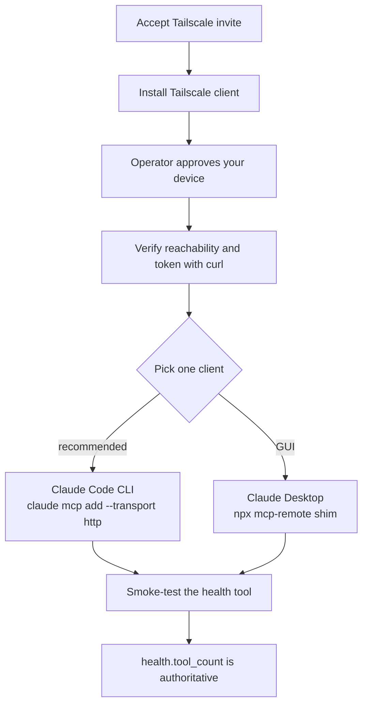

# Connect a Client to a Live Internal MCP Server

> **Section 09 · Integrations**
>
> **Audience:** A trusted end-user who needs to point **Claude Code CLI** or
> **Claude Desktop** at an *already-running* Agentropix-SIFT MCP server that an
> operator hosts on a private **Tailscale** tailnet — as opposed to standing the
> server up yourself.
>
> **Related:**
> - [Quickstart](../01-overview/quickstart.md) — the **self-host** path (`uv sync`
>   → `doctor` → first triage). This page is the *consumer* path: you connect to
>   someone else's server, you do not install the forensic toolchain.
> - [Deployment](../07-sdlc-ops/deployment.md) — operator-side server lifecycle.
> - [Security Model](../07-sdlc-ops/security-model.md) — bearer-token auth, audit
>   log, and fail-closed boot in depth.
> - [MCP Server](../02-architecture/mcp-server.md) — the transport and tool surface.

---

> **Operator-secret redaction.** The live server's tailnet IP, the production
> bearer token, and the Tailscale invite URL are **operator secrets** and are
> **not** reproduced here. Wherever this page shows `<TAILNET-IP>`, `<TOKEN>`, or
> `<INVITE-URL>`, your operator gives you the real value **out-of-band** (1Password
> / private message / sealed channel — never a public repo or chat). This mirrors
> the oracle runbook, which itself redacts the IP and invite
> (`docs/runbooks/expose-fastmcp-tailnet.md`).

The server endpoint has the shape `http://<TAILNET-IP>:8765/mcp` — reachable
**only** from machines on the operator's tailnet, never the public internet. It
exposes the full Agentropix-SIFT forensic surface: **71 MCP tools**
(`{{ref:CANONICAL_FACTS#mcp_tool_count}}`,
[`canonical-facts.md`](../08-reference/canonical-facts.md)) wrapping **16 SANS
SIFT forensic binaries** ([`canonical-facts.md`](../08-reference/canonical-facts.md);
`src/agentropix_sift/cli.py` `doctor`
tool dict). Authentication is a single static **bearer token** sent as
`Authorization: Bearer <TOKEN>`.

---

## Contents — what's in this page (and what to expect)

> Jump to any section below. Each row tells you what that part gives you, so you can go straight to your point.

| Section | What you'll get |
|---|---|
| [How to read this page (two audience tracks)](#how-to-read-this-page-two-audience-tracks) | The two tracks every step is shown in — 🖥️ expert command vs 💬 end-user prompt — plus the Execution X → Output X convention and the placeholder rules. |
| [1. Connection flow at a glance](#1-connection-flow-at-a-glance) | A one-diagram map of the whole setup: join tailnet → install client → verify → pick one client → smoke-test. |
| [2. Step 1 — Join the tailnet (one-time)](#2-step-1--join-the-tailnet-one-time) | Accept the invite, get device-approved, install Tailscale per OS, and run one combined token+reachability probe. |
| [3. Step 2 — Pick a client](#3-step-2--pick-a-client) | Wire up exactly one client: Claude Code CLI (`claude mcp add`, recommended) or Claude Desktop (the `mcp-remote` shim). |
| [4. Step 3 — Smoke-test with the `health` tool](#4-step-3--smoke-test-with-the-health-tool) | Confirm you're connected by calling the `health` tool and reading its authoritative `tool_count`. |
| [5. Troubleshooting matrix](#5-troubleshooting-matrix) | Symptom → cause → fix for 401s, timeouts, empty Desktop tool lists, wrong transport path, and slow first calls. |
| [6. The HTTP audit log (operator-side)](#6-the-http-audit-log-operator-side) | The exact JSON line shape logged per request, what each field means, and why `token_hash` is shared today. |
| [7. Roadmap — per-client tokens](#7-roadmap--per-client-tokens) | The planned per-client `tokens.json` that ends the shared-token problem and enables per-client audit attribution. |
| [8. Operator runbook — token rotation](#8-operator-runbook--token-rotation) | Operator-only steps to mint, install, and distribute a fresh bearer token, plus the fail-closed boot guard. |
| [See also](#see-also) | Cross-links to the self-host Quickstart, Security Model, MCP Server, and operator-only oracle runbooks. |

---

## How to read this page (two audience tracks)

Every connection step below is shown **two ways**, side by side in a callout, so
you only need to follow one track:

> **🖥️ Expert (command):** the exact CLI command, client JSON, or
> `agentropix-sift-mcp` invocation to type into a terminal or paste into a config
> file.
> **💬 End-user (prompt):** the plain-language question to type into a Claude
> session that already has the Agentropix MCP connected. A simple, focused
> question is enough — the session recognises it as an Agentropix capability and
> routes it to the right MCP tool automatically.

Both tracks confirm the **same live server** using a **real MCP tool** — the
`health` tool ([`tool-list.md`](../04-mcp-tools/tool-list.md) → *Case & session*) or the MCP `tools/list`
discovery method. Command/result pairs are enumerated
**Execution X → Output X** so it is unambiguous what you **run** versus what you
**get back**. Sample outputs come from a real connection probe against the
validated tailnet server; your hosts, tokens, and timestamps will differ.

> **Placeholders.** `<TAILNET-IP>`, `<TOKEN>`, and `<INVITE-URL>` are operator
> secrets supplied out-of-band — substitute the real values your operator gives
> you. Nothing on this page contains a live secret.

---

## 1. Connection flow at a glance



You only ever set up **one** client. Most people want the CLI.

---

## 2. Step 1 — Join the tailnet (one-time)

The server is reachable only from tailnet members; this is your **second auth
layer** behind the bearer token.

1. **Accept the invite.** Open the operator-supplied `<INVITE-URL>` in a browser
   and sign in with the Google / Microsoft identity you want associated with your
   tailnet membership.
2. **Device approval.** The invite requires **operator approval**. After you
   accept, ping the operator so they can approve your device in the Tailscale
   admin console; you receive a Tailscale notification once you are in. (Operator
   side: per-guest invites are generated and shared privately, then revoked when
   no longer needed — `docs/runbooks/expose-fastmcp-tailnet.md`.)
3. **Install the Tailscale client:**

   | OS | Command / link |
   |----|----------------|
   | **macOS** | `brew install --cask tailscale` or `https://tailscale.com/download/mac` |
   | **Windows** | `https://tailscale.com/download/windows` (MSI installer) |
   | **Linux** | `curl -fsSL https://tailscale.com/install.sh \| sh` then `sudo tailscale up` |

4. **Verify connectivity:**

   ```bash
   tailscale status          # the server host should appear, status "online"
   ping -c 2 <TAILNET-IP>    # should succeed (Windows: ping <TAILNET-IP>)
   ```

### Token-and-reachability sanity check (one combined probe)

> **🖥️ Expert (command):** fire one authenticated `initialize` request and read
> just the HTTP status code.
>
> **💬 End-user (prompt):** *"Connect to the agentropix-sift MCP server and run
> the `health` tool — is it reachable?"* — once a client is configured (Step 2),
> this single question exercises the same auth path and confirms the live server
> end to end. The session routes it to the real `health` tool.

**Execution A** — combined reachability + token probe:

```bash
curl -s -o /dev/null -w "%{http_code}\n" \
  -X POST http://<TAILNET-IP>:8765/mcp \
  -H "Authorization: Bearer <TOKEN>" \
  -H "Accept: application/json, text/event-stream" \
  -H "Content-Type: application/json" \
  -d '{"jsonrpc":"2.0","id":1,"method":"initialize","params":{"protocolVersion":"2025-06-18","capabilities":{},"clientInfo":{"name":"curl","version":"1.0"}}}'
```

**Output A** — a single HTTP status code, interpreted:

```text
200
```

| Response | Meaning |
|----------|---------|
| `200` | Tailnet OK **and** token OK — proceed to Step 2 |
| `401` | Tailnet OK but token wrong — re-paste the operator's value |
| `000` / timeout | Tailscale not connected or server down — re-check Step 1 |

The server enforces this at the middleware layer: a missing or malformed
`Authorization` header, or a token that fails a constant-time
`secrets.compare_digest`, is rejected with `401` and audited
(`src/agentropix_sift/mcp_server/fastmcp_app.py`).

---

## 3. Step 2 — Pick a client

### Client A — Claude Code CLI (recommended)

One line, works on macOS, Linux, Windows PowerShell, and WSL.

> **🖥️ Expert (command):** register the HTTP transport with the bearer header,
> then `claude mcp list` to confirm the handshake.
>
> **💬 End-user (prompt):** after registering, open a session and ask *"What MCP
> tools do you have available from agentropix-sift?"* — this routes to the MCP
> `tools/list` discovery method and lists the live tool surface, confirming the
> connection without touching a terminal.

**Execution B** — register the server (one line):

```bash
claude mcp add --transport http agentropix-sift \
  "http://<TAILNET-IP>:8765/mcp" \
  --header "Authorization: Bearer <TOKEN>"
```

**Output B** — confirmation that the server was added:

```text
Added HTTP MCP server agentropix-sift with URL: http://<TAILNET-IP>:8765/mcp
```

**Execution C** — verify the handshake:

```bash
claude mcp list
```

**Output C** — the server resolves and connects:

```text
agentropix-sift  http://<TAILNET-IP>:8765/mcp  ✓ Connected
```

Then start a session and ask `what MCP tools do you have available?` — you should
see the Agentropix tool families (`get_pslist`, `get_timeline`, `get_registry`,
`scan_yara`, `wazuh_*`, …; tool names per [`tool-list.md`](../04-mcp-tools/tool-list.md)).

**Project-scoped alternative.** To make the server available to anyone who clones
your repo and trusts the same token, drop a `.mcp.json` at the repo root:

```json
{
  "mcpServers": {
    "agentropix-sift": {
      "type": "http",
      "url": "http://<TAILNET-IP>:8765/mcp",
      "headers": {
        "Authorization": "Bearer <TOKEN>"
      }
    }
  }
}
```

Never commit a real token to a **public** repo.

### Client B — Claude Desktop (via the `mcp-remote` shim)

Claude Desktop speaks **stdio only**, so it bridges to the HTTP server through the
`mcp-remote` npx shim.

> **🖥️ Expert (command):** edit `claude_desktop_config.json`, add the
> `mcp-remote` shim block (OS-specific `command`), then fully quit and relaunch
> Desktop.
>
> **💬 End-user (prompt):** after relaunching, open any conversation and ask
> *"Run the `health` tool on agentropix-sift and tell me the tool_count"* — this
> routes to the real `health` tool and confirms the shim bridged to the live
> server.

**Prerequisite:** Node.js ≥ 18 on `PATH` (`node --version`). Install LTS from
`https://nodejs.org/` if missing.

Locate the config file:

| OS | Path |
|----|------|
| macOS | `~/Library/Application Support/Claude/claude_desktop_config.json` |
| Windows | `%APPDATA%\Claude\claude_desktop_config.json` |
| Linux | `~/.config/Claude/claude_desktop_config.json` |

Add (or merge) the server block. **The `command` differs per OS** — Windows must
use `npx.cmd`, macOS/Linux use bare `npx`:

**macOS / Linux:**

```json
{
  "mcpServers": {
    "agentropix-sift": {
      "command": "npx",
      "args": [
        "-y", "mcp-remote",
        "http://<TAILNET-IP>:8765/mcp",
        "--allow-http",
        "--header", "Authorization: Bearer <TOKEN>"
      ],
      "env": {}
    }
  }
}
```

**Windows** (note `npx.cmd`):

```json
{
  "mcpServers": {
    "agentropix-sift": {
      "command": "npx.cmd",
      "args": [
        "-y", "mcp-remote",
        "http://<TAILNET-IP>:8765/mcp",
        "--allow-http",
        "--header", "Authorization: Bearer <TOKEN>"
      ],
      "env": {}
    }
  }
}
```

> Claude Desktop does **not** expand `${ENV_VAR}` references — the token must
> appear literally in the JSON. On Linux/macOS, lock the file down:
> `chmod 0600 <config-path>`.

Then **fully quit and relaunch** Claude Desktop (⌘Q on macOS, tray → Quit on
Windows/Linux — closing the window keeps the old config loaded). Open any
conversation → click the tools icon → the Agentropix tools should appear.

---

## 4. Step 3 — Smoke-test with the `health` tool

This is the canonical connection confirmation for **both** clients and **both**
audiences — the `health` tool is a real MCP tool ([`tool-list.md`](../04-mcp-tools/tool-list.md) → *Case &
session*) and the single most reliable "am I connected?" signal.

> **🖥️ Expert (command):** call the `health` tool directly over the MCP — e.g.
> the raw JSON-RPC `tools/call` against `/mcp`, or in a CLI session ask the model
> to invoke it. Read the `tool_count` field back.
>
> **💬 End-user (prompt):** *"Use the agentropix-sift MCP server. Run the
> `health` tool and tell me the `tool_count`."* — the session routes this to the
> real `health` tool and reports the count in plain language.

**Execution D** — invoke the `health` tool (raw JSON-RPC form):

```bash
curl -s -X POST http://<TAILNET-IP>:8765/mcp \
  -H "Authorization: Bearer <TOKEN>" \
  -H "Accept: application/json, text/event-stream" \
  -H "Content-Type: application/json" \
  -d '{"jsonrpc":"2.0","id":2,"method":"tools/call","params":{"name":"health","arguments":{}}}'
```

**Output D** — the lightweight, no-subprocess health envelope:

```json
{
  "status": "ok",
  "server": "agentropix-sift",
  "version": "...",
  "uptime_seconds": 1342,
  "tool_count": 71
}
```

The `health` tool is a lightweight, no-subprocess probe that returns
`{status, server, version, uptime_seconds, tool_count}`. Its **`tool_count` field
is the single source of truth** for how many tools the live server exposes — the
server docstring states downstream documentation should cite this endpoint rather
than hardcode a catalogue size that drifts as wrappers are added
(`src/agentropix_sift/mcp_server/fastmcp_app.py`, `health()`). On the canonical
build that value is **71** (`{{ref:CANONICAL_FACTS#mcp_tool_count}}`,
[`canonical-facts.md`](../08-reference/canonical-facts.md)); trust the live field over any number printed in a doc.

> **Live delta (observed 2026-06-06).** Some current builds report
> `tool_count: 72` — a reproducible +1 over the canonical **71** (the same delta
> the [User Guide](../01-overview/user-guide.md#how-to-read-this-guide) records).
> This is expected drift between a freshly added wrapper and the canonical
> snapshot; the live `health` field is authoritative for *your* server, while
> **71** remains the canonical documentation figure
> (`{{ref:CANONICAL_FACTS#mcp_tool_count}}`).

---

## 5. Troubleshooting matrix

| Symptom | Likely cause | Fix |
|---------|--------------|-----|
| **`401 Unauthorized`** | Token typo / trailing newline / smart quotes | Re-copy the operator's token. `echo -n "<paste>" \| wc -c` should match the operator's stated length (43 chars for a 32-byte base64 token) |
| **`401 Unauthorized`** | Malformed header | Must be `Authorization: Bearer <token>` — case-sensitive `Bearer`, single space, no surrounding quotes |
| **`401 Unauthorized`** | Desktop "env var" not expanding | Claude Desktop does not expand `${VAR}` — paste the literal token in the JSON |
| **`401 Unauthorized`** | Operator rotated the token | Ask the operator for the current value (see §8) |
| **Timeout / `000` / "cannot reach host"** | Tailscale not running | `sudo tailscale up` (Linux/macOS) or open the GUI client (Windows); verify with `tailscale status` |
| **Timeout** | Device not approved | Send your `tailscale status` output to the operator so they can approve your device |
| **Timeout** | Corporate firewall blocks port 8765 | Test from a personal network; office networks sometimes block non-standard ports |
| **Empty tool list (Desktop)** | Closed the window but did not quit | Fully quit (⌘Q / tray → Quit) and relaunch |
| **Empty tool list (Desktop)** | `mcp-remote` not in npx cache | Run `npx -y mcp-remote --help` once to prime the cache, then restart Desktop |
| **Empty tool list (Desktop)** | `npx` vs `npx.cmd` mismatch | Windows must use `npx.cmd`; macOS/Linux must use `npx` |
| **Empty tool list (Desktop)** | Node too old / JSON syntax error | `node --version` ≥ 18; validate with `python3 -m json.tool < claude_desktop_config.json` |
| **`404 Not Found` on `/mcp`** | Server bound a different transport path | Try `/sse` in the URL — FastMCP's HTTP transport supports both and older versions default to `/sse`. If neither works, ask the operator which path is bound |
| **`JSONDecodeError` from `mcp-remote`** | Non-JSON on the server's **stdout** | The shim chokes on stdout pollution. Ask the operator to check the server log for stray warnings printed to stdout (everything should go to stderr) |
| **Slow first call, fast after** | FastMCP `initialize` handshake | Normal — handshake ~1–2 s, warm tool calls ~50–200 ms |
| **Tool list empty after a tool result** | Desktop's 1 MB inline-result cap | Prefer tools that return **file paths** over large inline payloads (e.g. full plaso CSV) |

For long-running tools (e.g. `plaso_log2timeline` against a multi-GB E01 can run
30–45 min and exceed the HTTP keepalive): verify wiring against a small image
first, then ask the operator to extend the server-side timeout.

---

## 6. The HTTP audit log (operator-side)

Every authenticated request — and every rejected one — is appended as a single
JSON line to `/var/log/agentropix/http_audit.log` (100 MB rotating handler,
`backupCount=10`). The record shape, **verified verbatim** against the middleware
(`src/agentropix_sift/mcp_server/fastmcp_app.py`, `_audit()`):

```json
{
  "timestamp": "2026-05-24T17:42:08Z",
  "token_hash": "8a3f0c1d2e4b5a67",
  "method": "POST",
  "path": "/mcp",
  "status": 200,
  "duration_ms": 124.3
}
```

| Field | Meaning |
|-------|---------|
| `timestamp` | UTC, `%Y-%m-%dT%H:%M:%SZ` |
| `token_hash` | **First 16 hex chars of `SHA256(token)`** — `hashlib.sha256(token.encode()).hexdigest()[:16]`. The raw bearer token is **never** logged |
| `method` | HTTP method (`POST` for `/mcp`) |
| `path` | Request path (`/mcp`) |
| `status` | Response status code (`200`, `401`, …) |
| `duration_ms` | Round-trip latency, ms, 1 decimal |

A `401` also carries a `reason` (`missing_authorization_header` or
`invalid_bearer_token`). An opt-in verbose mode
(`AGENTROPIX_MCP_ACCESS_LOG=verbose`, SIFT-W-298) additively appends
`client_ip` (X-Forwarded-For aware), `request_id`, `session_id`, `user_agent`, and
byte sizes — the default six-field shape is byte-for-byte unchanged so existing
parsers keep working (`src/agentropix_sift/mcp_server/fastmcp_app.py`).

Because every client shares one token, `token_hash` is the **same for everyone**
today — the log shows *that* an approved client called, not *which* one. That gap
is what the per-client-token roadmap (§7) closes.

---

## 7. Roadmap — per-client tokens

Today there is **one shared token** across all clients: if any single client leaks
it, the operator must rotate for everyone (disruptive), and the audit log cannot
attribute a call to a specific client.

**Planned:** a server-side `tokens.json` with one row per client —
`{label, token, created, last_used}`. Each client gets its own token; revoking one
client no longer affects the others, and the audit log can record a `client_label`
instead of (or alongside) the shared `token_hash`. The oracle CLIENT-SETUP.md
tracks this as a pending enhancement (not yet implemented). If you need per-client
attribution sooner, ask the operator to prioritize it.

> The runtime already contains a richer, scoped token store for a different
> subsystem — the evidence-gate registry persists
> `tokens(token_id, token_hash, scope, created_ts, ttl_seconds, …)` and verifies
> with `secrets.compare_digest` (`src/agentropix_sift/evidence_gate/registry.py`).
> That is **separate** from the MCP bearer token described here; it is referenced
> only as precedent that the per-client design is a small step, not a new pattern.

---

## 8. Operator runbook — token rotation

End-users never run this; you simply receive a new token out-of-band when a
rotation happens. The MCP bearer token is read **once at startup** via
`os.environ.get("AGENTROPIX_MCP_AUTH_TOKEN")` and compared per-request with
`secrets.compare_digest` — there is **no TTL, no JWT, no refresh path**, so the
only way to invalidate it is operator-initiated rotation + restart
(`src/agentropix_sift/mcp_server/fastmcp_app.py`).

```bash
# 1. Generate a fresh 32-byte base64 token
NEW_TOKEN=$(openssl rand -base64 32 | tr -d '=' | tr '+/' '-_')

# 2. Update the server systemd unit / env file
sudo systemctl edit agentropix-sift-mcp

# 3. Restart the server
sudo systemctl restart agentropix-sift-mcp

# 4. Confirm it booted with auth enabled (it fails closed if the token is unset)
sudo journalctl -u agentropix-sift-mcp -n 30 --no-pager

# 5. Distribute the new token to every approved client out-of-band
```

The server **fails closed**: if `AGENTROPIX_MCP_AUTH_TOKEN` is unset at boot it
**refuses to start** (raising `RuntimeError`) unless `AGENTROPIX_MCP_DEV_MODE=1` is
explicitly set to opt into unauthenticated dev mode
(`src/agentropix_sift/mcp_server/fastmcp_app.py`, `_add_auth_middleware`). That
boot guard is the backstop for a fat-fingered rotation.

---

## See also

- [Quickstart](../01-overview/quickstart.md) — the self-host install path.
- [Security Model](../07-sdlc-ops/security-model.md) — auth + audit deep dive.
- [MCP Server](../02-architecture/mcp-server.md) — transport and tool catalogue.
- [tool-list.md](../04-mcp-tools/tool-list.md) — the full catalogue of MCP tools the
  connected server exposes (incl. the `health` smoke-test tool).
- [canonical-facts.md](../08-reference/canonical-facts.md) — the authoritative tool count
  (71) cited for the connection probe.
- Oracle runbooks (operator-only): `docs/runbooks/expose-fastmcp-tailnet.md`
  (server stand-up), `docs/CLIENT-SETUP.md` (long-form client guide),
  `docs/adr/ADR-017-tailnet-mcp-exposure.md` (threat model).
