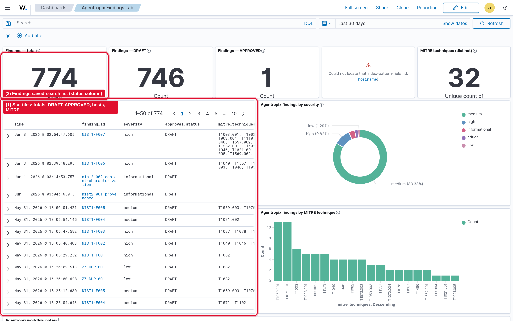
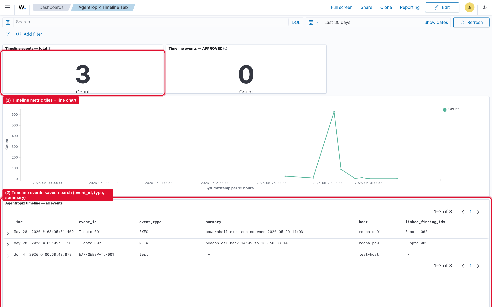
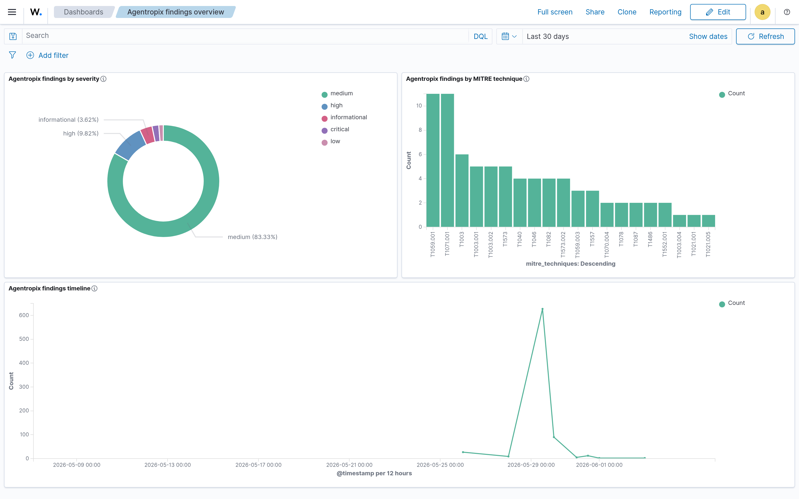
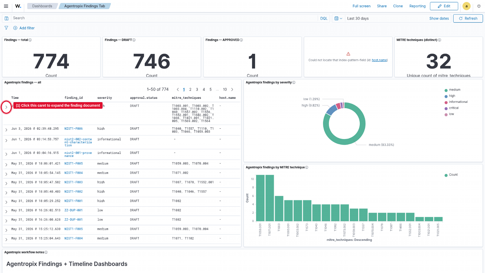
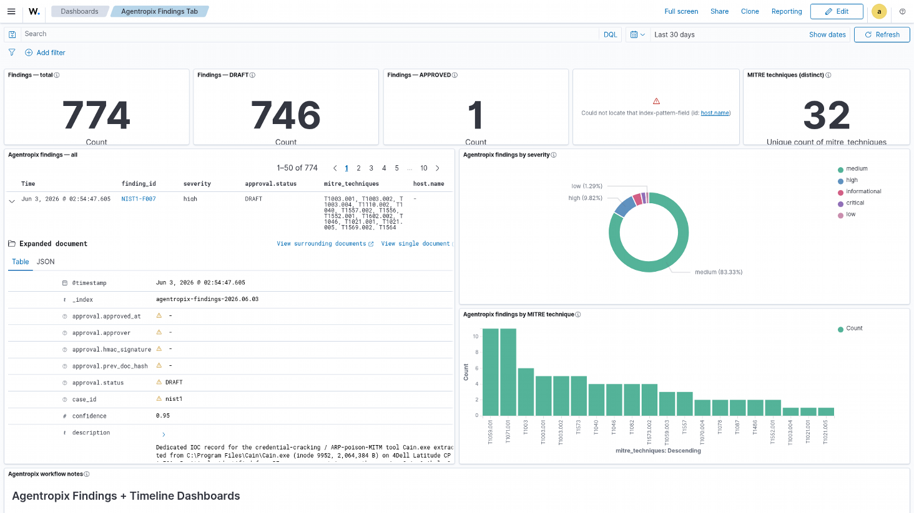
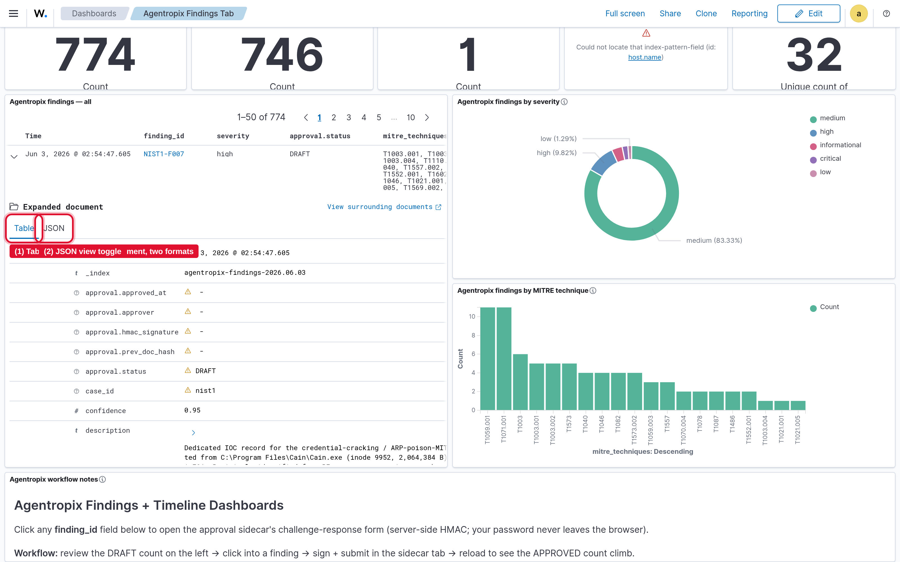
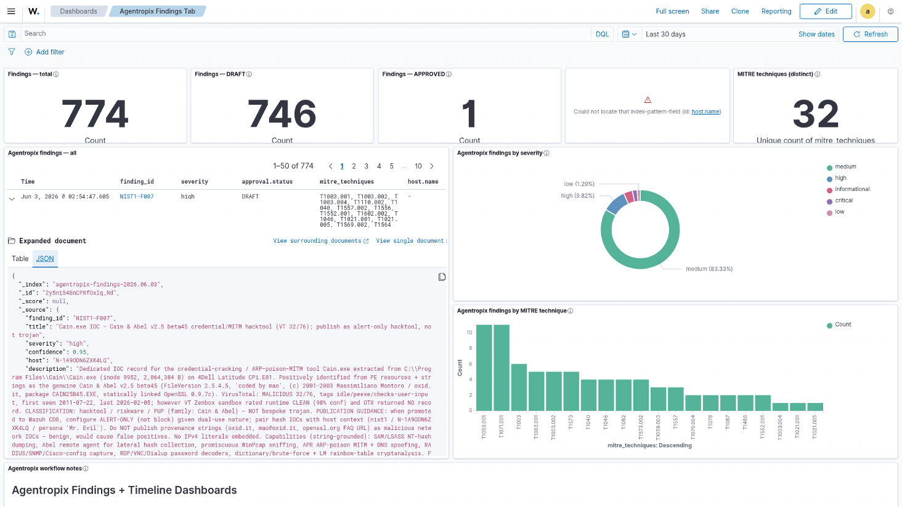
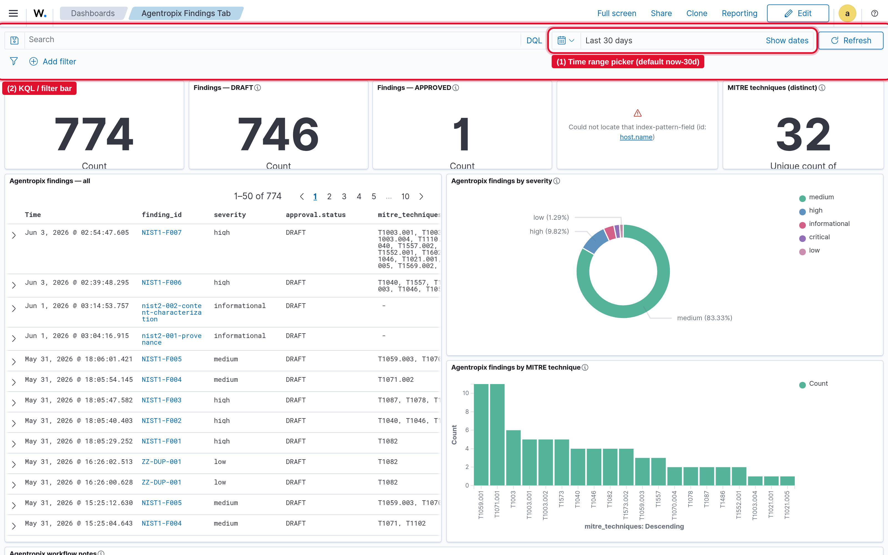

# Wazuh Integration — Operator Guide

> **Section 09 · Integrations**
>
> **Audience:** DFIR examiners / SOC operators who consume Agentropix‑SIFT findings
> inside the Wazuh Dashboard. This guide is read‑only and view‑centric — it tells you
> how to *reach and read* the dashboards, not how the data is pushed.
>
> **Related:**
> - [Use Case — Push a Finding to Wazuh as an Alert](../06-use-cases/uc-wazuh-push.md)
>   (the push internals: kill switches, mutation tokens, dry‑run defaults — not duplicated here).

---

## 1. What the integration exposes to you

Agentropix‑SIFT publishes its case output into a dedicated set of `agentropix-*`
OpenSearch indices on the Wazuh Indexer, then surfaces them through pre‑built saved
objects in the **Wazuh Dashboard (OpenSearch Dashboards 2.19.5)**. As an end‑user you get
three dashboards (the **Findings Tab**, the **Timeline Tab**, and the original
**Findings overview**), two Discover saved searches, and an **Examiner Approval Portal**
deep‑link off every finding. The primary surface is the **Agentropix Findings Tab**:
metric stat tiles (total / DRAFT / APPROVED findings, distinct hosts, distinct MITRE
techniques), a searchable findings list, a severity donut, a MITRE‑technique bar chart,
and a workflow‑notes panel. Findings live in `agentropix-findings-*` (daily indices,
90‑day default retention) and timeline events in `agentropix-timeline-*`.

**How the data gets there (brief):** an examiner runs the Agentropix‑SIFT MCP tools
(`wazuh_index_findings`, `wazuh_publish_iocs`) which seal each document (HMAC‑SHA256) and
bulk‑index it into the `agentropix-*` indices. The write path is **fail‑closed and
dry‑run‑by‑default** and is gated by kill switches plus a one‑shot mutation token. You do
**not** need to understand any of that to read the dashboards — see
[uc-wazuh-push.md](../06-use-cases/uc-wazuh-push.md) for the push mechanics, or **§9** below for a
dual‑audience operator quick‑reference (configure index → push → verify) if you also run the push.
The dashboard
saved‑object bundle itself is *operator‑imported* (Saved Objects Import), not pushed by the
runtime.

---

## 2. Accessing the dashboard

1. Open the Wazuh Dashboard at **<https://192.168.2.178/>** (the Wazuh Indexer/Dashboard
   host, OSD 2.19.5).
2. **Self‑signed certificate:** the host presents a self‑signed TLS certificate, so your
   browser will show a certificate warning on first visit. This is expected for this
   internal host — proceed/accept the exception to continue.
3. **Log in** with the Wazuh Dashboard `admin` account. **The password is not recorded in
   this document** — it lives in `gitlab.txt` alongside the deployment. Never paste the
   password into tickets, chat, or docs.
4. After login you land on the Wazuh home page (`/app/wz-home`). Use the left‑hand menu
   **Dashboards** entry (or paste the direct `/app/dashboards#/view/...` URLs below) to open
   each Agentropix view.

> All Agentropix dashboards default to a **`now-30d`** (Last 30 days) time window.

---

## 3. Agentropix Findings Tab (primary view)

**Saved‑object id:** `agentropix-findings-tab`
**Direct URL:** <https://192.168.2.178/app/dashboards#/view/agentropix-findings-tab>
**Navigate:** Dashboards → **Agentropix Findings Tab**

This is the main examiner workspace. Across the top sit **five metric stat tiles** —
*Findings · total*, *Findings · DRAFT*, *Findings · APPROVED*, *Hosts (distinct)*, and
*MITRE techniques (distinct)*. Below them, the left two‑thirds is the **findings list**
(a Discover‑style saved search with columns *Time*, *finding_id*, *severity*,
*approval.status*, *mitre_techniques*, *host.name*); the right side carries the
**severity donut** (top) and the **findings‑by‑MITRE‑technique bar chart** (below). A
full‑width **workflow‑notes** markdown panel sits at the bottom.



In the capture above the tiles read **774** total findings, **746** DRAFT, **1** APPROVED,
and **32** distinct MITRE techniques; the findings list shows `finding_id`, `severity`, and
the highlighted **`approval.status`** column (mostly `DRAFT`). The `finding_id` cells are
clickable deep‑links into the **Examiner Approval Portal** (see §6).

---

## 4. Agentropix Timeline Tab

**Saved‑object id:** `agentropix-timeline-tab`
**Direct URL:** <https://192.168.2.178/app/dashboards#/view/agentropix-timeline-tab>
**Navigate:** Dashboards → **Agentropix Timeline Tab**

The timeline workspace, backed by the `agentropix-timeline-*` index pattern. It has two
metric tiles (*Timeline events · total* and *Timeline events · APPROVED*), a
findings/timeline **line chart**, and a **timeline saved‑search list** with columns
*event_id*, *event_type*, *summary*, *host*, and *linked_finding_ids* (sorted by
`@timestamp` ascending).



In this capture the tiles read **3** total timeline events and **0** APPROVED; the events
list shows the per‑event rows linking back to findings via `linked_finding_ids`.

---

## 5. Agentropix findings overview

**Saved‑object id:** `agentropix-findings-overview`
**Direct URL:** <https://192.168.2.178/app/dashboards#/view/agentropix-findings-overview>
**Navigate:** Dashboards → **Agentropix findings overview**

The original pre‑canned three‑panel dashboard. The **severity donut** is top‑left, the
**MITRE‑technique bar chart** is top‑right, and a full‑width **findings timeline line chart**
runs along the bottom. Time window defaults to `now-30d`.



> The two Discover saved searches — **Agentropix findings - all**
> (`agentropix-findings-search`) and **Agentropix timeline - all events**
> (`agentropix-timeline-search`) — are embedded as the list panels of the Findings Tab and
> Timeline Tab respectively. To open one standalone, go to **Discover → Open** and pick it
> by name.

---

## 6. Drilling into a finding

Every row in the findings list is a single sealed finding document. The same document can
be viewed two ways — a **Table** (field/value) view and a raw **JSON** view. They are the
*same document*, just two renderings.

### Step 1 — Expand the row

Click the **expand caret** in the first column of any finding row (ringed in red below).



### Step 2 — Read the Table view (default)

The row expands into an **Expanded document** panel showing every field as a name/value
pair — `finding_id`, `severity`, `approval.status`, `mitre_techniques`, the `host.*`
fields, and the rest of the finding metadata. A **Table | JSON** toggle sits at the
top‑left of the expanded panel.



### Step 3 — Switch between Table and JSON

The **Table** and **JSON** tabs render the *same* finding in two formats — pick whichever
is easier to read. Table is best for scanning individual fields; JSON is best for copying
the full source document.



### Step 4 — Read the JSON view

Clicking **JSON** shows the full raw source document, including `approval.status` (e.g.
`DRAFT`), `mitre_techniques`, `host`, and the finding metadata — the exact bytes that were
sealed and indexed.



---

## 7. Setting the time range and filtering with KQL

To find specific data, scope the dashboard with the **time‑range picker** and the
**KQL query / filter bar**.



- **Time range** — use the **superDatePicker** at the top‑right (shows **Last 30 days** by
  default). Pick a quick range (Today, Last 24 hours, Last 7 days…), an absolute
  from/to window, or a relative window, then click **Update/Refresh**. All panels and the
  embedded list re‑query for the selected window.
- **KQL filters** — type a query in the search bar at the top‑left, e.g.:
  - `approval.status : "DRAFT"` — only un‑approved findings
  - `approval.status : "APPROVED"` — only signed‑off findings
  - `severity : "high"` — high‑severity findings
  - `host.name : "host-004"` — findings for one host
  - `mitre_techniques : "T1059"` — findings tagged with a technique
  - Combine with `and` / `or`, e.g. `severity : "high" and approval.status : "DRAFT"`.
- You can also click any value in a panel or the **+ / −** add/remove‑filter pills to pin a
  structured filter without typing KQL.

---

## 8. What each finding status means

The **`approval.status`** field tracks a finding through the examiner approval state
machine. Status transitions are written to `agentropix-approvals-*` via the **Examiner
Approval Portal** (deep‑linked from every `finding_id` cell):

| Status | Meaning |
| --- | --- |
| **DRAFT** | Default state. The finding has been indexed but **not yet reviewed/signed** by an examiner. Most findings start here. |
| **APPROVED** | An examiner reviewed the DRAFT and **signed an APPROVE** in the Approval Portal. Only APPROVED findings should drive downstream SOC action. |
| **REJECTED** | An examiner reviewed the finding and **declined** it — it should not be acted on. |
| **REVOKED** | A previously‑APPROVED finding was **withdrawn** after the fact. The approvals index is tamper‑evident (read‑only historical rows), so a revocation is recorded as a new state row rather than an edit. |

**Approving a finding:** click a `finding_id` cell in the Findings Tab — it opens the
**Examiner Approval Portal** sidecar in a new tab
(`http://127.0.0.1:8800/?target_id=<finding_id>` on the loopback default, or its tailnet
URL). There you review the DRAFT and sign **APPROVE** locally via an HMAC
challenge‑response (your password never leaves the browser); the portal writes the
`DRAFT → APPROVED` row to `agentropix-approvals-*`, after which the *Findings · APPROVED*
tile and the `approval.status` column update on refresh.

> The Approval Portal is a separate FastAPI app reached through the finding deep‑link; it is
> not part of the dashboard bundle and is not screenshotted in this guide.

---

## 9. Push path — getting findings/IOCs *into* the dashboard (operator quick‑reference)

> **Sections 1–8 are read‑only** (how to *reach and read* the dashboards). This section is the
> short operational counterpart: the three steps that put data *behind* those views —
> **configure the index target → push the IOC/finding → verify it landed**. The push mechanics
> (kill switches, mutation tokens, dry‑run defaults, idempotency, Indexer‑outage handling) are
> NOT duplicated here — see [uc-wazuh-push.md](../06-use-cases/uc-wazuh-push.md). This is the
> day‑to‑day "do the push, then go read it in §3" loop.

> **How to read these callouts.** Each step shows the same action two ways, side by side:
> **🖥️ Expert (command)** is the exact MCP call / CLI; **💬 End‑user (prompt)** is the
> plain‑language question you type into a Claude session that has the Agentropix MCP connected —
> the session recognises it as an Agentropix capability and routes the named MCP tool for you.
> Every prompt below maps to a **real** tool from [`.crew/tool-list.md`](../../.crew/tool-list.md)
> (the 5‑tool *Wazuh SIEM integration* family).

> 🛑 **Denylist (these stay manual — autonomy never auto‑confirms them).** A **live** Wazuh write
> is a Hard‑Stop: it needs **all four** kill switches flipped (`WAZUH_INTEGRATION_ENABLED=true`,
> `WAZUH_PUSH_ENABLED=true`, `WAZUH_DRY_RUN_ONLY=false`,
> `AGENTROPIX_INTEGRATION_NOT_PRODUCTION=true`) **plus** a valid one‑shot `mutation_token`
> (`egt_<ULID>`). The two write tools are marked **[MUT]** in the tool list. Without `dry_run=false`
> **and** a fresh token the call **fails closed** (returns a structured `error` naming the missing
> flag — never a silent pass). Findings you index should already be **APPROVED**
> (see [uc-approval-gate.md](../06-use-cases/uc-approval-gate.md)). **Default for these prompts is
> a dry‑run preview**; an end‑user prompt alone can never trigger a live write.

> **Placeholders.** Substitute your deployment's real values for `<WAZUH-MANAGER-URL>` (Manager
> API, `:55000`), `<WAZUH-INDEXER-URL>` (Indexer, `:9200`), the target index pattern
> `agentropix-findings-*`, and the token `egt_<ULID>`. Never paste a real token, password, or raw
> internal IP into a ticket, chat, or this doc — the token is one‑shot and sourced from
> `AGENTROPIX_MUTATION_TOKEN`, never a CLI flag.

### Step 1 — Configure the index target (dry‑run preview)

Confirm *where* findings will land and *what they'll look like* before any write. A dry‑run of
`wazuh_index_findings` computes the would‑be‑indexed shape (including per‑doc HMAC seals) against
the date‑suffixed `agentropix-findings-*` pattern **without** touching the Indexer — this is how
you validate the target index and connectivity safely.

> **🖥️ Expert (MCP call):**
> ```text
> wazuh_index_findings { "case_id":"CFReDS-Hacking",
>                        "findings":[ { "finding_id":"F-0001" } ],
>                        "index":"agentropix-findings-*",
>                        "dry_run":true }
> ```
> **💬 End‑user (prompt):** *"Do a dry‑run of indexing this case's findings into Wazuh — show me
> which index they'd go to and what each sealed document would look like. Don't write anything yet."*
> The session calls `wazuh_index_findings` with `dry_run=true` and reports the target index, the
> would‑be `indexed_count` / `batch_count`, and that nothing was written.

**Execution A → Output A.**

*Execution A:* `wazuh_index_findings` with `dry_run=true` (as above) — no `mutation_token` needed
for a preview.

*Output A (preview, nothing written):*
- `dry_run: true`
- `index: agentropix-findings-2026.06.05` (resolved from the `agentropix-findings-*` template, UTC date)
- `indexed_count: 1`, `indexed_failed_count: 0`, `batch_count: 1`
- `index_template_installed_this_run: false`
- `outcome: dry_run`, plus a fresh `run_id`

> 🟢 **In plain terms:** this proves the index target and the sealed‑document shape are correct.
> Nothing reached the dashboard yet — that's Step 2.

### Step 2 — Push the IOC / finding (the live write)

Two write tools cover the two payload kinds. **Findings → alerts** go through
`wazuh_index_findings`; **IOCs → CDB lists + rules** go through `wazuh_publish_iocs` (which loads
`MASTER-IOCS.json` from the case directory, classifies each IOC Tier‑1/2/3, validates through
**Thymus STRICT**, and PUTs CDB lists + rules with one coalesced Manager restart). Both are
**[MUT]** and require `dry_run=false` **plus** a valid `mutation_token` — the denylist gate above.
The IOC publish is **idempotent** (`skipped_idempotent`), so a retry after a partial failure is
safe; pass the whole `case_dir` once rather than looping per‑IOC.

> **🖥️ Expert (MCP call — findings → alerts):**
> ```text
> wazuh_index_findings { "case_id":"CFReDS-Hacking",
>                        "findings":[ { "finding_id":"F-0001" } ],
>                        "index":"agentropix-findings-*",
>                        "dry_run":false,
>                        "mutation_token":"egt_<ULID>" }
> ```
> **🖥️ Expert (MCP call — IOCs → CDB lists + rules):**
> ```text
> wazuh_publish_iocs { "case_dir":"/cases/cfreds-hacking",
>                      "dry_run":false,
>                      "mutation_token":"egt_<ULID>" }
> ```
> **💬 End‑user (prompt):** *"The case findings are APPROVED and the Wazuh write switches are on —
> push them into Wazuh as alerts and publish the case IOCs to the CDB lists, using my mutation
> token."*
> The session calls `wazuh_index_findings` (then `wazuh_publish_iocs`) with `dry_run=false`,
> spends the one‑shot token, HMAC‑seals each write, and reports the counts + `run_id`. If a switch
> is off or the token is stale it relays the fail‑closed `error` instead of writing.

**Execution B → Output B.**

*Execution B:* `wazuh_index_findings` with `dry_run=false` + `mutation_token` (as above).

*Output B (live index):*
- `dry_run: false`, `indexed_count: 1`, `indexed_failed_count: 0`, `batch_count: 1`
- `index: agentropix-findings-2026.06.05`
- `outcome: indexed` (a degraded Indexer would instead return `outcome=indexer_outage` with the
  full result shape — that is **not** an `error`)
- a `run_id` + per‑doc HMAC seal make the write auditable and tamper‑evident

**Execution C → Output C.**

*Execution C:* `wazuh_publish_iocs` with `dry_run=false` + `mutation_token` (as above).

*Output C (live IOC publish):*
- `case_id: CFReDS-Hacking`
- `pushed: 12`, `skipped_tier3: 3`, `skipped_idempotent: 0`, `failed: 0`
- `restart_pending: true` (one coalesced Manager restart)
- `dry_run: false`, plus `seal` (HMAC‑SHA256, ADR‑016) and `run_id`; an audit row is appended to
  `wazuh-audit.jsonl`

> ⚠️ **GOTCHA — fail‑closed, not silent.** If you forget a kill switch or the token is already
> spent, you get e.g. `{"error":"WAZUH_DRY_RUN_ONLY=true prevents --confirm pushes; set
> WAZUH_DRY_RUN_ONLY=false to enable writes", "dry_run":false}` and **nothing is written**. Fix the
> named flag (or mint a fresh token) and re‑run — the idempotent publish makes the retry safe.

### Step 3 — Verify it landed

Two ways to confirm the push reached the SOC: **retro‑hunt the IOC** with `wazuh_hunt_ioc` (queries
`wazuh-alerts-*` directly), and **open the dashboard** to see the new rows. The dashboard check
closes the loop back to §3 — the *Findings · total* / *APPROVED* tiles and the
`approval.status` column update on the next refresh.

> **🖥️ Expert (MCP call):**
> ```text
> wazuh_hunt_ioc { "ioc_value":"203.0.113.10",
>                  "ioc_type":"ip",
>                  "time_range_hours":2160 }
> ```
> **💬 End‑user (prompt):** *"Retro‑hunt this IP across the Wazuh alerts for the last 90 days and
> tell me if the finding I just pushed is showing up."*
> The session calls `wazuh_hunt_ioc` against `wazuh-alerts-*` and returns the historical hits for
> that indicator (a read‑only query — no token, no kill switch needed).

**Execution D → Output D.**

*Execution D:* `wazuh_hunt_ioc` (as above; `time_range_hours=2160` = the default 90‑day lookback).

*Output D (retro‑hunt):*
- `ioc_value: 203.0.113.10` (a documentation‑reserved placeholder IP), `ioc_type: ip`
- `hits: <n>` historical matches across `wazuh-alerts-*` within the window
- `time_range_hours: 2160`, plus a `run_id`

**Then confirm visually:** open the **Agentropix Findings Tab** (§3,
<https://192.168.2.178/app/dashboards#/view/agentropix-findings-tab> on the live host — substitute
your `<WAZUH-INDEXER-URL>`/dashboard host) and check the new row in the findings list and the bump
in the *Findings · total* tile. Set the time range and KQL filter (§7) to your case, e.g.
`finding_id : "F-0001"`.

> 🟢 **In plain terms:** Step 1 proves the target, Step 2 writes it, Step 3 confirms it — both by
> retro‑hunt **and** by eyeballing the dashboard you learned to read in §3.

### Usability matrix — the push, four ways

| | **🖥️ Expert (types MCP/CLI)** | **💬 Non‑expert (types a prompt)** |
| --- | --- | --- |
| **Preview / dry‑run** (safe, no token) | `wazuh_index_findings { … "dry_run":true }` — read the would‑be shape inline | *"Dry‑run indexing this case's findings into Wazuh — don't write anything."* |
| **Live write** (denylist: all 4 switches + `mutation_token`) | `wazuh_index_findings`/`wazuh_publish_iocs` with `dry_run":false` + `egt_<ULID>` | *"The switches are on and findings are APPROVED — push them with my mutation token."* |
| **Verify** (read‑only, no token) | `wazuh_hunt_ioc { … "time_range_hours":2160 }` + open the Findings Tab (§3) | *"Retro‑hunt this IOC over 90 days and tell me if my pushed finding shows up."* |

---

## Privacy note

The screenshots in this guide were captured from the **live internal Wazuh deployment** and
show:

- An **internal IP address** (`192.168.2.178`) for the Wazuh Indexer/Dashboard host.
- **Live alert / finding data** — real `finding_id`s, host names, severities, and MITRE
  techniques from the running environment.

Treat this document and its `assets/` images as **internal‑only**. Do not publish them
externally, and never add the Wazuh Dashboard password (kept in `gitlab.txt`) to this or any
other shared document.
