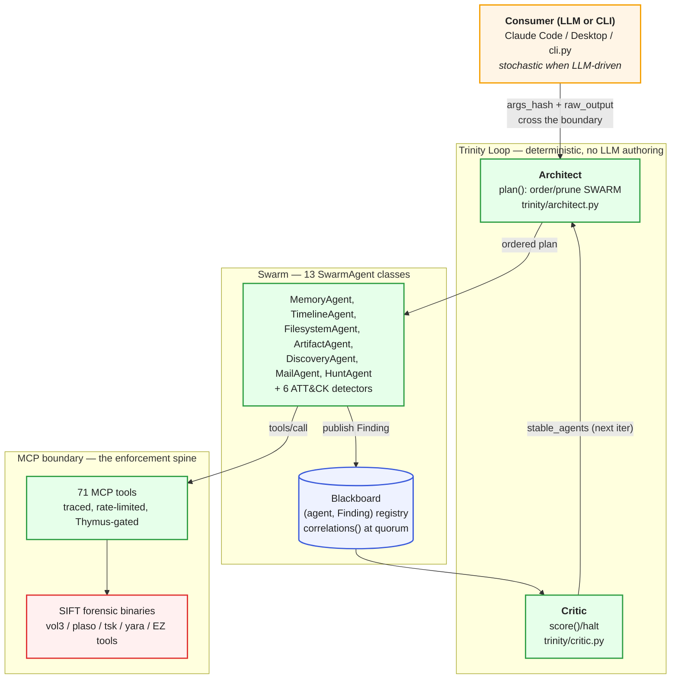

# Agents — The Agentic Architecture (category overview)

> **Section 10 · Agents** — the synthesis page. The architecture section
> ([02-architecture](../02-architecture/)) describes each moving part on its own; this page
> ties **Trinity ↔ Swarm ↔ MCP** together as a single model, and — crucially — **disambiguates
> the two unrelated things the word "agent" means** in this project. Read this first; it routes
> you to the deep pages rather than repeating them.

---

## Why this category exists: the word "agent" is overloaded

The oracle uses **"agent" in two completely different senses**, and conflating them is the most
common reading error. State the distinction up front:

| Sense | What it is | Where it lives | Lifecycle |
|---|---|---|---|
| **1. Runtime DFIR swarm agent** | A `SwarmAgent` subclass (`MemoryAgent`, `TimelineAgent`, the ATT&CK detectors, …) that investigates evidence and publishes `Finding`s to the Blackboard | `src/agentropix_sift/agents/`, `src/agentropix_sift/detectors/` | **Runtime** — instantiated each Trinity iteration |
| **2. BMAD dev-crew persona** | A build-time review role (Winston/Murat/… mapped to `forge-*` BMAD ids) and the Α–Ζ delivery crews | `docs/AGENTS.md` §"Crew / specialist personas", `docs/DELEGATION.md` §"Crew charter" | **Build-time** — a human/LLM reviewer, NOT a runtime component |

Sense 1 is what the rest of [02-architecture](../02-architecture/swarm-agents.md) covers.
Sense 2 — the personas who *built and reviewed* the system — is documented in
[delegation-model.md](delegation-model.md). They never run inside a triage. A BMAD persona is a
reviewer's hat, not a process on the SIFT host.

> **Third reconciliation — the aspirational runtime.** A *third* "agent" picture appears in the
> oracle's `docs/architecture.md` and `docs/tutorial-first-agent.md`: a **Bio-Agentic Runtime**
> with LangGraph `StateGraph` execution, a `RalphEngine`, `StemCell` API, an ATP ledger, a
> `TrinityLoop` class, and `agentropix init` / `agentropix run` CLI verbs. **This is stale /
> aspirational.** The audit banner on `docs/architecture.md:1-2` and `docs/architecture/trinity.md`
> §1/§8 declare it does not match shipped code: the real loop is a deterministic `for`-loop in
> `orchestrator.run_triage()` over a 13-class `SWARM` tuple — **there is no `TrinityLoop` /
> `swarm.py` / `router.py` / `engine/` module and no `agentropix init` / `run` CLI**. Per the
> portal's source-of-truth rule the oracle wins, and the authoritative oracle for the runtime is
> `docs/architecture/*.md` (the per-module docs), **not** `architecture.md` or the tutorial.

---

## The one model: Trinity ↔ Swarm ↔ MCP

Three layers, each deterministic from Layer 2 down. The LLM lives only at the top (Layer 1) and
*proposes* — it never *disposes* of a fact.

> 🔍 **[Open as SVG — full size, zoomable](assets/agentic-architecture-1.svg)** (renders larger than the page column; the SVG zooms losslessly in a browser tab).

How the three connect, in one paragraph (all three are deep-documented elsewhere — see the map
below):

- The **Trinity Loop** (`orchestrator.run_triage()` driving `trinity/architect.py` +
  `trinity/critic.py`) is the deterministic control wrapper. The **Architect** picks which swarm
  agents run this iteration; the **Critic** scores the Blackboard and decides halt-vs-iterate.
  Neither role authors a finding (`docs/architecture/trinity.md` §1).
- The **Swarm** (the `SWARM` tuple in `agents/__init__.py`) is the 13 `SwarmAgent` classes that do
  the forensic work, each publishing `Finding`s to the shared **Blackboard**
  ([agents-list.md](agents-list.md); `agents/__init__.py`).
- The **MCP boundary** is *how* a swarm agent touches evidence: every tool call flows through the
  traced → rate-limited → Thymus-gated stack and shells out to a SIFT binary
  ([fastmcp-execution.md](fastmcp-execution.md); `docs/MCP-REQUEST-FLOW.md`). Agents are **pure
  async coroutines over the MCP boundary — no LLM coupling** (`agents/_base.py` docstring).

---

## Where to read each part (don't expect it repeated here)

| You want… | Go to | Source-of-truth |
|---|---|---|
| The full swarm roster, Blackboard, run order, agent contract | [swarm-agents.md](../02-architecture/swarm-agents.md) | `agents/`, `agents/_blackboard.py` |
| The canonical agent/role table (machine-extracted) | [agents-list.md](agents-list.md) | `agents/`, `detectors/`, `trinity/` |
| Architect / Critic / halt logic | [trinity-loop.md](../02-architecture/trinity-loop.md) | `trinity/`, `orchestrator.py` |
| Per-agent tool routing + reverse index | [tool-by-agent.md](../04-mcp-tools/tool-by-agent.md) | `agents/`, `fastmcp_app.py` |
| The single tool call traced through the spine | [fastmcp-execution.md](fastmcp-execution.md) | `mcp_server/`, `docs/MCP-REQUEST-FLOW.md` |
| The build-time BMAD personas / Α–Ζ crews | [delegation-model.md](delegation-model.md) | `docs/AGENTS.md`, `docs/DELEGATION.md` |

---

## Read in this order

1. **This page** — the disambiguation + the one model.
2. [delegation-model.md](delegation-model.md) — the BMAD personas and the sub-agent delegation
   model (build-time "agents", so you stop confusing them with the runtime swarm).
3. [agents-list.md](agents-list.md) — the canonical runtime agent/role table.
4. [fastmcp-execution.md](fastmcp-execution.md) — exactly how an agent's tool call executes across
   the MCP boundary.
5. Then the deep architecture pages: [swarm-agents.md](../02-architecture/swarm-agents.md) →
   [trinity-loop.md](../02-architecture/trinity-loop.md) → [mcp-server.md](../02-architecture/mcp-server.md).

---

## Related ADRs (decision rationale)

The "one model" above is the shipped result of several architecture decisions — read them in
[Section 11 · ADR](../11-ADR/):

- **Why the system defaults to halting, not continuing** (the deterministic Critic + the
  capability-absence stance) → [ADR-008 — Safety Architecture (Bio-Agentic, "the Oncologist")](../11-ADR/ADR-008-safety-architecture.md).
- **Why "LLM proposes, Trinity disposes" is enforced at the boundary** (the court invariants the
  Architect/Critic read and the Findings carry) → [ADR-016 — Courtroom Audit + Cryptographic Sealing](../11-ADR/ADR-016-courtroom-audit.md).
- **The proposed (NOT shipped) intelligent task router** — relevant background to the aspirational
  vs deterministic-`for`-loop reconciliation above → [ADR-009 — Intelligent Task Router](../11-ADR/ADR-009-task-router.md) (status: Proposed).

## Where to go next

- The runtime swarm in full → [swarm-agents.md](../02-architecture/swarm-agents.md)
- The deterministic engine → [trinity-loop.md](../02-architecture/trinity-loop.md)
- The MCP protocol surface → [mcp-server.md](../02-architecture/mcp-server.md)
- The decision records behind it → [Section 11 · ADR](../11-ADR/)
- Every numeric claim → [Canonical Facts](../08-reference/canonical-facts.md)
