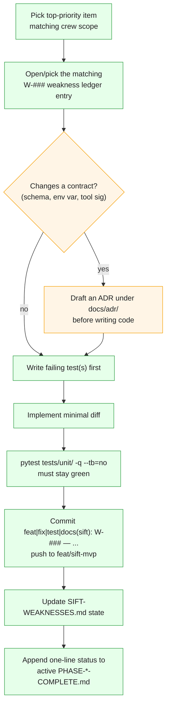

# The Delegation Model — BMAD Personas & Build-Time Crews

> **Section 10 · Agents** — the **build-time** "agents". This page documents the second sense of
> "agent" from [agentic-architecture.md](agentic-architecture.md): the BMAD-style review
> **personas** and the Α–Ζ **delivery crews** that designed, built, and reviewed Agentropix-SIFT.
> **None of these is a runtime component** — they are human/LLM roles, not processes on the SIFT
> host. For the runtime DFIR swarm, see [agents-list.md](agents-list.md) and
> [swarm-agents.md](../02-architecture/swarm-agents.md).
>
> **Source of truth.** `docs/AGENTS.md` (the persona glossary) and `docs/DELEGATION.md` (the crew
> charter) in the oracle repo. Every claim below cites one of those.

---

## 1. The two build-time structures

The project was built under an autonomous delivery process with two orthogonal organising
structures:

- **Review personas** — one per *review dimension* (architecture, test, PM, …). They dispatch as
  parallel specialists against every review doc (`docs/AGENTS.md` §"Crew / specialist personas").
- **Delivery crews (Α–Ζ)** — one per *workstream / code surface*. They run concurrently, commit
  independently, and coordinate via `docs/DELEGATION.md` + `PHASE-*-COMPLETE.md` sprint-close
  entries (`docs/DELEGATION.md` §"Crew charter").

A persona is a *lens*; a crew is a *worktree owner*. The same model can wear a persona hat while
working in a crew.

---

## 2. Review personas (the ten BMAD specialists)

Ten BMAD-style review roles, each mapped to a `forge-*` BMAD id. Every team-review doc
(`docs/REVIEW-*.md`, `docs/sprint-artifacts/W*-vote-*.md`) dispatches these ten as parallel
specialists (`docs/AGENTS.md` §"Crew / specialist personas"):

| Persona | BMAD id | Review lens |
|---|---|---|
| **Winston** | `forge-architect` | Architecture — Trinity loop, MCP server design, wrapper pattern, EWF handling |
| **Murat** | `forge-tea` | Test strategy — chaos suite, unit vs integration coverage |
| **John** | `forge-pm` | PRD / scope — S-01..S-05 acceptance criteria, deferred items |
| **Bob** | `forge-sm` | Sprint health — weakness-ledger trend, W-XXX path-to-close, burn rate |
| **Amelia** | `forge-dev` | Code quality — wrapper parity, parser edge cases, tech-debt density |
| **Mary** | `forge-analyst` | Competitive landscape — SANS criteria, DFIR-AI comparables |
| **Sally** | `forge-ux-designer` | Operator UX — CLI ergonomics, status readability, error messages |
| **Alex** | `forge-business-strategist` | Demo-day positioning — the story that wins judges |
| **Gulli** | `forge-patterns` | Agentic patterns — Trinity vs ReAct / Reflexion / Debate trade-offs |
| **Paige** | `forge-tech-writer` | Documentation — README, CLAUDE.md, ledger format, glossary gaps |

> These personas surface throughout the audit trail — vote tallies, review docs, commit messages.
> `docs/AGENTS.md` exists precisely so "anyone reading the audit trail without this file ends up
> guessing who Murat is" (`docs/AGENTS.md` header). They map to the BMAD evaluation reported in the
> portal's [Evaluation Scorecard](../07-sdlc-ops/evaluation-scorecard.md).

---

## 3. Delivery crews (Α–Ζ)

Six concurrent crews, each owning a code surface and gated by a success signal
(`docs/DELEGATION.md` §"Crew charter"):

| Crew | Handle | Scope | Primary files | Success signal |
|---|---|---|---|---|
| **Α** | Architect-A | Trinity Loop, event-window redesign, Critic tuning, halt logic | `trinity/`, `orchestrator.py`, `agents/timeline.py`, `agents/hunt.py` | cohit ≥ 2 recall gate on the DC E01 |
| **Β** | Builder-B | MCP server boundary, wrapper hardening, env-var discipline, subprocess controls | `mcp_server/server.py`, `mcp_server/wrappers/*`, `_env.py`, `config.py`, `_subprocess.py` | 0 warnings, ≥ 90% wrapper coverage |
| **Γ** | Measurer-Γ | Real-data runs, ground-truth, recall scoring, integration suite | `tests/integration/*`, `samples/ground_truth_dc.yaml`, e01-runs | recall gate met, integration green on real E01s |
| **Δ** | Docs-Δ | MASTER-PLAN, README, DEMO-SCRIPT, runbooks, archival hygiene | `docs/MASTER-PLAN.md`, `README.md`, `docs/DEMO-SCRIPT.md`, `docs/runbooks/*` | judge onboards in ≤ 3 min; plan matches live code |
| **Ε** | Epsilon-Safety | Thymus, secret rotation, audit analyzer, chain-of-custody | `mcp_server/thymus_policy.py`, `secrets.py`, `mcp_server/audit_analyzer.py`, hardening tests | 0 REJECT_WRITE bypasses, 0 token leaks in logs |
| **Ζ** | Reviewer-Ζ | Phase-close gate: coverage, lint, type, ledger sync, docs sync | cross-cutting | every `PHASE-*-COMPLETE.md` gets a Reviewer-Ζ sign-off line |

"**Builder-A / Builder-B / Alpha–Epsilon**" are parallel worktree branches during multi-crew waves
(`docs/AGENTS.md` §"Crew / specialist personas"; `docs/MASTER-PLAN-STATE.md`).

---

## 4. The sub-agent delegation protocol

How a crew takes work and how conflicts resolve — the operating contract that produced the codebase
(`docs/DELEGATION.md` §"Protocols"):

Coordination rules that keep concurrent crews from colliding:

- **Overlapping code.** The second crew to hit a merge conflict resolves it favouring the most
  recent test-green state, then rebases. Semantic (design) conflicts follow the MASTER-PLAN
  best-recommended-path rule and the choice is logged (`docs/DELEGATION.md` §"When crews touch
  overlapping code").
- **Stalls.** If progress halts > 30 min for missing information, the crew inspects the referenced
  file/test/run output directly, reads the weakness entry, or consults an ADR — it does not ask the
  operator (`docs/DELEGATION.md` §"When a crew stalls"). A missing external tool is handled with a
  `pytest.skip` reason plus a filed weakness.
- **Weakness ownership.** Each `W-###` bucket has a default owner crew
  (`docs/DELEGATION.md` §"Who owns what weakness bucket").

> **Relation to the portal's autonomy ledger.** This build-time protocol is the project-history
> analog of the runtime decision discipline. Autonomous-run decisions are recorded in the
> hash-chained ledger described in the host operational reference; the crew protocol above governed
> *how the code itself was authored*, not runtime triage decisions.

---

## 5. Where this connects to shipped artifacts

- The **weakness ledger** (`W-###` IDs) the crews work against is summarised in the portal's
  [ADR Index](../08-reference/adr-index.md) and [Design Decisions](../08-reference/design-decisions.md);
  the open seam `W-081` (Ralph PreToolUse hook) is discussed in
  [fastmcp-execution.md](fastmcp-execution.md) §"The open seam".
- The **BMAD persona evaluation** outcome is the
  [Evaluation Scorecard](../07-sdlc-ops/evaluation-scorecard.md).
- The **runtime** swarm these crews built is documented in
  [swarm-agents.md](../02-architecture/swarm-agents.md) and [agents-list.md](agents-list.md).

---

## Where to go next

- The runtime DFIR swarm (sense 1 of "agent") → [agents-list.md](agents-list.md)
- The single tool-call execution model → [fastmcp-execution.md](fastmcp-execution.md)
- The category overview / disambiguation → [agentic-architecture.md](agentic-architecture.md)
