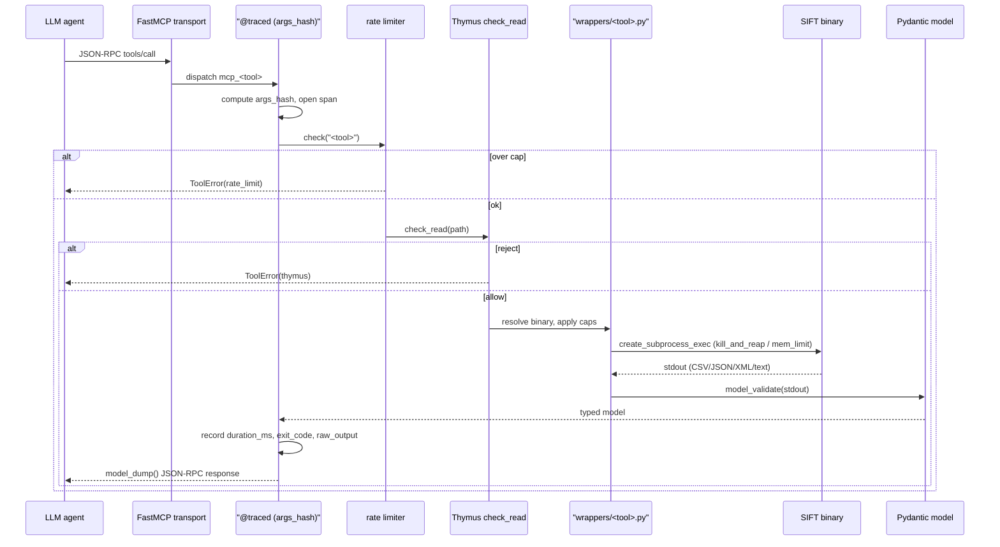

# FastMCP Execution — One Agent Tool Call, Station by Station

> **Section 10 · Agents** — how an agent's tool call *actually executes*. The
> [FastMCP Server](../02-architecture/mcp-server.md) page describes the protocol surface and the
> hardening layers; this page traces **one single call** through every station from the LLM's
> JSON-RPC frame to the JSON-RPC response, contrasts the two transports, and names the honest open
> seam. It is the execution companion to [agentic-architecture.md](agentic-architecture.md).
>
> **Source of truth.** `docs/MCP-REQUEST-FLOW.md`, `docs/ARCHITECTURE-LAYERS.md`,
> `docs/adr/ADR-017-tailnet-mcp-exposure.md`, and
> `src/agentropix_sift/mcp_server/{server.py,_trace.py,thymus_policy.py,fastmcp_app.py}`. Every
> claim cites one of these.

---

## 1. The station-by-station traversal

The portal's other pages describe the *layers* and the *safety spine*; what they do not lay out is
the single-call traversal — what happens, in order, between the LLM frame and the response. Here it
is as a numbered list, then as a sequence diagram. Source: `docs/MCP-REQUEST-FLOW.md` §"Request
flow" + `server.py`.

1. **LLM JSON-RPC frame.** The agent emits an MCP `tools/call` request
   (`docs/MCP-REQUEST-FLOW.md` §"Request flow").
2. **Transport.** FastMCP receives it over **stdio** (in-process) or **HTTP+SSE** under `/mcp`
   (`fastmcp_app.py`; see §2).
3. **`@traced("<tool>")`.** The decorator opens a span and computes the **`args_hash`** — freezing
   the LLM's argument choice before anything runs (`mcp_server/_trace.py`).
4. **Rate limiter.** `_rate_limiter.check("<tool>")` enforces the per-tool calls/min cap
   (`AGENTROPIX_RATE_LIMIT`, default 60); over-limit → `ToolError(rate_limit)` straight back to the
   caller (`server.py::_RateLimiter`).
5. **Thymus `check_read(path)`.** The S-02 evidence-integrity screen: allow-list (static + env-var
   + auto-detect on `.e01`/`.dd`/`.mem`/…), forbidden patterns (`..`, `~`, `/dev/`, `/proc/`,
   `/sys/`), and symlink resolution; reject → `ToolError(thymus)` (`mcp_server/thymus_policy.py`).
6. **Wrapper resolution.** `wrappers/<tool>.py` resolves the binary with `shutil.which(...)` and
   applies env-var timeout floor/ceiling caps (`wrappers/*.py`, `_env.py`).
7. **Subprocess launch.** `await asyncio.create_subprocess_exec(...)` runs the SIFT binary, with
   defensive variants for known wedge paths: `_kill_and_reap` (extract), `run_with_memory_limit`
   (vol3), output-dir lifecycle (bulk_extractor/foremost) (`wrappers/_subprocess.py`).
8. **Binary stdout.** The SIFT binary emits CSV/JSON/XML/text on stdout
   (`docs/MCP-REQUEST-FLOW.md` §"Request flow").
9. **Pydantic `model_validate`.** The wrapper parses stdout into a typed model
   (`PsList` / `FileListing` / `ExtractManifest` / …) — never raw passthrough.
10. **`@traced` finalisation.** The decorator records `duration_ms`, `exit_code`, and the bounded
    `raw_output` snapshot taken **before** any LLM summarisation (`_trace.py`).
11. **JSON-RPC response.** The FastMCP wrapper layer (`fastmcp_app.py`) `.model_dump()`s the result
    onto the wire back to the agent.

Every one of the 71 tools inherits all eleven stations — **there is no opt-out**
(`docs/MCP-REQUEST-FLOW.md` §"What the layer guarantees").

---

## 2. Transport modes: stdio vs HTTP+SSE

The same tool core is reachable over two transports with very different auth and overhead profiles
(`fastmcp_app.py`; `docs/adr/ADR-017-tailnet-mcp-exposure.md`):

| Property | **stdio** (default) | **HTTP+SSE** (`--transport http`) |
|---|---|---|
| Framing | JSON-RPC over stdin/stdout, in-process | HTTP+SSE under `/mcp`, default port 8765 |
| Auth | "whoever launched the process" — process-UID identity (`ADR-017` §"What changes vs local stdio") | Bearer token on every `POST /mcp`; 401 + audited `sha256[:16]` token-hash on miss (`fastmcp_app.py`) |
| Token check | n/a | `secrets.compare_digest` (constant-time), token from `AGENTROPIX_MCP_AUTH_TOKEN` |
| Failure posture | local trust boundary | **fail-closed at boot** — the server refuses to start the HTTP listener without a configured token |
| Exposure | purely in-process, nothing on the wire | tailnet-only by default; `--public` (bind `0.0.0.0`) exists but emits a loud warning (`ADR-017`; `fastmcp_app.py`) |
| Overhead | zero (no network) | ~10–50 ms per call (HTTP + SSE) |
| Default | **yes** — back-compat; the cron verifier exercises stdio (`ADR-017` §"Decision") | opt-in for remote/judge distribution |

> **FastMCP 2.x pin + the bearer-middleware battle-test.** The HTTP path pins FastMCP at the 2.x
> line, and the bearer middleware had to be installed via `app.run(middleware=[...])` rather than a
> route decorator — a fix landed during the 2026-05-23 hardening pass. The portal records this so
> readers don't reintroduce the un-middlewared listener. Authoritative: `fastmcp_app.py`
> (`_add_auth_middleware`), `docs/adr/ADR-017-tailnet-mcp-exposure.md`.

For the protocol-surface view of these transports (the `@app.tool()` registration, the `health()`
probe), see [mcp-server.md](../02-architecture/mcp-server.md) §2.

---

## 3. Three architectural surprises (the judge-facing framing)

These are the three design choices that read as *unfashionable* but are deliberate. The
[Design Decisions](../08-reference/design-decisions.md) page covers the "unfashionable choices"
theme; here is the per-call summary tied to the execution model
(`docs/ARCHITECTURE-LAYERS.md` §4, §6; `docs/MCP-REQUEST-FLOW.md` §"Security model in one sentence"):

1. **Capability-absence, not permission.** Evidence read-only-ness is *structural*: there is **no
   write tool to disable**. The agent "literally cannot mutate evidence; it can only fail to read
   it" (`docs/MCP-REQUEST-FLOW.md`). Thymus `check_write()` exists only as a defence-in-depth
   audit stub that always REJECTs (`thymus_policy.py`). This is stronger than a permission flag —
   you cannot toggle off a capability that was never built.
2. **LLM-proposes, Trinity-disposes — the wall is the layer boundary.** The stochastic LLM lives
   only at Layer 1; from Layer 2 down the system is pure Python + classical binaries. The
   `args_hash` + `raw_output` snapshot is taken **at the boundary**, so the report can prove the LLM
   phrased the request three ways but never touched a fact (`docs/ARCHITECTURE-LAYERS.md` §4 "The
   L1↔L3 Boundary Contract").
3. **Per-run HMAC + sealed session key, not a long-lived KMS cert.** The report seal is
   HMAC-SHA256 over canonicalised JSON with a per-run key written to a mode-0600 `.session-key`
   file — deliberately *not* a long-lived KMS certificate. The defensibility argument is "trust the
   trace ledger and the report seal because the LLM never touched them"
   (`docs/ARCHITECTURE-LAYERS.md` §4, §6.4). See the portal's
   [Audit & Courtroom Seal](../05-safety-forensics/audit-courtroom.md) for the seal pipeline.

---

## 4. The open seam — what catches a malformed LLM call (W-081)

An honest gap, stated plainly: **the Ralph `PreToolUse` validation hook (W-081) is only partially
implemented / OPEN** (`docs/ARCHITECTURE-LAYERS.md` §2, "W-081 … HIGH, P0, OPEN").

- **What W-081 *would* add.** PreToolUse + Stop hooks that intercept the LLM's tool call at the
  Layer 1↔Layer 2 boundary *before* it reaches the wrapper — Ralph self-correction wired into the
  agent loop (`docs/ARCHITECTURE-LAYERS.md` §2).
- **What catches a malformed call today.** Until W-081 lands, the **first deterministic gate that
  rejects a malformed call is the wrapper's own validation**: Pydantic argument parsing plus the
  rate-limiter and Thymus `check_read` in stations 4–6 above. A structurally wrong call fails there
  with a typed `ToolError` rather than being caught earlier by a PreToolUse hook. There is no
  PreToolUse interception layer in front of the wrapper yet.
- **Why it is the named seam.** `docs/ARCHITECTURE-LAYERS.md` ranks W-081 as the single largest
  score-mover in the SANS rubric (Goal 3, Ralph self-correction) and marks it P0/OPEN. The portal
  states it as an open gap rather than implying the hook exists.

> This is the one architecture-doc gap the portal previously did not state. The wrapper's Pydantic
> check is real and effective; the PreToolUse *pre-wrapper* hook is the aspirational piece still
> open.

---

## Where to go next

- The protocol surface and the layer guarantees → [mcp-server.md](../02-architecture/mcp-server.md)
- The determinism/layer map and the boundary contract →
  [component-architecture.md](../02-architecture/component-architecture.md)
- The seal these stations feed → [audit-courtroom.md](../05-safety-forensics/audit-courtroom.md)
- The category overview → [agentic-architecture.md](agentic-architecture.md)
