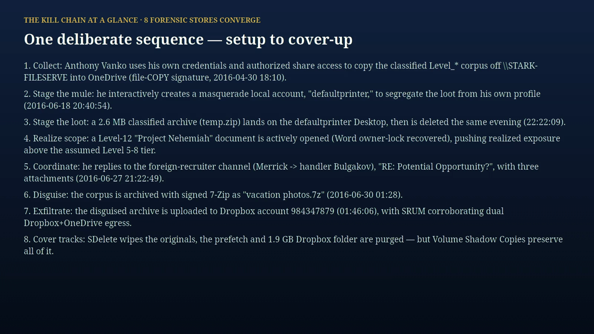

# 12 · Cases Reports

Sealed DFIR case reports — for each investigated case: the full forensic analysis, the indicators of compromise, and the Wazuh evidence captures. Findings are examiner-approved and HMAC-sealed, and every report carries its own honest-caveats section (scope, acquisition limits, what is unproven).

## Cases

### SRL-2015 — Stark Research Labs "APT Enterprise" (4-host intrusion)

Four-host enterprise APT (`win2008R2-controller` DC + 3 workstations): trojanized *USB-over-Ethernet*
C2 service on the DC → explorer process injection (T1055, VB6-packed LZMA self-injecting loader) →
`spinlock.exe` / fake-`svchost.exe` implants → PsExec lateral movement → `vibranium` credential abuse →
archive staging + USB exfil, with timestomping anti-forensics. **2,233 raw findings → 17
examiner-approved** (1 critical / 14 high / 2 medium); 91 IOCs TI-enriched (VT+OTX) → **12
malicious**; **21 malware samples** recovered hash-verified (16 disk-carved + 5 Volatility `malfind`
memory payloads, 9 distinct malicious SHA-256) — samples withheld, custody proven by manifest.

**Read in this order:**

1. [srl-2015-report/README.md](srl-2015-report/README.md) — **how to read, analyze & understand this
   investigation**: per-file map, the full provenance / chain-of-custody section (evidence image →
   SHA-256 → finding → IOC → VT/OTX verdict → Wazuh doc, RAW vs SANITIZED, withheld-by-reference
   hashes), and an "analyze it yourself" guide.
2. [srl-2015-report/reports/SRL-2015-full-report.pdf](srl-2015-report/reports/SRL-2015-full-report.pdf) — the
   complete forensic report (17 approved findings, IOC table, MITRE mapping, Wazuh reconciliation);
   condensed: [executive summary](srl-2015-report/reports/SRL-2015-executive-summary.pdf).
3. [srl-2015-report/deep-analysis/SRL-2015-memory-deep-analysis.md](srl-2015-report/deep-analysis/SRL-2015-memory-deep-analysis.md)
   — static reverse-engineering of the 5 memory-injection payloads (one VB6/LZMA loader family, two
   compiler variants, shipped [YARA rule](srl-2015-report/deep-analysis/srl2015_meminject.yar)).

**Recorded investigation replay** (~53 s, faithful command reenactment of the real 2026-06-10 run —
chapters in [video/README.md](srl-2015-report/video/README.md)):

> ▶ The animation above is the inline GIF replay (auto-plays on GitHub). For full quality:
> **[download the MP4 (1.5 MB)](https://raw.githubusercontent.com/galvangabriel-web/agentropix-mcp/main/docs/12-CASES-REPORTS/srl-2015-report/video/SRL-2015-investigation-web.mp4)**
> and open it locally (any browser/VLC plays it). The
> [asciinema source](srl-2015-report/video/session.cast) is also included.
> *Why no inline player: GitHub's Markdown sanitizer strips `<video>` tags entirely and renders
> `` as a broken image — repo-committed MP4s cannot play inline on github.com.*

---

### SRL-2018 — Stark Research Labs "Compromised Enterprise"

External RDP foothold → dual C2 (Metasploit/Meterpreter + PowerShell Empire) → service persistence → credential theft (SAM-from-VSS, 692-NTLM brute-force) → RD-01⇄FILE lateral hub → collection of user `nfury`'s **Carbonadium** IP → DMZ-FTP exfil, with `csrss.exe` timestomping + secure deletion anti-forensics. 12 examiner-approved findings.

**Read in this order:**

1. [srl-2018-report/SRL-2018-FORENSIC-REPORT.md](srl-2018-report/SRL-2018-FORENSIC-REPORT.md) — the full technical forensic report: attack chain, recovered malware toolkit (9 SHA-256), network/behavioural IOCs, the 12 sealed findings, ATT&CK mapping, and methodology + caveats (renders inline with diagrams).
2. [srl-2018-report/TECHNICAL-APPENDIX.md](srl-2018-report/TECHNICAL-APPENDIX.md) — machine-extracted depth: per-host network sockets (`get_netscan`), the rd-01 injected-code regions (`get_malfind`), and the evtx lateral-movement matrix.
3. [srl-2018-report/WAZUH-IOC-GALLERY.md](srl-2018-report/WAZUH-IOC-GALLERY.md) — 13 Wazuh-dashboard captures of every pushed IOC (findings index in Discover + manager CDB lists).

**Recorded analysis session** (254 agentropix MCP actions, paged for readability):

> ▶ The image above is a poster frame.
> **[Download the full session video (MP4, 19 MB)](https://raw.githubusercontent.com/galvangabriel-web/agentropix-mcp/main/docs/12-CASES-REPORTS/srl-2018-report/training-session-paged.mp4)**
> and open it locally (any browser/VLC plays it).
> *Why no inline player: GitHub's Markdown sanitizer strips `<video>` tags entirely and renders
> `` as a broken image — repo-committed MP4s cannot play inline on github.com, and at
> 19 MB this file exceeds the blob-preview limit ("we can't show files that are this big").*

**Correlate:** same Stark Research Labs org as [SRL-2015](srl-2015-report/README.md) (user `nfury` appears in both) — commodity C2 frameworks here vs SRL-2015's custom in-memory loader; contrast with the malware-free insider case [VANKO](vanko-report/VANKO-FORENSIC-REPORT.md).

---

### VANKO — "The Case of the Abducted Zebrafish" (insider IP theft)

A trusted insider (Anthony Vanko, STARKSURFACE / `PC User`) copied classified zebrafish-DNA and cell-regeneration trade secrets from the StarkResearch file server → masquerade `defaultprinter` staging account → archived + disguised as `vacation photos.7z` → **dual cloud exfil** (Dropbox `984347879` + OneDrive, SRUM-confirmed) → foreign-handler coordination (Russia: Merrick→Bulgakov; China: QQ/CAS at artifact level) → SDelete anti-forensics **defeated by Volume Shadow Copies**. **Not a malware intrusion** — an authorized insider abusing valid access and signed tools. **10 examiner-approved findings** (of 19; 9 refuted by the false-positive gate); egressed to Wazuh (decision ledger seq 139).

**Read in this order:**

1. [vanko-report/VANKO-FORENSIC-REPORT.md](vanko-report/VANKO-FORENSIC-REPORT.md) — the presentation forensic report: attack lifecycle, exfil/buyer-channel architecture, and timeline **diagrams**, the weaponized signed toolchain, IOC mindmap, the 10 sealed findings, ATT&CK mapping, and methodology + honest caveats (renders inline with diagrams).
2. [vanko-report/VANKO-DFIR-REPORT.md](vanko-report/VANKO-DFIR-REPORT.md) — the full legally-defensible 7-section DFIR report: executive summary, scope/methodology, master incident timeline, technical attack narrative (MITRE-mapped), malware & artifact analysis, structured IOCs, and containment/remediation recommendations.
3. [vanko-report/WAZUH-VANKO-GALLERY.md](vanko-report/WAZUH-VANKO-GALLERY.md) — 8 Wazuh-dashboard captures of the operator-authorized egress (10 approved findings in Discover, granular finding detail, MITRE/Threat-Hunting modules, and the manager CDB IOC read-back).

**Forensic evidence presentation** (~9 min) — the 8 key facts, each shown with its cross-source correlated artifacts (proof red-boxed), the technical correlation, and what it means to the case; bookended by the architecture and timeline diagrams:

> ▶ The image above is a poster frame.
> **[Download the full presentation video (MP4, 14 MB)](https://raw.githubusercontent.com/galvangabriel-web/agentropix-mcp/main/docs/12-CASES-REPORTS/vanko-report/findings-presentation.mp4)**
> and open it locally (any browser/VLC plays it). The raw paged action-log playback (76 MCP
> actions, 2:24) is also available:
> [download training-session-paged.mp4 (8 MB)](https://raw.githubusercontent.com/galvangabriel-web/agentropix-mcp/main/docs/12-CASES-REPORTS/vanko-report/training-session-paged.mp4).
> *Why no inline player: GitHub's Markdown sanitizer strips `<video>` tags entirely and renders
> `` as a broken image — repo-committed MP4s cannot play inline on github.com.*

**Correlate:** the no-malware counterpoint to the two intrusion cases — staged-archive exfiltration parallels [SRL-2015](srl-2015-report/README.md) (T1560.001), and anti-forensics defeat (VSS here, timestomp detection there) parallels [SRL-2018](srl-2018-report/SRL-2018-FORENSIC-REPORT.md).
