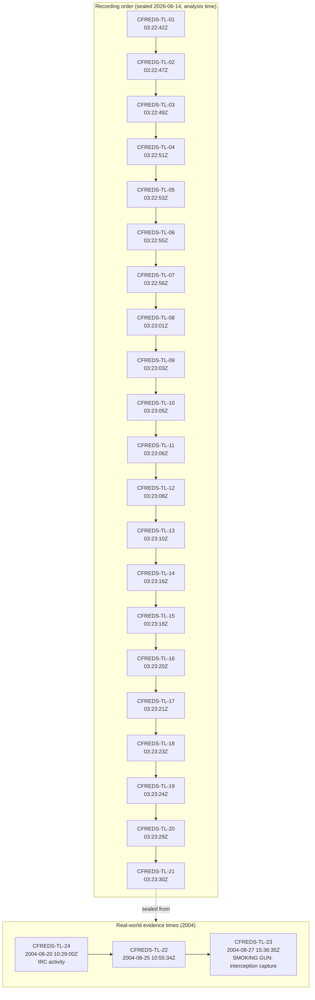

# Analyst / Technical Report — CFREDS-HACKING-CASE-4DELL

> **Likelihood scale (FIRST 5-tier):** almost_certain > highly_likely > likely > unlikely > remote. Likelihood estimates the probability of the assessed activity; it is kept separate from analytic confidence.
>
> **Confidence (LCA):** high / moderate / low — the analyst's confidence in the assessment given evidence quality and corroboration. Distinct from likelihood.

## Findings

### Hacking toolkit installed and executed by user 'Mr. Evil' (Cain, Ethereal, NetStumbler, Look@LAN, Whois, 123WASP, mIRC)
- **Finding ID:** `CFREDS-001-hacking-toolkit`  ·  **Severity:** high  ·  **Likelihood:** unlikely  ·  **Confidence:** moderate  ·  **Risk score:** 8

_Evidence:_ —

### Network sniffing + wireless wardriving capability (WinPcap + Ethereal + Cain + NetStumbler)
- **Finding ID:** `CFREDS-002-sniffing-wardriving`  ·  **Severity:** high  ·  **Likelihood:** unlikely  ·  **Confidence:** moderate  ·  **Risk score:** 8

_Evidence:_ —

### Suspect admin account 'Mr. Evil' with privacy/anonymizer tooling and suspicious batch file
- **Finding ID:** `CFREDS-003-suspect-account-evasion`  ·  **Severity:** medium  ·  **Likelihood:** unlikely  ·  **Confidence:** moderate  ·  **Risk score:** 6

_Evidence:_ —

### Bulk-extractor IOC carve summary (emails/domains/URLs/IPs)
- **Finding ID:** `CFREDS-004-ioc-carve`  ·  **Severity:** info  ·  **Likelihood:** unlikely  ·  **Confidence:** moderate  ·  **Risk score:** 0

_Evidence:_ —

### Suspect real identity: Greg Schardt behind alias 'Mr. Evil'
- **Finding ID:** `CFREDS-EXT-01-suspect-identity-greg-schardt`  ·  **Severity:** high  ·  **Likelihood:** unlikely  ·  **Confidence:** moderate  ·  **Risk score:** 8

_Evidence:_ —

### Suspect Outlook Express email: whoknowsme@sbcglobal.net (display name 'Mr Evil')
- **Finding ID:** `CFREDS-EXT-02-oe-email-whoknowsme`  ·  **Severity:** high  ·  **Likelihood:** unlikely  ·  **Confidence:** moderate  ·  **Risk score:** 8

_Evidence:_ —

### IRC identity ties persona to Undernet (mIRC nick 'Mr Evil')
- **Finding ID:** `CFREDS-EXT-03-irc-identity-undernet`  ·  **Severity:** medium  ·  **Likelihood:** unlikely  ·  **Confidence:** moderate  ·  **Risk score:** 6

_Evidence:_ —

### Removable optical CD 'Jul 28 2004' (serial 1A3AD55E) carried anonymizer + GhostWare tooling and installers
- **Finding ID:** `CFREDS-EXT-04-removable-optical-disc-ghostware`  ·  **Severity:** high  ·  **Likelihood:** unlikely  ·  **Confidence:** moderate  ·  **Risk score:** 8

_Evidence:_ —

### Access to remote SMB share \\4.12.220.254\Temp (host 'm1200') and sensitive files
- **Finding ID:** `CFREDS-EXT-05-remote-share-4-12-220-254`  ·  **Severity:** high  ·  **Likelihood:** unlikely  ·  **Confidence:** moderate  ·  **Risk score:** 8

_Evidence:_ —

### Hashes of recovered hacking-tool binaries (Cain, Ethereal, NetStumbler, Whois)
- **Finding ID:** `CFREDS-EXT-06-exec-hashes-toolkit`  ·  **Severity:** high  ·  **Likelihood:** unlikely  ·  **Confidence:** moderate  ·  **Risk score:** 8

_Evidence:_ —

### Packet-capture and wireless services registered (NPF / rpcapd / wlluc48)
- **Finding ID:** `CFREDS-EXT-07-pcap-wireless-services`  ·  **Severity:** high  ·  **Likelihood:** unlikely  ·  **Confidence:** moderate  ·  **Risk score:** 8

_Evidence:_ —

### UserAssist/prefetch prove execution of sniffing/cracking tools
- **Finding ID:** `CFREDS-EXT-08-userassist-execution`  ·  **Severity:** high  ·  **Likelihood:** unlikely  ·  **Confidence:** moderate  ·  **Risk score:** 8

_Evidence:_ —

### TypedURLs/cache show wardriving and 2600 intent; netstumbler.com browsing
- **Finding ID:** `CFREDS-EXT-09-wardriving-intent-typedurls`  ·  **Severity:** medium  ·  **Likelihood:** unlikely  ·  **Confidence:** moderate  ·  **Risk score:** 6

_Evidence:_ —

### Ethereal packet capture 'interception' saved to Mr. Evil profile
- **Finding ID:** `CFREDS-EXT-10-ethereal-interception-capture`  ·  **Severity:** high  ·  **Likelihood:** unlikely  ·  **Confidence:** moderate  ·  **Risk score:** 8

_Evidence:_ —

### Extensive secondary hacking-tool archive (John the Ripper, pwdump, netcat, NetBus, NAT, etc.)
- **Finding ID:** `CFREDS-EXT-11-additional-hacking-tools`  ·  **Severity:** high  ·  **Likelihood:** unlikely  ·  **Confidence:** moderate  ·  **Risk score:** 8

_Evidence:_ —

### Subscribed to hacking/phreaking newsgroups (alt.2600, alt.binaries.hacking)
- **Finding ID:** `CFREDS-EXT-12-newsgroups-subscribed`  ·  **Severity:** medium  ·  **Likelihood:** unlikely  ·  **Confidence:** moderate  ·  **Risk score:** 6

_Evidence:_ —

### Host configuration: ComputerName N-1A9ODN6ZXK4LQ, Central time zone
- **Finding ID:** `CFREDS-EXT-13-host-config-timezone`  ·  **Severity:** info  ·  **Likelihood:** unlikely  ·  **Confidence:** moderate  ·  **Risk score:** 0

_Evidence:_ —

### RECYCLER held recycled/restored executables (Dc1-Dc4.exe) - deletion activity
- **Finding ID:** `CFREDS-EXT-14-recycler-deleted-execs`  ·  **Severity:** low  ·  **Likelihood:** unlikely  ·  **Confidence:** moderate  ·  **Risk score:** 4

_Evidence:_ —

### SMOKING GUN: Ethereal 'interception' capture contains a third party's Pocket PC MSN/Hotmail session + captured .NET Passport auth cookies
- **Finding ID:** `CFREDS-EXT-15-intercepted-pocketpc-hotmail`  ·  **Severity:** critical  ·  **Likelihood:** unlikely  ·  **Confidence:** moderate  ·  **Risk score:** 10

_Evidence:_ —

### mIRC config confirms Undernet IRC identity (nick Mr / mrevilrulez, ident Mrevil) and C:\Temp fileserver
- **Finding ID:** `CFREDS-EXT-16-mirc-undernet-identity`  ·  **Severity:** medium  ·  **Likelihood:** unlikely  ·  **Confidence:** moderate  ·  **Risk score:** 6

_Evidence:_ —

### Look@LAN install log records real name 'Greg Schardt' in registry (attribution)
- **Finding ID:** `CFREDS-EXT-17-lookatlan-realname`  ·  **Severity:** medium  ·  **Likelihood:** unlikely  ·  **Confidence:** moderate  ·  **Risk score:** 6

_Evidence:_ —

### Inbox.dbx recovery: only the default OE 'Welcome' message — no user email correspondence
- **Finding ID:** `CFREDS-EXT-18-inbox-dbx-recovery`  ·  **Severity:** info  ·  **Likelihood:** unlikely  ·  **Confidence:** moderate  ·  **Risk score:** 0

_Evidence:_ —

### Recovered Usenet content: alt.hacking posts on BIOS password hacking & stealing monster.com employer logins
- **Finding ID:** `CFREDS-EXT-19-newsgroup-content-recovered`  ·  **Severity:** medium  ·  **Likelihood:** unlikely  ·  **Confidence:** moderate  ·  **Risk score:** 6

_Evidence:_ —

### OE account config binds mailbox whoknowsme@sbcglobal.net to the Mr. Evil profile (SBC/Dallas TX)
- **Finding ID:** `CFREDS-EXT-20-oe-account-whoknowsme`  ·  **Severity:** high  ·  **Likelihood:** unlikely  ·  **Confidence:** moderate  ·  **Risk score:** 8

_Evidence:_ —

### CAPSTONE: full correlation — identity chain + attack chain for Greg Schardt / Mr. Evil
- **Finding ID:** `CFREDS-EXT-21-master-correlation`  ·  **Severity:** critical  ·  **Likelihood:** unlikely  ·  **Confidence:** moderate  ·  **Risk score:** 10

_Evidence:_ —

### Threat-intel enrichment (VirusTotal/OTX): Cain.exe confirmed malicious hacktool
- **Finding ID:** `CFREDS-EXT-22-threat-intel-enrichment`  ·  **Severity:** medium  ·  **Likelihood:** unlikely  ·  **Confidence:** moderate  ·  **Risk score:** 6

_Evidence:_ —

### Hash + VT/OTX enrichment of remaining tool binaries and RECYCLER Dc#.exe
- **Finding ID:** `CFREDS-EXT-23-toolkit-hash-enrichment`  ·  **Severity:** medium  ·  **Likelihood:** unlikely  ·  **Confidence:** moderate  ·  **Risk score:** 6

_Evidence:_ —

### mIRC chat logs: suspect joined hacking/warez/shell channels as mrevil/mrevilrulez (2004-08-20)
- **Finding ID:** `CFREDS-EXT-24-irc-chatlogs`  ·  **Severity:** medium  ·  **Likelihood:** unlikely  ·  **Confidence:** moderate  ·  **Risk score:** 6

_Evidence:_ —

### IE browsing history: wardriving/sniffing/hacker sites and toolkit download sources
- **Finding ID:** `CFREDS-EXT-25-ie-history-wardriving`  ·  **Severity:** high  ·  **Likelihood:** unlikely  ·  **Confidence:** moderate  ·  **Risk score:** 8

_Evidence:_ —

### Anti-forensic / anonymity tooling: Anonymizer + GhostWare present
- **Finding ID:** `CFREDS-EXT-26-anonymizer-ghostware`  ·  **Severity:** medium  ·  **Likelihood:** unlikely  ·  **Confidence:** moderate  ·  **Risk score:** 6

_Evidence:_ —

### RECYCLER Dc1-Dc4.exe identified via INFO2 = deleted toolkit installers (Look@LAN, NetStumbler, WinPcap, Ethereal)
- **Finding ID:** `CFREDS-EXT-27-recycler-installers-identified`  ·  **Severity:** medium  ·  **Likelihood:** unlikely  ·  **Confidence:** moderate  ·  **Risk score:** 6

_Evidence:_ —

### Look@LAN saved no scan results (negative); additional IRC = warez/MP3/shell channels + scripted phrase marker
- **Finding ID:** `CFREDS-EXT-28-lookatlan-noscan-extra-irc`  ·  **Severity:** low  ·  **Likelihood:** unlikely  ·  **Confidence:** moderate  ·  **Risk score:** 4

_Evidence:_ —

### Wardriving hardware: Compaq WL110 (ORiNOCO/Agere 802.11b) PCMCIA wireless card installed
- **Finding ID:** `CFREDS-EXT-29-wireless-nic-wardriving-hw`  ·  **Severity:** high  ·  **Likelihood:** unlikely  ·  **Confidence:** moderate  ·  **Risk score:** 8

_Evidence:_ —

### VT/OTX enrichment of new IOCs (browsing domains + wireless driver)
- **Finding ID:** `CFREDS-EXT-30-new-ioc-enrichment`  ·  **Severity:** low  ·  **Likelihood:** unlikely  ·  **Confidence:** moderate  ·  **Risk score:** 4

_Evidence:_ —

### Network activity & lateral-movement summary (adapters, DHCP, SMB reach-out, capture services)
- **Finding ID:** `CFREDS-EXT-31-network-lateral-summary`  ·  **Severity:** high  ·  **Likelihood:** unlikely  ·  **Confidence:** moderate  ·  **Risk score:** 8

_Evidence:_ —

## Indicators of Compromise

_No IOCs extracted._

## Timeline

> Rendered as `flowchart TD` (GitHub/GitLab strict Mermaid rejects the `timeline` type — see the
> portal diagram rules). `CFREDS-TL-01..21` carry the **recording timestamps** (2026-06-14, when each
> event was sealed into the case); `CFREDS-TL-22..24` carry the **real-world evidence timestamps**
> (2004). The narrative kill-chain visual is the [attack execution graph](diagrams/attack-graph.png).

| Timestamp | Host | Event | Phase | Description |
| --- | --- | --- | --- | --- |
| 2026-06-14T03:22:42.707013+00:00 | MR-EVIL | CFREDS-TL-01 | — | — |
| 2026-06-14T03:22:47.987439+00:00 | MR-EVIL | CFREDS-TL-02 | — | — |
| 2026-06-14T03:22:49.394265+00:00 | MR-EVIL | CFREDS-TL-03 | — | — |
| 2026-06-14T03:22:51.760574+00:00 | MR-EVIL | CFREDS-TL-04 | — | — |
| 2026-06-14T03:22:53.629534+00:00 | MR-EVIL | CFREDS-TL-05 | — | — |
| 2026-06-14T03:22:55.064039+00:00 | MR-EVIL | CFREDS-TL-06 | — | — |
| 2026-06-14T03:22:56.509991+00:00 | MR-EVIL | CFREDS-TL-07 | — | — |
| 2026-06-14T03:23:01.840405+00:00 | MR-EVIL | CFREDS-TL-08 | — | — |
| 2026-06-14T03:23:03.677970+00:00 | MR-EVIL | CFREDS-TL-09 | — | — |
| 2026-06-14T03:23:05.534384+00:00 | MR-EVIL | CFREDS-TL-10 | — | — |
| 2026-06-14T03:23:06.935484+00:00 | MR-EVIL | CFREDS-TL-11 | — | — |
| 2026-06-14T03:23:08.941250+00:00 | MR-EVIL | CFREDS-TL-12 | — | — |
| 2026-06-14T03:23:10.612429+00:00 | MR-EVIL | CFREDS-TL-13 | — | — |
| 2026-06-14T03:23:16.631107+00:00 | MR-EVIL | CFREDS-TL-14 | — | — |
| 2026-06-14T03:23:18.530364+00:00 | MR-EVIL | CFREDS-TL-15 | — | — |
| 2026-06-14T03:23:20.405968+00:00 | MR-EVIL | CFREDS-TL-16 | — | — |
| 2026-06-14T03:23:21.828479+00:00 | MR-EVIL | CFREDS-TL-17 | — | — |
| 2026-06-14T03:23:23.702948+00:00 | MR-EVIL | CFREDS-TL-18 | — | — |
| 2026-06-14T03:23:24.768494+00:00 | MR-EVIL | CFREDS-TL-19 | — | — |
| 2026-06-14T03:23:29.269379+00:00 | MR-EVIL | CFREDS-TL-20 | — | — |
| 2026-06-14T03:23:30.916116+00:00 | MR-EVIL | CFREDS-TL-21 | — | — |
| 2004-08-25T10:55:34Z | MR-EVIL | CFREDS-TL-22 | — | — |
| 2004-08-27T15:36:35Z | MR-EVIL | CFREDS-TL-23 | — | — |
| 2004-08-20T10:29:00Z | MR-EVIL | CFREDS-TL-24 | — | — |
