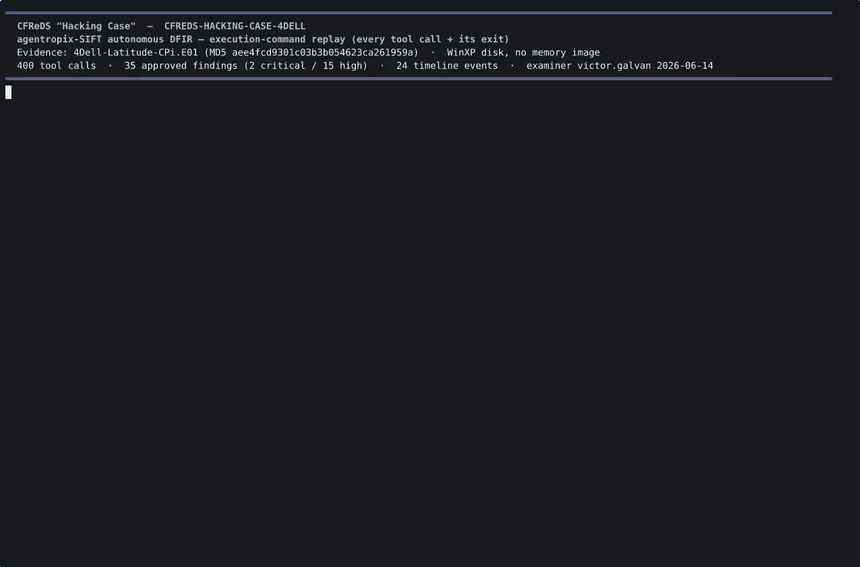
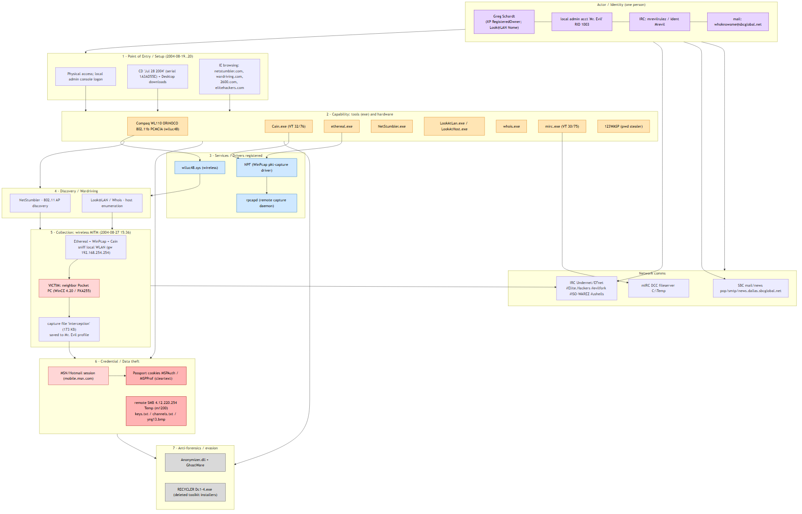

# CFReDS "Hacking Case" — Greg Schardt / "Mr. Evil" (unauthorized wireless interception)

Case folder for **CFREDS-HACKING-CASE-4DELL** — the NIST **CFReDS "Hacking Case"** (a public,
widely-taught disk-forensics scenario). The standalone Windows XP laptop of **Greg Schardt** (alias
**"Mr. Evil"**, local admin RID 1003) was used to conduct **unauthorized wireless interception**:
using a Compaq WL110 ORiNOCO 802.11b card with WinPcap + Ethereal + Cain & Abel, and
NetStumbler/Look@LAN for discovery, the actor captured a neighboring **Pocket PC's MSN/Hotmail
session** including cleartext **.NET Passport `MSPAuth`/`MSPProf`** authentication cookies
(2004-08-27 15:36 GMT). Identity is corroborated across the local admin account, the Outlook Express
mailbox `whoknowsme@sbcglobal.net`, the IRC persona `mrevilrulez`, and a Look@LAN registry value
recording the real name "Greg Schardt". Anti-forensic tooling (Anonymizer, GhostWare) and deleted
toolkit installers were also recovered. **A single-host disk case** — no enterprise lateral movement,
no memory image (Volatility N/A).

**35 examiner-approved findings** (2 critical / 15 high), **24 timeline events**, 93 IOCs staged —
all HMAC-sealed and approved by examiner `victor.galvan` on 2026-06-14.

> **Provenance:** evidence `4Dell-Latitude-CPi.E01` (MD5 `aee4fcd9301c03b3b054623ca261959a`), the
> public CFReDS "Hacking Case" image. This bundle is the **real Agentropix-SIFT autonomous run** over
> that image (single Claude-Code agent on `claude-opus-4-8[1m]` + one embedded multi-agent forensic
> workflow; 400 tool calls). All findings are disk-derived; recovered tool binaries are referenced by
> hash only (samples not republished here).

## Read in this order

1. [`CFREDS-executive.md`](CFREDS-executive.md) — **executive summary**: KPIs, the verdict, and the
   17 critical/high findings in plain language.
2. [`CFREDS-analyst.md`](CFREDS-analyst.md) — **analyst / technical report**: the 35-finding table,
   the full reconstructed **2004 kill-chain timeline** (profile creation → toolkit install → wireless
   recon → the 15:36 interception → clean shutdown), the **Key IOCs** (identity, email, IPs, captured
   creds, tool hashes with VT ratios, hardware, services), and the **honest negatives / scope**.
3. [`diagrams/attack-graph.png`](diagrams/attack-graph.png) — the **attack execution graph**
   (identity chain + kill-chain, one visual). Sources and a landscape variant are in
   [`diagrams/`](diagrams/).
4. [`audit/PROJECT-agent-execution-log.md`](audit/PROJECT-agent-execution-log.md) — the **agent
   execution log**: token usage, the 400-call tool-execution summary, the embedded forensic
   sub-agents, and a step-by-step trace. Machine-readable trace + per-agent rollup in
   [`audit/`](audit/). The same trace is replayed as a video below — the
   **[execution-command replay](#recorded-execution-command-replay-5-min-22-s)** (every tool call + its exit).
5. [`CFREDS-HACKING-CASE-4DELL-executive.md`](CFREDS-HACKING-CASE-4DELL-executive.md) /
   [`CFREDS-HACKING-CASE-4DELL-analyst.md`](CFREDS-HACKING-CASE-4DELL-analyst.md) — the **full
   server-rendered tier** (every finding by stable Finding-ID with likelihood/confidence/risk-score,
   cross-linked executive↔analyst).
6. [`CFREDS-report.html`](CFREDS-report.html) — **self-contained HTML report** (inline vector attack
   graph + legend + findings + IOCs + timeline). *GitHub shows `.html` as source — download it and
   open locally for the rendered single-file report.*

## Recorded execution-command replay (5 min 22 s)

A faithful terminal replay of the autonomous run — **every one of the 400 tool calls paired with its
result/exit**, the 68 honest errors/recoveries highlighted in red, reconstructed from
[`audit/tool-execution-trace.jsonl`](audit/tool-execution-trace.jsonl) by
[`make_execution_replay.py`](make_execution_replay.py).

> ▶ The animation above is an inline **teaser loop** (auto-plays on GitHub — title → a real
> tool-error self-correction → findings → seal). GitHub can't inline-play the full repo MP4, so for
> the complete 5 min 22 s run **click the teaser** for the GitHub Pages player, or
> ***[download the MP4 (13.5 MB)](https://raw.githubusercontent.com/galvangabriel-web/agentropix-mcp/main/docs/12-CASES-REPORTS/cfreds-hacking-case-report/EXECUTION-REPLAY.mp4)*** (poster: `EXECUTION-REPLAY-poster.png`).
> The [asciinema source](EXECUTION-REPLAY.cast) is included; regenerate with
> `python make_execution_replay.py && agg --cols 150 --rows 42 --font-size 14 --fps-cap 30 --theme github-dark EXECUTION-REPLAY.cast EXECUTION-REPLAY.gif`.

## Attack execution graph

## Headline numbers

| Metric | Value |
|---|---|
| Approved findings | **35** (2 critical · 15 high · the rest medium/low/info) |
| Timeline events | **24** (21 sealed at analysis time + 3 real-world 2004 anchors) |
| IOCs staged | **93** (promotion pending an examiner-minted evidence-gate token) |
| Suspect | Greg Schardt — alias "Mr. Evil" (local admin RID 1003) |
| Offense | Unauthorized wireless interception of a third party's web-mail session + credentials |
| Host | MR-EVIL (`N-1A9ODN6ZXK4LQ`, Dell Latitude CPi, Windows XP, Central time zone) |
| Evidence | `4Dell-Latitude-CPi.E01` · MD5 `aee4fcd9301c03b3b054623ca261959a` |
| Run | Single-agent (`claude-opus-4-8[1m]`) + embedded multi-agent workflow · 400 tool calls · 2026-06-14 |

## The two smoking-gun findings

- **CFREDS-EXT-15** (critical) — the Ethereal `interception` capture (173,372 bytes, saved to the
  Mr. Evil profile) contains a **third party's** Pocket PC (WinCE/PXA255) MSN/Hotmail session and the
  captured **.NET Passport `MSPAuth`/`MSPProf`** cookies (WLAN gateway `192.168.254.254`).
- **CFREDS-EXT-21** (critical) — the **capstone correlation**: the identity chain (Greg Schardt →
  "Mr. Evil" → `mrevilrulez` → `whoknowsme@sbcglobal.net`) joined to the attack chain (toolkit →
  wireless recon → interception) in a single sealed finding.

## Subfolder guides

| Path | Contents |
|---|---|
| [`diagrams/`](diagrams/) | Attack execution graph — `attack-graph.png` (portrait) / `attack-graph-lr.png` (landscape) / `attack-graph.svg` (vector) + Mermaid (`.mmd`/`-lr.mmd`), Graphviz (`.dot`), and the annotated [`attack-graph.md`](diagrams/attack-graph.md) with legend. |
| [`audit/`](audit/) | [`PROJECT-agent-execution-log.md`](audit/PROJECT-agent-execution-log.md) (the human-readable agent execution log), `tool-execution-trace.jsonl` (1,003-step machine trace), `workflow-agents.jsonl` (per-sub-agent rollup), `execution-dashboard.{png,svg}`, and the `build-*.py` regenerators. |
| `EXECUTION-REPLAY.mp4` | The **execution-command replay video** (5 min 22 s) — inline teaser `EXECUTION-REPLAY-teaser.gif`, poster `EXECUTION-REPLAY-poster.png`, asciinema source `EXECUTION-REPLAY.cast`, built by [`make_execution_replay.py`](make_execution_replay.py) from the audit trace. |
| [`approve-all-findings.ps1`](approve-all-findings.ps1) | Examiner batch-approval helper (the 35 Finding-IDs) — passwords read via secure prompt / env / DPAPI, sent only to the W-288 approval sidecar over TLS; the agent cannot self-approve (W-286 draft-gate). |
| [`build-report.py`](build-report.py) | Generator for the self-contained `CFREDS-report.html`. |
| [`MANIFEST.txt`](MANIFEST.txt) | Original deliverable manifest (bundle file list + verdict). |

## Honest caveats / scope

- **Single standalone WinXP workgroup host** — no domain, no second host, **no enterprise lateral
  movement** (no RDP/PsExec/Pass-the-Hash). The "lateral" activity is an outbound SMB browse of the
  remote share `\\4.12.220.254\Temp`.
- **No memory image** — Volatility is N/A; every execution claim is grounded in **disk** artifacts
  (registry hives, Prefetch/UserAssist, ShellBags, `INFO2`, `.evt` event logs, browser history).
- XP **`.evt`** logs (not `.evtx`); `Security.evt` was empty; Amcache skipped (Win7+ artifact).
- Negative results kept honest: Look@LAN saved no scan-results file; NetStumbler saved no `.ns1`
  session; `Inbox.dbx` held only the default OE "Welcome" message.
- The **93 IOCs are staged**, not promoted — index promotion requires an examiner-minted evidence-gate
  mutation token (CLI action), preserving the human-in-the-loop control.
- The CFReDS "Hacking Case" is a **public training image**; "Greg Schardt / Mr. Evil" is the
  scenario's documented subject, not a private individual.

---

## 🚀 Run / reproduce / extend this yourself

The CFReDS "Hacking Case" is the project's **fully-public, end-to-end reproduce loop** — every step is open:

1. **Download** the evidence — `4Dell-Latitude-CPi.E01` (MD5 `aee4fcd9301c03b3b054623ca261959a`) via [reproduce-datasets.md](../../06-use-cases/reproduce-datasets.md).
2. **Install & configure** — [main README → Deploy hub](../../../README.md) · [quickstart](../../01-overview/quickstart.md) · [client setup](../../09-integrations/client-setup.md).
3. **Run** the disk-triage prompt on it — [try-it-end-to-end.md](../../01-overview/try-it-end-to-end.md) · per-case [activation guide](../../../case-activation/cfreds-hacking-case-4dell.md).
4. **Compare** your findings against this sealed deliverable (35 approved findings, the attack graph, the audit trace).
5. **Extend** the engine — add a SwarmAgent / detector / tool: [extend-the-swarm.md](../../10-agents/extend-the-swarm.md).
