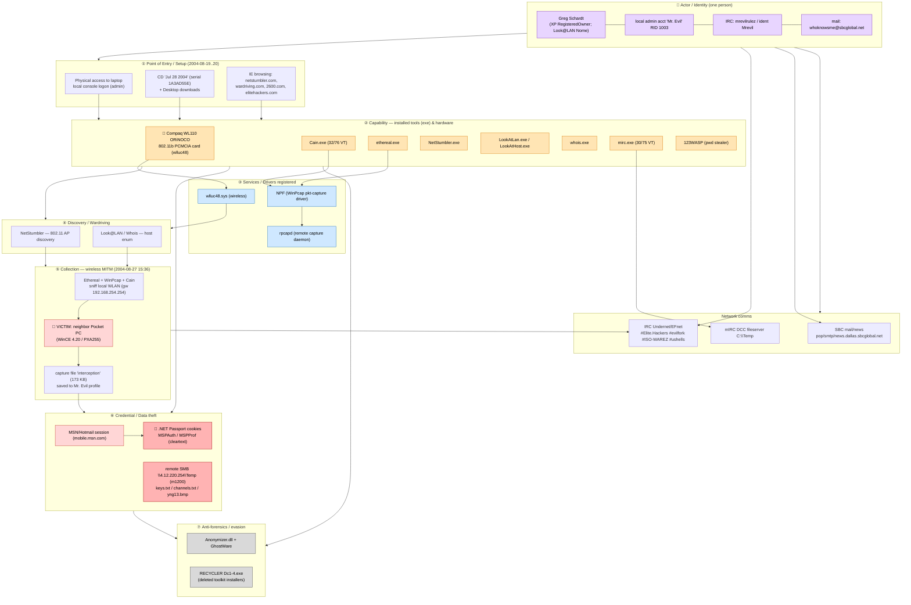

# CFReDS "Hacking Case" — Attack Execution Graph
Case `CFREDS-HACKING-CASE-4DELL` · Host **MR-EVIL** (N-1A9ODN6ZXK4LQ, Dell Latitude CPi, WinXP) · Actor **Greg Schardt / "Mr. Evil"**

## Legend / element inventory
| Type | Elements |
|---|---|
| **Entry** | local admin console logon; CD `1A3AD55E`; Desktop installers; hacker-site browsing |
| **Executables** | Cain.exe, ethereal.exe, NetStumbler.exe, LookAtLan/LookAtHost.exe, whois.exe, mirc.exe, 123WASP |
| **Services/drivers** | NPF (WinPcap), rpcapd, wlluc48.sys |
| **Hardware** | Compaq WL110 ORiNOCO 802.11b PCMCIA |
| **Captured/compromised files** | `interception` (pcap); MSPAuth/MSPProf cookies; remote `keys.txt`,`channels.txt`,`yng13.bmp` |
| **Victim** | neighbor Pocket PC (WinCE/PXA255) via gw 192.168.254.254 |
| **Anti-forensics** | Anonymizer.dll, GhostWare, deleted RECYCLER Dc1-4 installers |
| **MITRE** | T1078.003 · T1588.002 · T1592.001 · T1016/T1018 · T1040 · T1557 · T1539 · T1021.002 · T1070.004 |
