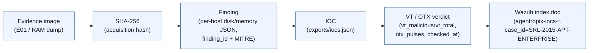
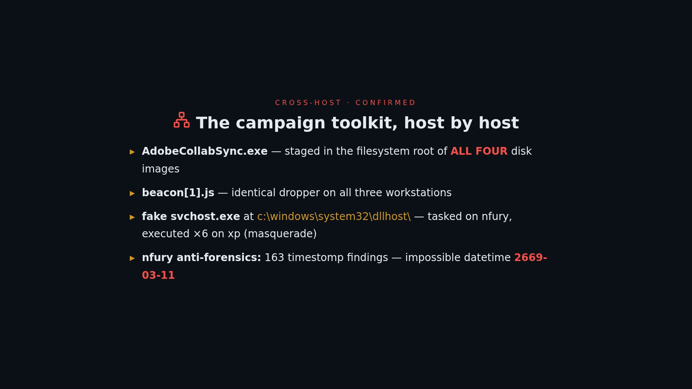
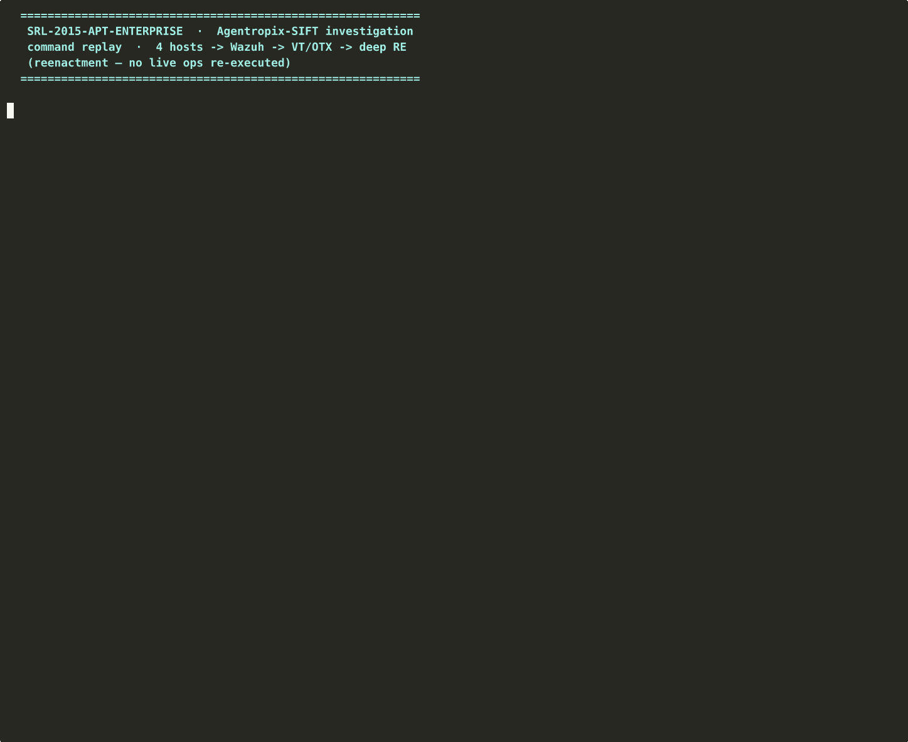

# SRL-2015-APT-ENTERPRISE — How to read, analyze & understand this investigation

> **Evaluator's guide.** This folder is the complete, sanitized deliverable of a real
> Agentropix-SIFT pipeline run (2026-06-10) against the *Stark Research Labs 2015* enterprise-APT
> evidence set. Everything in here is real tool output; nothing is mocked. Live malware, raw
> evidence images, and secrets are **withheld by reference** — their SHA-256 hashes are published
> below so every withheld byte stays provable without being shipped.

## 1. Case summary

**SRL-2015-APT-ENTERPRISE** is a four-host enterprise intrusion: a domain controller
(`win2008R2-controller`), two Windows 7 workstations (`win7-32-nromanoff`, `win7-64-nfury`) and a
Windows XP machine (`xp-tdungan`), each contributing a disk image and a memory source. The
autonomous DFIR swarm produced **2,233 raw findings** (≈2,874 evidence documents indexed in Wazuh),
distilled to **17 examiner-approved findings** (1 critical, 14 high, 2 medium) spanning the full
kill chain — a trojanized *USB-over-Ethernet* C2 service on the DC (T1543.003), explorer process
injection (T1055), `spinlock.exe`/fake-`svchost.exe` implants, PsExec lateral movement, credential
abuse of the `vibranium` account, RD-staged collection, archive staging and USB exfiltration, plus
timestomping/indicator-removal anti-forensics. Threat-intel enrichment (VirusTotal + OTX) of the
**91-IOC** set returned **12 malicious IOCs**; **21 malware samples** were recovered and
hash-verified into quarantine — **16 carved from the disk images + 5 in-RAM injected code regions**
(Volatility 3 `malfind`) — covering **9 distinct malicious SHA-256** (4 on-disk families, 5
memory-only payloads). A follow-on static reverse-engineering pass identified the memory payloads
as a single **VB6-packed LZMA self-injecting loader family** (2 compiler variants) and shipped a
YARA rule for it.

## 2. What every file is — folder-by-folder

| Path | What it is | Why you'd open it |
|---|---|---|
| [`INDEX.md`](INDEX.md) | The deliverable's own index: headline numbers with per-metric source, file map, and the **sealed source-deliverable SHA-256 list** | First stop; the integrity baseline referenced in §3.4 |
| [`AGENT-EXECUTION-LOGS-REPORT-SRL2015.md`](AGENT-EXECUTION-LOGS-REPORT-SRL2015.md) | **Agent Execution Logs** for the full-engine pipeline over this case: 8 sealed runs (4 hosts × disk/memory, 2,233 findings), the 13-agent communication chain, timestamped A2A message log, 15-iteration persistent-loop traces, cross-host APT correlation (spinlock.exe → DC), and the integrity/Thymus attestation — 82 claims, every one cited `[host/modality $.jsonpath = value]` | Submission requirement #8, multi-host edition |
| **`reports/`** | | |
| [`reports/SRL-2015-full-report.pdf`](reports/SRL-2015-full-report.pdf) / [`.html`](reports/SRL-2015-full-report.html) | Complete forensic report rendered from the MCP `report_generate(profile=full)` payload: all 17 approved findings, per-host detail, IOC table, MITRE mapping, Wazuh reconciliation screenshots, methodology | The human-readable case file |
| [`reports/SRL-2015-executive-summary.pdf`](reports/SRL-2015-executive-summary.pdf) / [`.html`](reports/SRL-2015-executive-summary.html) | Leadership summary: scope, headline counts, malicious IOCs, recommended actions | 5-minute read |
| **`exports/`** | | |
| [`exports/iocs.csv`](exports/iocs.csv) / [`iocs.json`](exports/iocs.json) | All **91 IOCs** with TI verdicts — tally: 12 malicious / 37 clean / 42 unknown / 0 suspicious; each row carries `vt_malicious/vt_total`, `otx_pulses`, providers, first host, source, check timestamp | The machine-readable IOC ground truth |
| [`exports/iocs-stix.json`](exports/iocs-stix.json) | STIX 2.1 bundle (92 objects) of the same IOC set | SIEM/TIP ingestion |
| [`exports/ear.csv`](exports/ear.csv) / [`ear.json`](exports/ear.json) | Executable Attribution Report: 17 PE inventory entries, **1 suspect** (`femc.exe` — the controller RAM malfind payload) | "Which executables ran, and which is bad?" |
| [`exports/_build_exports.py`](exports/_build_exports.py) | The exact script that built the exports (TI report ∪ ES bundle → CSV/JSON/STIX/EAR) | Reproducibility / audit of the export logic |
| **`deep-analysis/`** | | |
| [`deep-analysis/SRL-2015-memory-deep-analysis.md`](deep-analysis/SRL-2015-memory-deep-analysis.md) / [`.pdf`](deep-analysis/SRL-2015-memory-deep-analysis.pdf) | Static reverse-engineering report on the 5 malfind payloads: VB6-packed LZMA loader family, 2 variants, injection mechanism, negative C2-config result | The "what *is* this malware" answer |
| [`deep-analysis/INJECTION-ANALYSIS.md`](deep-analysis/INJECTION-ANALYSIS.md) | Condensed disassembly walkthrough: header, JMP stub, plaintext-name API resolution, VirtualAlloc→LZMA-decode→VirtualFree flow | Quick technical core of the RE work |
| [`deep-analysis/deep-findings.json`](deep-analysis/deep-findings.json) | The 10 structured deep-RE findings (run `srl2015-deep-mem-20260610`), MITRE-mapped, static-only methodology stated | Machine-readable RE findings |
| [`deep-analysis/disasm-variantA.txt`](deep-analysis/disasm-variantA.txt) / [`disasm-variantB.txt`](deep-analysis/disasm-variantB.txt) | Full real `objdump`/capstone i386 disassembly of both code variants | Verify every RE claim against raw disasm |
| [`deep-analysis/strings-all.txt`](deep-analysis/strings-all.txt) / [`ioc-config-summary.txt`](deep-analysis/ioc-config-summary.txt) | Strings output and the XOR/base64 config-sweep result (0 recoverable network IOCs) | The negative-evidence record |
| [`deep-analysis/srl2015_meminject.yar`](deep-analysis/srl2015_meminject.yar) | YARA rule `SRL2015_MemInject_VB_Family` — fires on all 5 samples | Take-away detection |
| [`deep-analysis/screenshots/`](deep-analysis/screenshots/) | Wazuh Discover captures of the pushed deep-RE findings (list, JSON doc, MITRE table) | Visual proof the findings landed in the index |
| **`quarantine/`** | | |
| [`quarantine/MANIFEST.csv`](quarantine/MANIFEST.csv) | One row per quarantined sample (21): in-zip name, original path, host, expected IOC hash, re-computed carved SHA-256, `verified` flag (all `Y`, 0 mismatches), size | **The chain-of-custody anchor** for every withheld sample |
| [`quarantine/README.txt`](quarantine/README.txt) | Handling warnings, carve provenance (read-only `ewfmount` of the E01s), and the honest list of what was *not* carved and why | Carve methodology + negative results |
| `quarantine/srl2015-samples.zip` | **NOT PUBLISHED — live malware.** Withheld by reference; SHA-256 in §3.4 | — |
| **`video/`** | | |
| [`video/README.md`](video/README.md) | Guide to the replay video: chapters, formats, honest "reenactment, not live capture" note | Start here for the video |
| [`video/SRL-2015-investigation-web.mp4`](video/SRL-2015-investigation-web.mp4) / [`.mp4`](video/SRL-2015-investigation.mp4) / [`.gif`](video/SRL-2015-investigation.gif) | ~53 s command replay of the whole investigation (intake → swarm → Wazuh push → TI → quarantine → deep RE) | See the run end-to-end |
| [`video/session.cast`](video/session.cast) / [`playback.sh`](video/playback.sh) / [`render.sh`](video/render.sh) | asciinema source, the replay command timeline, and the render pipeline | Re-render or audit the replay |
| **MCP payloads (root)** | | |
| [`full_report.json`](full_report.json) / [`exec_report.json`](exec_report.json) | The raw structured `report_generate` results (profile `full` / `executive`): report IDs, snapshot timestamps, the 17 approved findings, severity mix, IOC section | The machine truth the PDFs were rendered from |
| [`full_payload.json`](full_payload.json) / [`exec_payload.json`](exec_payload.json) | The verbatim JSON-RPC envelopes returned by the MCP server for those two calls | Prove the reports came from real MCP calls |
| [`full_err.txt`](full_err.txt) / [`exec_err.txt`](exec_err.txt) | stderr of the two calls — both **0 bytes** (clean runs) | Negative-error evidence |
| [`build_html.py`](build_html.py) | The script that rendered the HTML/PDF reports from the JSON payloads | Reproducibility of the report rendering |

## 3. Provenance / chain of custody

Every datum in this deliverable traces along one auditable chain:

### 3.1 Evidence sources (RAW — withheld, hashes published)

The eight evidence sources processed by the pipeline, with the SHA-256 recorded in each per-host
run JSON (`evidence_image_sha256` field of the pipeline's `disk.json`/`memory.json`):

| Host | Source (under `/cases/SRL-2015/`) | Kind | SHA-256 |
|---|---|---|---|
| win2008R2-controller | `win2008R2-controller-c-drive.E01` | Disk (EWF) | `389ea6b4969cc132ac9a3f28fa572ffc588442ca25ec04bea059b52fd6db4e7e` |
| win2008R2-controller | `win2008R2-controller-memory-raw.001` | RAM dump | `0980b543e6f659091ff4645c2b92771ede45c664e56dc754d420beeeae770edd` |
| win7-32-nromanoff | `win7-32-nromanoff-c-drive.E01` | Disk (EWF) | `f92662135db8d1a5eb33de5b391186c1242b59641db1ba96b3e4ff52a5a1e5b6` |
| win7-32-nromanoff | `Win7SP1x86-baseline.img` † | Memory baseline | `9e3b1e49cee1b67b0fd2a13223ea3825f06317a1677a6c5471202e38ccfd4f8e` |
| win7-64-nfury | `win7-64-nfury-c-drive.E01` | Disk (EWF) | `a5df0b38ec699656e8c9925ffa515945288aaa32cd29c284fb519cf06d1589c7` |
| win7-64-nfury | `win7-64-nfury-memory-raw.001` | RAM dump | `0b53c16973774007244b82d6e777f669ee17224e8aa8c5fc98954196a27c9f5b` |
| xp-tdungan | `xp-tdungan-c-drive.E01` | Disk (EWF) | `117511847d05cf3a52397b6800015b98d77fa3c8a31088a2592709825e402eb0` |
| xp-tdungan | `XPSP3x86-baseline.img` † | Memory baseline | `2d721439861fc433143bebdd2e4a7285b571dc1517dfafef6874f0fd32005c24` |

† **Honest caveat:** per-host RAM dumps existed only for the controller and `win7-64-nfury`. The
memory runs for `win7-32-nromanoff` and `xp-tdungan` executed against OS-matched *baseline* images
(10 findings each) — which is exactly why all 5 `malfind` payloads (manifest rows 17–21) come from
the controller and nfury dumps only.

### 3.2 Worked chain example A — on-disk dropper `a.exe`

1. **Evidence image:** `xp-tdungan-c-drive.E01`, SHA-256 `1175 1184…` (table above) — mounted
   read-only (`ewfmount` + NTFS `ro,loop`); never written.
2. **Finding:** the per-host disk run attributes `a.exe` in four user Temp dirs (e.g.
   `/Documents and Settings/tdungan/Local Settings/Temp/a.exe`); the same hash also appears on
   nfury and nromanoff — feeding approved findings such as `srl2015-exec-psexec-system` /
   `srl2015-lateral-psexec-hub` ([`full_report.json`](full_report.json)).
3. **IOC:** sha256 `598e53b69c71643db559c197db757363c48a30bb26b6486db2153bd417701dec` in
   [`exports/iocs.json`](exports/iocs.json).
4. **TI verdict:** `malicious` — VirusTotal **52/76**, providers `otx|virustotal`, checked
   2026-06-10T18:39:55Z (recorded in the same IOC row).
5. **Wazuh doc:** the IOC lives in `agentropix-iocs-*` on the evidence cluster
   (`https://<WAZUH-INDEXER>:9200`, `case_id=SRL-2015-APT-ENTERPRISE`) — see the `iocs` section of
   [`full_report.json`](full_report.json) and the Discover screenshots embedded in the full report.
6. **Custody closure:** eight copies of that file were carved (manifest rows 03–10: 2× nromanoff,
   2× nfury, 4× xp-tdungan), each
   re-hashed **after** copy; `carved_sha256 == expected_hash`, `verified=Y` in
   [`quarantine/MANIFEST.csv`](quarantine/MANIFEST.csv). The bytes themselves stay in the withheld
   quarantine zip (§3.4).

### 3.3 Worked chain example B — memory-only payload (`femc.exe`, pid 151132)

1. **Evidence image:** `win2008R2-controller-memory-raw.001`, SHA-256 `0980 b543…`.
2. **Finding:** Volatility 3 `windows.malfind` flags an 8192-byte RWX injected region at
   `VAD@0x20000` in pid 151132 (`femc.exe`) → approved finding `srl2015-dc-explorer-injection`
   family (T1055).
3. **IOC:** sha256 `dd8ac01d1d5e8865592443dc07faf1034fcc515f6522b2918ec7dc8bfe203ebd` —
   **malicious**, VT 1/71 ([`exports/iocs.json`](exports/iocs.json)); flagged as the single
   `suspect=true` entry in [`exports/ear.json`](exports/ear.json).
4. **Wazuh doc:** same `agentropix-iocs-*` index, `case_id=SRL-2015-APT-ENTERPRISE`.
5. **Custody closure:** the region was re-extracted from the RAM dump, re-hashed, and matched
   (`verified=Y`, manifest row 20: `20_win2008R2-controller_malfind_pid151132_femc.bin`).
6. **Deep analysis:** that very sample is "Variant B" in
   [`deep-analysis/SRL-2015-memory-deep-analysis.md`](deep-analysis/SRL-2015-memory-deep-analysis.md),
   with its full disassembly in [`disasm-variantB.txt`](deep-analysis/disasm-variantB.txt) and a
   YARA detection in [`srl2015_meminject.yar`](deep-analysis/srl2015_meminject.yar).
   Note the legit `\Program Files\F-Response\femc.exe` on disk does **not** match this hash — the
   malicious hash exists only in RAM (documented in [`quarantine/README.txt`](quarantine/README.txt)).

### 3.4 RAW vs SANITIZED — what is published, what is withheld

**Withheld by reference** (origin provable via SHA-256, bytes not shipped):

| Withheld item | Why withheld | SHA-256 proof |
|---|---|---|
| `quarantine/srl2015-samples.zip` (21 live malware samples) | Live malware — never published | zip: `7c4e6dd1a01e713adc6768eadcb73c9976057ebc1514c007bb3be815e9e371d0`; **every sample's individual SHA-256 is in [`quarantine/MANIFEST.csv`](quarantine/MANIFEST.csv)** |
| 8 raw evidence images (E01 / RAM / baseline) | Raw evidence, multi-GB | per-image SHA-256 table in §3.1 |
| Pipeline working set `SRL2015-PIPELINE-V2/` (full ES dump + scripts) | Contains unsanitized internal endpoints | referenced by exact path in [`exports/_build_exports.py`](exports/_build_exports.py) and [`INDEX.md`](INDEX.md); its derived aggregates (`iocs.*`, `ear.*`) are published here. **Update 2026-06-13:** the working set's evidentiary cores are now **published** (sanitized) — see "Now published" below |
| Wazuh cluster endpoint + credentials | Secrets / internal infrastructure | scrubbed to `<WAZUH-INDEXER>` / `<INTERNAL-IP>` placeholders — no hash published for secrets, by design |

**Now published (operator decision 2026-06-13)** — the raw artifacts that back the report's
headline numbers, copied from the working set with only infrastructure identifiers scrubbed:

| Published item | Proves | Folder |
|---|---|---|
| 8 per-host `disk.json`/`memory.json` (unmodified) | the **2,233** finding aggregation (per-host breakdown sums to 2,233) | [`pipeline-findings/`](pipeline-findings/) |
| `ti-report.json` (Wazuh endpoint + local path scrubbed) | the **12 malicious** IOC verdicts (upstream of `exports/iocs.*`) | [`enrichment/`](enrichment/) |
| Wazuh push receipts + pipeline summaries (already clean) | the dry-run → live push, the blocked second push, **VANKO preserved** | [`wazuh-push-receipts/`](wazuh-push-receipts/) |
| Discover capture | the **2,874** live evidence-document count | [`wazuh-push-receipts/discover-findings-count-2874.png`](wazuh-push-receipts/discover-findings-count-2874.png) |

**Published-but-sanitized** files: the copies in this folder had internal IPs/hostnames replaced
with placeholders (`<WAZUH-INDEXER>`, `<INTERNAL-IP>`) **after** the source deliverable was sealed.
That redaction (and only that) is why their published SHA-256 differs from the sealed source hash
recorded in [`INDEX.md`](INDEX.md):

| File | Published SHA-256 (this folder) | Sealed source SHA-256 ([`INDEX.md`](INDEX.md)) | Delta |
|---|---|---|---|
| `exports/iocs.json` | `56b01190c6b5ef89b65d1d1781acbce164533a3b99062ba3601f66f101f0439f` | `1bafbce22a986ae00df735cba6752763ec1a2c6faaaff4b8a1d616a24f459eb8` | ES endpoint + 1 internal IPv4 → placeholders |
| `exports/iocs.csv` | `56f5d53f0cf09dc8449b552cdf4a3ef310fa08fed8dd27fe619b159efd439c54` | `155b2a83e1ef64e9b26df66a421b12d5a4d3ff1c6656dcfcc6a88845cefaf2d7` | 1 internal IPv4 → `<INTERNAL-IP>` |
| `exports/iocs-stix.json` | `51a1d046b96a6fecdeb8e71a3fd2d656285e418b662a057a42fe496f48b4be72` | `0c7fcb74b296d3ba5907f9338e28d396a9bf178d8f97e7720f0e3e77c97b8f55` | same redactions in STIX objects |
| `reports/SRL-2015-full-report.pdf` | `1ec8330934255aee93ec7f76e62b5404e202fe0ba2a8656ac3977b19cce00317` | `781663b86fdcf8208ba0c48914e185fcc96f397f29b78340450c4e6b3ff02433` | re-rendered with placeholders |

**Published-unmodified** (published hash == sealed source hash, byte-identical):
`reports/SRL-2015-executive-summary.pdf` (`43f461d6…1019`), `exports/ear.csv` (`6b95785d…5ebd`),
`exports/ear.json` (`b06a917e…8b57c`), `quarantine/MANIFEST.csv` (`a00ef773…73c0c`),
`quarantine/README.txt` (`aebb1d19…2fa64`) — verify with `sha256sum` against the list in
[`INDEX.md`](INDEX.md).

### 3.5 Run provenance

Single real run, 2026-06-10, against the live Agentropix-SIFT MCP server and Wazuh evidence
cluster. The two report payloads carry MCP-issued report IDs
(`562edbdd…` full / `98bbfc37…` executive, see [`full_report.json`](full_report.json) /
[`exec_report.json`](exec_report.json)) and snapshot timestamps `2026-06-10T19:31:3x Z`; both
stderr captures are empty ([`full_err.txt`](full_err.txt), [`exec_err.txt`](exec_err.txt)). Every
autonomous decision of the run is appended to the host's hash-chained decision ledger
(run-id `srl2015-pipeline`) — ledger withheld (host-internal), referenced in
[`video/README.md`](video/README.md).

## 4. Analyze it yourself — which file answers which question

| Your question | Open this |
|---|---|
| What happened, end to end? | [`reports/SRL-2015-full-report.pdf`](reports/SRL-2015-full-report.pdf) |
| Give me the 5-minute version | [`reports/SRL-2015-executive-summary.pdf`](reports/SRL-2015-executive-summary.pdf) |
| Which indicators are confirmed malicious, and on whose word? | [`exports/iocs.json`](exports/iocs.json) — filter `"verdict": "malicious"` (12 rows; VT/OTX scores inline) |
| Can I feed the IOCs into my SIEM/TIP? | [`exports/iocs-stix.json`](exports/iocs-stix.json) (STIX 2.1, 92 objects) |
| Which executable on which host is the suspect? | [`exports/ear.json`](exports/ear.json) — the one `"suspect": true` row (`femc.exe`, controller) |
| Was real malware actually recovered — prove it | [`quarantine/MANIFEST.csv`](quarantine/MANIFEST.csv): 21 rows, expected vs re-computed SHA-256, all `verified=Y` |
| Why are some IOC hashes missing from disk? | [`quarantine/README.txt`](quarantine/README.txt) — "TARGETS NOT CARVED": they are memory-only malfind payloads |
| What *is* the injected malware? | [`deep-analysis/SRL-2015-memory-deep-analysis.md`](deep-analysis/SRL-2015-memory-deep-analysis.md) (+ raw disasm in `disasm-variant*.txt`) |
| How do I detect it elsewhere? | [`deep-analysis/srl2015_meminject.yar`](deep-analysis/srl2015_meminject.yar) |
| What were the 17 approved findings, exactly? | [`full_report.json`](full_report.json) → `sections.findings.approved_findings` (IDs, hosts, MITRE, confidence, timestamps) |
| Did the reports really come from the MCP server? | [`full_payload.json`](full_payload.json) / [`exec_payload.json`](exec_payload.json) (verbatim JSON-RPC envelopes) |
| Can I watch the whole investigation? | [`video/SRL-2015-investigation-web.mp4`](video/SRL-2015-investigation-web.mp4) (chapters in [`video/README.md`](video/README.md)) |
| How were the exports/reports built? | [`exports/_build_exports.py`](exports/_build_exports.py) / [`build_html.py`](build_html.py) |
| What's the integrity baseline? | [`INDEX.md`](INDEX.md) (sealed source hashes) + §3.4 above (published hashes) |

## 5. Correlate with the other cases

This portal ships three sealed cases — index: [`../README.md`](../README.md). SRL-2015 and
SRL-2018 share the same fictional enterprise (Stark Research Labs / SHIELD universe — user
**nfury** appears in both), which makes them a natural pair for comparing tradecraft eras; VANKO
is the contrast case (insider, no malware).

| Case | Nature | Compare against SRL-2015 |
|---|---|---|
| **SRL-2018** — [`../srl-2018-report/SRL-2018-FORENSIC-REPORT.md`](../srl-2018-report/SRL-2018-FORENSIC-REPORT.md) | External intrusion: RDP foothold, Meterpreter + Empire dual C2, SAM theft, FTP exfil | Later-era tradecraft on the same org: commodity C2 frameworks vs SRL-2015's custom VB6 injection loader; both abuse service persistence and timestomping. Memory depth in [`../srl-2018-report/TECHNICAL-APPENDIX.md`](../srl-2018-report/TECHNICAL-APPENDIX.md) (netscan/malfind) parallels this case's [`deep-analysis/`](deep-analysis/SRL-2015-memory-deep-analysis.md). Wazuh evidence: [`../srl-2018-report/WAZUH-IOC-GALLERY.md`](../srl-2018-report/WAZUH-IOC-GALLERY.md) vs this case's [`deep-analysis/screenshots/`](deep-analysis/screenshots/) |
| **VANKO** — [`../vanko-report/VANKO-FORENSIC-REPORT.md`](../vanko-report/VANKO-FORENSIC-REPORT.md) | Insider IP theft: signed tools, cloud exfil, SDelete anti-forensics | No malware at all — compare its valid-access tradecraft with SRL-2015's implant zoo; both end in staged-archive exfiltration (VANKO `vacation photos.7z` cloud vs SRL-2015 archive+USB, T1560.001/T1052.001). Full DFIR narrative: [`../vanko-report/VANKO-DFIR-REPORT.md`](../vanko-report/VANKO-DFIR-REPORT.md); Wazuh egress: [`../vanko-report/WAZUH-VANKO-GALLERY.md`](../vanko-report/WAZUH-VANKO-GALLERY.md) |

All three cases push findings/IOCs to the **same** Wazuh evidence cluster under distinct
`case_id`s, so the Discover screenshots across the three galleries can be correlated by index
pattern (`agentropix-*`) and case filter.

## 🎬 The execution-logs animation

> ▶ *The poster links to the **auto-playing GitHub Pages player**; or*
> ***[download the MP4 (1.2 MB, 2 min 24 s)](https://raw.githubusercontent.com/galvangabriel-web/agentropix-mcp/main/docs/12-CASES-REPORTS/srl-2015-report/EXECUTION-LOGS-SRL2015-ANIMATED.mp4)***
> *— 4 hosts, 8 sealed runs, the 13-agent chain, 15-iteration traces, and the cross-host APT reveal,
> animated from [`AGENT-EXECUTION-LOGS-REPORT-SRL2015.md`](AGENT-EXECUTION-LOGS-REPORT-SRL2015.md).*

## 🎬 The investigation replay

> ▶ *The GIF above plays inline; for the full-quality version,*
> ***[download the MP4 (1.5 MB, 53 s)](https://raw.githubusercontent.com/galvangabriel-web/agentropix-mcp/main/docs/12-CASES-REPORTS/srl-2015-report/video/SRL-2015-investigation-web.mp4)***
> *(or the [original render, 7.7 MB](video/SRL-2015-investigation.mp4)). Chapters and the honest
> "reenactment, not live capture" note are in [`video/README.md`](video/README.md).*
