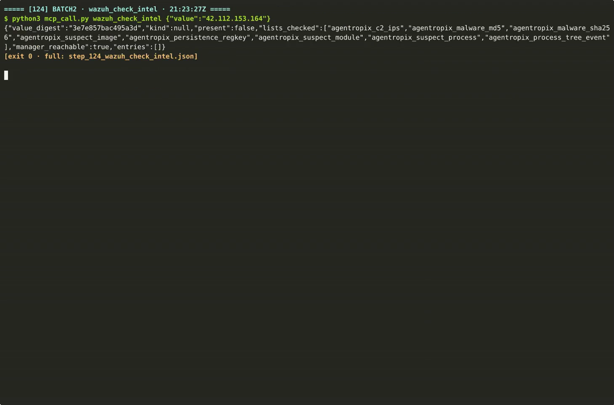

# SRL-2018 — network-wide APT / C2 deployment (case report)

SANS-derived multi-host APT scenario: initial access → credential theft → lateral movement →
Cobalt Strike / Empire C2 → collection & exfiltration across a segmented enterprise (incl. a DMZ).
This folder is the evaluator-facing case report for SRL-2018.

## How to read this case
1. **[SRL-2018-FORENSIC-REPORT.md](SRL-2018-FORENSIC-REPORT.md)** — the narrative: what happened,
   per-host, mapped to MITRE ATT&CK.
2. **[TECHNICAL-APPENDIX.md](TECHNICAL-APPENDIX.md)** — the supporting detail (artifacts, queries,
   evidence references).
3. **[WAZUH-IOC-GALLERY.md](WAZUH-IOC-GALLERY.md)** — the indicators and how they surface in Wazuh.
4. **[submission/AGENT-EXECUTION-LOGS-REPORT.md](submission/AGENT-EXECUTION-LOGS-REPORT.md)** — the
   **Agent Execution Logs gold report**: the autonomous engine run over this case's DC image
   (`base-dc`: 22 findings · 176 tool calls) plus a `Challenge_NotchItUp` comparison run, every
   claim cited as `file:json-path -> value` against the raw sealed evidence committed beside it; its [Visual Atlas](submission/AGENT-EXECUTION-VISUAL-ATLAS.md) tells the same story in thirteen color diagrams.

## Folder map
| Path | Contents |
|---|---|
| [`diagrams/`](diagrams/) | attack-chain / topology diagrams (Mermaid sources + rendered) |
| [`wazuh/`](wazuh/) | dashboard evidence gallery — screenshot proof findings/IOCs are indexed (see its [README](wazuh/README.md)) |
| [`submission/`](submission/) | **Agent Execution Logs gold package** — the evaluator-facing report + 10 raw evidence files for two engine runs (per run: sealed `report.json`, `audit-log.json`, `session-key`, live `run.log`, `thymus-audit.jsonl` — the last two published nowhere else; see its [README](submission/README.md)) |
| `training-session-paged.mp4` | recorded analyst walkthrough of the case |
| `training-session-poster.png` | poster frame for the video (GitHub can't inline-play repo MP4s — ▶ open the file to download) |

## Indicators & infrastructure
SRL-2018 evidence references scenario addresses (`192.168.30.x`, `172.16.x`) and APT tooling
(Cobalt Strike, Empire). These are **case IOCs**, not lab infrastructure.

## Provenance
Findings/IOCs were indexed to the live Wazuh cluster; the dashboard gallery in
[`wazuh/`](wazuh/) is the visual proof, cross-referenced from the report + appendix.

## Related cases (correlate)
- [SRL-2015 — multi-host APT (Stark Research Labs)](../srl-2015-report/)
- [VANKO — insider exfiltration](../vanko-report/)
- [↑ all cases index](../README.md)

## 🎬 The recorded analyst session

> ▶ *GitHub's repo pages can't play committed MP4s — the poster links to the **GitHub Pages copy, which plays directly in your browser**; or*
> ***[download the MP4 (19 MB, 5 min 48 s)](https://raw.githubusercontent.com/galvangabriel-web/agentropix-mcp/main/docs/12-CASES-REPORTS/srl-2018-report/training-session-paged.mp4)*** *— the
> paged action-log replay of the analyst walkthrough.*

---

## 🚀 Run / reproduce / extend this yourself

This folder documents the **case**; to **deploy and build on the agent itself**:

- **Install & run** the MCP server, then drive it from Claude — [main README → Deploy hub](../../../README.md) · [quickstart](../../01-overview/quickstart.md) · [client setup](../../09-integrations/client-setup.md)
- **Run it on a disk/memory image** (one prompt) — [try-it-end-to-end](../../01-overview/try-it-end-to-end.md)
- **Reproduce a case from public evidence** — [reproduce-datasets](../../06-use-cases/reproduce-datasets.md)
- **Extend the engine** (add a SwarmAgent / ATT&CK detector / tool wrapper) — [extend-the-swarm](../../10-agents/extend-the-swarm.md)
- **Self-host the full engine** that produced this report — [deployment.md](../../07-sdlc-ops/deployment.md)
