# 🎨 Agent Execution Logs — Visual Atlas

> **What this is.** The graphical companion to
> [`AGENT-EXECUTION-LOGS-REPORT.md`](AGENT-EXECUTION-LOGS-REPORT.md): thirteen color diagrams, one
> per major topic of the report, each **generated from and verified against the raw data files in
> this folder** (`base-dc-report.json`, `notch-report.json`, the run logs, and the Thymus audit
> trails) — no invented numbers. Diagrams are committed as PNG (rendered with mermaid-cli) so they
> always display on GitHub; every figure's Mermaid source is in a collapsed block beneath it.
>
> **Shared palette:** 🟦 blue = agents/tools/files · 🟪 purple = ATT&CK detectors & governance/seals ·
> 🟩 green = success/ALLOW/stable · 🟥 red = errors/REJECT/timeouts/gaps · 🟧 amber = correlation & anchors ·
> ⬜ grey = skipped/silent.

---

## 1. Agent-to-Agent Communication — who talked to whom

Maps the report's §3 handoff log: producers → correlation tokens → the hunt hub.

> **Why this representation:** The hunt correlator's 8 base-dc edges are pairwise "cross-source agreement" links keyed on a token, so the most faithful and catchable representation is a tripartite flowchart LR: producer agents (left, colored by category) converge on token nodes (middle, amber, with the real confidence value), which feed the single hunt hub (right). Modeling tokens as nodes instead of edge labels makes the 2-agent vs 3-agent agreements (scan, yara) visually obvious as fan-ins, and keeps the graph under 900px wide. A second, deliberately tiny notch diagram shows the degenerate case — one lone 0.3 'found' edge correlated entirely from failure/negative-result messages — which is itself the story.

### base-dc: agent-to-agent communication graph via the hunt correlator

*base-dc run: six producer agents converge on eight correlation tokens, which the hunt correlator seals as cross-source agreement edges (findings 14-21).*

**What to see:** Six of the 13 planned agents fed the correlator: blue disk agents (artifact, yara_hunt, null_session_baseline), purple ATT&CK detectors (t1059.001, t1546.008), and even the gray memory agent, whose skip notice still contributed the 'coverage' token. The two 3-agent agreements stand out as triple fan-ins: 'scan' (null_session_baseline + t1059.001 + yara_hunt) and 'yara' (artifact + t1546.008 + yara_hunt), both at confidence 0.4; the strongest edges are 'case' and 'evidence' at 0.6, the weakest 'host' at 0.3. The red box is honest about who said nothing: timeline timed out after 5452s and filesystem's fls after 60s, while discovery and mail produced no findings at all.

Mermaid source

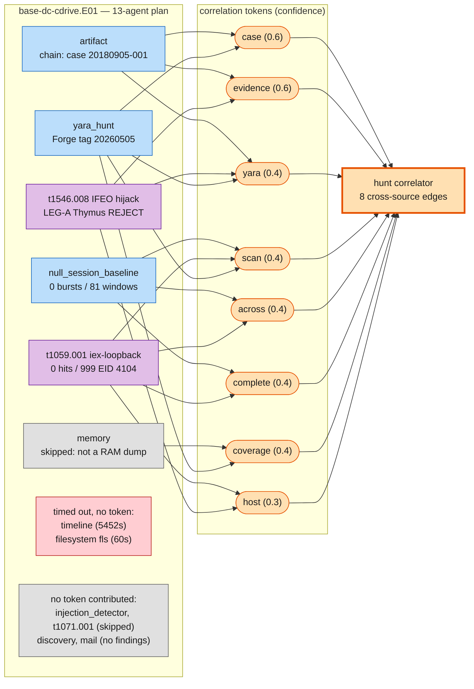

### notch: the single degenerate correlation edge

*notch run: the same 13-agent plan yields exactly one correlation edge — the token 'found' at confidence 0.3, agreed by three agents whose messages were all failures or negative results.*

**What to see:** On the raw notch image the communication graph collapses to one edge (finding 9): 'found' flagged by null_session_baseline, t1059.001 and yara_hunt at confidence 0.3 — the lowest tier seen in either run. Note the source texts: two evtx_dump rc=1 failures and yara_hunt's 'found no scannable files', so the lone agreement is a token match across negative-result messages, not a detection. The gray box accounts for the other nine planned agents, all skipped, failed, or silent.

Mermaid source

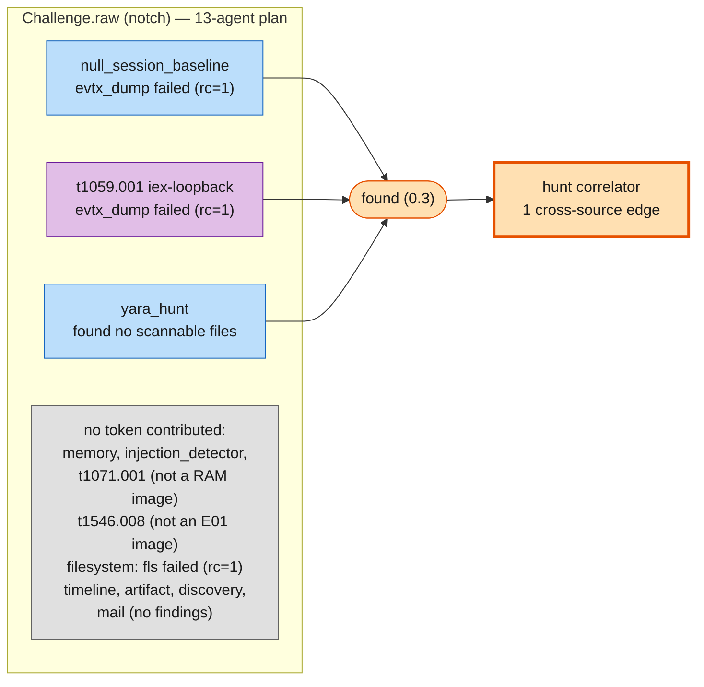

---

## 2. The End-to-End Timestamp Chain

Maps §4: the run's clock from first agent call to sealed report — macro, budget, and a microsecond zoom.

> **Why this representation:** The topic is a causal chain of timestamped events spanning seven orders of magnitude (a 5,452-second timeout down to a 217-microsecond burst), so a vertical flowchart with elapsed-time edge labels is the only form that keeps the sequence readable while making the wild duration asymmetry visible through edge annotations and outcome colors. A companion pie quantifies the headline fact (96.8% of the wall clock was one blocked tool call), and a micro-zoom flowchart resolves the 217-microsecond correlation burst that is invisible at run scale — together they tell the macro and micro story of the same clock.

### base-dc run — end-to-end timestamp chain (14:22:29 → 15:56:32 UTC)

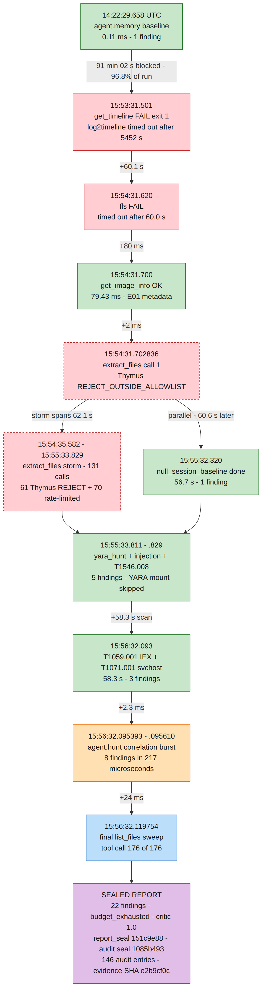

*The base-dc run's 1 h 34 m 02 s timestamp chain: every key tool-call event from the 14:22:29 memory baseline to the sealed report, colored by outcome with elapsed-time edges.*

**What to see:** Notice the brutal asymmetry: the very first edge consumes 91 min 02 s (96.8% of the run) waiting for log2timeline to hit its 5452 s timeout (tc[2], exit 1), while everything after 15:54:31 — including the 131-call extract_files storm (61 Thymus REJECTs + 70 rate-limit blocks) and the null_session_baseline running in parallel — fits in the last 2 minutes. The amber agent.hunt node then emits 8 cross-source correlation findings in just 217 microseconds (15:56:32.095393 → .095610) before the run seals with 22 findings, 176 tool calls, and report_seal 151c9e88…

Mermaid source

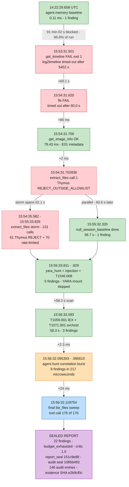

### Where the 5,642 seconds went

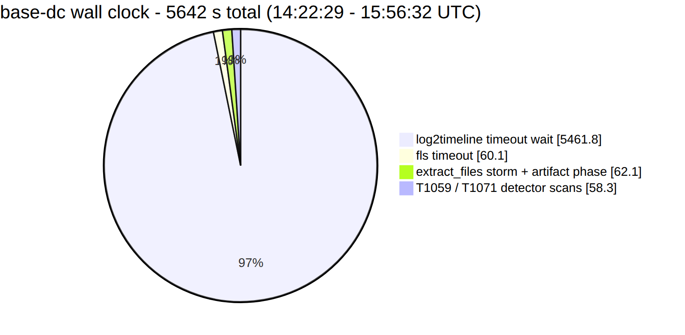

*Wall-clock budget of the 94-minute base-dc run: a single blocked log2timeline call dominates everything else combined by a factor of 30.*

**What to see:** The log2timeline slice (5,461.8 s measured duration_ms on tc[2], against its 5452 s configured cap) is 96.8% of the run; the three remaining phases — the 60.1 s fls timeout, the 62.1 s extract_files Thymus-REJECT storm, and the 58.3 s T1059/T1071 detector scans — are near-invisible slivers. The entire correlation, final sweep, and sealing tail adds under 30 ms and does not register at this scale.

Mermaid source

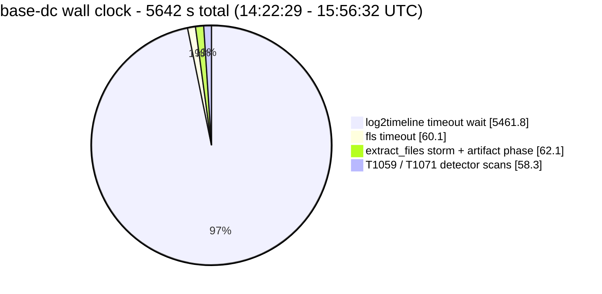

### Micro-zoom — the 217-microsecond agent.hunt correlation burst

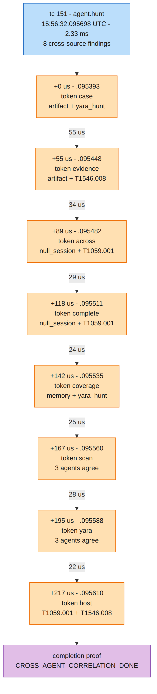

*Inside the 217-microsecond window at 15:56:32.095 UTC: agent.hunt emits all 8 cross-source correlation findings, 22-55 microseconds apart, closing the CROSS_AGENT_CORRELATION_DONE proof.*

**What to see:** Each amber node is one real hunt finding from base-dc-report.json with its exact sub-millisecond timestamp: the burst opens with token 'case' at .095393 (artifact + yara_hunt agree) and closes with token 'host' at .095610 — 217 microseconds total inside a 2.33 ms agent.hunt call (tc[151]). Inter-finding gaps shrink from 55 us down to 22 us, and two tokens ('scan', 'yara') reach 3-agent agreement, the strongest cross-source signal of the run.

Mermaid source

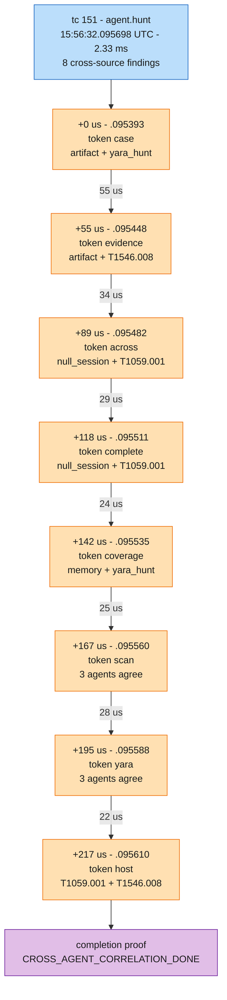

---

## 3. Iteration-over-Iteration — how the approach changed

Maps §5: the self-correction funnels and the plan-size cliff, both runs.

> **Why this representation:** The self-correction story has two distinct shapes that need two distinct visuals: (1) a per-run vertical flowchart funnel that shows WHY the plan shrank — the critic banks the stable agents' findings, drops them from the plan, and re-plans only the zero-finding gap agents, then loops on those gaps until the iteration budget runs out; and (2) a single xychart-beta comparing both runs' plan-size trajectory (13→2 vs 13→4), which makes the funnel shape and its iter-2 cliff instantly catchable. The flowcharts carry the real agent names and critic verdicts so the reader sees self-correction (not random shrinkage); the bar/line chart carries the cross-run comparison the flowcharts cannot. Vertical TD layouts keep both funnels at ~586px intrinsic width; all three sources were rendered with mmdc and verified.

### BASE-DC run — plan shrinks 13 → 2 (gap-only re-planning)

*BASE-DC (base-dc-cdrive.E01): after iteration 1, the 11 finding-producing agents are dropped from the plan and only the two zero-finding gap agents (discovery, mail) are re-planned, four times, until budget_exhausted.*

**What to see:** Iteration 1 plans the full 13-agent roster; 11 agents produce findings (green) and are immediately dropped from all later plans (grey) — their results are banked, not re-computed. The critic (score 1.00, should_halt=false) re-plans only the 2 gap agents, discovery and mail, which return 0 findings on every one of the four retries (red chain). The run ends as budget_exhausted at 5/5 iterations with 22 sealed findings — an honest negative: the gaps never close, the loop never pretends they did.

Mermaid source

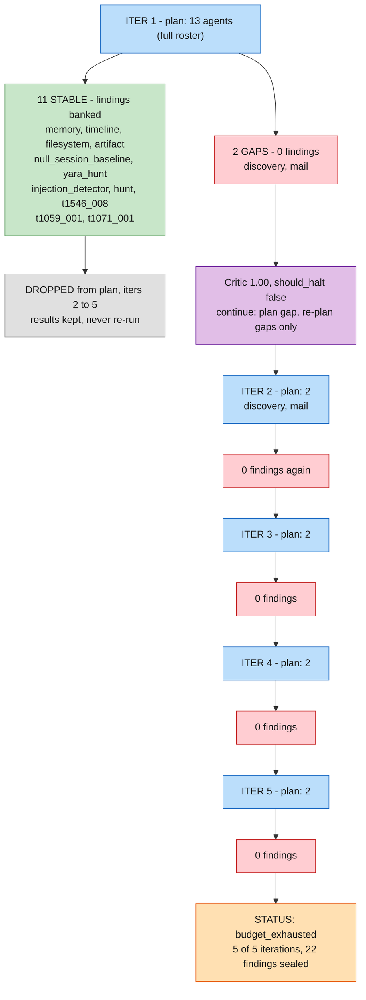

### NOTCH run — plan shrinks 13 → 4 (gap-only re-planning)

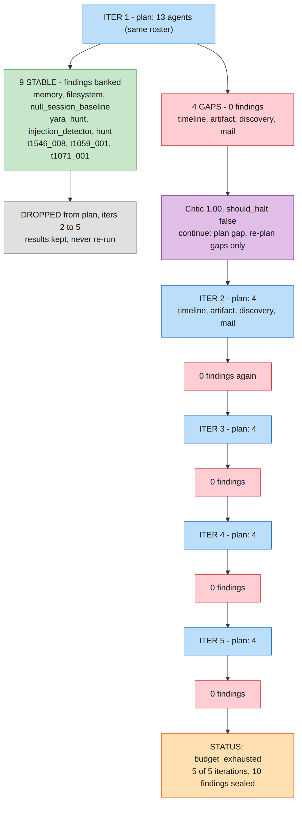

*NOTCH (Challenge.raw): the same 13-agent roster yields only 9 stable agents — timeline and artifact join discovery and mail as gaps — so iterations 2-5 re-plan 4 agents instead of 2, again ending budget_exhausted.*

**What to see:** Identical self-correction mechanics as BASE-DC but a different gap set: on this raw memory image, timeline and artifact also produce 0 findings, so the re-planned set is 4 agents (timeline, artifact, discovery, mail) rather than 2. The 9 stable agents (green) are dropped after iteration 1 and the run seals 10 findings at budget_exhausted. Comparing the two funnels shows the planner adapts per-evidence: the shrink target is data-driven (13 to 2 vs 13 to 4), not hard-coded.

Mermaid source

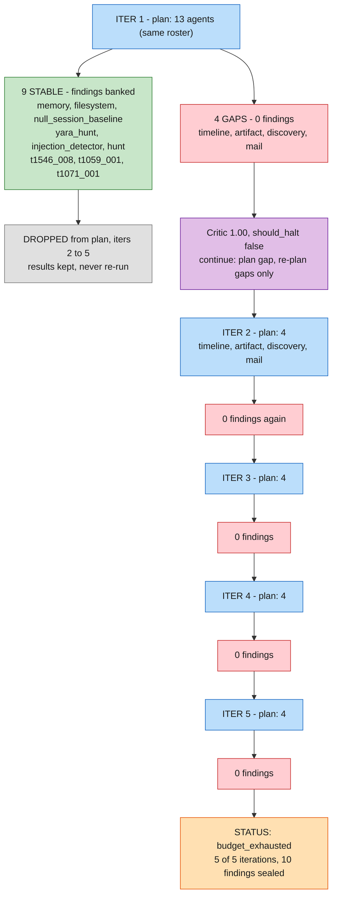

### Plan size per iteration — BASE-DC vs NOTCH

*Agents in the plan at each of the 5 iterations: BASE-DC (blue bars) collapses 13 to 2 after iteration 1; NOTCH (orange line) collapses 13 to 4 — both then hold flat until budget_exhausted.*

**What to see:** Both runs start with the full 13-agent plan and collapse after a single iteration — BASE-DC to 2 agents (blue bars: 13, 2, 2, 2, 2), NOTCH to 4 (orange line: 13, 4, 4, 4, 4). The one-iteration cliff is the self-correction signal: ~85% (11/13) and ~69% (9/13) of the roster proved stable on the first pass and was never re-run. The flat tail at 2 and 4 shows the critic (score 1.00, should_halt=false every iteration) kept retrying only the persistent zero-finding gaps until the 5-iteration budget was exhausted.

Mermaid source

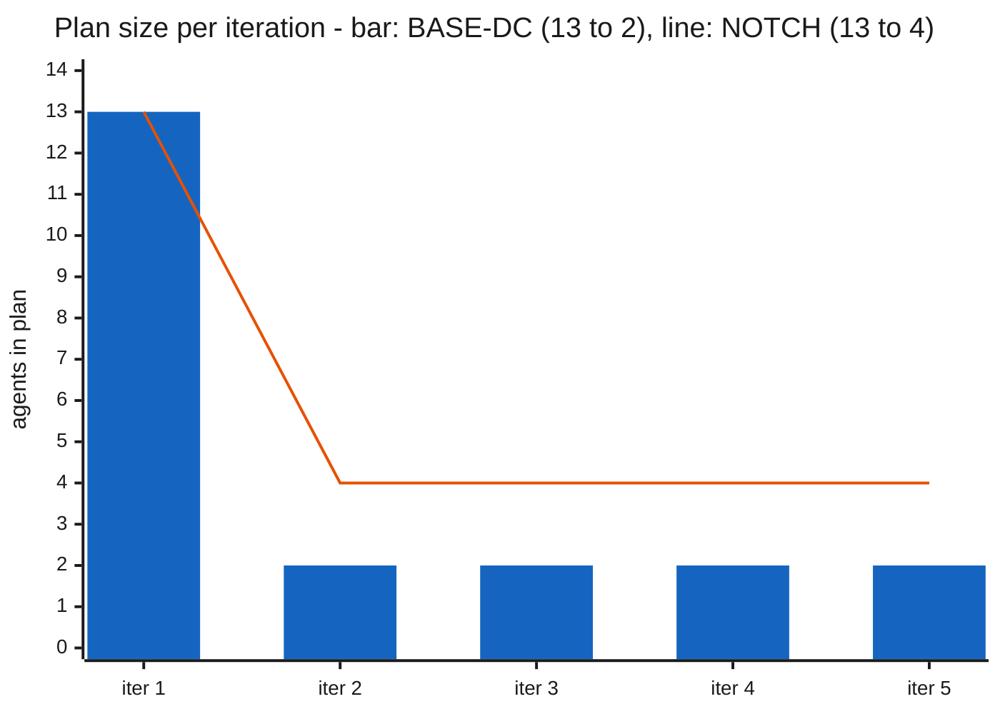

---

## 4. Governance & Sealing — the boundary and the tamper-evidence

Maps §6: the Thymus gate decisions and the HMAC cross-binding chain.

> **Why this representation:** Governance has two distinct stories that need two distinct visual grammars: (1) the boundary's behavior is a simple categorical split, best told by ALLOW/REJECT pies — one per case, because the 42% REJECT rate on base-dc versus 0% on notch is itself a finding (the gate fires when workloads stray, stays silent when they don't); (2) the sealing is a dependency chain, so a vertical flowchart shows how one 32-byte key cross-binds report.json and audit-log.json while the evidence sha256 anchors everything, with the REJECT path in red to show denials are inside (not outside) the sealed record. A consistent palette (green=ALLOW, red=REJECT, purple=seals/governance, blue=files, amber=hash anchor) ties the three figures together. All three diagrams were rendered with mermaid-cli and visually verified; every number was extracted from the raw jsonl/json with jq.

### Thymus policy gate — base-dc case (146 decisions)

*Thymus runtime boundary on the base-dc disk case: 85 of 146 file-access decisions allowed, 61 rejected.*

**What to see:** The gate is not decorative — 61 of 146 decisions (42%) were REJECTed, every one with reason REJECT_OUTSIDE_ALLOWLIST against /tmp/claude-1001 scratch paths (59x a tasks dir, 1x an extract dir, 1x a w204 dir). All 85 ALLOWs share a single reason, 'within read-only zone', covering only /cases/SRL-2018 (20) and the base-dc-cdrive.E01 image itself (65). Agents never touched anything outside the evidence allowlist, and every denial is on the sealed record.

Mermaid source

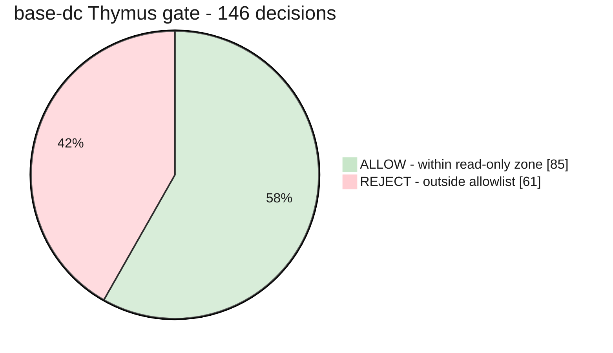

### Thymus policy gate — notch case (26 decisions)

*The same Thymus boundary on the notch raw-image case: all 26 decisions ALLOW, zero rejections.*

**What to see:** All 26 decisions are ALLOW 'within read-only zone' (20x the /cases/Challenge_NotchItUp directory, 6x Challenge.raw) — the REJECT slice is deliberately kept in the legend at 0 to show the gate was armed but never tripped. Contrast with base-dc's 61 REJECTs: the difference is workload shape (the disk case spawned /tmp scratch traffic the policy refused), not a relaxed policy.

Mermaid source

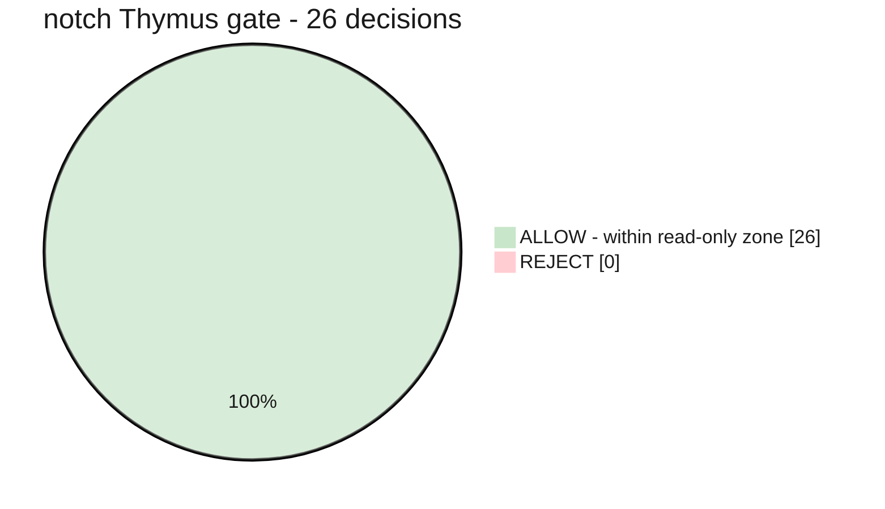

### Tamper-evidence cross-binding — evidence anchor, HMAC seals, and the Thymus REJECT path (base-dc)

*How one 32-byte session key cross-binds the findings report and the Thymus audit log into a single tamper-evident unit, anchored to the evidence image's sha256.*

**What to see:** Follow the purple governance lane: the same 32-byte HMAC session key produces both report_seal (151c9e88...e453b8c1) over base-dc-report.json and audit_log_seal (1085b493...6b5927) over the 146-entry audit log — and that audit_log_seal value is embedded byte-identically inside report.json, so editing either file breaks the cross-bind. The red edge is the boundary in action: 61 REJECTs of /tmp scratch paths are themselves part of the sealed record, while the green ALLOW path leads only to the evidence image, whose sha256 (e2b9cf0c...965b31b1) anchors the whole chain to the physical evidence. The audit log's entry_count 146 matching its 146 actual entries is the third independent consistency check.

Mermaid source

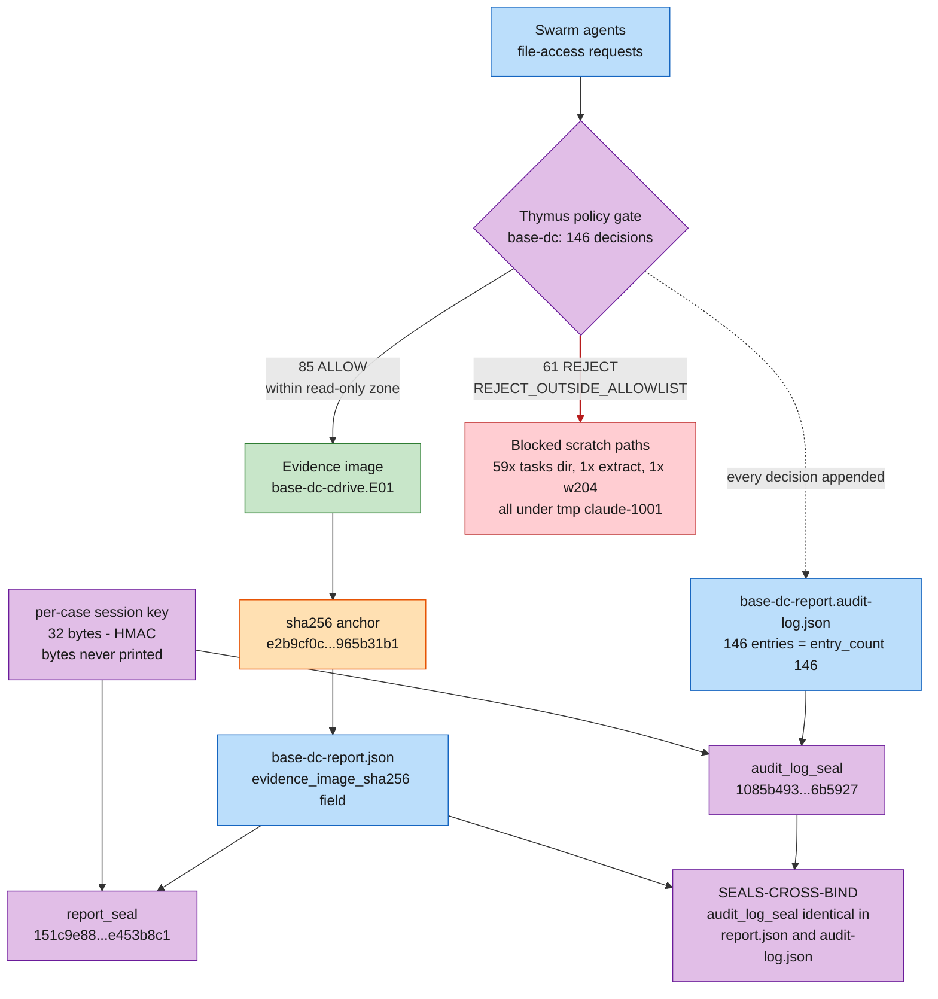

---

## 5. The Numbers at a Glance

Headline metrics of both runs, chartable and comparable in one look.

> **Why this representation:** The topic is "run metrics at a glance," which is purely quantitative — bar charts (xychart-beta) are the only representation that makes magnitudes instantly comparable. Chart 1 ranks the 11 base-dc agents by findings so the hunt agent's dominance (8 of 22) pops immediately; Chart 2 puts the two runs side-by-side on all three headline metrics (calls, findings, runtime) using alternating blue/amber bars via a zero-placeholder two-series technique, so the 176-vs-60 and 94-min-vs-1.2-min contrasts are caught in one look. Every number was extracted from base-dc-report.json and notch-report.json with python3 (findings[] grouped by agent field; trace.tool_calls length; trace.total_duration_ms), and both Mermaid sources were render-verified with mermaid-cli to PNG.

### base-dc: Findings per Agent

*Findings per agent in the base-dc run (22 total, sorted descending) — the correlation hunt agent alone contributed 8.*

**What to see:** The hunt (correlation) agent dominates with 8 of the 22 findings — 4x any single detector — showing most value came from cross-agent correlation rather than any one detector. The mid tier (artifact, yara, t1546 IFEO hijack, t1059 IEX loopback C2) contributed 2 each; six agents contributed 1 each. Note the memory bar is a skip marker, not a detection: the MemoryAgent recorded an honest 'disk-only image, Volatility requires RAM' skip with confidence 0.0.

Mermaid source

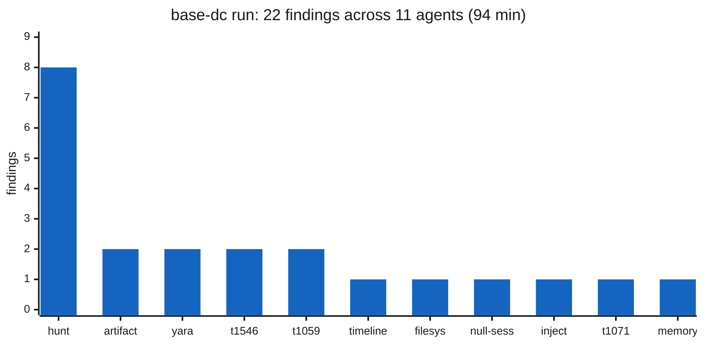

### Run Comparison: base-dc vs notch

*Headline metrics of the two SRL-2018 submission runs side by side: tool calls, findings, and wall-clock runtime.*

**What to see:** base-dc (blue) used 176 tool calls to seal 22 findings in 94.0 min; notch (amber) used 60 calls for 10 findings in just 72.4 seconds (1.2 min). The near-invisible 'min notch' bar IS the story: the 78x runtime gap is almost entirely one tool — base-dc's get_timeline call ran 5,461.8 s of the 5,642 s total (log2timeline timed out at 5452 s on the E01), while everything else on both runs completed in seconds. Both runs ended with status budget_exhausted after 5 iterations and a critic_score of 1.0.

Mermaid source

```mermaid
%%{init: {"xyChart": {"width": 860, "height": 430}, "themeVariables": {"xyChart": {"plotColorPalette": "#1565c0, #ef6c00", "titleColor": "#1a1a1a", "xAxisLabelColor": "#1a1a1a", "xAxisTitleColor": "#1a1a1a", "xAxisLineColor": "#1a1a1a", "yAxisLabelColor": "#1a1a1a", "yAxisTitleColor": "#1a1a1a", "yAxisLineColor": "#1a1a1a"}}}}%%
xychart-beta
    title "base-dc (blue) vs notch (amber): 176 vs 60 calls, 22 vs 10 findings, 94 vs 1.2 min"
    x-axis ["calls base-dc", "calls notch", "findings base-dc", "findings notch", "min base-dc", "min notch"]
    y-axis "count or minutes" 0 --> 180
    bar [176, 0, 22, 0, 94, 0]
    bar [0, 60, 0, 10, 0, 1.2]
```

---

*Built from the sealed records in this folder; cross-checked claims live in the
[gold report](AGENT-EXECUTION-LOGS-REPORT.md) (§3–§6) and are independently re-verifiable via its
"verify in 60 seconds" block. Folder guide: [README.md](README.md).*
