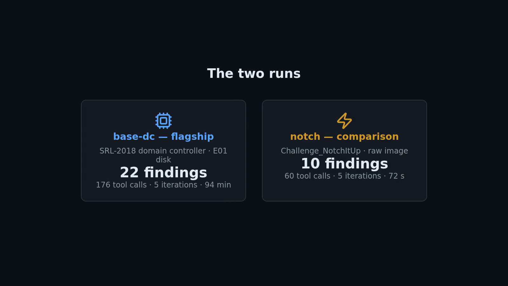

# `submission/` — the Agent Execution Logs gold package (requirement #8)

> **Provenance.** Two real `agentropix-sift` engine runs executed 2026-06-11, packaged as the
> evaluator-facing **"Agent Execution Logs"** submission deliverable. The folder ships the full
> evidence quintet per run — including two artifact types no other published run folder has: the
> **live `run.log`** (the engine's own console stream) and the **Thymus access trail**
> (`thymus-audit.jsonl`, every evidence-path decision with ALLOW/REJECT + reason). Per-run HMAC
> session keys are published under the repo's standing burned-key policy.

**Visual reader? → [`AGENT-EXECUTION-VISUAL-ATLAS.md`](AGENT-EXECUTION-VISUAL-ATLAS.md)** — thirteen
color diagrams (communication graph, timestamp chain, self-correction funnels, Thymus pies,
seal chain) generated from this folder's raw data ([`diagrams/`](diagrams/) holds PNG + Mermaid sources).

**Start here → [`AGENT-EXECUTION-LOGS-REPORT.md`](AGENT-EXECUTION-LOGS-REPORT.md)** — the gold
report: agent-to-agent handoff log (timestamped, every edge VERIFIED against records),
full tool-execution sequence with worked 3-way cross-file correlations, the
iteration-over-iteration persistent-loop trace, and a governance/sealed-audit section. Every claim
cites `file:json-path -> value`.

## The two runs

| Run | Evidence | Result | Window (UTC) | Seal |
|---|---|---|---|---|
| **base-dc** (flagship) | `/cases/SRL-2018/base-dc-cdrive.E01` (SRL-2018 domain controller) | **22 findings · 176 tool calls · 5 iterations**, status `budget_exhausted` | 2026-06-11 14:22 → 15:56 | `151c9e88…` |
| **notch** | `/cases/Challenge_NotchItUp/Challenge.raw` (raw memory) | **10 findings · 60 tool calls · 5 iterations**, status `budget_exhausted` | 2026-06-11 12:42 → 12:44 | `f5e525a0…` |

## File-by-file

| File (×2, per run) | What it is | What it shows |
|---|---|---|
| [`base-dc-report.json`](base-dc-report.json) / [`notch-report.json`](notch-report.json) | Sealed machine record | findings, full `trace.tool_calls[]` (args_hash/output_hash/exit_code), `iterations[]` Trinity trace, HMAC seals |
| [`base-dc-run.log`](base-dc-run.log) / [`notch-run.log`](notch-run.log) | **Live engine console log** | the run as it streamed — agent starts, tool durations, the log2timeline timeout, the Critic verdicts |
| [`base-dc-thymus-audit.jsonl`](base-dc-thymus-audit.jsonl) / [`notch-thymus-audit.jsonl`](notch-thymus-audit.jsonl) | **Thymus access trail** | one JSON line per evidence-path decision (`ALLOW`/`REJECT` + reason) — the read-only boundary, observable |
| [`base-dc-report.audit-log.json`](base-dc-report.audit-log.json) / [`notch-report.audit-log.json`](notch-report.audit-log.json) | Sealed audit-log companion | cross-bound to the report seal |
| `base-dc-report.session-key` / `notch-report.session-key` | Per-run HMAC key (32 B, binary) | independently re-verifies that run's seals (burned-key policy) |

A sample Thymus line — the boundary in action:

```json
{"timestamp": "2026-06-11T12:48:26.360870+00:00", "action": "ALLOW", "path": "/cases/SRL-2018/base-dc-cdrive.E01", "reason": "within read-only zone"}
```

## Why this folder matters

This is the package that answers submission requirement **#8 — Agent Execution Logs** in full:
agent-to-agent message logs with timestamps (multi-agent), tool-execution logs with timestamps
(single-agent view, token usage documented as an honest negative), and iteration-over-iteration
traces showing the approach changing (persistent loop: 13 agents → 2 on base-dc, 13 → 4 on notch).
Master routing: [🧭 EVALUATION-MAP.md](../../../../EVALUATION-MAP.md). The narrative case report for
the same evidence estate is one level up: [`../README.md`](../README.md).

## 🎬 The animated walkthrough

A 108-second **Animotion-animated presentation** of this package — the timestamp chain with the
91-minute wait drawn to scale, the 61-shield REJECT storm with a live counter, the 217 µs
correlation burst chip-by-chip, the 13 → 2 self-correction roster, the producers → tokens → hunt
flow, and the animated ALLOW/REJECT + seal cross-bind explainer. Rendered deterministically
(virtual-time capture, 12 fps) from [`execution-logs-animated-deck.html`](execution-logs-animated-deck.html);
animations & icons via the Animotion MCP.

[](https://galvangabriel-web.github.io/agentropix-mcp/docs/12-CASES-REPORTS/srl-2018-report/submission/EXECUTION-LOGS-ANIMATED.mp4)

> ▶ *The poster links to the **GitHub Pages copy, which plays directly in your browser**; or*
> ***[download the MP4 (980 KB, 1 min 48 s)](https://raw.githubusercontent.com/galvangabriel-web/agentropix-mcp/main/docs/12-CASES-REPORTS/srl-2018-report/submission/EXECUTION-LOGS-ANIMATED.mp4)***.
