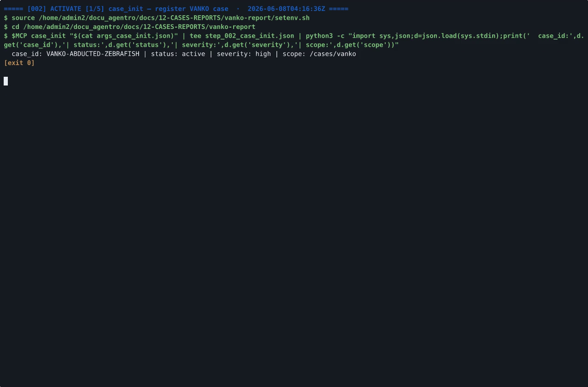

# VANKO — "The Case of the Abducted Zebrafish" (insider IP theft)

Case folder for **VANKO-ABDUCTED-ZEBRAFISH** (SANS FOR500 training scenario, fictional subjects): a
trusted insider on workstation STARKSURFACE copied classified zebrafish-DNA / cell-regeneration
trade secrets from the StarkResearch file server, staged them via a masquerade `defaultprinter`
account, disguised the archive as `vacation photos.7z`, exfiltrated over **dual cloud channels**
(Dropbox `984347879` + OneDrive, SRUM-confirmed) while coordinating with a foreign recruiter
channel, and ran SDelete anti-forensics that was **defeated by Volume Shadow Copies**.
**Not a malware intrusion** — an authorized user abusing valid access and signed tools.
**10 examiner-approved findings** (of 19; 9 refuted by the false-positive gate), HMAC-sealed and
egressed to Wazuh (decision ledger seq 139).

> **Data-handling note:** raw evidence-derived artifacts in this folder (OST mailbox carves, step
> logs, working analyses) are **local-only and unpublished**; every committed page redacts personal
> mailbox data and internal addresses. The named adversary-channel indicators are the published
> IOCs of the (fictional) scenario.

## Read in this order

1. [`VANKO-FORENSIC-REPORT.md`](VANKO-FORENSIC-REPORT.md) — presentation forensic report (renders
   the diagrams inline): attack lifecycle, exfil/buyer-channel architecture, timeline, IOC mindmap,
   the 10 sealed findings, ATT&CK mapping, honest caveats.
2. [`VANKO-DFIR-REPORT.md`](VANKO-DFIR-REPORT.md) — the full legally-defensible 7-section DFIR
   report (executive summary → methodology → master timeline → technical narrative → artifact
   analysis → structured IOCs → recommendations).
3. [`WAZUH-VANKO-GALLERY.md`](WAZUH-VANKO-GALLERY.md) — narrated gallery of the 8 Wazuh egress
   captures.
4. [`report.md`](report.md) — condensed forensic synthesis. Raw finding records
   (`FINDINGS.jsonl`, `confirmed-findings.json`) and the exfil-chain workflow notes
   (`VANKO-EXFIL-CHAIN-WORKFLOW.md`) are local working files (not in the published repository).

**Video:** [`findings-presentation.mp4`](findings-presentation.mp4) (~9 min, 8 key facts with
red-boxed artifact proof; poster: `findings-presentation-poster.png`) and the raw paged
action-log replay `training-session-paged.mp4`.

## Subfolder guides (per-folder README with file tables + curated excerpts)

| Folder | README | Contents |
|---|---|---|
| `diagrams/` | [diagrams/README.md](diagrams/README.md) | The 5 case diagrams — Mermaid sources + committed PNG renders (lifecycle, exfil architecture, timeline, IOC mindmap, approval pipeline) |
| `extracted/` | [extracted/README.md](extracted/README.md) | Intentionally empty — the Thymus-rejected extraction destination (guardrail audit trail; extraction went to the sandbox scratch area) |
| `ost-results/` | [ost-results/README.md](ost-results/README.md) | Outlook OST mailbox carve output (`carve_pst_iocs`): 1,592 + 36 messages, 218 attachments / 50 unique SHA-256 — **raw mailbox PII, local-only; README shows redacted structure + counts** |
| `toptier-results/` | [toptier-results/README.md](toptier-results/README.md) | The 5 deep-recovery streams (VSS, carving, memory remnants, chat clients, Windows.old) + synthesis that recovered the wiped archive and proved the no-share-link negative |
| `wazuh/` | [wazuh/README.md](wazuh/README.md) | The 8 Wazuh egress evidence captures (10 approved findings, finding detail, MITRE/Threat-Hunting modules, CDB IOC read-back) |

Everything else at this level (`step_*.json`, `args_*.json`, `*.sh`, `session-actions.log`,
`ost-investigation.*`, `p3_analyze.py`, presentation build scripts) is the raw, gitignored working
trail of the investigation run — kept locally for reproducibility and audit.

## 🎬 The videos

**Findings presentation** — the ~9-minute technical evidence walkthrough: 8 key facts, each with
red-boxed artifact proof and a cross-source correlation panel.

> ▶ ***[download the MP4 (14 MB, 8 min 48 s)](https://raw.githubusercontent.com/galvangabriel-web/agentropix-mcp/main/docs/12-CASES-REPORTS/vanko-report/findings-presentation.mp4)***

**Training-session replay** — the raw paged action-log playback of the investigation run.

> ▶ *GitHub's repo pages can't play committed MP4s — each poster links to the **GitHub Pages copy, which plays directly in your browser**; or*
> ***[download the MP4 (8.1 MB, 2 min 24 s)](https://raw.githubusercontent.com/galvangabriel-web/agentropix-mcp/main/docs/12-CASES-REPORTS/vanko-report/training-session-paged.mp4)***.

> **Repo housekeeping:** [`.gitignore`](.gitignore) is a git-control file (keeps local-only VANKO
> working artifacts untracked) — not a reader document.

---

## 🚀 Run / reproduce / extend this yourself

This folder documents the **case**; to **deploy and build on the agent itself**:

- **Install & run** the MCP server, then drive it from Claude — [main README → Deploy hub](../../../README.md) · [quickstart](../../01-overview/quickstart.md) · [client setup](../../09-integrations/client-setup.md)
- **Run it on a disk/memory image** (one prompt) — [try-it-end-to-end](../../01-overview/try-it-end-to-end.md)
- **Reproduce a case from public evidence** — [reproduce-datasets](../../06-use-cases/reproduce-datasets.md)
- **Extend the engine** (add a SwarmAgent / ATT&CK detector / tool wrapper) — [extend-the-swarm](../../10-agents/extend-the-swarm.md)
