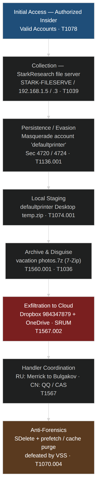
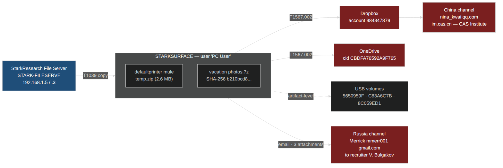
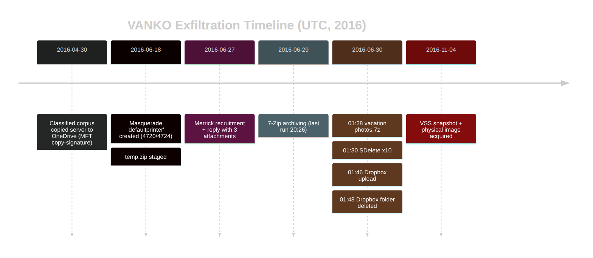
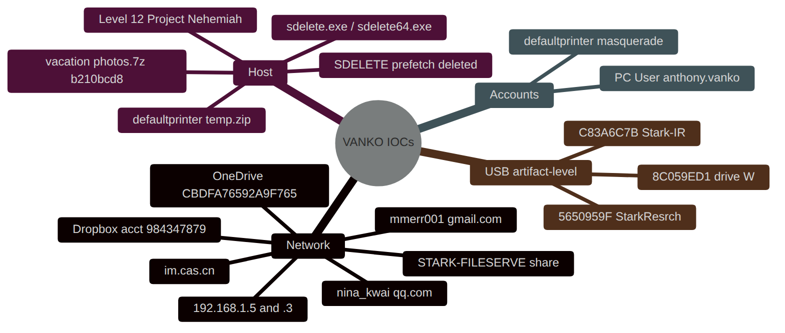
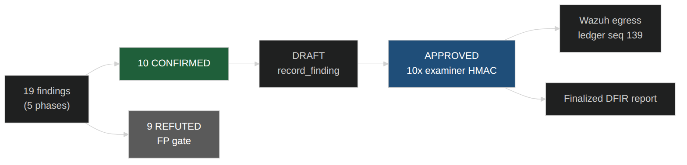

# VANKO — Digital Forensic & Incident Response Report

| | |
|---|---|
| **Case ID** | `VANKO-ABDUCTED-ZEBRAFISH` |
| **Examiner** | victor.galvan |
| **Evidence** | `/cases/vanko` — Surface 3 physical image `surface_physical.E01`–`.E21` (EWF), 116 GiB; MD5 `4032d556…`, SHA1 `e0e72dfc…` (acquisition-verified) |
| **Subject** | Anthony Vanko — STARKSURFACE (Windows 10 Pro, Build 10586; user `PC User`, MS account `anthony.vanko`) |
| **Incident window** | **2016‑04‑30 → 2016‑06‑30 UTC** (image acquired 2016‑11‑04) |
| **Classification** | **Insider threat — intellectual-property / trade-secret theft** |
| **Status** | 10 findings **APPROVED** (examiner-signed HMAC chain) · egressed to Wazuh (decision ledger seq 139) |

> **Honest framing.** This was **not a malware intrusion**. No memory-resident C2, no implant, and no host-to-host lateral movement were identified; the only malware-family signature hits were false positives. The threat was an **authorized insider** abusing legitimate access and legitimate, signed software.

---

## 1. Executive summary

A trusted insider, biochemical engineer **Anthony Vanko**, exfiltrated classified zebrafish‑DNA and cell‑regeneration trade secrets from Stark Enterprises' DC R&D facility. Operating with **valid credentials** (T1078), the subject copied a classified corpus from the **StarkResearch file server** (`\\STARK-FILESERVE`) into OneDrive, created a **masquerade local account** (`defaultprinter`) used as a staging mule, archived the material disguised as **`vacation photos.7z`** using legitimate signed utilities (7‑Zip, SysInternals SDelete, FTK Imager), and **exfiltrated to two cloud channels** (Dropbox account `984347879` + OneDrive, SRUM‑confirmed). Coordination with a **foreign recruiter channel** is evidenced (Michael Merrick → handler Vladimir Bulgakov; a China‑associated buyer channel — `nina_kwai@qq.com` / CAS Institute of Microbiology — is present at artifact level). The subject then attempted **anti‑forensic destruction** (SDelete secure‑wipe, prefetch and Dropbox‑cache deletion) — **defeated because Volume Shadow Copies preserved the deleted artifacts**.

**The exfiltration chain, the masquerade staging account, the dual cloud egress, the handler coordination, and the anti‑forensic destruction are all evidenced. Realized exposure includes a confirmed Level‑12 document (`Project Nehemiah`) opening, above the original Level 5–8 brief.**

---

## 2. Attack lifecycle (MITRE ATT&CK)

---

## 3. Exfiltration & buyer-channel architecture

> **No host-to-host lateral movement.** This is a single-host insider case. The "movement" is multi-*channel* (file server → STARKSURFACE → cloud / email → CN + RU recipients), not adversary pivoting. The USB volume serials are recorded at **artifact level** (kill-chain synthesis), not as a confirmed removable-media exfil finding.

---

## 4. Timeline (UTC)

---

## 5. Staging & anti-forensic toolchain (signed utilities weaponized)

No custom malware was deployed; a chain of **legitimate, signed utilities** was weaponized in sequence. The probative element is the **executed sequence within the exfil window**, not any individual binary.

| Artifact | Hash / locator | Role | ATT&CK |
|---|---|---|---|
| `vacation photos.7z` | SHA‑256 `b210bcd89fbde5d3b0816e1834483f7b82adf8565fd880d49930c25450ca7e31` | Exfil payload — classified docs disguised as holiday photos | T1560.001 / T1036 |
| `vacation photos.7z.lnk` | SHA‑256 `ca8433a7ba4ccde99a9170cb169c61f87b704b853a39c55843941ae049b201fc` | Shortcut — interactive launch / recent-doc provenance | T1074.001 |
| `temp.zip` (recovered `$RZQSNFO.zip`) | 2,603,690 B — `defaultprinter\Desktop` | Masquerade-account staging archive (Ion Thruster, ZF DNA, cell-regen) | T1074.001 |
| `sdelete.exe` / `sdelete64.exe` | Amcache SHA1 `ab48396a` — 10 executions, last 2016‑06‑30 01:30:52 | **Secure-deletion** of originals (anti-forensics) | T1070.004 |
| `7z1602-x64.exe` / `7ZG.EXE` / `7ZFM.EXE` | Amcache SHA1 `0d2c251d` — last 2016‑06‑29 20:26 | Archiving / payload disguise | T1560.001 |
| FTK Imager Lite · Diskmon · Tor Browser · Network Stumbler | LNK / Recycle Bin `$I` | Imaging / disk-monitor / anti-attribution / wireless recon toolset on desktop | T1090.003 |

> **Anti-forensics, defeated by VSS.** SDelete wiped the originals (06‑30 01:30); the `SDELETE.EXE-FBA93810.pf` prefetch was deleted to erase the proof; the Dropbox cache and 1.9 GB local Dropbox folder were purged (06‑30 01:48, 2m12s after upload). The **2016‑10‑14 / 2016‑11‑04 Volume Shadow Copies preserved all of it** — recovering the 0‑byte `temp.zip`, the deleted prefetch, the `~$Project_Nehemiah` Word lock, and the Dropbox cache (T1070.004).

---

## 6. Indicators of Compromise (IOCs)

### Network / Host / Accounts (mindmap)

### Accounts
| Account | Role in incident |
|---|---|
| `PC User` (`anthony.vanko`) | **The insider / threat actor** — authorized access abused (not a compromised account) |
| `defaultprinter` | **Masquerade** local account created 2016‑06‑18 20:40:54 (Sec 4720/4724); used as the staging mule (T1136.001) |

> **No external malware C2.** The "C2-equivalent" channels are legitimate cloud-storage, email, and chat services abused for coordination and exfiltration. `readnotify.com` and the USB volume serials are **artifact-level** indicators (see §8), not confirmed findings.

---

## 7. Approved findings (examiner-signed)

| ID | Sev | ATT&CK | Finding |
|---|---|---|---|
| `VANKO-P1-001` | high | T1136.001 | Masquerade local account `defaultprinter` created by `PC User` (4720/4724) |
| `VANKO-P2-001` | high | T1074.001 | `defaultprinter\Desktop\temp.zip` — 2.6 MB classified staging archive |
| `VANKO-P2-003` | high | T1070.004 | Local Dropbox folder (1.9 GB) deleted 2m12s after the upload |
| `VANKO-P2-004` | med | T1090.003 | Anti-attribution toolset (Tor Browser, Network Stumbler, FTK Imager) on desktop |
| `VANKO-P2-005` | high | T1074.001 | Signed toolchain weaponized in sequence (7-Zip, SDelete, FTK, Diskmon) |
| `VANKO-P3-002` | high | T1567.002 | SRUM-confirmed cloud egress — Dropbox + OneDrive |
| `VANKO-P3-003` | high | T1567 | Outbound coordination w/ foreign recruiter (Merrick→Bulgakov), reply w/ 3 attachments |
| `VANKO-P3-005` | high | T1039 | Native-protocol access to StarkResearch file server (data source) |
| `VANKO-P4-003` | high | T1070.004 | Anti-forensic destruction recovered from Shadow Copies (SDelete prefetch / cache) |
| `VANKO-P4-004` | high | T1530 | Level-12 `Project Nehemiah` document opened (`~$` Word lock, VSS) |

> 19 findings across 5 forensic phases → **10 CONFIRMED**, **9 REFUTED** (false-positive gate). DRAFT→APPROVED is a **human-only HMAC-sealed examiner sign-off**, hash-chained; the agent never self-approved.

---

## 8. Methodology, integrity & honest caveats

**Approach.** Agentropix‑SIFT MCP toolset over the EWF image under Opus 4.8 orchestration: The Sleuth Kit (`fls`/`extract_files`) + libvshadow recovered files from the live volume and its shadow copies; Eric Zimmerman tools (MFTECmd, RECmd, LECmd/JLECmd, AmcacheParser, SrumECmd) parsed the MFT/registry/LNK/execution/network artifacts; `get_evtx` built the account-creation (4720/4724) and logon (4648) record set; bulk_extractor + YARA carved and triaged recovered content; Volatility 3 assessed memory remnants. Every action was committed to a **recorded, replayable action log**; each finding is **HMAC-SHA256 sealed** and the approvals are **hash-chained** (examiner-signed). `inference_constraint: high` — the LLM orchestrated; facts derive from deterministic SIFT tools.

**Caveats (stated plainly).**
- **No malware / no C2.** Volatility produced no implant, injection, or beacon; the only memory remnants (truncated pagefile, WAKE-state hiberfil) are not valid memory inputs. YARA family hits (`with_sqlite`, `XMRIG_Miner`) were generic, non-PE-backed **false positives**.
- **iPhone present, not an evidenced exfil vector.** The tethered iPhone / recovered `.ipsw` firmware are confirmed artifacts, but **no classified payload is tied to the device** (down-ranked, not a proven channel).
- **Refuted hypotheses.** Timestomping was a file-COPY signature (`$SI` created>modified), not manipulation; the 11 system-time-change (4616) events were benign NTP; no persistence survived via `Windows.old` (OS skeleton only, host reset not upgraded).
- **Processing limits.** The Plaso super-timeline returned **0 events** (log2timeline timeout on the 110 GB `$MFT`) — the timeline is reconstructed from individually parsed artifact stores, each independently traceable. ShellBags did not decode from this `UsrClass.dat`. The 4648 server-target field and the SmbClient operational log were inconclusive/empty.
- **Artifact-level (not promoted) indicators.** The China buyer channel (`nina_kwai@qq.com`, `im.cas.cn`), the three USB volume serials (`5650959F`/`C83A6C7B`/`8C059ED1`), Skype, and `readnotify.com` appear in the synthesis but were **not** promoted to confirmed findings; the `mmerr001` 3-attachment reply confirms handler *coordination* only (attachment content not extracted — classified-exfil-by-email is not asserted).

---

*Full chain of custody + per-step JSON: `docs/12-CASES-REPORTS/vanko-report/` (local `session-actions.log`, gitignored). Egress proof: the Wazuh dashboard gallery below.*

---

**See also:** [VANKO-DFIR-REPORT.md](VANKO-DFIR-REPORT.md) — the full legally-defensible 7-section report (executive summary, scope/methodology, master timeline, technical attack narrative, malware & artifact analysis, IOCs, containment & remediation) · [WAZUH-VANKO-GALLERY.md](WAZUH-VANKO-GALLERY.md) — Wazuh egress proof gallery (8 inline captures).
