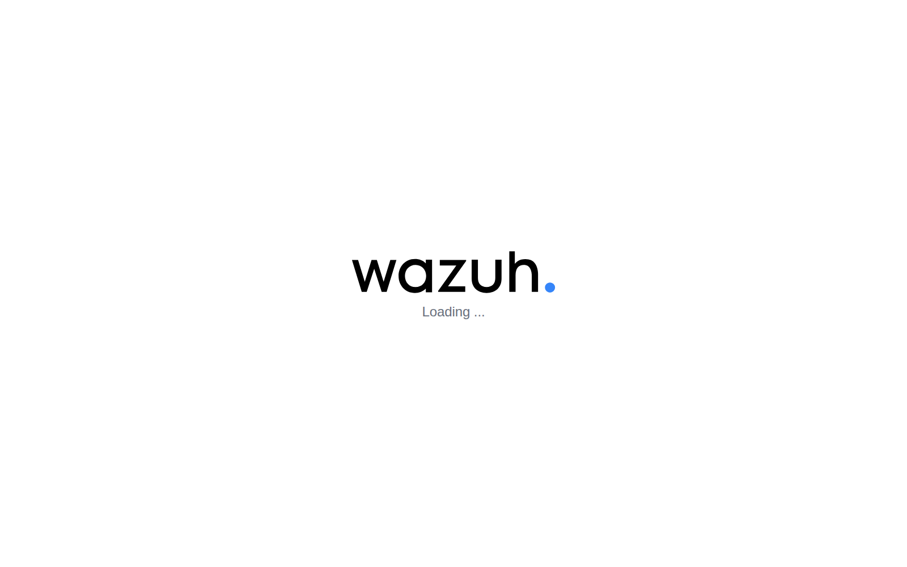
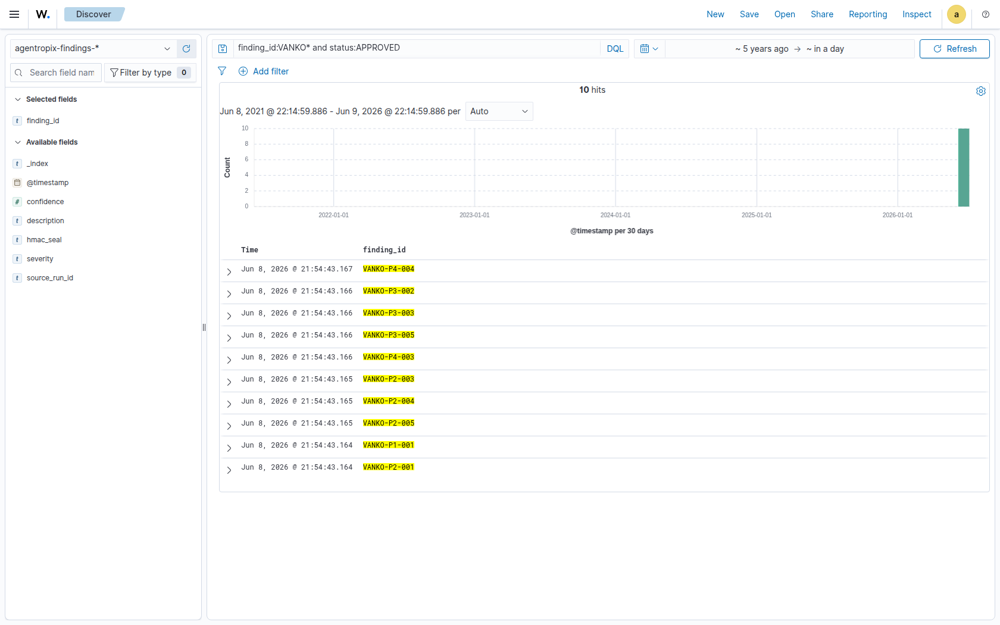
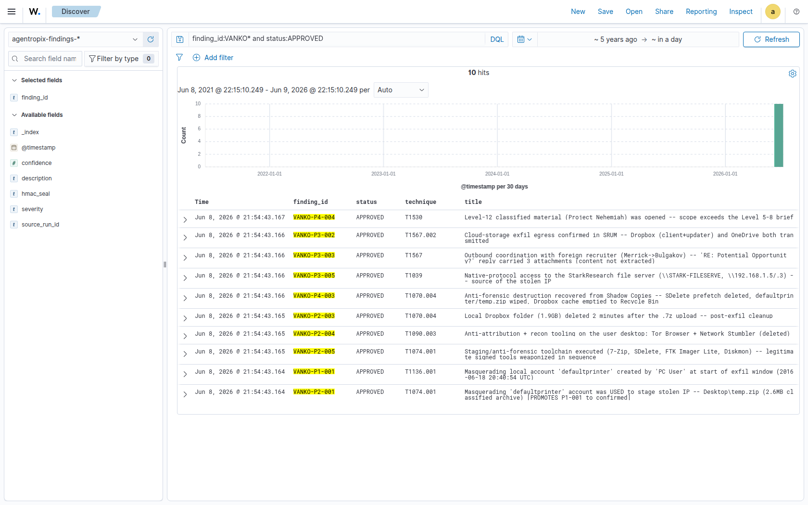
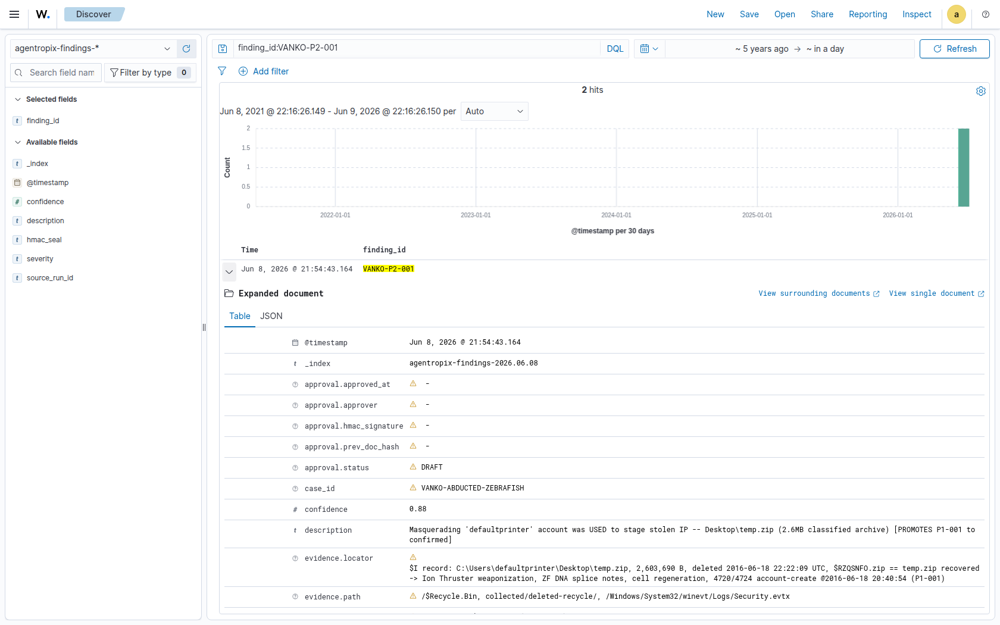
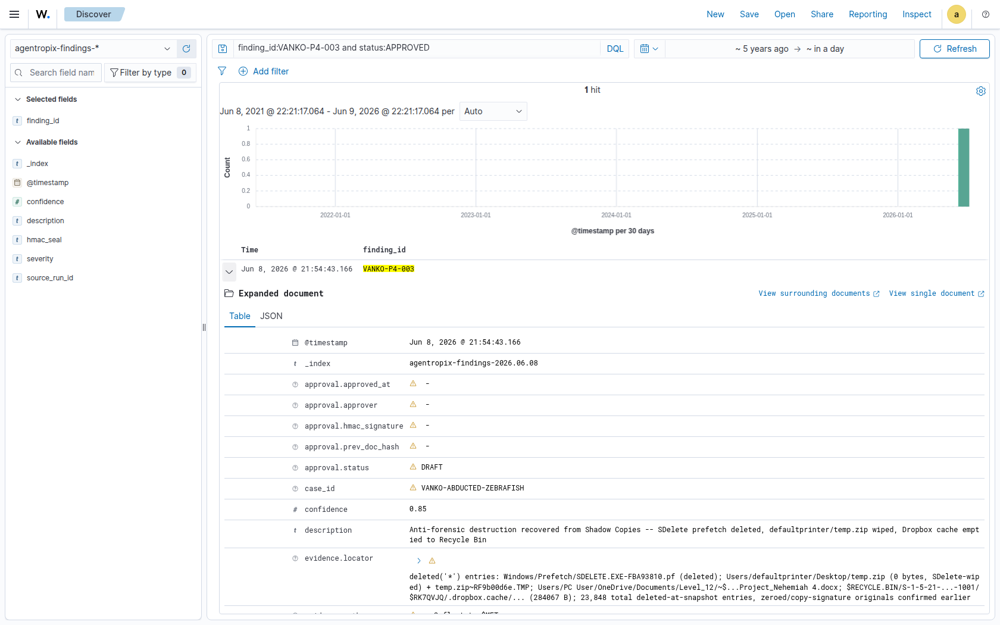
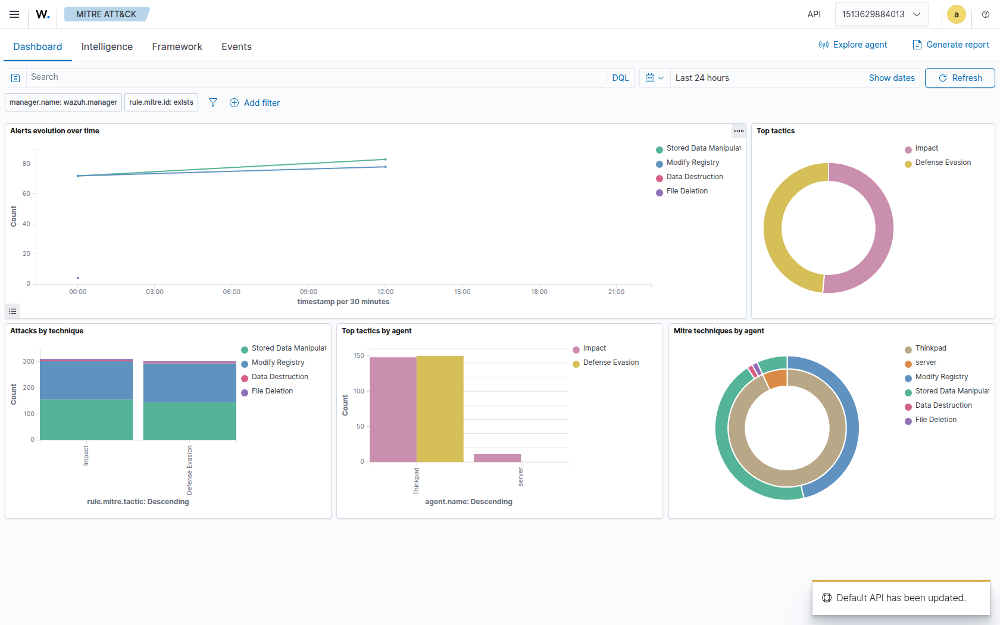
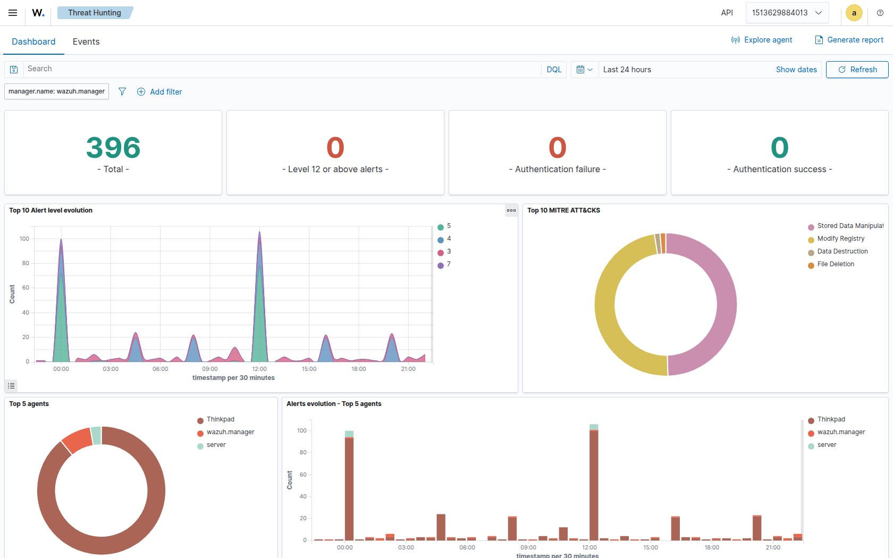
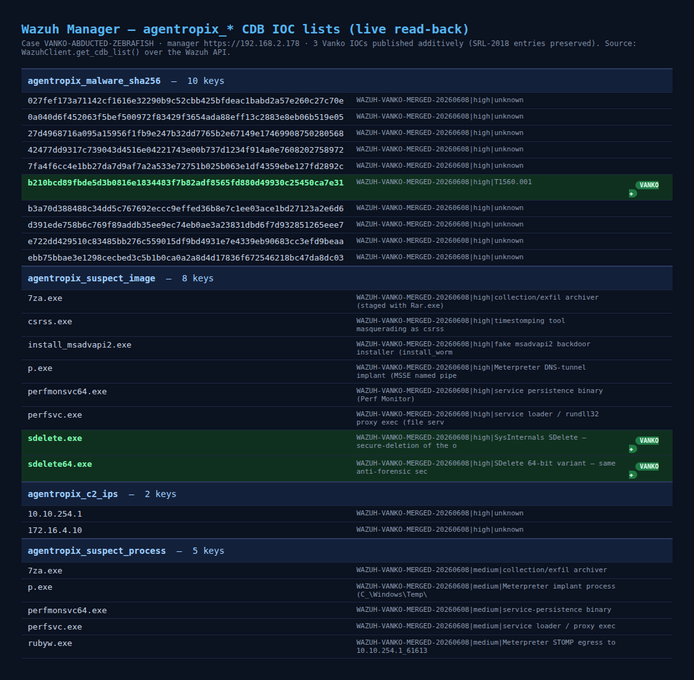

# VANKO — IOCs & Findings shown in Wazuh

Playwright captures of the **operator-authorized egress** of the VANKO investigation to the Wazuh manager (`192.168.2.178`): the 10 examiner-approved findings in Discover, granular finding detail, the correlation modules, and the manager CDB IOC lists.

> Rendered as embedded images so they display directly in GitLab (no client-side JavaScript needed — scroll to read the whole gallery without opening files individually).

**Provenance:** 10/10 findings HMAC-approved (sidecar, `agentropix-approvals-2026.06.08`) · decision ledger **seq 139** (`human-approved`, chain intact) · pushed 2026-06-08.

↳ [Forensic synthesis report](report.md)

---

## 1 · Wazuh dashboard login

Access to the Wazuh manager dashboard (`https://192.168.2.178`).

---

## 2 · Discover — 10 approved VANKO findings

Index `agentropix-findings-2026.06.08`, query `finding_id:VANKO* and status:APPROVED` → **10 hits**. All ten examiner-approved findings (`VANKO-P1-001` … `VANKO-P4-004`) carrying `confidence`, `severity`, and `hmac_seal` fields.

---

## 3 · Discover — full finding lifecycle

The same index showing the indexed VANKO finding set (the store also retains the DRAFT-stage records from registration, i.e. the complete DRAFT→APPROVED audit trail).

---

## 4 · Granular finding detail — `VANKO-P2-001` (staging)

Expanded document: masquerade account `defaultprinter` used to stage `Desktop\temp.zip` (2.6 MB classified archive). Visible fields: `case_id`, `confidence 0.88`, `evidence.locator` (`$RZQSNFO.zip == temp.zip` recovery, `4720/4724` account-create @ 2016-06-18 20:40:54), `evidence.path`, and the `approval.*` HMAC lifecycle fields. `T1074.001`.

---

## 5 · Granular finding detail — `VANKO-P4-003` (anti-forensics)

Expanded document: anti-forensic destruction recovered from Volume Shadow Copies — deleted `SDELETE.EXE` prefetch, SDelete-wiped `temp.zip`, Dropbox cache routed to the Recycle Bin. `T1070.004`.

---

## 6 · MITRE ATT&CK module

The manager's ATT&CK correlation surface (tactics: Impact, Defense Evasion). *Note: this module reflects live-agent alerts, not the forensic findings — the VANKO findings live in the `agentropix-findings` index shown above.*

---

## 7 · Threat Hunting module

The Threat Hunting console (available correlation surface on the manager).

---

## 8 · Manager CDB IOC lists — live read-back

Authoritative read-back of the four `agentropix_*` CDB lists via the Wazuh API (`get_cdb_list`). The VANKO IOCs — `vacation photos.7z` SHA-256 `b210bcd8…`, `sdelete.exe`, `sdelete64.exe` — are highlighted; the pre-existing SRL-2018 entries were **preserved** (additive union push). `check_intel` resolves all VANKO IOCs `present=true`.

---

## Honest caveats

- **`hunt_ioc` telemetry = 0 hits** for the VANKO IOCs — expected: the evidence is a **2016 forensic disk image**, not a live-monitored endpoint, so there are no agent events to correlate against. IOC membership is proven by `check_intel` (present=true) and the CDB read-back above (#8), not by alert correlation.
- The **MITRE ATT&CK / Threat-Hunting** modules (#6–7) render the manager's **live-agent alerts**, not the VANKO findings.
- **Shared CDB lists are last-writer-wins on the `case_id` value-tag**: the additive union push re-stamped the pre-existing SRL entries with `case_id=WAZUH-VANKO-MERGED-20260608`. **No IOC keys were lost** (detection intact); authoritative per-case provenance lives in the findings index + decision ledger.
