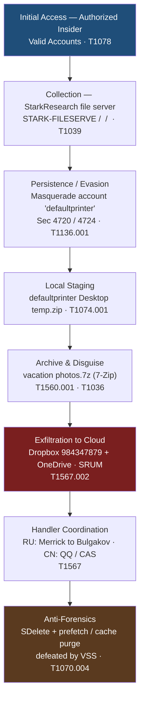
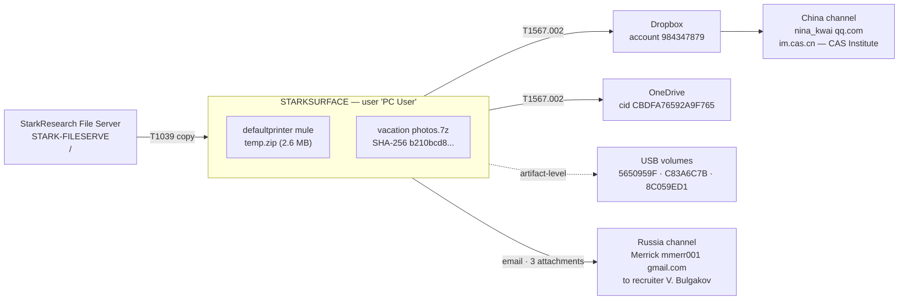
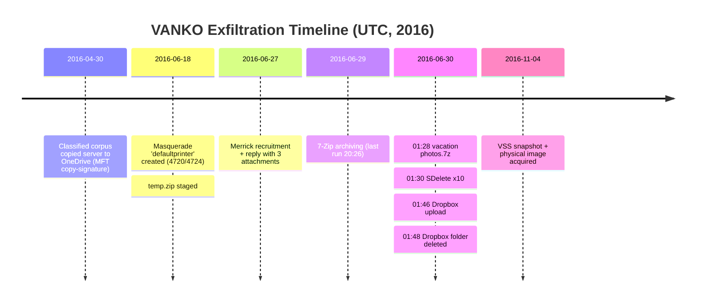
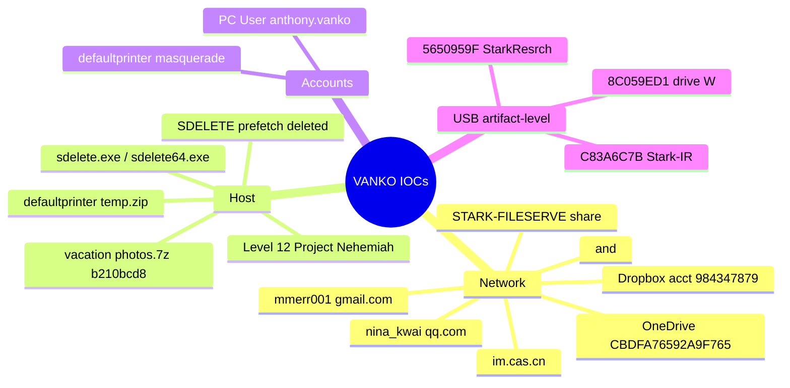
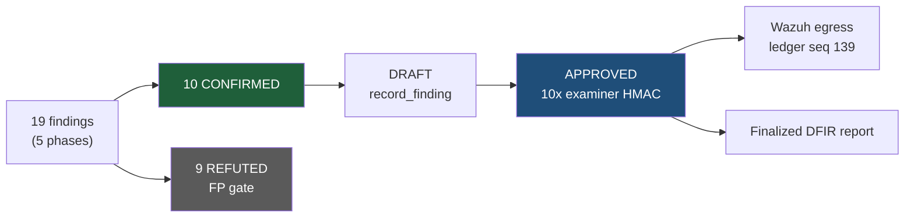

# `diagrams/` — VANKO case diagrams (Mermaid sources + rendered PNGs)

The five case diagrams embedded by [`../VANKO-FORENSIC-REPORT.md`](../VANKO-FORENSIC-REPORT.md):
each `dN.mmd` is the Mermaid source, each `dN.png` is its committed high-resolution render
(GitHub/GitLab-safe — the report embeds the PNGs, not client-rendered Mermaid).

> **Sanitization note:** in the excerpts below, evidence-network IPs from the 2016 disk image
> (`192.168.x.x` file-server addresses) are replaced with `<FILESERVER-IP-1>` / `<FILESERVER-IP-2>`
> per publication policy. The on-disk `.mmd` sources contain the literal values.

## Files

| File | Type | Size | What it is |
|---|---|---|---|
| `d1.mmd` | Mermaid source | 832 B | Attack-lifecycle flowchart: insider access → collection → staging → archive/disguise → dual-cloud exfil → handler coordination → anti-forensics (MITRE-tagged) |
| `d1.png` | PNG render | 308 KB | 1104×5400 vertical render of `d1.mmd` (report §"Attack lifecycle") |
| `d2.mmd` | Mermaid source | 844 B | Exfiltration & buyer-channel architecture: file server → STARKSURFACE staging → Dropbox/OneDrive/USB → RU + CN channels |
| `d2.png` | PNG render | 162 KB | 3136×1052 render of `d2.mmd` |
| `d3.mmd` | Mermaid source | 496 B | 2016 exfiltration timeline (Apr 30 → Nov 4, UTC) |
| `d3.png` | PNG render | 172 KB | 3136×1368 render of `d3.mmd` |
| `d4.mmd` | Mermaid source | 559 B | IOC mindmap: network / host / accounts / USB indicators |
| `d4.png` | PNG render | 287 KB | 3136×1332 render of `d4.mmd` |
| `d5.mmd` | Mermaid source | 370 B | Findings pipeline: 19 findings → 10 confirmed / 9 refuted → DRAFT → APPROVED (examiner HMAC) → Wazuh egress |
| `d5.png` | PNG render | 86 KB | 3136×756 render of `d5.mmd` |

> The `.mmd` sources are local working files; only the `.png` renders are tracked in the published
> repository.

## d1 — Attack lifecycle (full source, IPs sanitized)

Full source: `d1.mmd` *(local-only)* · render: [`d1.png`](d1.png)

## d2 — Exfiltration & buyer-channel architecture (full source, IPs sanitized)

Full source: `d2.mmd` *(local-only)* · render: [`d2.png`](d2.png)

## d3 — Exfiltration timeline (full source)

Full source: `d3.mmd` *(local-only)* · render: [`d3.png`](d3.png)

## d4 — IOC mindmap (full source, IPs sanitized)

Full source: `d4.mmd` *(local-only)* · render: [`d4.png`](d4.png)

## d5 — Findings approval pipeline (full source)

Full source: `d5.mmd` *(local-only)* · render: [`d5.png`](d5.png)
